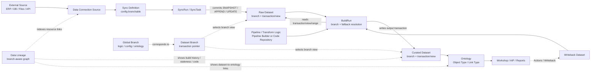

# 29 — 血缘、Dataset Branch/Version 与 Pipeline/Sync 数据关系调研

**日期：** 2026-05-30  
**类型：** Data Lineage / Dataset versioning / branch-aware lineage / Data Connection Sync / Pipeline build graph  
**写入范围：** 本文件  

---

## 背景

本轮调研聚焦 Palantir Foundry 的血缘模块，尤其是三个容易混淆的关系：

1. Dataset 的 branch、transaction、view、schema version 分别是什么。
2. Data Lineage 如何看待 Global Branch、Dataset Branch 和 Ontology 资源。
3. Data Connection Sync、Pipeline/Transform、Schedule/Build 如何通过 Dataset transaction 串成可追溯的数据版本图。

既有仓库资料已经覆盖 Pipeline DSL、增量计算、调度和高码/低码互操作，本文件只补齐“血缘视角下的数据关系模型”，避免重复展开执行引擎细节。

---

## 可信度规则

| 标签 | 含义 | 使用边界 |
|---|---|---|
| 【事实】 | 已由 Palantir 官方公开文档或本仓库既有资料直接支撑 | 可作为基线结论 |
| 【推断】 | 多个【事实】组合出的工程判断，但官方未公开完整内部模型 | 可用于架构设计，但要保留验证边界 |
| 【猜测】 | 公开资料没有直接支撑 | 只能作为待验证问题 |

---

## 核心结论

1. Foundry 血缘的最小可解释单元不是“表”，而是 `Dataset branch + transaction/view + producer`。Dataset branch 是指向最新 transaction 的指针；transaction 是原子数据变更；dataset view 是按事务历史计算出的有效文件集合。【事实】

2. Foundry 的“版本”需要拆成三层：数据版本是 transaction/view，schema version 绑定在 dataset view 上，逻辑版本来自 Pipeline Builder/Code Repository/Global Branch 的代码或配置变更。【事实+推断】

3. Dataset branch 和 Git branch 类似但不等价：Dataset branch 支持从父 branch 或 transaction 创建、独立提交 transaction、删除 branch 指针；但不支持直接 merge 数据内容。【事实】

4. Build 是把代码/配置分支和数据分支绑定起来的执行机制。每次 build 在指定 branch 上运行，输出 dataset 只在该 branch 打开并提交 transaction；输入优先从 build branch 读取，不存在时走 fallback branch。【事实】

5. Data Lineage 是 branch-aware，但 Data Lineage 图本身不是 branched resource，图配置不会作为 branch 上的修改资源被 merge 回 `Main`。【事实】

6. Global Branch 与 Dataset Branch 不是一回事：Global Branch 是跨 Pipeline Builder、Code Repository、Ontology、Workshop 等应用的逻辑/配置分支；所有 Global Branch 有对应 Dataset Branch，但不是每个 Dataset Branch 都绑定 Global Branch。【事实】

7. Data Connection Sync 是 raw data 的入口。官方明确 Data Connection 通过 dataset transactions 管理离散版本，并能追踪“哪些 sync tasks 产生了给定 dataset 的哪些版本”。【事实】

8. Data Connection 的配置可分支，用于 sandbox 测试新 sync 配置；这不应理解为所有 sync 产出都能自由写入任意 dataset branch。公开资料只能确认配置分支和版本血缘，不能确认“batch sync 可指定输出 feature branch”能力。【事实+推断】

9. Sync 的 transaction type 会直接影响下游 Pipeline 的增量能力：`APPEND` 是 incremental pipelines 的基础；`UPDATE` 破坏 append-only 要求，会使下游回退到 `SNAPSHOT` batch processing；`SNAPSHOT` 是全量替换视图的边界。【事实】

10. 血缘有两套粒度：静态血缘记录资源/逻辑依赖，例如 data source -> sync dataset -> transform output -> ontology object type；版本血缘记录某次 sync/build 实际读取和产出的 transaction 或 transaction range。【推断】

11. Data Lineage 的 UI 能展示 dataset、data source、object type 等节点，展开 parents/descendants，查看 preview、build history、staleness、生成数据的代码，并能从 graph 进入 schedule editor。【事实】

12. 自建平台若要复制 Foundry 的血缘体验，不能只建 OpenLineage 式 job edge；还需要 Dataset transaction/view、branch/fallback resolution、sync task run -> transaction、build run -> transaction、schema version、staleness 和 branch-aware graph index。【推断】

---

## 一、对象模型：Dataset、Branch、Transaction、View、Schema

### 1.1 Dataset 不是物理表，而是文件集合加元数据

Foundry Dataset 用于表示结构化、半结构化和非结构化数据。文件本身存储在 backing filesystem，例如 HDFS 或云对象存储；Foundry 维护逻辑路径到物理路径的映射，并在 Dataset 层管理 schema、permissions、transactions、branches 等元数据。【事实】

```text
Dataset
  rid: ri.foundry.main.dataset...
  path/location: /project/path/dataset
  branches:
    master -> transaction T10
    feature-a -> transaction T13
  schemas:
    attached to dataset views
  files:
    logical file refs -> backing filesystem physical paths
```

### 1.2 Transaction 是 Dataset 内容的一次原子变更

官方将 transaction 类比为 Git commit：一次对 Dataset 内容的原子变更。Transaction 状态包括 `OPEN`、`COMMITTED`、`ABORTED`；提交后写入文件进入最新 view，中止后写入文件被忽略。【事实】

Transaction 类型至少包括：

| 类型 | 语义 | 对下游影响 |
|---|---|---|
| `SNAPSHOT` | 用一组新文件完全替换当前 view | batch pipelines 的基础；也是 view 计算重置点【事实】 |
| `APPEND` | 只向当前 view 增加新文件，不能改旧文件 | incremental pipelines 的基础【事实】 |
| `UPDATE` | 增加新文件，也可覆盖旧文件 | 破坏 append-only，下游不能增量处理，需回退 snapshot/batch【事实】 |
| `DELETE` | 从 view 中移除文件引用，不等于物理删除文件 | 主要用于 retention workflow【事实】 |

### 1.3 Branch 是 transaction 指针

Dataset branch 是指向某个最新 transaction 的指针。官方描述中，Dataset、Branch、Transaction 分别类似 Git repository、branch、commit。某个 branch 提交 transaction 后，其他 branch 的 transaction 指针和 view 不受影响。【事实】

```text
Dataset: /raw/orders

master:
  T1 SNAPSHOT -> T2 APPEND -> T3 APPEND

feature-a:
  created from T2
  T2 -> T4 SNAPSHOT -> T5 APPEND
```

重要保证：

- 一个 branch 最多只有一个 open transaction。【事实】
- 每个非 root branch 有且只有一个 parent branch；删除中间 branch 只会改 parent 记录，不重排 transactions。【事实】
- Dataset branch 不支持 merge。若要把某分支数据“带回”另一分支，需要通过 Transform 读 source branch，再写 target branch；这属于新计算/新 transaction，不是原生 branch merge。【事实+推断】

### 1.4 View 是 branch 在某时刻的有效文件集合

Dataset view 不是单独手写的版本号，而是从 transaction history 计算出来的有效文件集合。算法可以简化为：

1. 从给定时间点之前最近的 `SNAPSHOT` transaction 开始；若没有 snapshot，则从最早 transaction 开始。
2. 依次应用后续 transaction：
   - `SNAPSHOT`/`APPEND` 增加文件；
   - `UPDATE` 增加并替换文件；
   - `DELETE` 移除文件引用。
3. 得到的文件集合就是该 view。【事实】

这解释了一个关键现象：在纯 `SNAPSHOT` Dataset 中，view 数量通常等于 transaction 数量；在 incremental Dataset 中，大量 `APPEND` transaction 会共同组成同一个持续演进的 view。【事实+推断】

### 1.5 Schema 绑定在 dataset view 上

Schema 是 dataset view 上的元数据，描述 view 中的文件如何被解释，例如字段名、类型、存储格式等。Schema 可以随时间变化，因为不同 transaction/view 可能引入不同列或字段类型。【事实】

公开 API 也体现了这个模型：`Get Dataset Schema` 可以按 `branchName`、`endTransactionRid`、`versionId` 查询 schema；返回值包含 `branchName`、`endTransactionRid` 和 schema `versionId`。【事实】

因此“Dataset 版本”至少要区分：

| 名称 | 锚点 | 说明 |
|---|---|---|
| Data transaction | `transactionRid` | 一次原子数据变更 |
| Dataset view | branch + end transaction/time | 某时刻有效文件集合 |
| Schema version | `versionId` + view | 某个 view 的解析元数据 |
| Logic version | Code/Pipeline/Global Branch revision | 生成 dataset 的代码或配置版本 |

---

## 二、Build 如何绑定逻辑分支与数据分支

### 2.1 Build branch 是数据写入隔离边界

官方 Branching 文档明确说，Foundry 使用 build system 把 Git/逻辑分支和 Dataset branch 绑定起来。每个 build 在用户指定 branch 上运行，build 中的 jobs 只修改该 branch 上的 datasets。【事实】

```text
Code / Pipeline branch: feature-a
Build branch:          feature-a

Input resolution:
  read input dataset from feature-a if exists
  otherwise read fallback, e.g. master

Output resolution:
  open transaction on feature-a
  commit output transaction on feature-a
  never modify master
```

官方还给出三条 build branch guarantee：

- build resolution 只有在 branch fallback sequence 与相关 dataset branch ancestry 兼容时才成功；
- build 不会修改 build branch 之外的 dataset branch；
- build 不会在 input datasets 上创建 branch。【事实】

### 2.2 JobSpec 决定“哪个逻辑生成哪个 Dataset”

在 Code Repository 中提交 Transform 代码会向 build system 发布 JobSpec。Build 编译图时，会从当前 branch 或 fallback chain 中读取 JobSpec，确定某个 output dataset 应由哪个逻辑执行。【事实】

```text
Transform contract:
  Input A
  Output B
  compute function F

Published as JobSpec:
  output B on branch feature-a
  depends on input A
  code revision / runtime config
```

这说明 lineage 不是运行时猜测出来的。至少在 dataset-level 上，Input/Output contract、Pipeline registration、Pipeline Builder graph、Data Connection source links 都是可注册的静态依赖来源。【推断】

### 2.3 Fallback branch 解释了“开发分支读生产数据”

典型分支开发流程：

```text
master:
  A(master) -> B(master) -> C(master)

feature-a build:
  A 没有 feature-a branch -> fallback 读 A(master)
  B/C 是本次修改输出 -> 写 B(feature-a), C(feature-a)
```

官方示例明确：当 `feature` build 中 dataset A 没有 feature branch 数据时，Job 1 使用 A 的 `master` branch 作为 input；然后输出写入 B 的 `feature` branch；Job 2 再读 B 的 `feature` branch，写 C 的 `feature` branch。A 和 B/C 的 master branch 都不受影响。【事实】

这个模型对血缘 UI 很重要：同一条逻辑边在不同 branch 上可能解析到不同的输入 transaction/view。【推断】

---

## 三、Data Lineage 的 branch-aware 语义

### 3.1 Data Lineage 图展示资源流，不是可 merge 资源

Data Lineage 是查看数据流向的交互式工具，可以搜索 Dataset、Project、表、列，展开 ancestors/descendants，查看 schema、last built、生成数据的 code，并创建可分享 pipeline snapshot。【事实】

Graph element 包括：

| 节点 | 作用 |
|---|---|
| Data source | Data Connection 中的数据源名称【事实】 |
| Dataset | Foundry datasets 以及 dataset 之间的 lineage【事实】 |
| Object type | Ontology object types，能展开对象关系【事实】 |
| Artifact | Contour analyses、Reports 等 Foundry artifacts【事实】 |

Data Lineage 与 Global Branching 集成后，可以选择某个 Global Branch 查看 branch 上的资源状态。但官方强调，Data Lineage 本身不是 branched resource；graph 和 graph configuration 不会作为 branch 修改资源，也不能 merge 回 `Main`。【事实】

### 3.2 Global Branch 和 Dataset Branch 的关系

官方 Branching Data Lineage 文档给出一个关键边界：

- branch selector 同时有 Global Branches 和 Dataset Branches tab；
- 所有 Global Branch 都有一个对应 Dataset Branch；
- 但不是每个 Dataset Branch 都绑定 Global Branch。【事实】

这意味着：

```text
Global Branch:
  逻辑/配置级分支，覆盖 Pipeline Builder、Ontology、Workshop、Code Repositories 等资源

Dataset Branch:
  数据级分支，是 Dataset transaction 指针

关系:
  Global Branch -> usually creates/corresponds to Dataset Branch
  standalone Dataset Branch -> may exist without Global Branch context
```

### 3.3 Branch-aware lineage 展示什么

选择 Global Branch 后，Lineage graph 会反映该 branch 上资源状态：

- Dataset 显示 branch-specific data、build status、staleness。【事实】
- Ontology object/link/action type 显示 branch-specific metadata，例如名称、属性和 branch 上新增/修改的实体。【事实】
- Dataset 与 Ontology entity 之间的 links 会按 branch state 展示。【事实】
- 搜索也变成 branch-aware，可搜索只存在于该 branch 上的 ontology entity。【事实】

节点详情也会按 branch 显示：

- Dataset node：branch-specific preview data、build history、staleness。【事实】
- Ontology entity node：branch-specific display name、description、properties。【事实】

### 3.4 Branch-aware lineage 的已知限制

官方公开的限制很关键：

1. 选择 Global Branch 时，dataset fallback branches 在 Data Lineage 中被禁用；graph 只展示与该 Global Branch 关联的 dataset branch 数据。【事实】
2. 每个 Global Branch 只关联一个 Ontology；如果 graph 中有多个 ontology，只有所选 Global Branch 绑定的 ontology 会显示 branch-specific data，其他 ontology 继续显示 `Main`。【事实】
3. Dataset-to-ontology links 对 `Main` 和 2026 年 5 月或之后创建的 Global Branch 自动索引；2026 年 5 月之前创建的老 Global Branch 不会回填，可能看不到 dataset-to-ontology links，需在该 branch 上保存 object/link type 修改以触发 reindex provenance。【事实】

这说明 branch-aware lineage 并不是简单切换 branch name，而是依赖后台 branch/resource provenance index。【推断】

---

## 四、Data Connection Sync 与 Dataset version lineage

### 4.1 Sync 是 raw data 入口，不是主要转换层

Data Connection 用于把外部系统数据同步进 Foundry，支持 batch、streaming、media、CDC sync 和 virtual tables。官方强调 Foundry 倾向于“as-is”接入 raw source，并尽量在数据进入 destination dataset 之前保持最小转换，让 branched/version-controlled pipeline 成为 raw data 到 Ontology 过程中所有变化的来源记录。【事实】

这解释了 Foundry 的产品边界：

```text
External system
  -> Data Connection Source
  -> Sync task
  -> Raw Foundry Dataset / Stream
  -> Pipeline Builder or Code Repository transforms
  -> Curated Dataset
  -> Ontology / Applications
```

Data Connection 可以做连接、同步、基础配置和少量 transformer，但官方在 file-based sync 文档中建议：不要依赖 Data Connection transformers 做主要数据处理，而应在 Foundry 中用 Pipeline Builder/Code Repositories 执行转换，以获得 provenance 和 branching 能力。【事实】

### 4.2 Sync task 与 dataset version 的关系

官方 Connecting to data 文档明确说，Data Connection framework 通过 dataset transactions 管理离散版本，支持跨时间的数据版本血缘，让用户理解“哪些 sync tasks 产生了某个 dataset 的哪些版本”。【事实】

因此 Sync 的版本血缘可抽象为：

```text
SourceRef
  -> SyncDefinition / SyncConfig
  -> SyncRun / SyncTask
  -> Output Dataset Branch
  -> Output Transaction
  -> Dataset View
```

公开文档未披露内部表结构，但从官方表述可稳定推断，SyncRun 至少会与 output dataset transaction 建立 provenance 关系，否则无法回答“哪个 sync task 产生哪个版本”。【推断】

### 4.3 Batch sync 会创建或写入 Dataset

官方 Set up batch sync 文档说明：

- 创建 batch sync 会创建一个新的 Foundry Dataset，用于写入 synced data。【事实】
- Sync 配置完成后，可以手动运行，也可以设置 schedule，通过 Foundry build system 触发 build，读取外部系统并写 output dataset。【事实】
- Syncing to an existing dataset 支持但不推荐，因为 sync 可能 overwrite 该 dataset 中已有数据。【事实】
- Transaction type 决定 ingested data 是覆盖旧数据（`SNAPSHOT`）还是增量添加（`APPEND`）。【事实】

这说明 Data Connection Sync 并不是旁路写文件，而是进入 Foundry build/transaction 体系。【推断】

### 4.4 File-based sync transaction modes

官方 file-based sync 文档把常见接入模式直接映射到 transaction type：

| 模式 | Transaction type | 输出 view 语义 | 下游影响 |
|---|---|---|---|
| Batch mirror | `SNAPSHOT` | 每次运行 ingest 所有文件，并提交包含所有文件的 snapshot | 简单稳定，但数据越大越重【事实】 |
| Incremental mirror | `APPEND` | 每次只 ingest 未同步过的新文件，累计形成 view | 支持 end-to-end incremental pipeline【事实】 |
| Incremental mirror with updates | `UPDATE` | ingest 新文件和已变化文件，view 表示最新文件集合 | 下游不能增量，只能 batch fallback【事实】 |
| Trailing window | `SNAPSHOT` + filters | 每次 snapshot 只包含本窗口新文件 | 只适合最近窗口数据场景【事实】 |

这里可以看到 Sync 和 Pipeline 增量能力的强绑定：如果 raw sync 输出是 `APPEND`，下游才有稳定的 append-only 基础；如果 sync 输出 `UPDATE` 或 `SNAPSHOT`，下游增量 Transform 的收益会降低或消失。【事实+推断】

### 4.5 Sync 配置分支与数据分支要分开看

官方 Connecting to data 文档说明，Data Connection 可独立管理 sync metadata 和 sync definitions，这允许新配置完整分支化，新 sync 在 branch 中 sandbox 测试，之后才影响下游 transformation jobs。【事实】

这句话更像是在说：

```text
Sync config branch:
  source settings / sync definition / metadata
  proposal/review/merge style lifecycle

Output dataset branch:
  transaction pointer and produced data versions
```

公开资料没有找到“batch sync 可显式选择写入任意 dataset feature branch”的直接证据。保守结论是：Data Connection 支持配置分支和 version lineage，但不要把它等同于 Pipeline Transform 那种“build 在指定 branch 上写所有输出 dataset”的能力。【推断】

---

## 五、Pipeline / Transform 与 version lineage

### 5.1 Transform contract 是静态血缘源

Code Repository 和 Pipeline Builder 最终都以 dataset I/O contract 进入 lineage：

```text
Transform:
  inputs: DatasetRef[]
  outputs: DatasetRef[]
  compute: function/query/node graph
  runtime config

Static lineage:
  input dataset(s) -> transform/job spec -> output dataset(s)
```

Java 官方文档明确说 `Transform` 描述如何计算 dataset，包含 input/output datasets、compute function 和额外配置，并注册到 `Pipeline`；`Pipeline` 用于注册 dataset 的构建说明，并在 build 时定位负责构建给定 dataset 的 `Transform`。【事实】

Python/Pipeline Builder 虽然 authoring surface 不同，但同样需要可注册的 Input/Output，才能被 build、schedule、lineage 识别。【事实+推断】

### 5.2 Build run 是动态血缘源

静态血缘回答“理论上谁依赖谁”，动态血缘回答“这一次 build 实际读了哪些版本并产出了哪个版本”。基于公开资料，可抽象为：

```text
BuildRun
  branchName
  jobSpec / transform logic version
  input datasets:
    datasetRid + branchName + input transaction/view/range
  output datasets:
    datasetRid + branchName + output transactionRid
  status / timestamps / code revision / profile
```

官方 Data Lineage/Explore Lineage 能查看 dataset 是如何生成的代码、build history、staleness；Scheduling 和 incremental transaction limits 文档也暴露 previous/end transaction、processed range 等观测字段。公开资料未给出统一“version lineage table”，但这些能力共同要求平台保存 build run 与 input/output version 的关系。【事实+推断】

### 5.3 增量 Transform 的血缘不是一条边，而是一段 transaction range

普通 batch build 常可简化为：

```text
Input view at Tn -> Output transaction To
```

增量 build 更准确是：

```text
Input transaction range (previous end, last read]
  + optional snapshot inputs current view
  -> Output APPEND/MODIFY transaction
```

因此，增量血缘至少有两种信息：

- 资源级 lineage：A -> B，长期稳定展示在 graph 上。【事实】
- 版本级 lineage：B 的某个 output transaction 消费了 A 的哪段 transaction range。【推断】

如果只建资源级 lineage，会无法解释“为什么这次只处理了部分 backlog”“为什么 downstream 仍 stale”“为什么 UPDATE 后 fallback”。【推断】

### 5.4 Pipeline Builder / Code Repository 分支互操作

Pipeline Builder branch 可以与 Code Repository branch 同名，使 Pipeline Builder transforms 从匹配 branch 读取 input datasets；也可以配置 fallback branches，在当前 branch 上没有 input dataset 时控制读取来源。【事实】

这说明低码和高码不是两张孤立的 lineage 图；二者通过 branch name、dataset branch、fallback resolution 和 shared DatasetRef 进入同一个 build/lineage 体系。【推断】

---

## 六、Schedule 与 Lineage 的关系

### 6.1 Schedule 在 Data Lineage graph 上定义 build 范围

官方 Scheduling Overview 说明 scheduled builds 可按以下条件触发：

- 指定时间；
- data updated；
- logic updated；
- 上述条件组合。【事实】

Scheduled builds 的范围可配置为：

- 单个 dataset；
- 单个 dataset 及其 dependencies；
- 依赖某 dataset 的所有 datasets；
- 连接两个 datasets 的所有 datasets；
- 上述范围组合。【事实】

Create Schedule 文档进一步说明，Data Lineage schedule editor 是创建/编辑 schedules 的地方；target datasets、excluded datasets、build type、branch selection 都在 Data Lineage graph 语境下配置。【事实】

这说明 Foundry 调度不是纯 cron job list，而是 Dataset lineage graph 上的 build range selection。【推断】

### 6.2 Schedule branch selection 影响 version lineage

Create Schedule 文档说明，在 Data Lineage 中创建 schedule 时，schedule 作用于 graph 中配置的 branch，包括 fallback branches；target datasets 会在 Data Lineage 右上角设置的 branch 上 build。【事实】

Connecting build 还有 branch-specific 限制：input datasets 与 target datasets 之间必须在 schedule 所在 branch 上存在 job spec path，否则 target 可能不会被纳入 build。【事实】

这意味着 schedule 血缘至少应包含：

```text
Schedule
  branch/fallback config
  target datasets
  excluded datasets
  build type
  triggers
  owner/scope
```

如果忽略 branch，调度出来的实际构建路径可能与 lineage graph 的 main 视图不一致。【推断】

### 6.3 Data Connection sync 与 staleness 的特殊性

Create Schedule 文档指出，Data Connection syncs 总是标记为 up to date，因为它们的输入源来自外部系统，Foundry 不知道外部数据是否已经更新。【事实】

因此 Sync 与普通 Transform 在 staleness 上不同：

- Transform：上游 dataset transaction 或 logic update 能让下游 stale。【事实+推断】
- Sync：外部源变化不可由 Foundry 内部 lineage graph 完整感知，通常依赖 schedule、manual run、connector state 或 external trigger。【事实+推断】

这也是为什么 raw ingestion 层的 schedule/monitoring 与下游 transform schedule 需要分开建模。【推断】

---

## 七、统一关系图

### 7.0 血缘关系总图



这张图表达三层事实：Sync 把外部源写成 Dataset transaction；Build 在 branch/fallback 语义下把输入版本转为输出版本；Data Lineage 再以 branch-aware graph 方式把 source、dataset、pipeline、ontology 和 app 串起来。【事实+推断】

### 7.1 资源级血缘

```text
External Source
  |
  | Data Connection Source
  v
Sync Definition / Sync Config
  |
  | SyncRun commits Dataset Transaction
  v
Raw Dataset (branch + transaction/view)
  |
  | Pipeline Builder / Code Repository Transform
  v
Curated Dataset (branch + transaction/view)
  |
  | Ontology mapping / materialization
  v
Object Type / Link Type / Action Type
  |
  v
Workshop / AIP / Reports / downstream apps
```

### 7.2 版本级血缘

```text
SyncRun S1
  -> Dataset A master transaction A_T10

BuildRun B1 on branch master
  reads A master view ending A_T10
  runs Transform F at code revision C7
  writes Dataset B master transaction B_T22

BuildRun B2 on branch feature-x
  reads A master view ending A_T10 via fallback
  writes B feature-x transaction B_T23

Ontology branch view
  reads B feature-x view
  shows branch-specific object type metadata and links
```

### 7.3 Branch-aware graph 切换

```text
Main graph:
  A(master@A_T10) -> B(master@B_T22) -> ObjectType(Main)

Global Branch feature-x:
  A(feature-x missing; Data Lineage global branch view disables fallback display)
  B(feature-x@B_T23)
  ObjectType(feature-x metadata)

Build feature-x:
  may still use fallback A(master) during input resolution
```

注意最后一段差异：Build resolution 可使用 fallback branch；但 Data Lineage 在选中 Global Branch 时，官方说明 dataset fallback branches disabled，graph 只显示该 Global Branch 关联的 dataset branch。【事实】这会导致“执行时读 fallback”和“Lineage UI branch view 展示”不是完全同一层语义。【推断】

---

## 八、对自建平台的设计启发

### 8.1 必须先建 Dataset version substrate

血缘系统不要只存：

```text
job_a -> dataset_b
dataset_b -> job_c
```

至少要能表达：

```text
dataset_id
branch_name
transaction_id
transaction_type
transaction_status
view_end_transaction
schema_version
producer_run_id
producer_logic_version
input_transaction_ranges
```

否则无法支持：

- branch 上的 preview/build history/staleness；
- 按 transaction 回溯版本；
- SyncRun -> DatasetVersion；
- BuildRun -> InputVersionRange -> OutputTransaction；
- UPDATE/SNAPSHOT 导致的 incremental fallback；
- branch/fallback 解析和影响分析。【推断】

### 8.2 血缘要分层存储

建议至少分四层：

| 层 | 关系 | 用途 |
|---|---|---|
| Resource lineage | Dataset/DataSource/ObjectType/Artifact 之间的边 | Graph 展示、搜索、影响分析 |
| Logic lineage | Transform/Sync/Pipeline config -> input/output refs | 静态 DAG、review、merge 检查 |
| Run lineage | SyncRun/BuildRun -> input/output transactions | 审计、回放、故障定位 |
| Branch lineage | GlobalBranch/DatasetBranch -> branch-specific resource state | 分支预览、proposal、branch-aware graph |

### 8.3 Sync 不能只当外部任务

Data Connection 类能力应进入统一 lineage：

```text
External source metadata
  + Sync config version
  + Sync task run
  + Output transaction
  + Transaction type
  + Connector state / cursor
```

尤其要记录 `SNAPSHOT`、`APPEND`、`UPDATE`，因为它决定下游是否能增量处理。【推断】

### 8.4 Branch 和 merge 语义要避免误导

应明确区分：

- 代码/配置 branch 可以 proposal/merge；
- Dataset branch 是 transaction pointer，不支持数据内容直接 merge；
- “把 branch 数据带回 main”应表现为 Transform/Copy/Promote 操作，生成新的 transaction，而不是 Git merge。【推断】

### 8.5 Lineage UI 要显式展示 branch/fallback 差异

Foundry 公开资料显示，branch-aware Data Lineage 在 Global Branch 下禁用 fallback display；但 build resolution 又会使用 fallback branch 读取输入。【事实】

自建产品最好在 UI 中明确展示：

- graph 当前显示 branch；
- build 实际输入 branch；
- fallback branch 命中情况；
- output 写入 branch；
- 每条边对应的 transaction/view。【推断】

否则用户会很容易误判“我在 feature branch 看到的数据”和“build 实际读的数据”。【推断】

---

## 九、证据缺口

1. 官方公开资料没有披露 Data Lineage 内部索引表结构，无法确认其边主键是 dataset RID、path、branch-qualified resource id，还是其他 resource reference。【猜测】

2. 官方公开资料没有找到 batch Data Connection Sync 可显式选择输出 dataset branch 的直接说明；只能确认配置分支、dataset transaction 版本血缘和 sync task -> version 追踪。【推断】

3. 官方公开资料没有完整披露 SyncRun/BuildRun 与 transaction 的 API 级数据模型；version lineage 表结构需要真实环境或内部 API 验证。【推断】

4. 官方公开资料没有说明跨 Dataset 的多输出 build 是否具备跨 Dataset 原子提交；当前只能确认单 Dataset transaction 原子性和失败 abort 语义。【推断】

5. Column-level lineage 的公开资料不足。本轮只确认 Data Lineage 可按 dataset/object/artifact 展示和搜索列名；不能确认手写 PySpark、Pipeline Builder 表达式、SQL transform 的列级血缘覆盖率边界。【推断】

6. Global Branch 中 Data Connection、Pipeline Builder、Code Repository、Ontology 资源的 proposal/rebase/merge 冲突检测细节没有完整公开；只能确认 Global Branch 提供统一分支体验并支持多应用修改和 merge。【事实+推断】

---

## 十、结论摘要

Foundry 的血缘能力建立在 Dataset transaction 和 branch 之上。Data Connection Sync 负责把外部数据变成 Foundry Dataset 的离散 transaction；Pipeline/Transform 通过 Input/Output contract 形成静态 DAG，并在每次 Build 中把输入 transaction/view/range 转换为输出 transaction；Schedule 在 Data Lineage graph 上选择 branch 和 build 范围；Ontology 再把 Dataset 映射到业务对象。Data Lineage 则把这些资源关系按 branch-aware 的方式呈现出来。

最关键的架构判断是：Dataset branch/version 不是血缘旁边的附属功能，而是血缘的坐标系。没有 branch + transaction/view + producer run，血缘图只能回答“谁依赖谁”，不能回答“这个版本是谁在什么配置、什么输入版本下生产出来的”。

---

## 参考来源

### Palantir 官方文档

1. Core concepts - Datasets: https://www.palantir.com/docs/foundry/data-integration/datasets
2. Core concepts - Branching: https://www.palantir.com/docs/foundry/data-integration/branching
3. Data Lineage - Overview: https://www.palantir.com/docs/foundry/data-lineage/overview/
4. Data Lineage - Explore data lineage: https://www.palantir.com/docs/foundry/data-lineage/explore-lineage/index.html
5. Data Lineage - Graph elements reference: https://www.palantir.com/docs/foundry/data-lineage/elements-reference/
6. Data Lineage - Branching data lineage: https://www.palantir.com/docs/foundry/data-lineage/branching-data-lineage/
7. Global Branching - Overview: https://www.palantir.com/docs/foundry/global-branching/overview
8. Global Branching - Best practices and technical details: https://www.palantir.com/docs/foundry/global-branching/best-practices-and-technical-details
9. Pipeline Builder - Branches overview: https://www.palantir.com/docs/foundry/pipeline-builder/branches-overview
10. Pipeline Builder - Create a branch: https://www.palantir.com/docs/foundry/pipeline-builder/branches-create-a-branch
11. Connecting to data: https://www.palantir.com/docs/foundry/data-integration/connecting-to-data
12. Data Connection - Overview: https://www.palantir.com/docs/foundry/data-connection/overview
13. Data Connection - Set up a batch sync: https://www.palantir.com/docs/foundry/data-connection/set-up-sync
14. Data Connection - File-based syncs: https://www.palantir.com/docs/foundry/data-connection/file-based-syncs
15. Pipeline Builder - Configure sources and data syncs: https://www.palantir.com/docs/foundry/pipeline-builder/datasets-sources
16. Pipeline Builder - Add datasets: https://www.palantir.com/docs/foundry/pipeline-builder/datasets-add
17. Building pipelines - Creating incremental syncs: https://www.palantir.com/docs/foundry/building-pipelines/create-incremental-syncs
18. Building pipelines - Scheduling overview: https://www.palantir.com/docs/foundry/building-pipelines/scheduling-overview
19. Building pipelines - Create a schedule: https://www.palantir.com/docs/foundry/building-pipelines/create-schedule
20. Streams: https://www.palantir.com/docs/foundry/data-integration/streams
21. API - Get Branch: https://www.palantir.com/docs/foundry/api/datasets-v2-resources/branches/get-branch
22. API - Get Transaction: https://www.palantir.com/docs/foundry/api/datasets-v2-resources/transactions/get-transaction
23. API - Get Dataset Schema: https://www.palantir.com/docs/foundry/api/datasets-v2-resources/datasets/get-dataset-schema

### 本仓库既有资料

1. `docs/raw/04-lineage-ontology-integration.md`
2. `docs/raw/06-incremental-pipeline.md`
3. `docs/raw/15-job-execution-guarantee.md`
4. `docs/raw/18-branching-data-connection.md`
5. `docs/raw/25-transform-contract-dag.md`
6. `docs/raw/27-incremental-scheduling-transaction.md`
7. `docs/raw/28-pipeline-builder-pro-code-interop.md`
