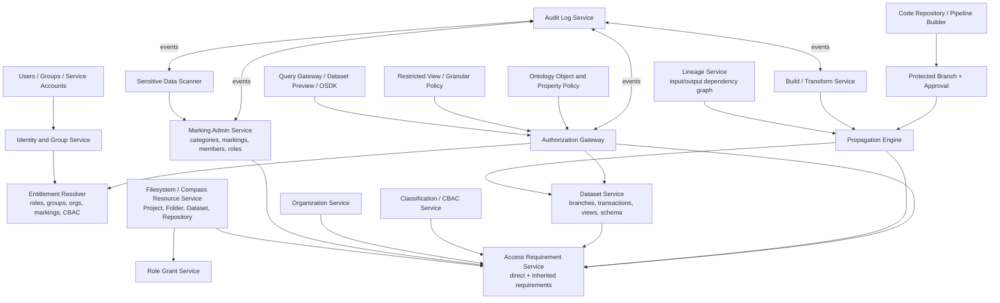

# 30 - Palantir Dataset 权限体系与 Marking 架构全覆盖调研

**调研日期：** 2026-05-30
**关联 Issue：** #19
**调研方向：** Dataset 权限模型 / Marking 功能定义 / 架构设计 / 实现链路 / 自建平台参考

---

## 1. 背景与口径

本文件把 Foundry 中 Dataset 相关的权限体系和 Marking 机制从“功能定义”推进到“架构设计”和“实现链路”。目标不是复述单点能力，而是回答三个工程问题：

1. Dataset 到底受哪些权限体系共同控制。
2. Marking 如何被建模、应用、传播、移除、审计。
3. 如果自建类似能力，控制面、构建链路、查询链路和治理链路应该如何落地。

可信度标注：

| 标注 | 含义 |
|---|---|
| 【事实】 | Palantir 官方公开文档明确说明，或本仓库已有调研已由官方资料支撑 |
| 【推断】 | 官方未披露内部实现，但可由公开 API、行为语义和平台架构合理推出 |
| 【猜测】 | 缺少直接证据，仅作为实现可能性或设计建议 |

本文件优先引用官方 Palantir 文档，并复核仓库内既有文档：

- `docs/raw/06-security-and-permissions.md`
- `docs/raw/11-marking-mechanism-deep-dive.md`
- `docs/raw/12-dataset-marking-implementation.md`
- `docs/raw/13-marking-advanced-deep-dive.md`
- `docs/raw/26-pro-code-governance-quality-observability.md`
- `docs/raw/29-lineage-branch-version-pipeline-sync.md`

---

## 2. 核心结论

1. Dataset 权限不是单一 RBAC，而是 `DAC roles + MAC access requirements + lineage-derived data requirements + optional row/property policies` 的组合。【事实】
2. Projects 是 Foundry 的主要安全边界，roles 是自主访问控制 DAC；roles 决定用户能对资源执行哪些工作流，例如 Owner、Editor、Viewer、Discoverer。【事实】
3. Markings 是强制访问控制 MAC；用户必须满足资源上的所有普通 Markings，角色不能覆盖 Marking 要求，Owner 也不能因为拥有资源而绕过 Marking。【事实】
4. Organizations 也是 MAC，但语义不同：它们应用于 Projects，用户需要是至少一个相关 Organization 的 member 或 guest member；官方 API 也说明 Organizations 是析取要求，而 Markings 是合取要求。【事实】
5. CBAC / Classifications 是高密级场景的强制控制，非默认启用，需要 Palantir 参与配置；它支持层级密级、分类类别、以及 disjunctive releasability 语义。【事实】
6. Data access 和 resource access 必须分开看。用户可以有资源角色，但仍因上游 data markings / data classifications 无法读取 Dataset 数据。【事实】
7. Markings 通过文件层级和直接数据依赖传播。Project/folder 上的 Marking 会传给子资源；上游 Dataset 的 Marking 会沿 transform / analysis 传播到派生 Dataset。【事实】
8. `stop_propagating` 和 `stop_requiring` 是受控的传播中断机制，只作用于 Markings / Organizations，不作用于 roles；需要 protected branch、required approver、以及 `Remove marking` 或 `Expand access` 等权限。【事实】
9. Marking removal 与 transaction 历史不是对称操作。给 Dataset 加 Marking 会影响 Dataset 历史 transactions；在 transform 中移除 Marking 只影响新的 output transactions，旧 transactions 不会被改写。【事实】
10. 自建平台若只实现 Dataset ACL，会漏掉 Foundry 的核心治理能力。最小闭环必须包括身份与组、资源角色、Marking 管理、lineage-aware propagation、transaction-level requirements、query-time enforcement、branch approval、simulation 和 audit。【推断】

---

## 3. 功能定义全景

### 3.1 Dataset 的安全语义

Foundry Dataset 是数据进入 Foundry 后直到映射进 Ontology 之前的核心数据表示。官方定义 Dataset 是包裹 backing filesystem 文件集合的资源，并内置权限管理、schema 管理、版本控制和随时间更新能力。【事实】

Dataset 同时具备三种身份：

| 身份 | 说明 | 安全含义 |
|---|---|---|
| Filesystem Resource | 在 Foundry 文件系统中的资源，有 RID、path、Project/folder 位置 | 受 Project/folder role、file marking、organization、classification 控制 |
| Data Asset | 由 transactions / branches / dataset views 组成的数据版本资产 | 受 data marking、data classification、上游 lineage requirements 控制 |
| Pipeline Node | transform input/output 或 sync output | 参与 Marking / Organization / Classification 的传播与中断 |

因此，访问 Dataset 至少包含两类问题：

```text
Resource access: 用户能否发现、打开、管理这个 Dataset 资源。
Data access: 用户能否读取这个 Dataset view 中的数据内容。
```

Data Lineage 官方也把权限排查分成两类 coloring：`Data access in datasets` 和 `Resource access`。Resource access 展示用户在资源上的 role；Data access 用于排查上游 Dataset 如何限制用户读取数据。【事实】

### 3.2 Dataset 权限体系清单

| 权限体系 | 类型 | 作用对象 | 粒度 | 是否随血缘传播 | 用途 |
|---|---|---|---|---|---|
| Project / Resource Roles | DAC | Project、folder、file、Dataset 等资源 | 资源级 | 否 | 授予工作流能力，例如 view/edit/manage |
| Organizations | MAC | Space / Project，继承到资源与直接依赖 | Project / organization boundary | 是 | 多组织隔离、跨组织协作 |
| Markings | MAC | Project、folder、resource，包括 Dataset | 资源级和数据级 | 是 | 敏感数据类别门槛，例如 PII、PHI、Finance |
| Classifications / CBAC | MAC | Project、file、Dataset data | 项目、文件、数据级 | data classification 随上游继承 | 政府/高密级数据访问控制 |
| Restricted Views | Granular policy | Dataset 下游受限视图 | 行级 | 不是 transform input | 控制用户只能看到部分行 |
| Marking-backed Restricted Views | Granular policy + Markings | 含 Marking ID 列的 Dataset | 行级 | 由策略判断 | 每行要求不同 Marking |
| Ontology Object Security | Granular policy | Object Type / Object Set | 对象/行级 | 通过 backing source 继承数据要求 | 应用层对象可见性 |
| Ontology Property Security | Granular policy + security markings display | Object property | 属性/列/值级 | 依赖 object/property policy | 属性值可见性 |
| Cipher | 数据保护能力 | Dataset column、Ontology cipher property | 列/值级 | 否，作为保护手段配合 Marking | 加密、哈希、解密审计 |
| SDS | 治理自动化 | Dataset、virtual table、media set | 扫描范围内 | 可触发 apply marking | 敏感数据发现与自动处理 |
| Audit Logs | 审计 | 平台动作 | 事件级 | 不适用 | 安全调查、合规、SIEM |

---

## 4. 访问判定模型

### 4.1 访问判定公式

完整 Dataset 读取判定可抽象为：

```text
can_read_dataset_view(user, dataset_view) =
    has_resource_role(user, dataset, "view")
AND satisfies_organization_requirements(user, dataset.resource_requirements)
AND satisfies_file_markings(user, dataset.file_requirements)
AND satisfies_file_classification(user, dataset.file_classification)
AND satisfies_data_markings(user, dataset_view.data_requirements)
AND satisfies_data_classification(user, dataset_view.data_classification)
AND satisfies_scoped_session(user, active_session, required_markings)
AND satisfies_granular_policy_if_applicable(user, row_or_property)
```

说明：

- `has_resource_role` 属于 DAC，是资源所有者或 Project 管理员可授予的能力。【事实】
- `satisfies_*requirements` 属于 MAC，不能被 role 覆盖。【事实】
- `dataset.resource_requirements` 来自 Project/folder/resource 的直接和继承要求。【事实】
- `dataset_view.data_requirements` 来自上游 transaction lineage 的数据要求。【事实】
- `scoped_session` 是用户主动收窄当前会话可用 Markings 的机制，适合在多类敏感工作之间做视觉和访问隔离。【事实】
- row/property policy 只在 Restricted View 或 Ontology 访问路径中生效；直接读取 backing Dataset 仍受 Dataset 本身权限控制。【事实】

### 4.2 Resource access 与 Data access 的差异

Foundry 对 Dataset 至少区分两类访问结果：

| 场景 | 用户看到什么 | 原因 |
|---|---|---|
| 不满足 file/project requirements | 资源可能不可发现，或无法进入 | 文件层级的 Project/folder/file Marking、Organization、Classification 未满足 |
| 满足 file requirements，但不满足 data requirements | 可能能看到 Dataset 存在和 metadata，但不能读取数据 | 上游 data markings / data classifications 未满足 |
| 满足 data requirements，但 role 不足 | 不具备对应工作流能力 | Marking 只代表资格，不授予访问 |
| role 与 all requirements 都满足 | 可按 role 允许范围读取、编辑或管理 | DAC + MAC 全部通过 |

官方 Markings 文档明确指出：用户可能满足 file access requirements 但不满足从上游继承的数据访问要求，此时能检测到派生 Dataset 的存在并查看 file metadata，但不能访问 Dataset 内的数据。这不同于不满足 file marking 导致资源不可发现的情况。【事实】

### 4.3 Organizations 与 Markings 的逻辑差异

Get Access Requirements API 明确返回 Markings 和 Organizations 两类 access requirements，并说明 Organizations 是 disjunctive，Markings 是 conjunctive。【事实】

因此普通 Dataset requirements 的默认逻辑应写成：

```text
marking_ok = user has every required Marking
organization_ok = user belongs to at least one required Organization
access_requirements_ok = marking_ok AND organization_ok
```

重要修正：

- 既有笔记曾把 Marking Category 的 `CONJUNCTIVE / DISJUNCTIVE` 扩展为普通 Marking 的 AND/OR 访问语义。
- 官方概念文档对普通 Markings 明确表述为所有 Markings 均需满足。
- 官方 CBAC 文档明确说明 classification marking categories 支持 disjunctive OR。
- 官方 Admin API 的 Marking Category 对象暴露 `categoryType` 枚举，但公开用户文档没有直接证明普通 mandatory non-CBAC Markings 在资源访问上可按 category 做 OR。

本文采用保守口径：普通 Markings 按 all-of 处理；Organizations 和 CBAC classification categories 的 OR 语义按官方明确说明处理。【事实 + 推断】

---

## 5. Roles：自主访问控制层

### 5.1 功能定义

Projects 是 Foundry 组织工作的主要方式，也是主要安全边界。用户和组通过 Project roles 协作；Projects + roles 构成 Foundry 的 discretionary access control。【事实】

默认 roles 从强到弱通常包括：

| Role | 典型能力 |
|---|---|
| Owner | 管理 Project/resource、授权、移动/分享、更新 Markings on resource 等 |
| Editor | 编辑资源、构建或修改工作流 |
| Viewer | 读取资源和数据预览，前提是满足 access requirements |
| Discoverer | 发现 Project/resource，但不读取内容 |

官方建议在 Project 级给 group 授权，而不是给大量单个文件/文件夹直接授权。Project contents 会继承 Project 级 roles，以降低权限管理混乱度。【事实】

### 5.2 与 Dataset 构建系统的关系

Foundry 建议 work logic 与 output 资源位于同一 Project；跨 Project 使用上游 Dataset 时，通过 References 引入。添加 reference 后，目标 Project 的同事可以访问派生 Dataset，前提是他们满足派生 Dataset 上的 Organizations 和 Markings；他们不一定需要访问上游 Project。【事实】

这说明 Foundry 把“对上游资源的 role”和“对下游派生数据的 access requirements”分离：

```text
构建者：需要有权引用/读取上游 Dataset，并在目标 Project 写 output。
消费者：需要有目标 Project role，并满足 output 的 data requirements。
```

### 5.3 设计启示

自建平台不要把 role 当作敏感数据资格。合理边界是：

- Role 授予资源操作能力。
- Marking / Organization / Classification 限制访问资格。
- Lineage 决定资格如何随数据派生传播。

---

## 6. Organizations：组织隔离层

### 6.1 功能定义

Organizations 是应用于 Projects 的 access requirements，用于在 Palantir 平台内保护组织数据和工作空间。每个用户只能是一个主 Organization 的 member，但可以是多个 Organization 的 guest member。要满足 Project 的 Organization requirements，用户必须属于至少一个相关 Organization。【事实】

Organizations 与 Markings 的差异：

| 维度 | Organizations | Markings |
|---|---|---|
| 主要对象 | Spaces、ontologies、projects、users、groups、tag categories、collections 等组织边界 | Projects 和资源 |
| 是否可直接绑到单个资源 | 官方说明 individual resources 不能 tied to organization | 可以 applied to projects and resources |
| 用户要求 | 用户必须属于一个 Organization | 用户不必天然持有任何 Marking |
| 访问逻辑 | 至少满足一个相关 Organization | 满足所有普通 Markings |
| 管理入口 | Control Panel / Organization permissions | Foundry Settings / Markings |

### 6.2 传播与移除

Organizations 会经 file hierarchy 和 direct dependencies 继承，与 Markings 类似。【事实】

当派生资源已经移除或混淆了受组织限制的内容，可以用 `stop_requiring` 移除继承的 Organizations。官方说明 Organizations 在 transform keyword 中用 `OrgMarkings` 表示，因为内部上 Organizations 被表示成一种稍有不同的 Marking。【事实】

---

## 7. Markings：强制访问控制核心

### 7.1 功能定义

Markings 为 Foundry 中的 files、folders、Projects 提供额外访问控制。Marking 定义用户访问某类数据所需的资格条件。用户必须是资源上所有 Markings 的 member 才能访问资源。【事实】

Markings 的关键特征：

| 特征 | 说明 |
|---|---|
| Mandatory control | 平台强制执行，role 不能绕过 |
| Binary access | 对单个 Marking 是 all-or-nothing，持有或不持有 |
| Conjunctive | 普通资源上的多个 Markings 全部需要满足 |
| Propagating | 沿文件层级和直接数据依赖传播 |
| Restrictive only | 不用于授予访问；满足 Marking 后仍需 role |
| Centrally governed | DPO / platform admin 可集中管理谁具备访问某类敏感数据的资格 |

典型用途：

- PII、PHI、PCI、Financial、ITAR 等敏感数据类别。
- 某业务数据 owner 控制其负责数据及派生数据。
- Pipeline stage，例如 Raw Data、De-identified Data、Synthetic Data。
- 隐藏资源存在性，例如必须连资源名都不可见的场景。

### 7.2 Marking 对象模型

官方 Admin API 暴露 Marking Category、Marking、Marking Members、Marking Role Assignments 等资源。可抽象为：

```text
MarkingCategory
  id
  name
  description
  categoryType: CONJUNCTIVE | DISJUNCTIVE
  markingType: MANDATORY | CBAC
  permissions: category administrators / viewers

Marking
  id
  categoryId
  name
  description
  organization?              # Organization-associated marking 时存在
  createdTime
  createdBy

MarkingMember
  markingId
  principalId                # user 或 group
  transitive resolution?      # list members API 支持 transitive

MarkingRoleAssignment
  markingId
  role: ADMINISTER / apply / remove 等公开 UI 权限语义
  principalId
```

说明：

- Create Marking 需要 `categoryId`，可设置 `initialMembers` 和 `initialRoleAssignments`。【事实】
- Create Marking 要求至少一个 ADMINISTER role assignment，否则会报错；如果没有把自己或所属 group 设为 ADMINISTER，可能创建出自己无法管理的 Marking。【事实】
- Marking Members 是能查看被该 Marking 保护资源的 principals；List Marking Members 支持 `transitive=true` 解析嵌套 group 成员。【事实】

### 7.3 Marking 权限分离

官方管理文档把 resource-level marking 权限拆成四类：【事实】

| 权限 | 含义 | 是否自动包含 member |
|---|---|---|
| Manage permissions | 管理 Marking 权限、成员和 metadata | 否 |
| Apply marking | 把 Marking 应用到 Projects 和 resources | 否 |
| Remove marking | 从 Projects 和 resources 移除 Marking；还要求能 apply marking | 否 |
| Members | 可查看被该 Marking 保护的资源和 Project | 是 |

关键设计点：

- 管理员可以管理或应用 Marking，但不一定能看数据。
- 数据访问资格和治理操作权解耦。
- 自建平台也应避免 `marking_admin = marking_member` 的默认耦合。

### 7.4 应用 Marking 的前置条件

官方说明，把 Marking 应用到 resource、folder 或 Project 需要同时满足：【事实】

1. 用户有该 Marking 的 `Apply marking` 权限。
2. 用户有资源上的 `Update Markings on resource` 权限，默认包含在 Owner role 中。

应用 Marking 是敏感操作，因为它会限制下游用户并沿 lineage 传播。官方建议在已有 pipeline 上加 Marking 前：

1. 确认 Marking 已创建。
2. 新建 branch 做变更。
3. 用 Data Lineage 复核完整 downstream impact。
4. 检查 transaction types，尤其 APPEND / UPDATE。
5. 找到应停止继承的点。
6. 预先加入 `stop_propagating`。
7. 构建生产 pipeline。
8. 复核 simulation 结果。
9. 再实际 apply Marking。【事实】

---

## 8. Marking 传播机制

### 8.1 两类传播路径

```text
路径 A：文件层级传播
Project / Folder Marking
  -> child Folder
  -> Dataset / Code Repository / Analysis / other resources

路径 B：数据依赖传播
Dataset A with PII
  -> Transform / Analysis reads A
  -> Dataset B inherits PII as data marking
  -> Dataset C derived from B inherits PII
```

官方说明 Markings 通过 file hierarchy 和 direct dependencies 继承，并通过 transform / analysis logic 传播。与 role 不同，Marking 跟着数据走，而不是只跟着资源位置走。【事实】

### 8.2 Direct Marking 与 Inherited/Data Marking

可以把 Dataset 上的 Marking 来源分成三类：

| 来源 | 说明 | 能否直接在当前 Dataset 移除 |
|---|---|---|
| Direct resource marking | 直接应用在当前 Dataset resource 上 | 可以，需对应权限 |
| File hierarchy marking | Project/folder 上继承而来 | 需在源 Project/folder 处理 |
| Data marking | 上游 Dataset direct/file/data requirements 经 lineage 传播而来 | 不能简单从当前 Dataset resource 删除，需在 transform 里 stop propagation 或改上游 |

Data Lineage simulation 明确限制：只能模拟移除直接应用在 Dataset 上的 Markings；不能模拟移除经 lineage 或 parent Project 继承来的 Markings。【事实】

### 8.3 Build-time propagation 抽象

官方没有披露内部传播表结构。根据公开行为，构建时可以抽象为：

```python
def compute_output_access_requirements(output, inputs, branch, transform_rules):
    direct = direct_requirements(output.resource)
    inherited = empty_requirements()

    for input_ref in inputs:
        input_requirements = resolve_input_data_requirements(input_ref)
        stop_rules = transform_rules.for_input(input_ref, branch)
        approved_rules = require_protected_branch_and_security_approval(stop_rules)

        inherited += input_requirements.without(approved_rules.removed_markings)
        inherited += input_requirements.without(approved_rules.removed_organizations)

    return direct + inherited
```

注意：

- `stop_propagating` 只移除该 input 对 output 的 Marking 贡献，不代表删除上游 Dataset 自身的 Marking。【事实】
- 每个带有 Marking/Organization 贡献的 input 都需要显式声明移除规则，否则其他 input 仍会把 requirement 传播到 output。【事实】
- 真实系统还需要处理 branch、transaction view、dataset references、project/folder inheritance、classification、cache invalidation 等细节。【推断】

### 8.4 Query-time enforcement 抽象

查询时可抽象为：

```python
def authorize_dataset_read(user, dataset_view):
    principal = resolve_user_principal(user)
    group_closure = resolve_groups(principal)
    active_markings = resolve_marking_memberships(principal, group_closure)
    active_orgs = resolve_org_memberships(principal)

    if not role_service.allows(principal, dataset_view.resource, "VIEW"):
        deny("missing resource role")

    requirements = access_requirement_service.get_for_dataset_view(dataset_view)

    missing_markings = requirements.markings - active_markings
    if missing_markings:
        deny("missing markings", missing_markings)

    if requirements.organizations and not intersects(requirements.organizations, active_orgs):
        deny("missing organization")

    if requirements.classification and not cbac_service.satisfies(principal, requirements.classification):
        deny("missing classification")

    allow()
```

Query-time 的职责不是重新推导 lineage，而是对当前 Dataset view 的有效 access requirements 做快速判定。【推断】

### 8.5 传播模拟

Data Lineage 的 `Simulate access requirements` 可以评估 Dataset Marking 变更对派生 Dataset 的影响。模拟图会标识：

| 状态 | 含义 |
|---|---|
| Simulate changes applied | 被直接模拟应用变更的 Dataset |
| Access affected | Marking 变更前后 access requirements 不同 |
| Access unaffected | 变更前后 access requirements 不变 |
| No visible transactions | 未构建，或当前用户无权查看 transactions |

官方警告 simulation 依赖最近的 Dataset builds，不会考虑尚未 finalized 的变更。因此模拟前必须确认使用最新数据版本。【事实】

---

## 9. 移除继承：stop_propagating 与 stop_requiring

### 9.1 功能定义

当受限内容已在派生资源中被移除或混淆后，可以用 input transform properties 移除 inherited Markings 或 Organizations：【事实】

| 机制 | 移除对象 | 示例场景 |
|---|---|---|
| `stop_propagating` | inherited Markings | PII 字段已删除或强脱敏 |
| `stop_requiring` | inherited Organizations | 组织 A 数据已处理成可跨组织共享结果 |

它们只适用于 Organizations 和 Markings，不适用于 roles。【事实】

### 9.2 安全前置条件

官方列出的关键条件：

1. Repository 至少有一个 protected branch，例如 `main`。
2. Protected branch 必须 enforce 至少一个 required approver。
3. 只能在 protected branch 上移除 Organizations 和 Markings；对未保护分支声明会导致 build fail。
4. Python、Java、SQL 均支持。
5. 审批用户需要对应特殊权限：移除 Markings 需要 `Remove marking`，移除 Organizations 需要 `Expand access`。
6. PR 中多个 reviewer 时，只要任何 reviewer reject，整个 PR 被 reject。【事实】

### 9.3 Python 实现形态

```python
from transforms.api import Input, Markings, OrgMarkings, Output, transform

@transform(
    input_1=Input(
        "<input_id>",
        stop_propagating=Markings(["<marking_id>"], ["main"]),
        stop_requiring=OrgMarkings(["<organization_marking_id>"], ["main"]),
    ),
    output=Output("<output_id>"),
)
def compute(input_1, output):
    df = input_1.dataframe()
    # 只主动选择确认安全的字段，不推荐只 drop 黑名单字段。
    output.write_dataframe(df.select("safe_col_1", "safe_col_2"))
```

官方最佳实践强调：Marking removal transform 应主动选择不需要 Marking 的数据，而不是只 filter/drop 掉已知敏感数据。原因是上游未来可能新增敏感字段或新敏感值，黑名单式处理容易漏保护。【事实】

### 9.4 Java 实现形态

自动注册 transform 可通过注解声明：

```java
@Compute
public void myComputation(
    @StopPropagating(markings = {"<marking_id>"}, onBranches = {"main"})
    @StopRequiring(orgMarkings = {"<org_id>"}, onBranches = {"main"})
    @Input("<input_id>") FoundryInput input,
    @Output("<output_id>") FoundryOutput output) {
    // transform logic
}
```

手动注册 Java transform 可在 pipeline registration 中声明 `desiredUnmarkings`，绑定 branch、input、output、markingId。【事实】

### 9.5 Pipeline Builder 入口

Pipeline Builder 中也支持从 outputs 移除 inherited Markings / Organizations。官方说明这等价于 Code Repositories 中的 `stop_propagation` 参数，移除 output 上的 Marking 等价于停止某个 input 的 Marking 传播。【事实】

---

## 10. Transaction、Branch 与 Marking 的交互

### 10.1 Dataset transaction 基础

Foundry Dataset 通过 transactions 更新。官方定义了 `SNAPSHOT`、`APPEND`、`UPDATE`、`DELETE` 四类 transaction。【事实】

| Transaction | 数据语义 | 对 Marking 设计的影响 |
|---|---|---|
| SNAPSHOT | 用一组新文件替换当前 view | 最容易统一 requirements |
| APPEND | 向当前 view 添加新文件 | 历史 transaction 的 requirements 仍可能参与 view |
| UPDATE | 添加新文件并可能覆盖现有文件 | 下游增量处理复杂，权限一致性也更复杂 |
| DELETE | 从当前 view 移除文件引用 | 不等于物理删除旧文件 |

### 10.2 Marking application 与 removal 的非对称性

官方 guidance 明确说明：

- 标记 Dataset 会标记它所有 transactions。
- 在 transforms 中移除 Marking 只会为新的 output transactions 移除 Marking。
- 旧 transactions 不会被移除 Marking。
- 因此，下游如果仍从旧 transaction 派生，仍会继承 Marking。【事实】

关键影响：

```text
Dataset A 加 PII
  -> Dataset B 最新 snapshot 通过 stop_propagating 变成无 PII
  -> Dataset B 旧 transactions 仍有 PII
  -> 下游增量 Dataset 如果依赖旧 transaction，仍可能继承 PII
```

官方还说明 Foundry 在验证 Dataset view 权限时只检查每个 input 的 most recent transaction；但为了确保每个 incremental downstream dataset 都 unmarked，需要重建 unmarking transform 与 downstream incremental dataset 之间的所有内容，使它们只依赖 latest unmarked transaction。【事实】

### 10.3 Branch 语义

`stop_propagating` 和 `stop_requiring` 必须声明适用的 protected branches。只有变更 merge 到 protected branch 并通过 required approver 后，build output 才会产生新的 access requirements。【事实】

自建平台需要把 unmarking rule 作为 branch-aware metadata：

```text
unmarking_rule
  rule_id
  repository_id
  branch_name
  input_dataset_id
  output_dataset_id
  requirement_type: MARKING | ORGANIZATION
  requirement_id
  approved_by
  approved_at
  code_commit
  status: PROPOSED | APPROVED | REJECTED | ACTIVE | REVOKED
```

---

## 11. CBAC / Classifications

### 11.1 功能定义

Classification-based Access Controls 是用于保护敏感政府信息的 mandatory controls。它不是默认启用能力，classification markings 的配置因机构而异，并需要 Palantir 参与。【事实】

CBAC 关键特征：

| 特征 | 说明 |
|---|---|
| Hierarchy | 例如 Secret or below、Top Secret or below |
| Disjunctive elements | classification marking 可包含 OR 组件，常用于 releasability |
| Ubiquity | 启用 CBAC 的环境要求所有 Projects 有 Project classification，所有 datasets 有 data classification |

### 11.2 File classification 与 Data classification

官方区分：

| 类型 | 控制内容 | 继承方式 |
|---|---|---|
| Project classification | 谁能 discover/access Project 及其中资源 | 不沿 data dependencies 传播 |
| File classification | 用户必须满足才能 discover file | 可直接编辑 |
| Data classification | 用户必须满足才能查看 file 内数据 | 由 file classification 和所有上游 data classifications 合成，不能直接编辑 |

Data classification 总是至少与 file classification 和上游 data dependencies 的 data classifications 一样严格。【事实】

这与普通 Project Marking 不同：Project classification 不会沿数据依赖传播到其他 Project 的下游 Dataset，但 Project markings 会被下游 Dataset 继承。【事实】

---

## 12. Restricted Views、Ontology 与细粒度控制

### 12.1 Restricted Views

Restricted Views 用于比 Markings 和 roles 更细粒度的 Dataset 行级权限。它建立在 backing Dataset 上，并由 Granular Permissions policy 决定用户能看到哪些行。【事实】

关键约束：

- Restricted View 不能作为 transforms 的 input。【事实】
- Restricted View 可作为 Ontology Object Type 的 backing data source。【事实】
- Policy 通过 user attributes、column name、specific value、logical operators 做判断。【事实】
- 用户/组/Organization 在 policy 中需要使用 UUID，而不是名称，以避免 rename 风险。【事实】

### 12.2 Marking-backed Restricted Views

官方支持基于 Marking 列创建 Restricted View：

1. Dataset 中准备一个或多个 Marking ID 列。
2. 每个 cell 是 `STRING ARRAY`，包含 Marking IDs。
3. 可在 column 上加 typeclass `marking_type.mandatory`，这不是策略生效的必要条件，但能帮助界面渲染。
4. Policy 左侧选择 user's Markings，右侧选择 Marking column。
5. 多列可组合 AND / OR rules。【事实】

这实现了行级动态 Marking：

```text
Row 1 requires [A1, A2] -> 用户必须持有 A1 和 A2
Row 2 requires [B1]     -> 用户必须持有 B1
```

### 12.3 Ontology Object 与 Property Security

当 Dataset 映射到 Ontology Object Type 后，Dataset 的 data requirements 与 Ontology policies 叠加：

```text
Dataset data requirements
  -> Object Type backing source requirements
  -> Object security policy filters objects
  -> Property security policy controls property values
  -> Workshop / OSDK / AIP access path receives filtered result
```

Property security markings 是 UI 信息展示和访问抽象能力。官方说明 Foundry 会根据 object/property security policies 配置的 markings 和 CBAC values 校验属性，确保只有具备适当访问权限的用户可查看属性值；即使隐藏 pill 展示，校验仍生效。【事实】

注意：Property security markings 是展示和抽象访问要求，不等于 Dataset-level Marking 传播机制本身。【推断】

---

## 13. SDS、Cipher 与自动治理链路

### 13.1 Sensitive Data Scanner

SDS 用于发现并保护 Foundry 中的敏感数据。治理用户配置 match conditions 和 match actions 后，可执行 one-time 或 recurring scans。【事实】

Match conditions：

| 类型 | 说明 |
|---|---|
| Regular expression | 用 regex 匹配格式或值；AIP 可辅助生成 regex |
| Overlap match | 与已知敏感 Dataset 某列做精确重叠匹配 |

Match actions：

| 动作 | 说明 |
|---|---|
| Create Issues | 命中后创建 Issue，供治理团队人工处理 |
| Apply Marking(s) | 命中后给 Dataset 应用一个或多个 Markings |
| Obfuscate Data | 使用 Cipher 对命中数据加密或哈希 |

### 13.2 扫描策略

官方建议 `Scan only source datasets` 作为数据边界监控方式，避免扫描所有派生数据造成高计算成本。也可以扫描 all datasets，但成本更高。【事实】

SDS 也支持按 Markings include/exclude datasets。例如排除已经带 PII Marking 的 Dataset，避免重复扫描已保护数据。【事实】

### 13.3 Cipher 配合 Marking

Cipher 可对匹配字段加密或哈希。它不替代 Marking，而是一个数据保护手段：

- Marking 决定谁可以看到受保护资源或数据。
- Cipher 决定字段内容如何被加密、哈希、解密。
- 对已加密/哈希后的输出能否 `stop_propagating` PII，需要基于再识别风险和治理审批决定。【推断】

---

## 14. Audit、Approvals 与合规闭环

### 14.1 Audit logs

Audit logs 是 Foundry 中每个动作的综合记录，可用于威胁检测、事件调查、合规和责任追踪。官方说明 audit logs 能回答：

- Who performed an action。
- What the action was。
- When the action happened。
- Where the action occurred。【事实】

Audit.3 logs 可通过 API 直接进入外部 SIEM，也可以 export 到 Foundry Dataset 做平台内分析。官方建议客户监控自己的 audit logs。【事实】

### 14.2 Marking 相关审计事件

公开文档没有给出完整 Marking audit event schema，但从平台功能上应至少覆盖：【推断】

| 事件 | 审计字段 |
|---|---|
| Marking category / Marking 创建或修改 | 操作人、对象 ID、时间、变更前后 |
| Marking member 添加/移除 | 操作人、markingId、principalId、时间 |
| Apply / remove resource Marking | 操作人、resourceRid、markingId、时间 |
| Access denied | user、resourceRid、缺失 requirement、时间 |
| `stop_propagating` / `stop_requiring` 审批 | PR、commit、approver、结果 |
| SDS 自动 Apply Marking | scan id、match condition、match action、service account |

### 14.3 Approvals

继承 Marking/Organization 的移除通过 protected branch 和 required approver 进入代码审查与安全审批闭环。关键是：权限扩大不是普通工程师单独合并代码即可完成，而是由 branch protection、reviewer 权限和 build enforcement 共同拦截。【事实 + 推断】

---

## 15. 公开 API 与操作入口

### 15.1 Admin API

| 能力 | Endpoint | 用途 |
|---|---|---|
| Create Marking Category | `POST /api/v2/admin/markingCategories?preview=true` | 创建 Marking Category |
| Create Marking | `POST /api/v2/admin/markings` | 创建 Marking，设置 initial members 和 admin roles |
| List Markings | `GET /api/v2/admin/markings` | 列出 Markings |
| Get Marking | `GET /api/v2/admin/markings/{markingId}` | 查询 Marking 定义 |
| Add Marking Members | `POST /api/v2/admin/markings/{markingId}/markingMembers/add?preview=true` | 授予 Marking member |
| List Marking Members | `GET /api/v2/admin/markings/{markingId}/markingMembers` | 查看直接或 transitive members |
| Marking Role Assignments | `.../markingRoleAssignments` | 管理 Marking 操作权限 |

### 15.2 Filesystem API

| 能力 | Endpoint | 用途 |
|---|---|---|
| Get Resource | `GET /api/v2/filesystem/resources/{resourceRid}?preview=true` | 查询资源 metadata |
| Add Markings | `POST /api/v2/filesystem/resources/{resourceRid}/addMarkings?preview=true` | 给资源添加 Markings |
| Remove Markings | `POST /api/v2/filesystem/resources/{resourceRid}/removeMarkings?preview=true` | 从资源移除直接 Markings |
| List Markings Of Resource | `GET /api/v2/filesystem/resources/{resourceRid}/markings?preview=true` | 列出直接 applied Markings |
| Get Access Requirements | `GET /api/v2/filesystem/resources/{resourceRid}/getAccessRequirements?preview=true` | 返回用户查看资源所需的 Markings / Organizations，包括直接和继承要求 |

`Get Access Requirements` 是自建平台最值得模仿的 API：它把 access requirements 做成资源级解释接口，便于 UI、审批流、调试和外部集成统一理解权限要求。【推断】

### 15.3 UI / 应用入口

| 入口 | 能力 |
|---|---|
| Platform Settings / Markings | 创建 category、创建 Marking、管理 visibility、members、administrators、removers |
| Project / resource side panel | 查看和更新 Markings / access requirements |
| Data Lineage | 检查 resource/data permissions，模拟 Marking 变更影响 |
| Code Repositories | 用 `stop_propagating` / `stop_requiring` 声明继承移除 |
| Pipeline Builder | 在 outputs 上移除 inherited Markings / Organizations |
| Restricted View UI | 创建行级 policy，复核 upstream/downstream markings |
| Sensitive Data Scanner | 扫描敏感数据、Apply Marking、Create Issue、Obfuscate |
| Audit export / API | SIEM 集成和安全分析 |

---

## 16. 平台架构设计

### 16.1 逻辑架构



### 16.2 控制面组件职责

| 组件 | 关键职责 |
|---|---|
| Identity and Group Service | 用户、组、嵌套组、服务账号、第三方应用主体 |
| Entitlement Resolver | 解析用户实际拥有的 roles、org memberships、marking memberships、CBAC clearance、scoped session |
| Filesystem / Resource Service | 管理 Project/folder/resource/RID/path/type/parent hierarchy |
| Role Grant Service | 管理 DAC roles、继承、Project 级授权建议、资源级授权开关 |
| Marking Admin Service | Marking category、Marking、members、管理/应用/移除权限 |
| Organization Service | Organization、guest membership、spaces、cross-org visibility |
| CBAC Service | classification hierarchy、category rules、valid combinations、clearance |
| Dataset Service | datasetId、branch、transaction、view、schema、backing file manifest |
| Lineage Service | transform input/output、sync lineage、branch-aware dependency graph |
| Propagation Engine | 在 build 和 marking change 时计算 effective access requirements |
| Approval Service | protected branch、required approver、security review、PR 状态 |
| Authorization Gateway | query-time / UI-time / API-time 统一鉴权 |
| Restricted View Policy Engine | row-level policy evaluation |
| Ontology Policy Engine | object/property policy evaluation |
| SDS | 敏感数据扫描与自动治理 action |
| Audit Log Service | 统一记录安全相关事件 |

### 16.3 数据面组件职责

| 组件 | 说明 |
|---|---|
| Backing filesystem | S3/HDFS/云存储中的实际文件，权限不直接暴露给最终用户 |
| Dataset transaction files | 每个 transaction 写入/引用的文件集合 |
| Query engine | Spark/Faster engine/preview/query APIs 读 Dataset view 时调用 Authorization Gateway |
| Build workers | Transform 执行者，commit output transaction 时触发 requirement computation |
| Ontology serving | Object/property 查询路径，叠加 Dataset requirements 与 Ontology policies |

---

## 17. 参考数据模型

### 17.1 身份与角色

```sql
CREATE TABLE principal (
    principal_id        VARCHAR PRIMARY KEY,
    principal_type      VARCHAR NOT NULL, -- USER, GROUP, SERVICE_ACCOUNT, THIRD_PARTY_APP
    display_name        VARCHAR NOT NULL,
    status              VARCHAR NOT NULL
);

CREATE TABLE group_member (
    group_id            VARCHAR NOT NULL,
    member_principal_id VARCHAR NOT NULL,
    PRIMARY KEY (group_id, member_principal_id)
);

CREATE TABLE resource_role_grant (
    resource_id         VARCHAR NOT NULL,
    principal_id        VARCHAR NOT NULL,
    role                VARCHAR NOT NULL, -- OWNER, EDITOR, VIEWER, DISCOVERER, custom
    inherited_from      VARCHAR,
    granted_by          VARCHAR NOT NULL,
    granted_at          TIMESTAMP NOT NULL,
    PRIMARY KEY (resource_id, principal_id, role)
);
```

### 17.2 Marking 与 Organization

```sql
CREATE TABLE marking_category (
    category_id         VARCHAR PRIMARY KEY,
    name                VARCHAR NOT NULL,
    description         TEXT,
    category_type       VARCHAR NOT NULL, -- CONJUNCTIVE, DISJUNCTIVE
    marking_type        VARCHAR NOT NULL, -- MANDATORY, CBAC
    visibility          VARCHAR NOT NULL, -- VISIBLE, HIDDEN
    restricted_org_id   VARCHAR
);

CREATE TABLE marking (
    marking_id          VARCHAR PRIMARY KEY,
    category_id         VARCHAR NOT NULL REFERENCES marking_category(category_id),
    name                VARCHAR NOT NULL,
    description         TEXT,
    organization_rid    VARCHAR,
    created_by          VARCHAR NOT NULL,
    created_at          TIMESTAMP NOT NULL,
    UNIQUE (category_id, name)
);

CREATE TABLE marking_member (
    marking_id          VARCHAR NOT NULL REFERENCES marking(marking_id),
    principal_id        VARCHAR NOT NULL,
    granted_by          VARCHAR NOT NULL,
    granted_at          TIMESTAMP NOT NULL,
    PRIMARY KEY (marking_id, principal_id)
);

CREATE TABLE marking_role_assignment (
    marking_id          VARCHAR NOT NULL REFERENCES marking(marking_id),
    principal_id        VARCHAR NOT NULL,
    role                VARCHAR NOT NULL, -- ADMINISTER, APPLY, REMOVE
    granted_by          VARCHAR NOT NULL,
    granted_at          TIMESTAMP NOT NULL,
    PRIMARY KEY (marking_id, principal_id, role)
);

CREATE TABLE organization_membership (
    organization_id     VARCHAR NOT NULL,
    principal_id        VARCHAR NOT NULL,
    membership_type     VARCHAR NOT NULL, -- MEMBER, GUEST
    PRIMARY KEY (organization_id, principal_id)
);
```

### 17.3 Resource 与 access requirements

```sql
CREATE TABLE resource (
    resource_id         VARCHAR PRIMARY KEY,
    resource_type       VARCHAR NOT NULL, -- PROJECT, FOLDER, DATASET, REPOSITORY, ANALYSIS
    parent_resource_id  VARCHAR,
    path                VARCHAR NOT NULL,
    display_name        VARCHAR NOT NULL,
    created_by          VARCHAR NOT NULL,
    created_at          TIMESTAMP NOT NULL
);

CREATE TABLE resource_direct_requirement (
    resource_id         VARCHAR NOT NULL REFERENCES resource(resource_id),
    requirement_type    VARCHAR NOT NULL, -- MARKING, ORGANIZATION, CLASSIFICATION
    requirement_id      VARCHAR NOT NULL,
    applied_by          VARCHAR NOT NULL,
    applied_at          TIMESTAMP NOT NULL,
    PRIMARY KEY (resource_id, requirement_type, requirement_id)
);

CREATE TABLE resource_effective_requirement (
    resource_id         VARCHAR NOT NULL REFERENCES resource(resource_id),
    requirement_type    VARCHAR NOT NULL,
    requirement_id      VARCHAR NOT NULL,
    source_type         VARCHAR NOT NULL, -- DIRECT, PARENT, DATA_LINEAGE
    source_resource_id  VARCHAR,
    requirement_version BIGINT NOT NULL,
    PRIMARY KEY (resource_id, requirement_type, requirement_id, source_type, source_resource_id)
);
```

### 17.4 Dataset transaction 与 lineage

```sql
CREATE TABLE dataset (
    dataset_id          VARCHAR PRIMARY KEY,
    resource_id         VARCHAR NOT NULL REFERENCES resource(resource_id),
    storage_type        VARCHAR NOT NULL
);

CREATE TABLE dataset_branch (
    dataset_id          VARCHAR NOT NULL REFERENCES dataset(dataset_id),
    branch_name         VARCHAR NOT NULL,
    head_transaction_id VARCHAR,
    parent_branch       VARCHAR,
    PRIMARY KEY (dataset_id, branch_name)
);

CREATE TABLE dataset_transaction (
    transaction_id      VARCHAR PRIMARY KEY,
    dataset_id          VARCHAR NOT NULL REFERENCES dataset(dataset_id),
    branch_name         VARCHAR NOT NULL,
    transaction_type    VARCHAR NOT NULL, -- SNAPSHOT, APPEND, UPDATE, DELETE
    state               VARCHAR NOT NULL, -- OPEN, COMMITTED, ABORTED
    file_manifest_id    VARCHAR,
    producer_run_id     VARCHAR,
    committed_at        TIMESTAMP
);

CREATE TABLE transaction_requirement (
    transaction_id      VARCHAR NOT NULL REFERENCES dataset_transaction(transaction_id),
    requirement_type    VARCHAR NOT NULL,
    requirement_id      VARCHAR NOT NULL,
    source_input_id     VARCHAR,
    source_transaction_id VARCHAR,
    PRIMARY KEY (transaction_id, requirement_type, requirement_id, source_input_id)
);

CREATE TABLE transform_run_input (
    run_id              VARCHAR NOT NULL,
    input_alias         VARCHAR NOT NULL,
    dataset_id          VARCHAR NOT NULL,
    branch_name         VARCHAR NOT NULL,
    resolved_view_id    VARCHAR NOT NULL,
    PRIMARY KEY (run_id, input_alias)
);

CREATE TABLE transform_run_output (
    run_id              VARCHAR NOT NULL,
    output_alias        VARCHAR NOT NULL,
    dataset_id          VARCHAR NOT NULL,
    branch_name         VARCHAR NOT NULL,
    transaction_id      VARCHAR NOT NULL,
    PRIMARY KEY (run_id, output_alias)
);
```

### 17.5 Unmarking 审批

```sql
CREATE TABLE unmarking_rule (
    rule_id             VARCHAR PRIMARY KEY,
    repository_id       VARCHAR NOT NULL,
    code_commit         VARCHAR NOT NULL,
    protected_branch    VARCHAR NOT NULL,
    input_alias         VARCHAR NOT NULL,
    output_alias        VARCHAR NOT NULL,
    requirement_type    VARCHAR NOT NULL, -- MARKING, ORGANIZATION
    requirement_id      VARCHAR NOT NULL,
    requested_by        VARCHAR NOT NULL,
    approved_by         VARCHAR,
    approved_at         TIMESTAMP,
    status              VARCHAR NOT NULL -- PROPOSED, APPROVED, REJECTED, ACTIVE, REVOKED
);
```

### 17.6 Audit

```sql
CREATE TABLE audit_event (
    event_id            VARCHAR PRIMARY KEY,
    event_time          TIMESTAMP NOT NULL,
    actor_principal_id  VARCHAR NOT NULL,
    action_category     VARCHAR NOT NULL,
    action_type         VARCHAR NOT NULL,
    resource_id         VARCHAR,
    outcome             VARCHAR NOT NULL, -- SUCCESS, DENIED, FAILED
    details_json        JSON
);
```

---

## 18. 实现链路全覆盖

### 18.1 链路 A：创建 Marking

```text
Admin opens Platform Settings
  -> Create Marking Category
  -> Create Marking with initial ADMINISTER assignment
  -> Assign Members / Apply marking / Remove marking roles
  -> Audit event: marking_created / roles_assigned / members_changed
```

API 链路：

```text
POST /api/v2/admin/markingCategories?preview=true
POST /api/v2/admin/markings
POST /api/v2/admin/markings/{markingId}/markingMembers/add?preview=true
```

自建验收点：

- 创建者不能意外创建自己无法管理的 category / marking。
- admin/apply/remove/member 权限分离。
- group membership 支持 transitive resolution。
- 所有 member/role 变更可审计。

### 18.2 链路 B：给源 Dataset 应用 Marking

```text
Resource Owner + Apply marking user
  -> Add Marking to raw Dataset
  -> Resource service writes direct requirement
  -> Requirement service recomputes effective requirements
  -> Lineage service identifies downstream affected datasets
  -> Propagation engine updates derived data requirements
  -> Audit event: resource_marking_added
```

API 链路：

```text
POST /api/v2/filesystem/resources/{resourceRid}/addMarkings?preview=true
GET  /api/v2/filesystem/resources/{resourceRid}/getAccessRequirements?preview=true
```

自建验收点：

- Apply marking 同时要求 marking-level apply 权限和 resource-level update-markings 权限。
- 下游 impact 可模拟。
- 传播不依赖应用层代码。
- 资源 direct requirement 与 lineage inherited requirement 可区分。

### 18.3 链路 C：Transform 构建并继承 Marking

```text
Build starts
  -> Resolve input dataset views and transactions
  -> Read input effective data requirements
  -> Execute transform
  -> Before commit output transaction:
       compute inherited requirements
       add output direct requirements
       apply approved unmarking rules
  -> Commit output transaction
  -> Write transaction_requirement
  -> Update output resource effective requirements
  -> Emit lineage edges
  -> Audit event: dataset_built
```

自建验收点：

- output requirements 在 commit 前计算并持久化。
- build worker 不能伪造或绕过 requirements。
- transform code 不直接写 ACL，只声明 input/output contract 与 unmarking intent。
- transaction_requirement 可追溯到具体 input transaction。

### 18.4 链路 D：脱敏后停止传播

```text
Engineer creates branch
  -> Adds stop_propagating / stop_requiring in code or Pipeline Builder output config
  -> Opens PR to protected branch
  -> Security approver with Remove marking / Expand access reviews
  -> Approved PR merges
  -> Protected branch build runs
  -> Output transaction no longer inherits listed requirement
  -> Downstream rebuilt to depend on latest unmarked transaction
  -> Audit event: unmarking_approved / unmarking_applied
```

自建验收点：

- 非 protected branch 上的 unmarking rule 不生效或 build fail。
- approver 权限与具体 marking/org 绑定。
- unmarking rule 必须指定 branch、input、output、requirementId。
- downstream incremental datasets 有 rebuild 策略。

### 18.5 链路 E：用户读取 Dataset

```text
User opens Dataset Preview / API read / OSDK query
  -> Authorization Gateway resolves user context
  -> Check resource role
  -> Get effective access requirements
  -> Check Marking membership all-of
  -> Check Organization membership any-of
  -> Check CBAC classification if enabled
  -> Check scoped session constraints
  -> Allow read or return permission denied
  -> Audit event: data_access_allowed / data_access_denied
```

自建验收点：

- access failure 可解释：缺 role、缺 marking、缺 organization、缺 classification。
- 权限判断在服务端，不信任客户端 UI。
- query engines、preview、export、OSDK、AIP 均走统一 gateway。

### 18.6 链路 F：Restricted View 行级访问

```text
Owner creates Restricted View from backing Dataset
  -> Defines granular policy
  -> Reviews upstream and downstream Markings
  -> Creates view and schedule
  -> User reads restricted view
  -> Dataset requirements checked first
  -> Row policy filters rows using user attributes and columns
```

Marking-backed Restricted View：

```text
Dataset contains marking_ids ARRAY column
  -> Column optionally annotated marking_type.mandatory
  -> Policy compares user's Markings with column values
  -> Each row has independent Marking requirement
```

自建验收点：

- Backing Dataset 不暴露给只能看 restricted result 的用户。
- Restricted View 不能被 transform 当作 input，避免把用户态过滤误当成数据生产语义。
- Policy 中使用 immutable IDs 而不是 display names。

### 18.7 链路 G：SDS 自动治理

```text
Governance user configures scan
  -> Select source datasets / folders / virtual tables / media sets
  -> Select regex or overlap match conditions
  -> Select match actions: Create Issue / Apply Marking / Obfuscate
  -> One-time or recurring scan runs
  -> Matches found
  -> SDS service account applies Marking or Cipher action
  -> Audit event: scan_run / match_found / action_applied
```

自建验收点：

- SDS service account 的权限最小化。
- 自动 Apply Marking 后仍进入人工 review issue。
- 支持 include/exclude by existing Markings。
- 扫描策略优先覆盖 source dataset boundary。

### 18.8 链路 H：访问申请

```text
User lacks Project access or Marking
  -> Request access from Project/file/resource entry point
  -> Request includes role changes and required Marking changes
  -> Group admin / Project Owner / Marking admin review
  -> On approval:
       add user/group to Project role group
       add user/group to Marking member group if approved
  -> Audit event: access_request_submitted / approved / rejected
```

官方 Projects 文档说明 Project access request 会包含给用户访问 Project 所需的所有变更，包括 required Markings。【事实】

---

## 19. 自建平台实现建议

### 19.1 能力分级

| 等级 | 能力 | 说明 |
|---|---|---|
| L1 | Project/Dataset RBAC + 手动敏感标签 | 可控资源访问，但无法保证派生数据保护 |
| L2 | Marking 管理 + Dataset direct marking + query-time enforcement | 能限制带标签 Dataset，但还没有 lineage propagation |
| L3 | Lineage-aware propagation + build-time requirements + Data Lineage simulation | 接近 Foundry 的核心治理能力 |
| L4 | Protected branch unmarking + transaction-level requirements + Restricted View + SDS + Audit/SIEM | 生产级治理闭环 |
| L5 | CBAC、scoped sessions、AIP/user-context 一体化、cross-org collaboration | 高监管和 AI 场景增强 |

### 19.2 最小可用闭环

不要第一阶段就实现全部能力。最小闭环建议：

```text
Phase 1:
  Project role grants
  Dataset direct markings
  Marking members via groups
  Query-time enforcement
  Audit basic events

Phase 2:
  Transform input/output lineage
  Build-time marking propagation
  getAccessRequirements explanation API
  Data Lineage permission coloring

Phase 3:
  stop_propagating with protected branch approval
  transaction-level requirements
  downstream impact simulation
  rebuild guidance for incremental datasets

Phase 4:
  Restricted View row policy
  SDS scan and apply marking
  Cipher integration
  SIEM export
```

### 19.3 API 设计建议

```http
GET /resources/{resourceId}/access-requirements
POST /resources/{resourceId}/markings:add
POST /resources/{resourceId}/markings:remove
GET /datasets/{datasetId}/branches/{branch}/views/latest/requirements
POST /markings
POST /markings/{markingId}/members:add
POST /markings/{markingId}/role-assignments:add
POST /lineage/marking-impact:simulate
POST /repositories/{repoId}/unmarking-rules:propose
POST /repositories/{repoId}/unmarking-rules/{ruleId}:approve
```

### 19.4 鉴权服务接口

```typescript
type Requirement =
  | { type: "MARKING"; id: string; source: "DIRECT" | "PARENT" | "LINEAGE" }
  | { type: "ORGANIZATION"; id: string; source: "DIRECT" | "PARENT" | "LINEAGE" }
  | { type: "CLASSIFICATION"; id: string; source: "FILE" | "DATA" };

type AccessDecision = {
  allowed: boolean;
  missingRoles: string[];
  missingMarkings: string[];
  missingOrganizations: string[];
  missingClassifications: string[];
  explanation: string;
};

interface AuthorizationService {
  canViewResource(userId: string, resourceId: string): AccessDecision;
  canReadDatasetView(userId: string, datasetId: string, branch: string, viewId: string): AccessDecision;
  getAccessRequirements(resourceId: string): Requirement[];
}
```

### 19.5 传播引擎接口

```typescript
type TransformInput = {
  alias: string;
  datasetId: string;
  branch: string;
  viewId: string;
};

type UnmarkingRule = {
  inputAlias: string;
  outputAlias: string;
  requirementType: "MARKING" | "ORGANIZATION";
  requirementId: string;
  branch: string;
  approvalId: string;
};

interface PropagationEngine {
  computeOutputRequirements(
    outputDatasetId: string,
    outputBranch: string,
    inputs: TransformInput[],
    rules: UnmarkingRule[]
  ): Requirement[];
}
```

### 19.6 关键测试场景

| 场景 | 预期 |
|---|---|
| 用户有 Viewer role 但缺 PII Marking | 不能读数据 |
| 用户有 PII Marking 但无 Viewer role | 不能读资源 |
| Dataset 有 PII + Finance | 用户必须同时持有两者 |
| Project 有 OrgA + OrgB | 用户满足任一 Organization 即可 |
| 上游 Dataset 加 PII | 下游 build 后继承 PII |
| Transform 对 input 声明 stop_propagating，但 branch 未保护 | build fail 或 rule ignored |
| Reviewer 无 Remove marking 权限 | PR security approval fail |
| stop_propagating 后只重建中间 Dataset，不重建 downstream incremental | downstream 可能仍继承旧 transaction requirement |
| Restricted View policy 按 user.region 过滤 | 用户只看到自己 region 行 |
| SDS 命中手机号列并 Apply PII | Dataset direct marking 新增，audit 记录 service account |

---

## 20. 常见错误与风险

| 错误 | 后果 | 修正 |
|---|---|---|
| 把 Marking 当授权工具 | 用户持有 Marking 但无 role 仍不能访问，权限模型混乱 | Role 授权，Marking 只做资格限制 |
| 只在 UI 做敏感控制 | API/Query/Export 绕过 | 统一 Authorization Gateway |
| 不记录 transaction-level requirements | 增量和历史 view 难以解释 | requirements 绑定 transaction/view |
| stop_propagating 不走审批 | 工程师可随意扩大访问 | protected branch + required approver + specific permission |
| 用 drop 黑名单字段做脱敏 | 上游新增敏感字段时漏保护 | whitelist select 安全字段 |
| Marking admin 默认也是 member | 管理权限变成数据访问权限 | admin/member 分离 |
| 只扫描派生数据 | 成本高且滞后 | 优先扫描 source dataset boundary |
| 不提供 access explanation | 用户和管理员无法排障 | getAccessRequirements + denied reason |
| 不做 lineage simulation | 给根 Dataset 加 Marking 锁死大量下游 | 变更前必须模拟影响 |
| 不审计 access denied | 无法发现越权尝试 | denied 也写 audit |

---

## 21. 覆盖度检查表

| 覆盖项 | 本文位置 | 状态 |
|---|---|---|
| Dataset 功能定义 | 第 3 节 | 已覆盖 |
| DAC roles | 第 5 节 | 已覆盖 |
| Resource access vs Data access | 第 4 节 | 已覆盖 |
| Organizations | 第 6 节 | 已覆盖 |
| Marking 定义与权限 | 第 7 节 | 已覆盖 |
| Marking 传播 | 第 8 节 | 已覆盖 |
| stop_propagating / stop_requiring | 第 9 节 | 已覆盖 |
| Branch / transaction 交互 | 第 10 节 | 已覆盖 |
| CBAC / Classification | 第 11 节 | 已覆盖 |
| Restricted Views | 第 12 节 | 已覆盖 |
| Ontology property security | 第 12 节 | 已覆盖 |
| SDS / Cipher | 第 13 节 | 已覆盖 |
| Audit / Approval | 第 14 节 | 已覆盖 |
| API 入口 | 第 15 节 | 已覆盖 |
| 平台架构图 | 第 16 节 | 已覆盖 |
| 参考数据模型 | 第 17 节 | 已覆盖 |
| 端到端实现链路 | 第 18 节 | 已覆盖 |
| 自建平台建议 | 第 19 节 | 已覆盖 |
| 风险与错误模式 | 第 20 节 | 已覆盖 |

---

## 22. 证据缺口

1. 官方没有公开 Marking Service、Compass、Dataset transaction requirements 的内部表结构；本文的数据模型是面向自建平台的工程化推断。【推断】
2. 官方普通 Marking 概念文档明确 all Markings conjunctive；Admin API 暴露 Marking Category `categoryType` 枚举，但没有公开说明普通 mandatory Marking 是否可按 category OR 参与资源访问。本文保守按普通 Markings all-of 处理，OR 只用于 Organizations 和 CBAC 明确场景。【事实 + 推断】
3. 官方未披露 Marking 传播是同步、异步、事件驱动还是混合实现；本文只依赖其公开行为语义，不假设具体内部队列机制。【推断】
4. 官方未公开完整 audit event schema；本文列出的 Marking audit event 是自建平台建议。【推断】
5. AIP/LLM 场景下的权限继承在官方架构材料中有原则性描述，但不同 AIP 产品入口的细节仍需单独按产品文档核验。【推断】

---

## 23. 参考来源

### 官方 Palantir 文档

1. Datasets: https://www.palantir.com/docs/foundry/data-integration/datasets
2. Projects and roles: https://www.palantir.com/docs/foundry/security/projects-and-roles
3. Organizations and spaces: https://www.palantir.com/docs/foundry/security/orgs-and-spaces
4. Markings: https://www.palantir.com/docs/foundry/security/markings/
5. Manage markings: https://www.palantir.com/docs/foundry/platform-security-management/manage-markings
6. Classification-based Access Controls: https://www.palantir.com/docs/foundry/security/classification-based-access-controls
7. Restricted views: https://www.palantir.com/docs/foundry/security/restricted-views
8. Property security markings: https://www.palantir.com/docs/foundry/security/property-security-markings
9. Remove inherited Markings and Organizations: https://www.palantir.com/docs/foundry/building-pipelines/remove-inherited-markings
10. Guidance on removing markings: https://www.palantir.com/docs/foundry/building-pipelines/remove-markings
11. Data Lineage - Check resource permissions: https://www.palantir.com/docs/foundry/data-lineage/check-permissions
12. Data Lineage - See the impact of Marking changes: https://www.palantir.com/docs/foundry/data-lineage/see-impact-marking-changes
13. Sensitive Data Scanner - Core concepts: https://www.palantir.com/docs/foundry/sensitive-data-scanner/core-concepts
14. Sensitive Data Scanner - Create a sensitive data scan: https://www.palantir.com/docs/foundry/sensitive-data-scanner/create-a-sensitive-data-scan
15. Audit logs: https://www.palantir.com/docs/foundry/security/audit-logs-overview
16. API - Create Marking Category: https://www.palantir.com/docs/foundry/api/v2/admin-v2-resources/marking-categories/create-marking-category
17. API - Create Marking: https://www.palantir.com/docs/foundry/api/v2/admin-v2-resources/markings/create-marking
18. API - Add Marking Members: https://www.palantir.com/docs/foundry/api/admin-v2-resources/marking-members/add-marking-members
19. API - List Marking Members: https://www.palantir.com/docs/foundry/api/admin-v2-resources/marking-members/list-marking-members
20. API - Add Markings to Resource: https://www.palantir.com/docs/foundry/api/filesystem-v2-resources/resources/add-markings
21. API - List Markings Of Resource: https://www.palantir.com/docs/foundry/api/filesystem-v2-resources/resources/list-markings-of-resource
22. API - Get Access Requirements: https://www.palantir.com/docs/foundry/api/filesystem-v2-resources/resources/get-access-requirements

### 仓库内参考

1. `docs/raw/06-security-and-permissions.md`
2. `docs/raw/11-marking-mechanism-deep-dive.md`
3. `docs/raw/12-dataset-marking-implementation.md`
4. `docs/raw/13-marking-advanced-deep-dive.md`
5. `docs/raw/26-pro-code-governance-quality-observability.md`
6. `docs/raw/29-lineage-branch-version-pipeline-sync.md`
