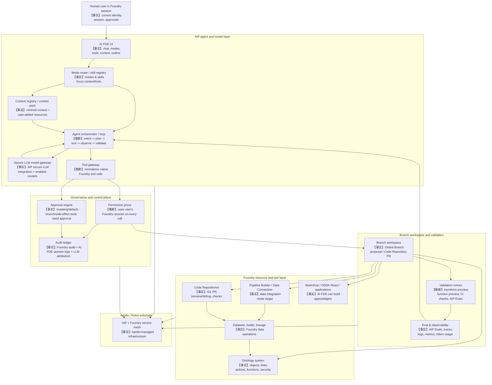

# 36 - Palantir AI FDE 架构设计推断

**调研日期：** 2026-05-30
**关联 Issue：** #25
**Agent：** E
**研究范围：** AIP architecture、AI FDE、Foundry、Apollo、Global Branching、Code Repositories、Ontology、tool services、governance、eval/observability

---

## 1. 可信度规则

| 标签 | 判定标准 |
|---|---|
| 【事实】 | Palantir 官方文档直接说明，或本仓库已有 raw 调研已引用官方文档确认。 |
| 【推断】 | 多个官方事实组合出的架构判断；需要写明推导依据。 |
| 【猜测】 | 公开资料未披露的内部模块、协议、数据结构或实现细节；只能作为待验证设计点。 |

---

## 2. 官方事实基线

1. 【事实】AIP 是 Palantir 将生成式 AI 接入 operational domains 的平台；AIP 与 Foundry 在同一 service mesh 中协同运行，由 Apollo 支撑，并部署在 Rubix substrate 上。来源：<https://www.palantir.com/docs/foundry/architecture-center/aip-architecture>
2. 【事实】AIP architecture 被官方概括为 12 类能力：secure LLM integration & access、end-to-end observability、context engineering、Ontology system、vector/compute/tool services、security & governance、agent lifecycle、operational automation、development environments、human + AI applications、package/release/deploy、enterprise automation。来源：<https://www.palantir.com/docs/foundry/architecture-center/aip-architecture>
3. 【事实】AI FDE 是交互式 agent，使用对话命令操作 Foundry，可把自然语言转成数据转换、Code Repositories 管理、Ontology 构建维护等 Foundry operations。来源：<https://www.palantir.com/docs/foundry/ai-fde/overview>
4. 【事实】AI FDE 要求 enrollment 启用 AIP；官方建议启用 Global Branching 以支持 AI FDE 的 Ontology edits。来源：<https://www.palantir.com/docs/foundry/ai-fde/overview>
5. 【事实】AI FDE 的工作步骤是：分析用户意图和上下文、确定 Foundry operations、用 native tool support 执行动作、返回解释和文档。来源：<https://www.palantir.com/docs/foundry/ai-fde/overview>
6. 【事实】AI FDE 采用 closed-loop operation：执行动作、观察结果、把反馈用于后续决策；可运行 transform preview、function preview、查看 Code Repositories CI checks 来验证修改。来源：<https://www.palantir.com/docs/foundry/ai-fde/overview>
7. 【事实】AI FDE 允许用户选择模型、工具和数据可见范围；初始状态只加载 Foundry 概念级 minimal context，不访问用户数据，用户可手动增加 datasets、functions、branches、interfaces、action types、object types、documentation bundles、media 或启用 search tools。来源：<https://www.palantir.com/docs/foundry/ai-fde/overview>、<https://www.palantir.com/docs/foundry/ai-fde/navigation>
8. 【事实】AI FDE 使用 modes 和 skills 管理任务上下文。Modes 负责广义任务类型和相关文档/工具装载，skills 映射到更细粒度的可调用工具；agent 可以在任务过程中切换 mode、请求澄清、生成计划、加载文档、管理 context/skills。来源：<https://www.palantir.com/docs/foundry/ai-fde/modes-and-skills>
9. 【事实】AI FDE 在当前用户 Foundry session 下执行，不是独立 service account 或 bot；所有操作受同一权限、governance controls 和 audit logging 约束。来源：<https://www.palantir.com/docs/foundry/ai-fde/security-and-governance>
10. 【事实】AI FDE 对 sensitive / mutating actions 有 tool approval：默认保守；default branch、unbranched change、副作用操作需审批；read-only operations 可自动批准；branch/project 可配置 allowlist。来源：<https://www.palantir.com/docs/foundry/ai-fde/security-and-governance>、<https://www.palantir.com/docs/foundry/ai-fde/navigation>
11. 【事实】AI FDE 默认跨 workflow 使用 branching，并通过 Global Branch proposal 或 Code Repository pull request 提交变更供 review。来源：<https://www.palantir.com/docs/foundry/ai-fde/overview>
12. 【事实】Global Branching 允许在一个 branch 上跨 Pipeline Builder、Ontology、Workshop、Code Repositories 等应用修改、端到端测试，并通过 review process 合并到 Main。来源：<https://www.palantir.com/docs/foundry/global-branching/overview>
13. 【事实】Code Repositories 是 Foundry 的 web-based IDE 和 Git 工程入口，支持 branching、committing、tagging releases、pull requests/code review、configurable permissions、IntelliSense、lint/error checking；Transforms repositories 支持 preview/debug。来源：<https://www.palantir.com/docs/foundry/code-repositories/overview/index.html>
14. 【事实】AIP observability 覆盖 metrics、execution history、distributed tracing、logging/debugging、log search、token usage、prompt/error details，并可导出 logs 到 Foundry streaming dataset；trace view 可展示 Functions、Actions、Automations、LLM calls 的 span。来源：<https://www.palantir.com/docs/foundry/aip-observability/overview>、<https://www.palantir.com/docs/foundry/aip-observability/trace-view>
15. 【事实】AIP Evals 用于 LLM-backed functions 的测试、debug、迭代、模型比较和 variance 分析；涉及 Ontology edits 的 evaluation 会在 Ontology simulation 中执行，避免改变真实 Ontology。来源：<https://www.palantir.com/docs/foundry/aip-evals/overview/>、<https://www.palantir.com/docs/foundry/aip-evals/ontology-edits>
16. 【事实】Palantir MCP 为 AI IDEs 和 AI agents 提供与 Foundry resources 的 secure integration，可覆盖 data integration、ontology configuration、application development；AIP architecture 页面把 MCP 描述为与 AI FDE 平台内能力相类比的 agentic development secure interface。来源：<https://www.palantir.com/docs/foundry/palantir-mcp/overview>、<https://www.palantir.com/docs/foundry/architecture-center/aip-architecture>

---

## 3. AI FDE 在 Palantir 平台中的位置

1. 【事实】Foundry 是 data operations platform，提供 data management、logic authoring、Ontology development、analytics 和 workflow development；AIP 是 generative AI platform；Apollo 是管理底层基础设施与持续交付的平台。来源：<https://www.palantir.com/docs/foundry/architecture-center/platforms>
2. 【推断】AI FDE 位于 AIP enterprise automation / human + AI application 层，而不是 Foundry 的底层数据处理引擎。推导依据：官方把 AI FDE 列入 enterprise automation examples，同时说明它通过 native tools 执行 Foundry operations。
3. 【推断】AI FDE 的有效执行面落在 Foundry toolchain 上：数据转换通过 Pipeline Builder 或 Code Repositories，Ontology edits 通过 Ontology toolchain，Functions 通过 Logic/Code Repositories，验证通过 preview、CI checks、AIP Evals 和 observability。推导依据：AI FDE capability list、Code Repositories overview、AIP Evals/observability 文档。
4. 【推断】Apollo 对 AI FDE 的直接角色更可能是运行 AIP/Foundry service mesh、发布和配置底层服务，而不是每个 agent loop 的业务编排器。推导依据：Apollo 官方定位为持续交付和底层基础设施管理，AI FDE 执行动作则由 Foundry native tools 完成。
5. 【事实】Global Branching 是 AI FDE 的默认变更承载面之一；Code Repository PR 是代码类变更的承载面。来源：AI FDE overview、Global Branching overview、Code Repositories overview。
6. 【推断】AI FDE 可以被理解为“用户会话内的 AIP agent orchestrator + Foundry tool gateway + branch-aware change proposal surface”。它不绕过 Foundry，而是把自然语言 intent 转换为受权限、审批、分支、审计和验证约束的平台操作。

---

## 4. AIP 12 类能力与 AI FDE 架构映射

| AIP capability | AI FDE 对应模块/行为 | 证据或推断依据 | 可信度 |
|---|---|---|---|
| Secure LLM integration & access | Model gateway / model selector；支持 enrollment-enabled Anthropic、OpenAI、Google、xAI 等模型；第三方不保留传输数据、不用于训练的承诺属于 AIP 层 | AIP architecture、AI FDE model support | 【事实】 |
| End-to-end observability | Session chat outline、prompts/tools history、Foundry audit logs、AIP observability trace/log/token usage、CI checks result | AI FDE overview/security/navigation、AIP observability | 【事实】 |
| Context engineering | Context registry / context pack builder；minimal context 起步，用户显式添加资源、文档、media、search tools | AI FDE overview/navigation/modes | 【事实】 |
| Ontology system | Object/link/action/function/interface 的上下文读取和变更目标；Ontology simulation 可用于 eval | Ontology docs、AI FDE capability、AIP Evals ontology edits | 【事实】 |
| Vector, compute, tool services | Tool services / tool gateway；transform preview、function preview、builds、search、LLM/vector/compute 工具 | AIP architecture、AI FDE tool support | 【推断】 |
| Security & governance | Permission proxy、approval engine、marking/session controls、audit ledger | AI FDE security/governance、AIP security governance | 【事实】 |
| Agent lifecycle | Agent loop、mode router、skill registry、plan/replan、eval/debug iteration | AI FDE closed-loop、modes/skills、AIP Evals | 【推断】 |
| Operational automation | Schedule/event/API driven automations 是 AIP 能力；AI FDE 可构建/修改 workflows，但公开资料未说 AI FDE 自身是生产调度器 | AIP architecture、AI FDE capability list | 【推断】 |
| Development environments | AI FDE 平台内对话界面；VS Code/Jupyter/SDK/MCP 是邻近开发入口 | AIP architecture、Palantir MCP、Code Repositories | 【事实】 |
| Human + AI applications | AI FDE 是 Human + AI 协作应用，用户选择 mode/context/tools 并批准敏感动作 | AI FDE overview/navigation/security | 【事实】 |
| Package, release, deploy | AI FDE 输出 Global Branch proposal、Code Repository PR；package/release/deploy 属于下游 DevOps toolchain | AIP architecture、AI FDE branching | 【推断】 |
| Enterprise automation | AI FDE 是 specialized AI agent，用来构建 pipeline、business logic、ontology、analytics、applications | AIP architecture 明确列举 AI FDE | 【事实】 |

---

## 5. Mermaid 架构分层图



【推断】图中 AI FDE 最可能不是一个单体服务，而是 AIP agent runtime、Foundry UI、native tool APIs、branch/proposal systems、security/audit services 和 observability/eval systems 的组合。推导依据：官方没有披露内部服务拓扑，但分别确认了模型接入、context/tool 管理、用户会话权限、approval、branch proposal/PR、preview/CI/evals/trace 等能力。

---

## 6. 关键模块边界与证据

| 模块 | 模块边界 | 证据来源或推断依据 | 可信度 |
|---|---|---|---|
| AI FDE UI | 会话入口、prompt input、mode selector、context ribbon、tools menu、chat outline、approval UI | AI FDE navigation 明确描述这些控件 | 【事实】 |
| Mode router | 根据用户选择或 prompt 自动选择/切换 mode，并决定文档、工具、问题处理方式 | Modes and skills 说明 mode 可自动选择和中途切换 | 【事实】 |
| Skill registry | 维护 agent skills 与 domain skills；skills 映射到一个或多个可调用工具，可启停 | Modes and skills 说明 skills 分类和启停 | 【事实】 |
| Context registry | 记录本次 session 可见 context；从 minimal context 扩展到用户添加的 Foundry resources、docs、media、search results | AI FDE overview/navigation | 【事实】 |
| Context pack builder | 把资源 schema、文档、branch 状态、tool results 压缩成 LLM 可用上下文 | 官方说明 context management，但未披露 prompt packing/token budgeting 实现 | 【猜测】 |
| Agent orchestrator / loop | 执行 intent analysis、operation selection、tool call、observation、replanning、validation | 官方说明 closed-loop operation；内部调度实现未披露 | 【推断】 |
| Secure LLM model gateway | 统一访问 enrollment-enabled commercial/open-source/BYO models，并执行 provider data retention / retraining 边界 | AIP architecture、AI FDE model support | 【事实】 |
| Tool gateway | 把 agent 的 tool choice 转换为 Foundry native tool/API 调用，覆盖 object type creation、transform writing、build running 等 | AI FDE overview 明确 native tool support 和工具例子；gateway 形态未公开 | 【推断】 |
| Permission proxy | 所有工具调用携带当前用户 Foundry session；不使用 bot/service account；权限错误与人工操作一致 | AI FDE security/governance | 【事实】 |
| Approval engine | 对 default branch、unbranched change、side-effect/mutating operations 要求用户批准；支持 branch/project allowlist | AI FDE security/governance、navigation | 【事实】 |
| Branch workspace | 把变更约束在 Global Branch proposal 或 Code Repository PR 中，支持 review 后 merge | AI FDE overview、Global Branching overview、Code Repositories overview | 【事实】 |
| Validation runner | 调用 transform preview、function preview、CI checks、AIP Evals 和可能的 lineage/impact checks | AI FDE overview 确认 preview/CI；AIP Evals 确认 eval；统一 runner 未公开 | 【推断】 |
| Audit ledger | AI FDE session log 记录 prompts/tools；Foundry audit logs 记录 API calls；LLM usage 归因到用户 | AI FDE overview、security/governance | 【事实】 |
| Eval / observability | trace/log/metrics/token usage/prompt/error details/execution history；AIP Evals 支持测试和模型比较 | AIP observability、AIP Evals | 【事实】 |
| Code Repositories adapter | 面向 Git repository、PR、file edits、preview/debug/checks、protected branches | Code Repositories overview 和既有 raw 文档 | 【事实】 |
| Ontology adapter | 面向 object/link/action/function/interface 的读写和 branch-aware proposal | AI FDE capability、Ontology docs、Global Branching overview | 【推断】 |
| Data integration adapter | 面向 Pipeline Builder、Python transforms、Data Connection、build/preview | AI FDE capability list | 【推断】 |
| MCP-adjacent interface | 面向外部 AI IDE/agent 的 secure Foundry interface，与 AI FDE 平台内能力类比 | AIP architecture、Palantir MCP overview/security | 【事实】 |

---

## 7. Agent loop 推断

```text
User prompt + selected mode + added context
  -> Mode router loads relevant docs/tools
  -> Agent orchestrator analyzes intent and missing information
  -> Agent may request clarification or generate a plan
  -> Tool gateway proposes native Foundry tool calls
  -> Permission proxy checks current user's authority
  -> Approval engine requests confirmation when needed
  -> Tool executes against branch workspace / Foundry resource
  -> Validation runner observes preview, build, CI, eval, lineage, logs
  -> Agent summarizes result, replans, or prepares proposal/PR
```

1. 【事实】“analyze intent/context -> determine operations -> perform actions -> return explanations” 是官方 AI FDE 工作流。
2. 【事实】closed-loop operation、tool results、preview/CI checks 是官方确认能力。
3. 【事实】用户控制 context/tools；工具过多或 context 过多会降低正确性和安全性，官方 best practices 建议只提供必要 context/tools。来源：<https://www.palantir.com/docs/foundry/ai-fde/best-practices>
4. 【推断】AI FDE 的 loop 必须维护 tool call state、observation state 和 branch state，否则无法持续执行多步 workflow 并把前一步输出变成后续输入。
5. 【猜测】内部可能存在 task graph / run state schema，用于记录每个 step 的 tool name、arguments、approval status、resource ids、branch id、trace ids、validation result；公开资料只确认 chat outline 和 audit/trace 能力，没有披露统一 schema。

---

## 8. Tool gateway、permission proxy、branch workspace 等模块边界

### 8.1 Tool gateway

1. 【事实】AI FDE 可使用匹配平台操作的工具，包括 creating object types、writing transforms、running builds，并展示所用工具。
2. 【推断】Tool gateway 的边界应止于“规范化调用 Foundry native tools/API”，而不是自行实现 transform engine、Ontology store 或 Git server。推导依据：官方强调 native tool support 和现有 Foundry 操作。
3. 【猜测】公开文档未披露 tool manifest 格式、参数 schema、工具错误码、幂等键、重试策略、tool result schema。

### 8.2 Permission proxy

1. 【事实】AI FDE 使用当前用户 Foundry session 执行；无独立 credential、service account 或 privilege escalation。
2. 【推断】Permission proxy 应位于每次 tool call 前后：前置做 authority/scope 检查，后置把权限错误以 agent 可理解的 observation 返回。推导依据：权限错误与人工操作一致，agent 需要在 loop 中观察并修正。
3. 【猜测】公开资料未披露 permission decision 是否有 dry-run endpoint、是否返回可解释 policy graph、是否支持批量权限预检。

### 8.3 Branch workspace

1. 【事实】AI FDE 默认使用 branching；变更以 Global Branch proposal 或 Code Repository PR 供 review。
2. 【事实】Global Branching 可跨 Pipeline Builder、Ontology、Workshop、Code Repositories 在单一 branch 端到端修改和测试。
3. 【推断】Branch workspace 是 AI FDE 的核心安全边界之一：多数 mutating operations 应先落到 feature/global branch 或 repo branch，再由 proposal/PR 合并。
4. 【猜测】公开资料未披露 AI FDE 如何在同一任务中协调 Global Branch id、Code Repository branch name、Dataset Branch、fallback branch、CI head/base revision。

### 8.4 Validation runner

1. 【事实】AI FDE 可运行 transform preview、function preview、查看 Code Repositories CI checks；AIP Evals 可评估 LLM-backed functions。
2. 【推断】Validation runner 应统一管理“轻量 preview -> branch build/CI -> eval suite -> observability trace/log”的递进验证路径。
3. 【猜测】公开资料未披露 AI FDE 是否有自动选择验证策略的策略引擎、验证失败的重试预算、质量阈值配置或 cross-resource impact scoring。

### 8.5 Audit ledger 与 observability/evals

1. 【事实】AI FDE session logs、Foundry audit logs、LLM attribution 均生效；AIP observability 提供 traces/logs/metrics/token/prompt/error details。
2. 【推断】审计与 observability 是两个相邻但不同的面：audit 证明“谁在何时对什么资源做了什么”，observability 解释“执行链路为何成功/失败、耗时与 token 资源如何消耗”。
3. 【猜测】公开资料未披露 AI FDE chat outline id、audit event id、foundryTraceId、PR/proposal id、eval run id 之间是否存在统一 correlation id。

---

## 9. 公开资料未披露但实现时必须设计的接口

| 接口 | 最小职责 | 为什么必须设计 | 公开证据与缺口 | 可信度 |
|---|---|---|---|---|
| `ContextBundleService` | 输入 session id、selected mode、resource refs、docs/search/media；输出可审计、可裁剪、权限过滤后的 context bundle | AI FDE 需要用户控制 context，并避免 context pollution | 官方确认 context 管理，但不披露 bundle schema/token budgeting | 【猜测】 |
| `ToolManifestRegistry` | 注册 tool name、description、argument schema、risk class、branch awareness、approval policy、result schema | Agent 需要只启用必要工具，并能展示/审批工具调用 | 官方确认 customizable tools/skills，但不披露 manifest | 【猜测】 |
| `PermissionPreflightApi` | 对计划中的 tool calls 做批量权限预检，返回 allowed/denied/requires-approval 和可解释原因 | Agent 不能越权；提前发现权限问题可减少失败 tool calls | 官方确认 server-side permission，但不披露 dry-run 接口 | 【猜测】 |
| `ApprovalDecisionApi` | 记录用户对单次 tool call、session-level allowlist、branch/project-scoped approval 的决定 | Mutating/default-branch/side-effect 操作必须经用户同意 | 官方确认 approval 行为，但不披露 decision event schema | 【猜测】 |
| `BranchWorkspaceResolver` | 解析任务涉及的 Global Branch、Code Repository branch、Dataset Branch、fallback branch、target Main/protected branch | AI FDE 默认 branching，且跨 workflow 修改需要一致 branch context | 官方确认 Global Branching/PR，但不披露跨系统 branch mapping | 【猜测】 |
| `ToolExecutionJournal` | 记录 tool call arguments、approval id、user/session identity、resource ids、result、error、trace ids | 支撑 closed-loop observation、chat outline、audit 与故障恢复 | 官方确认 chat outline/audit/logging，但不披露统一 journal | 【猜测】 |
| `ValidationRunApi` | 统一触发 transform preview、function preview、CI checks、AIP Eval suite、Ontology simulation，并回收结果 | AI FDE 需要验证自己的改动，而各验证工具来自不同子系统 | 官方确认若干验证动作，但不披露统一 runner | 【猜测】 |
| `ProposalSynthesisApi` | 把 branch 上的 file/resource/schema/ontology/function/app changes 汇总成 Global Branch proposal 或 Code Repository PR 描述 | AI FDE 默认通过 proposal/PR 交付变更供 review | 官方确认 proposal/PR，但不披露自动撰写和资源 diff API | 【猜测】 |
| `TelemetryCorrelationApi` | 将 session、message、tool call、audit event、trace、eval run、build run、PR/proposal 关联 | 排障和治理需要跨 UI、agent、Foundry、AIP observability 追踪同一任务 | 官方确认多个日志/trace 面，但不披露 correlation model | 【猜测】 |

关键判断：以上接口不是 Palantir 已公开 API；它们是复刻 AI FDE 类系统时必须明确的设计接口。【猜测】

---

## 10. 架构关键结论

1. 【事实】AI FDE 是 AIP 上的 enterprise automation agent，操作 Foundry，而不是独立于 Foundry 的外部机器人。证据：AI FDE overview、AIP architecture。
2. 【事实】AI FDE 的安全边界继承用户身份、权限、markings/session access、approval、audit logging 和 LLM usage attribution。证据：AI FDE security/governance。
3. 【推断】AI FDE 的架构核心不是“LLM 生成代码”，而是“LLM loop + context/tool scoping + Foundry native tools + branch/proposal + validation/audit”。推导依据：官方同时强调 context management、customizable tools、closed-loop validation、branching、security governance。
4. 【事实】AI FDE 与 Code Repositories 的连接点至少包括写 transform/function/app 代码、运行 preview、查看 CI checks、提交 PR。证据：AI FDE overview、Code Repositories overview。
5. 【事实】AI FDE 与 Global Branching 的连接点是跨应用 branch 上的端到端 workflow 变更，尤其是 Ontology edits。证据：AI FDE overview、Global Branching overview。
6. 【推断】AI FDE 与 Apollo 的关系是“运行在 Apollo-managed AIP/Foundry service mesh 上”，不是由 Apollo 直接决定每个 agent step。证据：Apollo 在 architecture center 中负责底层基础设施和持续交付；AI FDE step 由 Foundry native tools 执行。
7. 【推断】Tool gateway 和 permission proxy 必须分离：tool gateway 关心“怎么调用平台能力”，permission proxy 关心“当前用户是否可调用、是否需审批”。这能解释官方同时强调 tool customization 和 server-side permission enforcement。
8. 【推断】Validation runner 必须是分层的：read-only exploration 和 preview 可快速反馈；CI checks、AIP Evals、branch proposal review 和 observability 用于更高置信度。证据：AI FDE overview、AIP Evals、AIP observability、Code Repositories checks。
9. 【猜测】Palantir 内部是否使用单一 agent runtime、是否复用 MCP tool schema、是否使用特定 orchestrator 框架、是否有统一 state machine，公开资料无法确认。

---

## 11. 自建平台可借鉴的最小架构

| 层 | 必建模块 | 借鉴点 | 可信度 |
|---|---|---|---|
| User/session | Authenticated user session、session markings、chat/session store | Agent 不能有高于用户的权限 | 【事实】 |
| Model | Model gateway、model policy、token/usage accounting | 模型访问要统一治理和归因 | 【事实】 |
| Context | Context registry、resource resolver、context compressor | 只加载任务必要资源，避免 context pollution | 【推断】 |
| Agent | Mode router、skill registry、planner/loop、clarification | 不同任务加载不同 docs/tools | 【事实】 |
| Tools | Tool manifest、tool gateway、idempotent execution、tool result schema | tool 必须可审计、可审批、可重放排查 | 【推断】 |
| Governance | Permission preflight、approval engine、audit ledger | mutating operations 要审批，所有调用可追溯 | 【事实】 |
| Branching | Branch workspace、resource diff、proposal/PR generator | 变更先进入 branch，再 review/merge | 【事实】 |
| Validation | Preview runner、CI checks、eval suites、simulation | Agent 应验证自己的改动 | 【事实】 |
| Observability | Trace/log/metrics/token/prompt/error dashboard、correlation ids | closed-loop 与生产治理需要统一 telemetry | 【推断】 |

---

## 12. 证据缺口

1. 【猜测】AI FDE 内部 agent orchestrator 的具体实现、state machine、memory schema、tool-call protocol、retry/rollback 策略未公开。
2. 【猜测】Context bundle 的构建算法、token budgeting、resource summarization、敏感字段裁剪、search ranking 未公开。
3. 【猜测】Tool gateway 的 manifest schema、risk classification、参数校验、幂等与错误恢复策略未公开。
4. 【猜测】Permission proxy 是否支持批量 dry-run、policy explanation、approval reason code、branch-aware preflight 未公开。
5. 【猜测】Global Branch、Dataset Branch、Code Repository branch、PR/proposal、fallback branch 在 AI FDE 中如何统一绑定未公开。
6. 【猜测】AI FDE 的 audit/session log、Foundry audit logs、AIP observability traces、AIP Evals run、Code Repository checks 之间是否有统一 correlation id 未公开。
7. 【猜测】AI FDE 对多 session 并发、基础设施限流、build storm 防护、GPU/compute quota 的调度策略未公开；官方 best practices 只提示 AI FDE 高频并发操作可能暴露基础设施瓶颈。

---

## 13. 参考来源

### 官方 Palantir 文档

- AIP architecture overview: <https://www.palantir.com/docs/foundry/architecture-center/aip-architecture>
- AIP, Foundry, and Apollo: <https://www.palantir.com/docs/foundry/architecture-center/platforms>
- AI FDE Overview: <https://www.palantir.com/docs/foundry/ai-fde/overview>
- AI FDE Navigation: <https://www.palantir.com/docs/foundry/ai-fde/navigation>
- AI FDE Modes and skills: <https://www.palantir.com/docs/foundry/ai-fde/modes-and-skills>
- AI FDE Security and governance: <https://www.palantir.com/docs/foundry/ai-fde/security-and-governance>
- AI FDE Best practices: <https://www.palantir.com/docs/foundry/ai-fde/best-practices>
- Global Branching Overview: <https://www.palantir.com/docs/foundry/global-branching/overview>
- Code Repositories Overview: <https://www.palantir.com/docs/foundry/code-repositories/overview/index.html>
- Ontology system architecture: <https://www.palantir.com/docs/foundry/architecture-center/ontology-system>
- Ontology overview: <https://www.palantir.com/docs/foundry/ontology/overview/>
- AIP observability overview: <https://www.palantir.com/docs/foundry/aip-observability/overview>
- AIP observability trace view: <https://www.palantir.com/docs/foundry/aip-observability/trace-view>
- AIP Evals overview: <https://www.palantir.com/docs/foundry/aip-evals/overview/>
- AIP Evals Ontology edits: <https://www.palantir.com/docs/foundry/aip-evals/ontology-edits>
- Palantir MCP overview: <https://www.palantir.com/docs/foundry/palantir-mcp/overview>
- Palantir MCP security: <https://www.palantir.com/docs/foundry/palantir-mcp/security>

### 仓库内参考

- `docs/superpowers/plans/2026-05-30-palantir-ai-fde-research-plan.md`
- `docs/raw/23-code-repositories-engineering-entry.md`
- `docs/raw/26-pro-code-governance-quality-observability.md`
- `docs/raw/29-lineage-branch-version-pipeline-sync.md`
