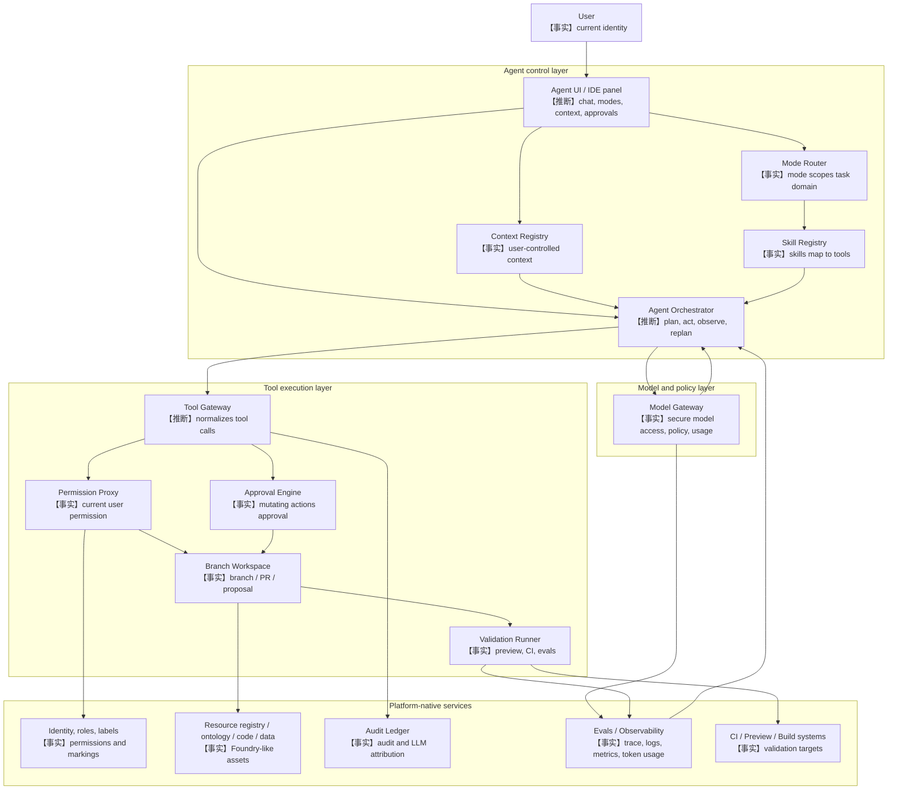

# 37 - Palantir AI FDE 自建实现方案与 PoC 路线

**调研日期：** 2026-05-30
**关联 Issue：** #24
**负责 Agent：** Agent F
**输出文件：** `docs/raw/37-ai-fde-self-build-implementation-blueprint.md`
**输入依赖：** `docs/raw/32-ai-fde-source-map.md`、`docs/raw/33-ai-fde-product-positioning.md`、`docs/raw/34-ai-fde-context-tools-skills.md`、`docs/raw/35-ai-fde-governance-branching.md`、`docs/raw/36-ai-fde-architecture-design.md`

---

## 1. 结论摘要

1. 【事实】Palantir AI FDE 是在 AIP 启用的 Foundry 环境中运行的交互式 agent，通过自然语言驱动 Foundry 原生操作，覆盖数据转换、Code Repositories、Ontology、Functions、Governance、ML、OSDK React 等任务域。来源：<https://www.palantir.com/docs/foundry/ai-fde/overview>、<https://www.palantir.com/docs/foundry/ai-fde/modes-and-skills>
2. 【事实】AI FDE 在当前用户 Foundry session 下执行，不是独立 service account；权限、markings、audit logging、LLM usage attribution 均继承平台机制。来源：<https://www.palantir.com/docs/foundry/ai-fde/security-and-governance>
3. 【事实】AI FDE 通过 mode、skills、用户显式 context、tool selection、tool approval、branch/proposal/PR、preview/CI/evals 形成闭环操作模型。来源：<https://www.palantir.com/docs/foundry/ai-fde/navigation>、<https://www.palantir.com/docs/foundry/ai-fde/best-practices>
4. 【推断】自建类 AI FDE 的核心不是先做“全能聊天机器人”，而是先建设受控工程执行面：`agent orchestrator`、`model gateway`、`context registry`、`mode router`、`skill registry`、`tool gateway`、`permission proxy`、`approval engine`、`branch workspace`、`validation runner`、`audit ledger`、`evals/observability`。推理链：AI FDE 的公开能力同时依赖模型接入、上下文工程、工具调用、权限、审批、分支、验证和审计；缺任一约束都无法复刻其可信边界。
5. 【推断】平台必须原生支持身份透传、权限/标签强制、分支工作区、审批策略、审计归因、验证执行和资源语义目录；外部 Agent 框架可以实现规划、反思、提示词模板、局部工具选择和多步任务编排，但不能替代平台安全强制点。推理链：AI FDE 官方明确所有操作受 Foundry session 和治理约束，而 agent 框架默认只能建议或调用接口，不能凭模型推理保证权限、审计和回滚。
6. 【推断】90 天 PoC 应按风险递增推进：P0 只读探索，P1 分支内代码修改，P2 preview/CI validation，P3 ontology/function/tool 扩展，P4 evals 和运营化。推理链：只读能力可先验证身份、上下文和审计；写能力必须先限制在 branch；再通过 validation 和 proposal/PR 提升置信度；最后才开放更高风险的 ontology/action/tool 场景。
7. 【猜测】Palantir 内部是否复用 MCP tool schema、是否有统一 agent state machine、是否存在统一 correlation id、approval policy schema 和 context bundle schema，公开资料没有披露；自建方案只能把这些作为待设计接口，而不是声称复刻 Palantir 内部实现。

---

## 2. 设计目标与非目标

### 2.1 设计目标

| 目标 | 说明 | 可信度 |
|---|---|---|
| 受控工程执行入口 | 用自然语言把用户意图转成可审查、可验证、可回滚的平台变更或诊断结果 | 【推断】 |
| 用户身份执行 | 所有工具调用绑定发起用户，不能使用共享高权 token | 【事实】 |
| 显式上下文 | 用户和系统都能看到本轮模型使用了哪些资源、文档、分支、历史摘要和工具结果 | 【事实】 |
| Mode-scoped tools | 按 Exploration、Data integration、Functions、Ontology、Governance 等任务域限制工具面 | 【事实】 |
| Branch-first writes | 写操作默认进入 branch/sandbox，产出 PR/proposal，而不是直接写生产 | 【事实】 |
| Validation evidence | 代理报告必须引用 preview、CI、test、eval、build 或 trace 证据 | 【推断】 |
| 全链路审计 | prompt、context、tool plan、approval、execution、result、usage、diff 可按用户/资源/session 查询 | 【推断】 |

### 2.2 非目标

| 非目标 | 边界说明 | 可信度 |
|---|---|---|
| 不做无权限自动化 | Agent 不能绕过用户权限、项目角色、敏感标签、分支保护或审批策略 | 【事实】 |
| 不承诺自然语言直达生产 | 高风险写入必须经过 branch、review、approval、CI/eval 或人工 owner 验收 | 【推断】 |
| 不替代确定性平台服务 | Agent 不应自行实现 Git、数据构建、Ontology store、权限系统、CI 或审计系统 | 【推断】 |
| 不声称复刻 Palantir 内部实现 | 公开资料未披露内部 orchestrator、prompt、state machine、tool schema | 【猜测】 |
| 不把普通 RAG 问答包装成 AI FDE | AI FDE 的差异点是原生工具执行、审批、分支、验证和审计闭环 | 【推断】 |

---

## 3. Self-build Reference Architecture

### 3.1 分层架构图



### 3.2 模块职责

| 模块 | 最小职责 | 平台原生 / 外部框架 | 可信度 |
|---|---|---|---|
| Agent Orchestrator | 接收 intent，生成计划，调用工具，观察结果，必要时请求澄清、重试或停止 | 可由外部 Agent 框架实现，但必须只通过平台 tool gateway 行动 | 【推断】 |
| Model Gateway | 模型白名单、模型路由、prompt/response policy、token 预算、用户/项目归因、速率限制 | 必须平台原生支持治理；可外接第三方模型 provider | 【事实】 |
| Context Registry | 记录 session 可见资源、文档、搜索结果、媒体、branch、摘要、tool outputs 及权限快照 | 必须平台原生支持资源权限过滤；context packing 可由 agent 框架辅助 | 【推断】 |
| Mode Router | 把任务路由到 Exploration、Data integration、Functions、Ontology、Governance 等 mode，并装载工具/文档 | 可由 agent 框架分类，但 mode policy 必须平台配置化 | 【事实】 |
| Skill Registry | 注册 agent skills/domain skills，映射 tool refs、前置条件、风险级别、可观测输出 | 平台应维护可信 manifest；agent 框架可选择启用技能 | 【事实】 |
| Tool Gateway | 统一工具 schema、参数校验、幂等键、执行适配器、结果 schema、错误分类 | 必须平台原生，外部 agent 只能调用受控接口 | 【推断】 |
| Permission Proxy | 每次 tool call 以当前用户身份做权限、租户、标签、branch、资源 scope 检查 | 必须平台原生强制 | 【事实】 |
| Approval Engine | 根据 risk class、branch class、side effect、allowlist、TTL 决定是否要求用户批准 | 必须平台原生或平台可信服务，不能由 LLM 自行判断 | 【事实】 |
| Branch Workspace | 创建/解析 branch、sandbox、PR/proposal、diff、merge gate、retention、rollback | 必须平台原生或与代码/资源系统深度集成 | 【事实】 |
| Validation Runner | 触发 preview、dry-run、unit tests、CI checks、builds、AIP evals、ontology simulation 并汇总结果 | 必须平台原生接入验证系统；agent 可选择验证计划 | 【推断】 |
| Audit Ledger | 记录 prompt、context、tool plan、approval、execution、result、diff、trace、usage、correlation id | 必须平台原生且不可由 agent 篡改 | 【事实】 |
| Evals / Observability | traces、logs、metrics、token usage、prompt/error details、eval suites、运营 dashboard | 平台原生为主；外部框架可上报 spans 和自定义 metrics | 【事实】 |

### 3.3 最小闭环

```text
intent
  -> mode route
  -> context resolve
  -> plan
  -> permission preflight
  -> approval decision
  -> branch-local execution
  -> validation
  -> proposal / PR / report
  -> audit and eval feedback
```

【推断】上述闭环的关键在于每一步都产出可审计对象，而不是只把中间推理保存在模型上下文中。推理链：AI FDE 文档强调 chat outline、tools used、approval、branch proposal/PR、preview/CI 和 audit logs；这些都是可检查的系统对象。

---

## 4. 平台原生能力 vs 外部 Agent 框架能力

### 4.1 必须平台原生支持

| 能力 | 为什么必须平台原生 | 缺失后果 | 可信度 |
|---|---|---|---|
| 用户身份透传与 delegated token | 官方 AI FDE 使用当前用户 session，不使用 bot/service account | Agent 可能变成共享高权服务，无法按用户追责 | 【事实】 |
| 资源权限、租户、组织、敏感标签强制 | 官方说明权限和 markings 继续生效 | prompt 注入或工具参数篡改可能泄露数据 | 【事实】 |
| 模型治理与使用归因 | AIP 提供模型启用、rate limits、token/compute usage 归因 | 无法控制模型合规、成本和滥用 | 【事实】 |
| Context resource resolver | AI FDE 只访问加入 chat 的 context，且 context 受权限控制 | 模型可能看到不该看到的资源或过量上下文 | 【事实】 |
| Tool manifest 和 server-side schema validation | 工具调用必须被平台解释、校验和执行 | LLM 生成的参数可绕过业务约束 | 【推断】 |
| Permission preflight 和执行时重检 | Approval 不是 permission 替代；权限错误与人工操作一致 | 用户批准后仍可能越权或产生不一致执行 | 【事实】 |
| Approval policy engine | Mutating/default branch/side-effect 操作需要审批 | LLM 可自行触发高风险写入 | 【事实】 |
| Branch workspace / PR / proposal | AI FDE 默认通过 branching、proposal 或 PR 交付变更 | 无法 review、回滚、隔离生产影响 | 【事实】 |
| Preview / CI / eval / build integration | AI FDE 用 preview、function preview、CI checks、AIP Evals 验证 | Agent 无法证明改动有效 | 【事实】 |
| Audit ledger 和 correlation id | AI FDE 活动进入 session logs、Foundry audit logs、LLM usage attribution | 事故后无法回答 who/what/when/why | 【事实】 |
| Kill switch / revoke / freeze | 高风险自动化需要人工中止和撤销预授权 | 失控任务可能持续写入或消耗资源 | 【推断】 |

### 4.2 可以由外部 Agent 框架实现

| 能力 | 可外部实现的原因 | 平台约束 | 可信度 |
|---|---|---|---|
| Planner / Replanner | 多步计划、反思、错误修复属于 agent runtime 常见能力 | 计划不能直接执行，必须经 tool gateway | 【推断】 |
| Prompt templates | mode-specific prompt、角色描述、输出格式可在框架侧维护 | 模型输入必须来自 context registry 的授权 bundle | 【推断】 |
| Tool selection heuristic | 外部框架可根据 mode 和 task 选择候选工具 | 实际可用工具由 platform manifest 和权限决定 | 【推断】 |
| Clarification policy | 何时问用户补充信息可由 agent runtime 决定 | 不能用追问诱导用户泄露无权限资源 | 【推断】 |
| Local code edit loop | 在 branch workspace 内生成 patch、修复 lint/test 可由 coding agent 执行 | 文件写入、commit、PR 必须走平台分支和审计 | 【推断】 |
| Summarization / memory compaction | 长会话摘要、message pruning 可由模型实现 | 摘要必须作为新 context item 记录来源、范围和标签 | 【推断】 |
| Report synthesis | 最终总结、PR 描述、proposal 说明可由 LLM 生成 | 必须引用实际 validation/audit evidence | 【推断】 |
| Eval case generation | Agent 可建议 eval cases、fixture、expected behavior | 执行和通过标准由平台 eval runner 固化 | 【推断】 |

### 4.3 边界判断

【推断】外部 Agent 框架适合做“认知编排”，平台原生服务必须做“执行授权”。推理链：Agent 框架可以生成计划和候选工具，但无法凭自身保证用户权限、敏感标签、分支保护、审计不可篡改和生产合并策略。

【推断】如果一个系统只有 LLM、RAG、少量 API tool 和聊天 UI，但没有用户身份透传、分支隔离、审批、验证、审计和资源权限重检，就只能称为“平台助手”或“工程 copilot”，不应称为类 AI FDE。推理链：AI FDE 的官方差异点集中在 Foundry native tool support、security/governance、branching 和 closed-loop validation。

---

## 5. 核心接口草案

以下接口是自建类 AI FDE 时建议定义的 contract，不是 Palantir 已公开 API。【猜测】

### 5.1 TypeScript-like domain types

```ts
type Confidence = "fact" | "inference" | "guess";

type ModeId =
  | "exploration"
  | "platform_qa"
  | "data_integration"
  | "data_connection"
  | "ontology_editing"
  | "functions_editing"
  | "governance"
  | "machine_learning"
  | "osdk_react";

type ContextType =
  | "documentation_bundle"
  | "dataset"
  | "function"
  | "branch"
  | "interface"
  | "action_type"
  | "object_type"
  | "uploaded_media"
  | "dragged_link"
  | "search_result"
  | "message_summary"
  | "tool_result";

type RiskClass =
  | "read_only"
  | "branch_aware_mutation"
  | "side_effecting"
  | "always_approve"
  | "forbidden";

type BranchClass = "none" | "feature" | "default" | "protected" | "production";

interface AgentSession {
  sessionId: string;
  ownerUserId: string;
  tenantId: string;
  appliedLabels: string[];
  activeMode?: ModeId;
  branchWorkspaceId?: string;
  status: "open" | "awaiting_approval" | "running" | "proposed" | "closed" | "frozen";
  createdAt: string;
  updatedAt: string;
}

interface ContextItem {
  contextId: string;
  type: ContextType;
  sourceUri: string;
  displayName: string;
  addedBy: "user" | "agent" | "mode_default" | "search_tool" | "validation_runner";
  branchScope?: string;
  labels: string[];
  permissionSnapshotId: string;
  tokenEstimate: number;
  status: "active" | "summarized" | "removed" | "expired";
  provenance: {
    sourceContextIds?: string[];
    retrievalQuery?: string;
    summaryModel?: string;
    collectedAt: string;
  };
}

interface ToolManifest {
  toolId: string;
  skillIds: string[];
  supportedModes: ModeId[];
  description: string;
  inputSchemaRef: string;
  outputSchemaRef: string;
  riskClass: RiskClass;
  branchPolicy: "not_required" | "feature_required" | "protected_requires_approval";
  idempotency: "required" | "recommended" | "not_supported";
  observableOutputs: string[];
}

interface ToolCallRequest {
  callId: string;
  sessionId: string;
  userId: string;
  modeId: ModeId;
  toolId: string;
  arguments: Record<string, unknown>;
  contextIds: string[];
  targetResources: ResourceRef[];
  branchWorkspaceId?: string;
  idempotencyKey?: string;
  reason: string;
}

interface ResourceRef {
  resourceType: "dataset" | "repository" | "file" | "ontology_type" | "function" | "application" | "policy";
  resourceId: string;
  branchId?: string;
  labels?: string[];
}

interface PermissionDecision {
  decisionId: string;
  allowed: boolean;
  requiresApproval: boolean;
  denialReasons: string[];
  approvalReasons: string[];
  checkedAt: string;
}

interface ApprovalDecision {
  approvalId: string;
  callId: string;
  userId: string;
  decision: "approved" | "rejected" | "expired" | "revoked";
  scope: "single_call" | "session_tool" | "branch_project_allowlist";
  expiresAt?: string;
  justification?: string;
  decidedAt: string;
}

interface ToolCallResult {
  callId: string;
  status: "succeeded" | "failed" | "cancelled" | "partial";
  outputRef?: string;
  errorCode?: string;
  errorMessage?: string;
  changedResources: ResourceRef[];
  traceIds: string[];
  auditEventIds: string[];
  observedAt: string;
}

interface ValidationRun {
  validationId: string;
  sessionId: string;
  branchWorkspaceId?: string;
  type: "preview" | "unit_test" | "ci_check" | "build" | "eval_suite" | "simulation" | "policy_check";
  targetResources: ResourceRef[];
  status: "queued" | "running" | "passed" | "failed" | "skipped";
  evidenceUri?: string;
  metrics?: Record<string, number | string | boolean>;
  startedAt?: string;
  completedAt?: string;
}
```

### 5.2 JSON schema-like tool manifest

```json
{
  "$id": "ToolManifest",
  "type": "object",
  "required": ["toolId", "supportedModes", "riskClass", "inputSchema", "outputSchema"],
  "properties": {
    "toolId": { "type": "string" },
    "supportedModes": {
      "type": "array",
      "items": { "enum": ["exploration", "data_integration", "ontology_editing", "functions_editing", "governance"] }
    },
    "riskClass": {
      "enum": ["read_only", "branch_aware_mutation", "side_effecting", "always_approve", "forbidden"]
    },
    "branchPolicy": {
      "enum": ["not_required", "feature_required", "protected_requires_approval"]
    },
    "approvalPolicyRef": { "type": "string" },
    "inputSchema": { "type": "object" },
    "outputSchema": { "type": "object" },
    "auditCategory": { "type": "string" },
    "rateLimitKey": { "type": "string" }
  }
}
```

### 5.3 最小服务接口

```ts
interface ContextRegistryApi {
  addContext(sessionId: string, item: ContextItem): Promise<ContextItem>;
  removeContext(sessionId: string, contextId: string): Promise<void>;
  buildContextBundle(input: {
    sessionId: string;
    modeId: ModeId;
    maxTokens: number;
    includeContextIds: string[];
  }): Promise<{ bundleId: string; contextIds: string[]; promptRef: string; labels: string[] }>;
}

interface ModeRouterApi {
  route(input: {
    sessionId: string;
    userPrompt: string;
    explicitMode?: ModeId;
    contextIds: string[];
  }): Promise<{ selectedMode: ModeId; alternatives: ModeId[]; rationale: string }>;
}

interface ToolGatewayApi {
  preflight(request: ToolCallRequest): Promise<PermissionDecision>;
  execute(request: ToolCallRequest, approvalId?: string): Promise<ToolCallResult>;
}

interface ApprovalEngineApi {
  evaluate(input: {
    request: ToolCallRequest;
    permissionDecision: PermissionDecision;
    branchClass: BranchClass;
    riskClass: RiskClass;
  }): Promise<{ required: boolean; approvalPrompt?: ApprovalPrompt }>;
  recordDecision(decision: ApprovalDecision): Promise<void>;
}

interface BranchWorkspaceApi {
  resolveOrCreate(input: {
    sessionId: string;
    targetResources: ResourceRef[];
    preferredBranchName?: string;
  }): Promise<{ branchWorkspaceId: string; branchClass: BranchClass; proposalUri?: string; prUri?: string }>;
  diff(branchWorkspaceId: string): Promise<{ changedResources: ResourceRef[]; diffUri: string }>;
}

interface ValidationRunnerApi {
  run(input: {
    sessionId: string;
    branchWorkspaceId?: string;
    targets: ResourceRef[];
    validationTypes: ValidationRun["type"][];
  }): Promise<ValidationRun[]>;
}

interface AuditLedgerApi {
  append(event: AuditEvent): Promise<{ auditEventId: string }>;
  correlate(input: {
    sessionId: string;
    callId?: string;
    validationId?: string;
    traceId?: string;
    proposalOrPrUri?: string;
  }): Promise<void>;
}
```

### 5.4 审批策略伪代码

```ts
function requiresApproval(input: {
  riskClass: RiskClass;
  branchClass: BranchClass;
  permissionAllowed: boolean;
  hasSideEffects: boolean;
  allowlistHit: boolean;
}): "deny" | "approve_required" | "auto_approve" {
  if (!input.permissionAllowed) return "deny";
  if (input.riskClass === "forbidden") return "deny";
  if (input.riskClass === "always_approve") return "approve_required";
  if (input.branchClass === "default" || input.branchClass === "protected" || input.branchClass === "production") {
    return "approve_required";
  }
  if (input.hasSideEffects && !input.allowlistHit) return "approve_required";
  if (input.riskClass === "read_only") return "auto_approve";
  if (input.riskClass === "branch_aware_mutation" && input.branchClass === "feature") {
    return input.allowlistHit ? "auto_approve" : "approve_required";
  }
  return "approve_required";
}
```

【推断】审批策略必须把 permission、risk class、branch class、side effect、allowlist 拆开判断。推理链：AI FDE 文档同时说明 read-only auto approval、branch-aware approval、default branch/unbranched/side-effect approval 和 server-side permission enforcement。

---

## 6. 90 天 PoC 路线

### 6.1 阶段概览

| 阶段 | 时间 | 范围 | 主要能力 | 不开放能力 | 退出标准 |
|---|---:|---|---|---|---|
| P0 只读探索 | Day 1-15 | 文档、资源目录、元数据、权限内搜索 | Exploration / Platform Q&A、context registry、read-only tools、audit | 写入、build、PR、生产 action | 能回答“看到了什么、为什么能看、用了哪些工具” |
| P1 分支内代码修改 | Day 16-35 | 单 repo / 单项目 branch-local file edits | branch workspace、patch generation、tool approval、diff audit | main/protected 写入、自动合并 | 生成可审查 PR 草案，所有写入限于 feature branch |
| P2 Preview / CI validation | Day 36-55 | transforms/functions/app code 的预览和 CI | validation runner、CI checks、preview evidence、失败修复 loop | 无验证的成功报告、生产发布 | PR 描述包含验证证据或明确失败原因 |
| P3 Ontology / Function / Tool 扩展 | Day 56-75 | ontology schema 草案、function edits、governance diagnosis、更多 tool adapters | mode/skill registry、proposal 草案、higher-risk approval | 直接合并 ontology/action/publish/tag | 高风险变更只生成 proposal/PR，owner 审批 |
| P4 Evals 和运营化 | Day 76-90 | eval suites、observability、运营门禁、成本/限流 | eval dashboard、trace correlation、SLO、kill switch、runbook | 无监控扩容到生产 | 可度量质量、成本、失败率和安全事件 |

### 6.2 P0：只读探索

| 维度 | 内容 |
|---|---|
| 目标 | 【推断】先验证“用户身份 + 权限内 context + read-only tools + audit”这条最低风险链路。 |
| 交付 | 【推断】Agent UI、session store、context registry、mode router v0、read-only resource search、documentation search、chat outline、token/usage logging。 |
| 工具 | 【推断】`searchResources`、`getResourceMetadata`、`getLineageSummary`、`searchDocs`、`readDefinitions`。 |
| 验证 | 【推断】同一 prompt 对不同权限用户返回不同可见资源；audit ledger 记录 user/session/context/tool/result。 |
| 禁止 | 【推断】任何写入、build、action execution、branch creation、PR creation。 |

验收标准：

1. 【推断】100% tool call 绑定当前用户，并可在 audit ledger 查询。
2. 【推断】无权限资源不会进入 context bundle、模型输入、tool output 或摘要。
3. 【推断】chat outline 能展示 prompts、responses、tools、context ids、token estimates。
4. 【推断】read-only tool 的结果带 resource ids、labels、retrieval query 和时间戳。

### 6.3 P1：分支内代码修改

| 维度 | 内容 |
|---|---|
| 目标 | 【推断】把 agent 写能力限制在 feature branch 和可 review diff 中。 |
| 交付 | 【推断】branch workspace resolver、file edit tool、patch apply、commit metadata、PR draft generator、approval engine v1。 |
| 工具 | 【推断】`createBranch`、`readFile`、`proposePatch`、`applyPatchOnBranch`、`commitBranchChanges`、`openDraftPr`。 |
| 验证 | 【推断】所有修改只出现在 branch；main/protected branch tool call 被拒绝或要求审批；PR diff 可重放审计。 |
| 禁止 | 【推断】自动合并 PR、直接 push main、修改 protected branch、执行生产 action。 |

验收标准：

1. 【推断】所有 mutating tool call 都有 permission preflight 和 approval decision。
2. 【推断】branch workspace diff 能列出 changed files、resource refs、agent-generated commit message 和 call ids。
3. 【推断】用户拒绝 approval 后 tool 不执行，audit 记录 rejected decision。
4. 【推断】agent 最终输出只声明已创建 branch/PR 草案，不宣称生产已变更。

### 6.4 P2：Preview / CI validation

| 维度 | 内容 |
|---|---|
| 目标 | 【推断】让 agent 从“会改”升级到“能证明改动经过验证”。 |
| 交付 | 【推断】validation runner、preview adapter、CI adapter、validation evidence store、failure repair loop。 |
| 工具 | 【推断】`runTransformPreview`、`runFunctionPreview`、`runUnitTests`、`readCiChecks`、`summarizeValidationEvidence`。 |
| 验证 | 【推断】PR/proposal 描述引用 validation ids、CI check urls、preview sample、失败日志摘要。 |
| 禁止 | 【推断】无 validation evidence 时输出“已通过”；CI 失败时自动绕过 merge gate。 |

验收标准：

1. 【推断】每个 branch-local code change 至少触发一种 validation 或记录为什么无法验证。
2. 【推断】失败验证会进入 agent observation，agent 最多在配置预算内修复重试。
3. 【推断】最终报告区分 `passed`、`failed`、`skipped`、`not_applicable`。
4. 【推断】CI/preview/eval 结果与 PR/proposal、tool call、audit event 有 correlation。

### 6.5 P3：Ontology / Function / Tool 扩展

| 维度 | 内容 |
|---|---|
| 目标 | 【推断】扩展到更接近 AI FDE 的 platform asset 变更，但继续强制 proposal/approval。 |
| 交付 | 【推断】ontology schema proposal adapter、function edit adapter、governance diagnosis mode、tool manifest registry v1、risk-based approval。 |
| 工具 | 【推断】`draftOntologyChange`、`simulateOntologyChange`、`editFunctionOnBranch`、`runFunctionEval`、`diagnosePermissions`、`createProposalDraft`。 |
| 验证 | 【推断】Ontology/function 变更进入 branch/proposal，不直接合并；action/publish/tag 每次审批。 |
| 禁止 | 【推断】执行真实业务 action、发布应用、创建 tag、变更 security markings 时自动批准。 |

验收标准：

1. 【推断】每个新增 tool 都有 manifest、risk class、input/output schema、approval policy、observability contract。
2. 【推断】Ontology/function 变更带 simulation/eval 或 owner review checklist。
3. 【推断】Governance mode 默认诊断和建议，不直接修改权限或 markings。
4. 【推断】高风险 tool approval UI 展示目标资源、branch、side effects、回滚方式和验证计划。

### 6.6 P4：Evals 和运营化

| 维度 | 内容 |
|---|---|
| 目标 | 【推断】把 PoC 从 demo 变成可运营的受控能力。 |
| 交付 | 【推断】eval suites、golden tasks、regression dashboard、model comparison、trace/log/token dashboard、rate limit、kill switch、runbook。 |
| 工具 | 【推断】`runAgentEvalSuite`、`compareModelRuns`、`exportAuditSlice`、`setSessionFreeze`、`revokePreApproval`。 |
| 验证 | 【推断】每周回归任务通过率、tool failure rate、approval rejection rate、cost per successful task 可追踪。 |
| 禁止 | 【推断】没有监控、限流、事故响应和质量评估时扩大到更多团队或生产写能力。 |

验收标准：

1. 【推断】至少 30 个代表性任务形成 eval suite，覆盖只读、代码修改、验证失败、权限拒绝、高风险审批。
2. 【推断】每次模型、prompt、tool manifest 或 approval policy 变更前后可做回归比较。
3. 【推断】安全团队可按 user/session/resource/tool/model 查询审计链路。
4. 【推断】运营 dashboard 展示成功率、失败原因、人工审批耗时、token/compute 成本、CI/eval 通过率。

---

## 7. 端到端验收标准

| 类别 | 验收标准 | 可信度 |
|---|---|---|
| 身份与权限 | 每个 tool call 都能证明执行主体是当前用户；越权请求由服务端拒绝 | 【事实】 |
| 上下文治理 | 模型输入只包含 active context；每个 context item 有来源、权限快照、标签、token 估算和状态 | 【推断】 |
| Mode / skill | 每个 session 有明确 mode；跨 mode tool use 需要记录理由或用户确认 | 【推断】 |
| 工具执行 | 所有工具有 manifest、schema validation、risk class、result schema、audit category | 【推断】 |
| 审批 | Mutating、side-effecting、default/protected branch、always-approve tool 均触发审批 | 【事实】 |
| 分支 | 写操作默认进入 feature branch/sandbox；main/protected/production 不能直接被 agent 修改 | 【事实】 |
| 验证 | agent 对代码、function、pipeline 或 ontology 变更必须运行 preview/CI/eval/simulation 或记录无法验证原因 | 【事实】 |
| PR/proposal | 最终交付是 reviewable artifact，包含 diff、验证证据、风险、回滚说明 | 【推断】 |
| 审计 | prompt、context、plan、approval、execution、validation、usage、PR/proposal 具有关联键 | 【推断】 |
| 运营 | 有 rate limits、cost attribution、kill switch、pre-approval revoke、incident runbook | 【推断】 |
| 文档口径 | 面向用户的输出区分事实、推断、猜测，不把未验证内部机制写成事实 | 【推断】 |

---

## 8. 风险清单

| 风险 | 影响 | 缓解 | 可信度 |
|---|---|---|---|
| 权限绕过或共享高权 token | 数据泄露、越权写入、审计失真 | 用户身份透传、服务端权限重检、禁止共享 service account | 【事实】 |
| 上下文污染 | 模型使用过期、无关或无权限信息做决策 | context registry、active/removed 状态、mode-scoped context、token budget | 【推断】 |
| Prompt injection 触发危险工具 | 高风险 tool 被错误调用 | tool gateway schema validation、risk class、approval、branch restriction | 【推断】 |
| 用户盲批 | 用户未理解 side effects 就批准 | approval UI 展示 diff、目标资源、branch、影响范围、回滚和验证计划 | 【推断】 |
| Branch 语义混乱 | 在错误分支验证或误判 main/fallback 数据 | branch workspace resolver、fallback 记录、validation evidence 标注输入版本 | 【推断】 |
| 验证假阳性 | preview/CI 通过但业务语义错误 | representative eval suite、owner review、sample inspection、rollout gate | 【推断】 |
| 构建风暴和成本失控 | compute、storage、network、LLM token 成本异常 | per-user/session rate limits、build queue quota、token budget、kill switch | 【事实】 |
| 审计不可关联 | 事故后无法追踪 prompt 到资源变更 | unified correlation id、audit ledger、trace/log/export | 【推断】 |
| 模型供应商合规差异 | 数据流、保留、训练、地域不满足合规 | model gateway policy、provider allowlist、组织级模型配置 | 【事实】 |
| 外部 Agent 框架过度自治 | 框架绕开平台门禁直接调用底层 API | 只暴露受控 tool gateway，底层 API 强制 authz 和 audit | 【推断】 |
| 产品边界过度承诺 | 用户误以为 agent 可替代 owner 审批或生产责任 | UI 和文档明确“建议/草案/PR/proposal”状态 | 【推断】 |
| 内部机制误读 | 把公开资料没有披露的 Palantir 实现当成事实 | 统一使用【事实】/【推断】/【猜测】标签和证据缺口 | 【事实】 |

---

## 9. 证据缺口

1. 【猜测】公开资料未披露 AI FDE 内部 agent orchestrator、state machine、memory schema、planner/replanner 和 retry budget。
2. 【猜测】公开资料未披露 AI FDE context bundle schema、token budgeting、summary retention、search ranking 和敏感字段裁剪算法。
3. 【猜测】公开资料未披露 AI FDE tool manifest、参数 schema、错误码、幂等策略、tool result schema 和 risk class 完整清单。
4. 【猜测】公开资料未披露 permission preflight 是否有批量 dry-run、policy explanation、branch-aware reason codes。
5. 【猜测】公开资料未披露 approval policy schema、session-level pre-approval 的 TTL、撤销语义、持久化格式和 UI 必填字段。
6. 【猜测】公开资料未披露 Global Branch、Dataset Branch、Code Repository branch、fallback branch、PR/proposal 在 AI FDE 内部如何统一绑定。
7. 【猜测】公开资料未披露 AI FDE session log、Foundry audit logs、AIP observability traces、eval run、CI check、PR/proposal 之间是否有统一 correlation id。
8. 【猜测】公开资料未披露 AI FDE 对外部 Agent/MCP 的内部复用程度；Palantir MCP 与 AI FDE 只能作为相邻能力比较，不能推断为同一实现。
9. 【事实】Palantir AI FDE / AIP feature availability 可能随客户环境和时间变化；自建路线需要在目标平台的权限、分支、CI、模型和审计现状中复核。
10. 【推断】本 PoC 路线缺少真实用户任务集和目标平台 API inventory，后续必须补充 golden tasks、工具列表、权限模型和 validation adapters。

---

## 10. 建议的 PoC 里程碑表

| 里程碑 | 日期区间 | Demo 场景 | 必须展示的证据 | Go / No-go |
|---|---:|---|---|---|
| M0 | Day 1-5 | 登录用户发起 read-only session | user id、session id、audit event、context item | 无身份透传则 No-go |
| M1 | Day 6-15 | 资源搜索 + 文档问答 + chat outline | 权限过滤结果、token usage、tool call log | 无上下文审计则 No-go |
| M2 | Day 16-25 | 在 feature branch 生成单文件 patch | branch id、diff、approval decision、audit | 可写 main 则 No-go |
| M3 | Day 26-35 | 创建 PR 草案 | PR url、changed resources、call ids | 无 review artifact 则 No-go |
| M4 | Day 36-45 | 运行 preview / unit test | validation id、日志、pass/fail 状态 | 无验证证据则 No-go |
| M5 | Day 46-55 | CI 失败后 agent 修复一次 | failure observation、repair patch、rerun result | 无限重试则 No-go |
| M6 | Day 56-65 | function edit + eval | eval run、metric、owner checklist | 无 eval/owner gate 则 No-go |
| M7 | Day 66-75 | ontology proposal 草案 | proposal diff、simulation 或 review checklist | 直接合并 ontology 则 No-go |
| M8 | Day 76-85 | eval regression dashboard | golden task pass rate、model comparison、cost | 无回归基线则 No-go |
| M9 | Day 86-90 | 运营演练 | kill switch、revoke approval、audit export、runbook | 无事故响应则 No-go |

---

## 11. 参考来源

### 本仓库输入

- `docs/superpowers/plans/2026-05-30-palantir-ai-fde-research-plan.md`
- `docs/raw/32-ai-fde-source-map.md`
- `docs/raw/33-ai-fde-product-positioning.md`
- `docs/raw/34-ai-fde-context-tools-skills.md`
- `docs/raw/35-ai-fde-governance-branching.md`
- `docs/raw/36-ai-fde-architecture-design.md`

### Palantir 官方文档

- AI FDE Overview: <https://www.palantir.com/docs/foundry/ai-fde/overview>
- AI FDE Navigation: <https://www.palantir.com/docs/foundry/ai-fde/navigation>
- AI FDE Modes and skills: <https://www.palantir.com/docs/foundry/ai-fde/modes-and-skills>
- AI FDE Security and governance: <https://www.palantir.com/docs/foundry/ai-fde/security-and-governance>
- AI FDE Best practices: <https://www.palantir.com/docs/foundry/ai-fde/best-practices>
- AIP Architecture: <https://www.palantir.com/docs/foundry/architecture-center/aip-architecture>
- AIP Features: <https://www.palantir.com/docs/foundry/aip/aip-features>
- AIP Evals Overview: <https://www.palantir.com/docs/foundry/aip-evals/overview/>
- AIP Observability Overview: <https://www.palantir.com/docs/foundry/aip-observability/overview>
- Palantir MCP Overview: <https://www.palantir.com/docs/foundry/palantir-mcp/overview>
- Palantir MCP Security: <https://www.palantir.com/docs/foundry/palantir-mcp/security>
- Global Branching Overview: <https://www.palantir.com/docs/foundry/global-branching/overview>
- Code Repositories Overview: <https://www.palantir.com/docs/foundry/code-repositories/overview/index.html>
