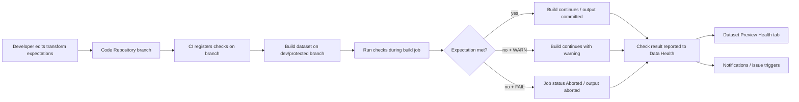

# 45 - Palantir Data Expectations 构建期质量门禁调研

**日期：** 2026-05-30  
**关联 Issue：** #40  
**所属 Epic：** #35  
**类型：** Story 调研 / Data Expectations 构建期质量门禁  
**术语基线状态：** 已读取 `docs/raw/44-data-quality-source-map.md` 并对齐术语；本文聚焦 #40 构建期门禁，不覆盖 #37/#39/#38 的运行期、告警和治理展开。

---

## 1. 总结与洞察

1. 【事实】Data Expectations 是定义在 dataset input/output 上的代码化数据要求；它们在 dataset build 中作为 check 运行，失败时可配置为 abort build，并把结果接入 Data Health 监控。
2. 【事实】Data Expectations 的生命周期不是“写规则后运行”这么简单，而是 `define -> CI register -> build run -> Data Health monitor`：规则变更跟随 Code Repositories 和 protected branch PR review，check result 进入 Builds、History、Dataset Preview Health tab。
3. 【事实】Python Transforms 的能力边界明显宽于 Pipeline Builder：Python 支持列级、schema、primary key、group-by、conditional、foreign value、跨 dataset row count 等 expectations；Pipeline Builder 当前只支持 output 上的 primary key 和 row count。
4. 【事实】在 incremental transform 中，Palantir 官方明确所有 checks 都运行在 full datasets 上；因此增量计算不能被理解为只校验本次增量，primary key 等全局约束仍会扫描/判断完整输出资产。
5. 【推断】Data Expectations 更像构建期 contract/gate，而不是离线质量报表；自建平台复刻时必须同时实现规则 DSL、规则注册、构建阻断、结果存储、历史命名稳定性和监控/告警接入。

---

## 2. 范围与资料源

本文聚焦 Data Expectations 的构建期质量门禁，不展开 Data Health 全量运行期检查、Monitoring Views 规模化告警和治理生命周期，这些由并行 Agent 负责。

| 编号 | 来源 | 本文用途 |
|---|---|---|
| S01 | https://www.palantir.com/docs/foundry/maintaining-pipelines/define-data-expectations | 定义、术语、define/register/run/monitor、FAIL/WARN、incremental full-dataset checks |
| S02 | https://www.palantir.com/docs/foundry/transforms-python/data-expectations-getting-started | Python `Check` 结构、`on_error`、input/output checks、复合 checks |
| S03 | https://www.palantir.com/docs/foundry/transforms-python/data-expectations-reference | Python expectations DSL 能力范围 |
| S04 | https://www.palantir.com/docs/foundry/pipeline-builder/dataexpectations-overview | Pipeline Builder primary key / row count expectations |
| S05 | https://www.palantir.com/docs/foundry/observability/data-health | Data Health 监控承接、Health tab 和告警入口背景 |

---

## 3. 术语语义

| 术语 | 语义 | 可信度 |
|---|---|---|
| Data Expectations | 定义在 dataset inputs 或 outputs 上的一组代码化 requirements，用于创建提升 pipeline stability 的 checks；build 失败时可自动 abort，并集成 Data Health。 | 【事实】 |
| Expectation | 对数据结构或内容的强类型要求，例如列非空、主键唯一、schema 包含指定列。 | 【事实】 |
| Check | 连接到单个 transform input 或 output 的有意义 expectation；可以由多个 expectations 组合而成，并有用于识别和监控的唯一名称。 | 【事实】 |
| Pre-condition | 绑定在 transform input 上的 check，通常用于在继续 build 前验证输入结构或内容的关键假设。 | 【事实】 |
| Post-condition | 绑定在 transform output 上的 check，通常用于保证输出 dataset SLA，并保护下游依赖。 | 【事实】 |
| Check result | check 在 build 期间运行后产生的结果，包含 expectations 结果和 breakdown，可在 Data Health 监控。 | 【事实】 |
| FAIL | Python `Check(..., on_error='FAIL')` 的失败处理；默认值。check 失败时 job 会 abort，build/job 状态进入 Aborted。 | 【事实】 |
| WARN | Python `Check(..., on_error='WARN')` 的失败处理；job 继续运行，同时产生 warning 并交由 Data Health 处理。 | 【事实】 |
| Build abort | 当 check 定义指示 FAIL 且 expectations 未满足时，build job 被中止，以节省资源并阻止坏数据继续向下游传播。 | 【事实】 |

关键细节：pre-condition 定义在 input 上，但如果它失败，被 abort 的是当前 transform 的 output，而不是该 input dataset 的 build。若要阻断输入数据集自身的构建，必须把 expectation 作为该输入数据集 transform 的 post-condition 定义。【事实】

---

## 4. 生命周期：define -> register/CI -> run/build -> monitor

### 4.1 Define

Data Expectations 在相关 Code Repository 的 dataset transform 中定义，可应用于 transform inputs 和 outputs。每个 check 除了 expectation 本身，还定义 build time 的失败处理策略：失败后 abort，或带 warning 继续运行。check name 在单个 transform 内必须唯一。【事实】

Python Transforms 的基本形态是：

```python
Check(expectation, "Check unique name", on_error="WARN/FAIL")
```

其中 expectation 可以是单个 expectation，也可以是 `E.all(...)`、`E.any(...)` 等组合 expectation；check 名称会跨 Data Health、Builds application 等应用识别该检查；`on_error='FAIL'` 表示失败即 abort，`on_error='WARN'` 表示继续并生成 Data Health warning。【事实】

### 4.2 Register / CI

官方文档说明 check 会在相关 branch 的 CI 中注册；由于 Expectations 定义在 Code Repositories 中，protected branch 上的变更需要遵循与其他代码变更相同的 pull-request review 流程。合并到默认/受保护分支前，官方建议先在 development branch build dataset，以验证 Data Expectations 是否满足。【事实】

工程含义：Data Expectations 是“代码仓库内的可审查规则”，不是 UI 上随意配置的运行时阈值。它天然适合纳入 code review、branch protection、CI 注册和变更审计。【推断】

### 4.3 Run / Build

注册后的 checks 会作为 build job 的一部分运行。若 expectations 未满足，失败会在 Builds application 和 dataset History tab 中高亮；若 check 定义为 FAIL on error，job status 会变为 `Aborted`，并提供对应错误。Job timeline 中的 `Expectations` indicator 可展开查看 check results 和不同 expectations 的 breakdown。【事实】

工程含义：构建期质量门禁与 job timeline 绑定，check result 不是只在 transform 日志中出现，而是成为 build history 可导航的一部分。【推断】

### 4.4 Monitor / Data Health

每次 check run 都会产生 result，并上报 Data Health。最新 Data Expectations 结果会出现在 Dataset Preview application 的 Health tab，在那里可以设置 notifications 和 issue triggers，行为类似其他 Data Health checks。【事实】

Data Health 官方定位是 Foundry 中用于监控 platform resources 健康的应用，支持 in-platform notifications、email digests，以及 PagerDuty、Slack、REST endpoints 等外部系统集成；Data Health 的 Health checks 适合单个资源的细粒度 content/schema validation。【事实】

工程含义：Data Expectations 是 build-time contract，Data Health 是 post-run observation/notification 承接层；两者共同形成“阻断 + 监控”的闭环。【推断】

---

## 5. Check、Expectation 与组合粒度

Python 文档建议使用多个 checks 来让 Expectations 结构更清晰，并分别控制每个有意义 check 的失败行为。一个 composite expectation 会作为一个整体被监控；如果需要对组合内部的某些部分单独 watch 或通知，官方建议拆分为多个 checks。【事实】

| 设计选择 | 效果 | 风险/影响 |
|---|---|---|
| 一个大 composite check | 规则集中，代码较少；整体 FAIL/WARN 一致 | Data Health 中监控粒度粗，无法单独订阅组合内部子规则 |
| 多个独立 checks | 每条业务质量规则可独立 FAIL/WARN、独立命名、独立监控 | check name 管理成本上升，需要命名规范 |
| input check 作为 pre-condition | 可提前验证输入假设，避免浪费后续计算 | 失败 abort 当前 transform output，不会反向 abort input dataset |
| output check 作为 post-condition | 可保护输出 SLA 和下游依赖 | 可能在 transform 计算完成后才发现质量问题，仍需消耗计算资源 |

命名稳定性是治理约束：Data Expectations 的 check 通过名称唯一识别；check history 和 monitoring settings 只有在名称不变时保留，改名等同于删除旧 check 并创建新 check。【事实】

---

## 6. Python Transforms 能力边界

Python Transforms 的 Data Expectations DSL 覆盖面较广，官方 reference 将 available expectations 分为 operators、column expectations、timestamp expectations、array expectations、group-by expectations、primary key、schema expectations、conditional、foreign value expectations、cross-dataset row count comparisons 等类别。【事实】

| 能力 | Python Transforms 支持情况 | 说明 |
|---|---|---|
| Operators | 支持 `E.true()`、`E.false()`、`E.all(...)`、`E.any(...)`、`E.negate(...)` | 可构造组合规则和默认分支 |
| Column expectations | 支持大小比较、列间比较、property comparison、equals/not equals、null、is in、regex、type 等 | 多个比较类 expectation 默认会忽略 null；需要显式 `non_null()` 才能检查非空 |
| Property metrics | 支持 `null_percentage`、`null_count`、`distinct_count`、`approx_distinct_count`、`sum`、标准差等 | 适合分布/聚合类质量阈值 |
| Timestamp | 支持静态 timestamp、列间 timestamp、relative timestamp comparison | 官方提醒不要用 `datetime.now()` 生成静态 timestamp，应使用 relative timestamp |
| Array | 支持 array `is_in`、`array_contains`、`size` 等有限集合 | 并非所有 expectations 都适用于 array 类型 |
| Group-by | 支持 `E.group_by(...)` 上的 uniqueness、row count、property comparisons | 可表达“每个分组”层面的质量阈值 |
| Primary key | 支持一个或多个列，验证每列非空且列组合唯一 | 与 Pipeline Builder primary key 语义一致 |
| Schema | 支持 `contains`、`equals`、`is_subset_of`，类型随 compute engine 使用 Polars 或 PySpark SQL types | 覆盖 schema contract |
| Conditional | 支持 `E.when(...).otherwise(...)` | 可表达分支式业务规则 |
| Foreign value | Experimental；验证 expected dataset 中列值是否存在于 foreign dataset 指定列中 | 涉及 joins，官方警告可能非常昂贵；foreign dataset 必须作为 transform input |
| Cross-dataset row count | 支持与其他 dataset reference 的 count 比较 | 可表达 input/output 行数守恒或比例类规则的基础形态 |

边界判断：Python Transforms 的强项是“代码化、可组合、可审查的质量 contract”；弱点不是 DSL 覆盖不足，而是高成本规则、跨 dataset join、全量检查在大规模数据上的成本控制需要工程设计配套。【推断】

---

## 7. Pipeline Builder 能力边界

Pipeline Builder 的 Data Expectations 可应用于 pipeline output，并且当前只支持两类 expectations：primary key 和 row count。若任一 expectation 失败，build 会 fail，job expectations pane 会展示哪些 expectations passed/failed。【事实】

| 能力 | Pipeline Builder | Python Transforms |
|---|---|---|
| 作用位置 | 官方页面描述为 each pipeline output / dataset outputs | transform inputs 和 outputs |
| primary key | 支持；一个或多个列，每列非空且列组合唯一 | 支持；一个或多个列，每列非空且列组合唯一 |
| row count | 支持最小值和/或最大值 | 支持全局/分组 row count，也支持跨 dataset count comparison |
| schema checks | 未在 Pipeline Builder overview 中列为当前支持能力 | 支持 `E.schema()` 系列 |
| column value checks | 未在 Pipeline Builder overview 中列为当前支持能力 | 支持比较、null、is in、regex、type 等 |
| grouped checks | 未在 Pipeline Builder overview 中列为当前支持能力 | 支持 `E.group_by(...)` |
| conditional rules | 未在 Pipeline Builder overview 中列为当前支持能力 | 支持 `E.when(...).otherwise(...)` |
| foreign value / referential integrity | 未在 Pipeline Builder overview 中列为当前支持能力 | Experimental 支持，且高成本 |
| FAIL/WARN 控制 | Pipeline Builder overview 表述为 expectation failed 则 build failed，未呈现 WARN 选项 | `on_error='FAIL'` 或 `on_error='WARN'` |

结论：Pipeline Builder 提供低门槛、少配置的 output gate，适合基础主键和行数检查；Python Transforms 提供完整 DSL 和 pre/post-condition 控制，适合复杂数据 contract 和工程化治理。【推断】

---

## 8. Incremental transform 下 full-dataset checks 的成本与设计影响

Palantir 官方明确：所有 checks 都在 full datasets 上运行，不受 transform 是否 incremental 影响。官方例子说明，即使 transform 是 incremental，output 上的 primary key check 也会检查完整 dataset；如果新 transaction 写入的 primary key 已经存在于历史 transaction 中，check 会失败。【事实】

### 8.1 成本影响

1. 【事实】primary key、row count、group-by、distinct_count、foreign value 这类规则在语义上可能需要观察完整输出或跨 dataset 数据。
2. 【推断】incremental compute 节省的是 transform 写入/计算增量的成本，不自动降低全局质量 contract 的校验成本。
3. 【推断】对大表而言，full-dataset checks 可能成为 build tail latency 和 compute cost 的主要来源，特别是 uniqueness、distinct、group-by、referential integrity 等需要 shuffle/join/全局聚合的规则。
4. 【事实】Pipeline Builder 文档对 incremental build 中 primary key check 过慢的场景，建议给 primary key column 添加 projection。

### 8.2 设计影响

| 设计问题 | 影响 | 自建平台启示 |
|---|---|---|
| 增量表是否只检查增量片段 | 只查增量无法发现历史重复/全局唯一性破坏；查全量成本更高 | 必须显式声明 check scope：delta-only、affected-partition、full-dataset |
| 主键唯一性 | 全局唯一要求跨历史 transaction 判断 | 需要索引、projection、constraint state 或近似/分层校验策略 |
| referential integrity | 需要 join foreign dataset，官方标记可能非常昂贵 | 不应默认放入每次 build 的 hard gate；可分级为 async monitor 或 sampled/precomputed gate |
| row count / grouped metrics | 全量/分组聚合可能扩大扫描范围 | 支持物化统计、增量统计维护、分区级阈值和全局阈值分离 |
| build abort 策略 | FAIL 会中断输出，WARN 会继续但进入监控 | 对高成本规则可先 WARN 或异步监控，再逐步升为 FAIL |

关键判断：Foundry 的选择偏向“质量语义正确性优先于增量校验便宜性”。自建平台如果选择 delta-only checks，必须在产品语义上明确它不等价于 Foundry 的 full-dataset Data Expectations。【推断】

---

## 9. 构建期门禁状态流



说明：图中的 “output aborted” 对 pre-condition 尤其重要，pre-condition 失败会 abort 当前 transform output；不会反向 abort 作为 input 的上游 dataset。【事实】

---

## 10. 自建平台启示

1. 【建议】把 Data Expectations 抽象成“数据 contract + build gate + health signal”的一等对象，而不是只做规则执行器。
2. 【建议】规则定义必须纳入代码审查：check name、scope、FAIL/WARN、input/output 绑定、owner、变更历史都应可审计。
3. 【建议】构建系统必须支持门禁结果的结构化存储：build id、dataset id、branch、transaction、check name、expectation breakdown、abort/warn outcome；如自建平台引入 `severity` 字段，应标注这是统一质量结果模型的扩展字段，不是 Palantir Data Expectations 公开文档中的原生 FAIL/WARN 语义。
4. 【建议】pre-condition 和 post-condition 要有清晰语义：前者保护当前 transform 免于错误输入假设，后者保护输出 SLA 和下游消费者；不要把 pre-condition 误实现为“阻断上游数据集构建”。
5. 【建议】增量场景要产品化暴露 check scope 和成本提示。若实现 Foundry 等价语义，full-dataset checks 要配套索引/projection/统计物化；若选择 delta-only，要明确标注语义弱化。
6. 【建议】复杂规则应支持逐步升级：先作为 WARN 进入 Data Health/告警，观察误报和成本后再升为 FAIL hard gate。
7. 【建议】check name 必须稳定。重命名应作为破坏性变更处理，因为历史和监控配置可能随名称断裂。
8. 【建议】Pipeline Builder 类低码入口应从 primary key、row count、schema contains 等低认知规则开始；复杂 conditional、foreign value、跨 dataset 规则更适合代码入口或高级模式。

---

## 11. 证据缺口

1. 【待验证】官方公开文档说明 check 在 branch CI 中注册，但未披露注册产物的数据模型、API、缓存策略和失败重试机制。
2. 【待验证】官方公开文档未完整说明 Data Expectations check result 在 Data Health 中的持久化周期、历史查询 API、聚合模型和权限模型。
3. 【待验证】Pipeline Builder overview 只说明当前支持 primary key 和 row count；未验证其 “Configure data health checks” 子页面是否提供额外 runtime checks，这需要 Agent C/D 的运行期调研补齐。
4. 【待验证】foreign value expectations 标记为 Experimental，且可能不在所有 enrollment 可用；不能作为稳定能力外推到所有 Foundry 环境。
5. 【待验证】incremental full-dataset checks 的底层优化方式未公开；本文只能确认语义和成本风险，不能断言 Palantir 内部采用何种索引、projection 或统计复用实现。
6. 【待验证】本文未核验 Java、SQL 或其他 transform 类型的 Data Expectations 等价能力；Python Transforms 结论不能无条件外推到所有语言栈。

---

## 12. 参考来源

- Palantir Foundry - Define data expectations: https://www.palantir.com/docs/foundry/maintaining-pipelines/define-data-expectations
- Palantir Foundry - Python Data expectations getting started: https://www.palantir.com/docs/foundry/transforms-python/data-expectations-getting-started
- Palantir Foundry - Python Data expectations reference: https://www.palantir.com/docs/foundry/transforms-python/data-expectations-reference
- Palantir Foundry - Pipeline Builder Data expectations overview: https://www.palantir.com/docs/foundry/pipeline-builder/dataexpectations-overview
- Palantir Foundry - Data Health: https://www.palantir.com/docs/foundry/observability/data-health
- 仓库术语基线：`docs/raw/44-data-quality-source-map.md`
- 仓库计划文档：`docs/superpowers/plans/2026-05-30-palantir-data-quality-research-plan.md`
