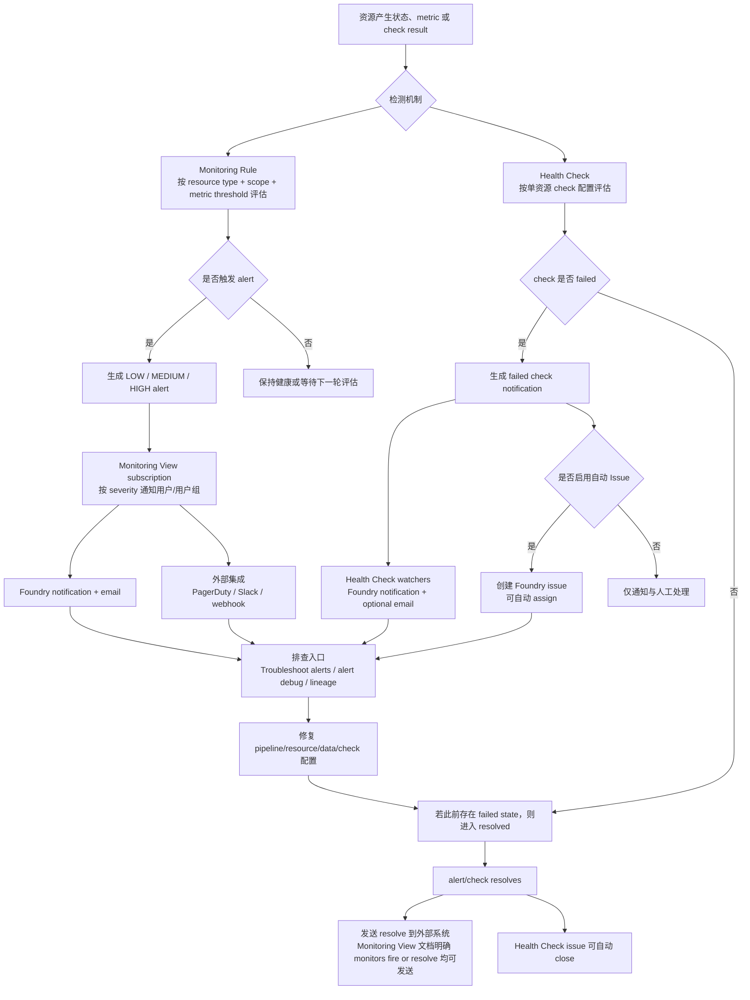

# 47 — Palantir Monitoring Views、告警与 Issue 闭环调研

**调研日期：** 2026-05-30  
**角色：** Agent D  
**关联 Issue：** #39  
**资料优先级：** Palantir 官方文档优先  
**术语基线状态：** 已补读 `docs/raw/44-data-quality-source-map.md`；本文沿用其对 Data Health、Health Checks、Monitoring Views、Monitoring Rules、Foundry Issue 的边界定义。
**第二轮修订：** 已按专家评审补充 `docs/raw/49-data-quality-external-notification-security.md`，修正外部通知安全边界表述。

## 1. 总结与洞察

1. 【事实】Data Health 的两个核心面向是 Monitoring Views 与 Health Checks：Monitoring Views 适合跨 project/folder/workflow/application scope 的规模化监控；Health Checks 适合单资源细粒度检查，尤其是 dataset 的 content/schema/freshness 等质量验证。
2. 【事实】Monitoring Views 不是单条规则，而是 monitoring rules 与已有 health checks 的集合；其订阅、severity 和外部集成把“检测到问题”转换为 Foundry 通知、邮件、PagerDuty、Slack 或 webhook。
3. 【事实】Monitoring Rules 支持 `LOW`、`MEDIUM`、`HIGH` 三档 severity，并可按 severity 配置订阅和外部集成；接收 Monitoring View 告警要求用户同时拥有被监控资源与 monitoring view 的 `Viewer` permission。
4. 【事实】Health Checks 的 issue 闭环更明确：failed check 可自动创建 Foundry issue、可指定 assignee，并在 check resolves 后自动关闭 issue。
5. 【推断】Palantir 的质量闭环不是“规则触发即结束”，而是形成“scope 发现资源 -> rule/check 评估 -> alert 路由 -> 外部协同/issue -> 恢复后 resolve/close”的运营链路；自建平台必须把告警、权限、订阅和 issue 状态机作为同一套质量运行模型设计。

## 2. 来源与证据范围

| 编号 | 官方来源 | 本文用途 |
|---|---|---|
| S05 | https://www.palantir.com/docs/foundry/observability/data-health | Data Health 顶层定位、Monitoring Views 与 Health Checks 职责边界、通知渠道总览 |
| S06 | https://www.palantir.com/docs/foundry/data-health/overview/ | Health Checks 资源类型、Health tab、pipeline/platform-wide health 入口 |
| S10 | https://www.palantir.com/docs/foundry/data-health/notifications/ | Health Checks 的 Foundry notifications、email、自动 issue 创建/关闭 |
| S11 | https://www.palantir.com/docs/foundry/monitoring-views/overview | Monitoring Views 概览、scope、resource type、subscription、Viewer permission、snooze、lineage navigation |
| S11a | https://www.palantir.com/docs/foundry/monitoring-views/core-concepts | Metric/resource/scope/rule/view/subscriber/alert/severity 核心概念 |
| S11b | https://www.palantir.com/docs/foundry/monitoring-views/external-systems | PagerDuty、Slack、webhook 外部系统集成 |
| S12 | https://www.palantir.com/docs/foundry/monitoring-views/rules-reference | Monitoring rules 支持资源类型、规则类型、severity 字段 |
| Repo-44 | `docs/raw/44-data-quality-source-map.md` | 术语基线；用于区分 Data Expectations 的 `Check`、Data Health 的 `Health Checks` 与 Monitoring Rules |

## 3. Monitoring Views 与 Health Checks 的职责边界

| 维度 | Monitoring Views | Health Checks | 判断 |
|---|---|---|---|
| 核心定位 | scope-based monitoring rules，面向多资源规模化覆盖 | 单资源详细检查，尤其是 dataset/schedule/table 的质量状态 | 【事实】 |
| 适用场景 | 多 project/folder/single resource 统一监控；资源新增/删除时希望覆盖自动变化 | 针对单个 dataset/schedule/table 配置 content、schema、status、time、size 等检查 | 【事实】 |
| 资源覆盖 | Agent、Object type、Link type、Schedule、Streaming dataset、Live deployment、Time series sync、Geotemporal observation、Automation、Dataset、Function、Action type 等 | 官方 overview 明确可为 Datasets、Schedules、Tables 创建检查 | 【事实】 |
| 范围模型 | static scope 与 dynamic scope；可按 Single、Folder、Project、Workflow Lineage、Workshop、OSDK application 等建模，具体取决于资源类型 | 单资源为主；可批量给多个 dataset 添加同类 health check，但每个 check 仍落在资源上 | 【事实】 |
| 质量检查深度 | 基于资源 emitted metrics/logs 的 thresholds；也可把已有 Health Checks 加入 view | content/schema/freshness 等数据质量细粒度验证更强 | 【事实】 |
| 告警路由 | Monitoring View 订阅者按 severity 接收 Foundry/email；外部集成按 severity 路由 | failed check 通知 watchers；email 由 watcher 偏好控制；可自动创建/关闭 Foundry issue | 【事实】 |

关键判断：Monitoring Views 是“规模化监控与告警编排层”，Health Checks 是“具体资源质量/健康检查层”。两者不是替代关系：Monitoring View 可纳入已有 Health Checks，但当目标是细粒度 content/schema validation 时，官方仍建议使用 Health Checks。【推断】

## 4. Scope、资源类型、Severity、Subscription 与 Viewer Permission

### 4.1 Static / Dynamic Scope

| Scope 类型 | 支持形态 | 语义 |
|---|---|---|
| Static scope | Single | 监控固定、显式选择的单个资源。【事实】 |
| Dynamic scope | Folder | 监控指定 folder 中指定类型资源；官方说明不包含 subfolders。【事实】 |
| Dynamic scope | Project | 监控一个或多个 project 中指定类型资源。【事实】 |
| Dynamic scope | Workflow Lineage | 对 function/action type，覆盖某个 Workflow Lineage 使用的 functions/actions。【事实】 |
| Dynamic scope | Workshop | 对 function/action type，覆盖 Workshop application 使用的 functions/actions。【事实】 |
| Dynamic scope | OSDK application | 对 function/action type，覆盖 OSDK application 使用的 functions/actions。【事实】 |

【事实】Monitoring Views overview 还说明 dynamic scope 会随资源新增或移除自动更新，不需要人工改 monitor。  
【推断】这意味着 Palantir 把“监控对象发现”从人工逐条绑定推进到资源图/scope 规则驱动，适合治理团队给某类生产 project 建统一监控模板。

### 4.2 Monitoring Views 支持资源类型与 Scope

| 资源类型 | 官方支持 scope |
|---|---|
| Agent | Single, Project |
| Object type | Single, Project |
| Link type | Single, Project |
| Schedule | Single, Project |
| Streaming dataset | Single, Folder, Project |
| Live deployment | Project |
| Time series sync | Single |
| Geotemporal observation | Single |
| Automation | Single, Project |
| Dataset | Single, Folder, Project |
| Function | Single, Project, Workflow Lineage, Workshop, OSDK application |
| Action type | Single, Project, Workflow Lineage, Workshop, OSDK application |

补充约束：使用 ontology resources 的 project scope 前，需要先迁移 ontology 到 project-based permissions。【事实】

### 4.3 Monitoring Rules 支持资源与典型规则

| 资源类型 | 典型 rule 能力 |
|---|---|
| Agents | heartbeat stale、manager/agent version stale、CPU、JVM heap、disk、certificate expiry、queue size |
| Schedules | consecutive failures、schedule duration |
| Objects and links | active/replacement pipeline 的 changelog/merge/sync/scroll job failure、sync propagation delay、invalid stream records |
| Streaming datasets | checkpoint duration、liveness、lag、throughput、ingest records over time windows |
| Live deployments | heartbeat |
| Time series syncs | points written over recent windows |
| Datasets | time since job last succeeded |
| Geotemporal observations | observations sent over recent windows |
| Automations | no evaluations/triggers、failure threshold、system-disabled、repeated execution/evaluation/effect failures |
| Functions | duration p95、failures in window、user-facing/non-user-facing failures |
| Actions | duration p95、failures in window、non-user-facing failures |

【事实】Monitoring rules reference 明确每条 monitoring rule 都有 `Alert severity` 字段，选项为 Low、Medium、High。  
【事实】Core concepts 明确 Monitoring Views 支持 `LOW`、`MEDIUM`、`HIGH` 三档 severity；severity 也是路由机制，Foundry 内通知和外部集成都按特定 severity 配置，只有匹配 severity 的 alert 才触发对应 integration。  
【待验证】rules reference 个别段落提到 “critical severity” 的表述，但 Monitoring Views core concepts 与 rule component 表统一列出三档 severity；是否存在历史/特定 rule 兼容层，需要真实租户或官方进一步确认。

### 4.4 Subscription 与 Viewer Permission

【事实】Monitoring View 的订阅在 Manage subscriptions tab 管理，可添加 users 和 user groups，并按 severity 配置 alert。  
【事实】当 monitoring rule 触发 alert 时，订阅了包含该 alert 的 monitoring view 的用户会收到 email 和 Foundry notifications。  
【事实】用户必须拥有被监控资源的 `Viewer` permission 才能监控资源；要接收 Monitoring View 触发的 alerts，用户必须同时拥有被监控资源与 monitoring view 的 `Viewer` permission。  
【推断】这把 Foundry 内部的 Monitoring View alert 接收与资源可见性绑定；但不能直接外推为 Slack、PagerDuty、webhook、email 等外部通道的完整泄露防线。外部通道还需要单独的 export/redaction policy，例如 Slack source 的 exportable markings/organizations。详见 `docs/raw/49-data-quality-external-notification-security.md`。

## 5. 通知、外部系统与 Issue 闭环行为

### 5.1 Foundry Notifications 与 Email

【事实】Data Health 顶层文档说明，Monitoring Views 与 Health Checks 都会在发现问题时产生 alerts；接收方式包括 Foundry notifications、email digests、PagerDuty、Slack 与 arbitrary REST endpoints。  
【事实】Health Checks notifications 文档说明，Data Health 集成 Foundry Notifications 与 Emails；check failed 时，watchers 总会收到 Foundry 内通知，watcher 也可启用 email notifications。  
【事实】Monitoring View 订阅者在 rule 触发时会收到 email 和 Foundry notifications，且订阅可以按 severity 配置。  
【推断】email digest 与 per-alert email 的精确聚合规则、频率和去重策略未在本轮官方页面展开；不能断言其内部发送窗口与抑制算法。

### 5.2 PagerDuty

【事实】Monitoring Views 支持将 monitors fire 或 resolve 的 alerts 发送给 PagerDuty。  
【事实】PagerDuty integration 使用 PagerDuty Events API V2；一个 integration 将某个 Monitoring View 内给定 severity 的所有 alerts 映射到 PagerDuty service 的 Events V2 API integration。  
【事实】需要在 Monitoring View 的 Manage subscriptions tab 为 PagerDuty 配置 integration name、integration key 和 severity level；不同 severity 需要按需重复配置。  
【事实】Health checks 与 PagerDuty 的映射在 linked/upgraded monitoring view 场景下可启用：info/low -> `LOW`，moderate/medium -> `MEDIUM`，critical/high -> `HIGH`。

### 5.3 Slack

【事实】Monitoring Views 的 Slack integration 可向配置的 channel 发送消息。  
【事实】Slack 需要先在 Data Connection 创建 Slack source，并配置 bearer token；官方列出 `channels:join`、`channels:read`、`chat:write`，以及私有频道所需的可选 `groups:read` scope。  
【事实】Slack integration 同样在 Manage subscriptions tab 配置，并绑定 severity level。  
【事实】Slack 消息中是否显示 human-readable resource name 受安全控制约束：只有资源上的 markings 与 organizations 都在 Slack source 的 exportable markings 配置中时才显示名称；否则显示 RID。  
【推断】这说明外部告警通道不是简单 webhook 文本转发，而要与 Foundry marking/organization 安全模型联动。

### 5.4 Webhook

【事实】Monitoring Views 支持通过 Data Connection 中配置的 Webhooks 触发 arbitrary REST endpoints。  
【事实】webhook 必须有一个 string input parameter，官方称为 `Message` parameter；Monitoring View 会把 notification 内容填入该参数，且当前内容不可自定义。  
【事实】webhook integration 也在 Manage subscriptions tab 配置，并按 severity level 绑定。

### 5.5 Foundry Issue 自动创建与关闭

【事实】Health Checks 可在 check fails 时自动 report Foundry Issue，以便调试和讨论。  
【事实】启用方式是在创建或编辑 check 时勾选 “Automatically create an issue when this check fails”。  
【事实】创建出的 issue 可自动分配给指定用户。  
【事实】Data Health 会在 check failure 时 file issue，并且可在 check resolves 后自动 close issue。  
【待验证】官方 notifications 页面明确描述 Health Checks 的 issue 创建/关闭；本轮未在 Monitoring Views 文档中看到 Monitoring Rule alert 直接自动创建 Foundry issue 的同等说明。因此本文不把“Monitoring Rules 自动创建 issue”写为事实。

## 6. 质量问题从检测到通知/Issue/恢复的流程

流程说明：

1. 【事实】Monitoring Rules 基于资源 metrics/logs 设置阈值；Health Checks 基于资源检查配置评估。
2. 【事实】Monitoring Views 可以在 Troubleshoot alerts tab 按 alert name、resource、failure reason、reported time 查看 alert，并可进入 alert debug page 查看详细 metrics、alert history 和 diagnostics。
3. 【事实】从 alert 可跳转到资源 lineage：datasets、schedules、object types 打开 Data Lineage；functions、action types、automations 打开 Workflow Lineage 的 Run history。
4. 【事实】Monitoring Views 支持 snooze 单个 fired alert，也支持 snooze 整个 monitor rule；monitor rule snooze 会静默该 rule scope 下所有 target alerts。
5. 【推断】恢复闭环由两类状态完成：Monitoring View 侧的 alert resolve 可继续触发外部系统通知；Health Check 侧的 check resolves 可自动关闭此前创建的 Foundry issue。

## 7. 对自建平台的启示

1. 【建议】把“规则”拆成两层：单资源质量/健康检查层与跨资源 scope 监控层。前者管 schema/content/freshness，后者管覆盖、订阅、severity 和渠道路由。
2. 【建议】scope 必须是一等模型，至少支持 single、folder/project、lineage/application 这类动态范围，否则平台会退化为人工维护的告警清单。
3. 【建议】severity 应该同时驱动 UI 优先级、订阅策略和外部集成路由；不能只作为告警文本字段。
4. 【建议】订阅与外部通知必须接入权限和导出控制系统。对外发 Slack/webhook/PagerDuty/email 时，要单独建模 exportable markings、organizations、字段脱敏、RID/name 显示策略、channel owner 和接收者治理；不要只依赖 Foundry `Viewer` permission。
5. 【建议】Issue 闭环需要状态机：failed/open、assigned、resolved/close、reopen、snooze、dedupe、历史保留。Palantir 官方至少确认 Health Checks 可自动 create/assign/close issue。
6. 【建议】排查入口要与血缘和运行历史打通。告警页只显示“失败”不够，必须能跳到 lineage、run history、metric history、failure reason 和相关资源上下文。
7. 【建议】外部集成应统一抽象为 severity-scoped route：PagerDuty 适合 high/on-call，Slack 适合团队协同，webhook 适合接入企业 ITSM/告警中台。

## 8. 证据缺口

1. 【待验证】Monitoring Rules 文档与 Core Concepts 对 severity 的表述存在潜在差异：主模型是 `LOW`/`MEDIUM`/`HIGH`，但个别 rule 描述出现 “critical severity”。需要租户实测或官方补充确认是否为历史兼容、文档残留或特殊规则级别。
2. 【待验证】官方公开文档未详细说明 email digests 的聚合周期、去重、升级、静默窗口和用户偏好优先级。
3. 【待验证】本轮未找到 Monitoring Rule alert 自动创建 Foundry issue 的官方说明；已确认 Health Checks 支持自动 issue 创建/关闭。
4. 【待验证】PagerDuty incident 的 dedup key、resolve 事件映射、重开策略、acknowledge 回写 Foundry 的行为未在官方页面中展开。
5. 【待验证】webhook notification payload 当前仅确认通过 `Message` string parameter 传递且内容不可自定义；结构化 payload、签名、重试、失败告警未在本轮资料中确认。
6. 【待验证】Monitoring Views 与 Health Checks 的底层事件存储、alert 历史保留周期、权限变更后的历史告警可见性未公开。

## 9. 参考来源

- Data Health: https://www.palantir.com/docs/foundry/observability/data-health
- Health checks overview: https://www.palantir.com/docs/foundry/data-health/overview/
- Health checks notifications and issues: https://www.palantir.com/docs/foundry/data-health/notifications/
- Monitoring views overview: https://www.palantir.com/docs/foundry/monitoring-views/overview
- Monitoring views core concepts: https://www.palantir.com/docs/foundry/monitoring-views/core-concepts
- Monitoring views external systems: https://www.palantir.com/docs/foundry/monitoring-views/external-systems
- Monitoring rules reference: https://www.palantir.com/docs/foundry/monitoring-views/rules-reference
- 第二轮补充：`docs/raw/49-data-quality-external-notification-security.md`
