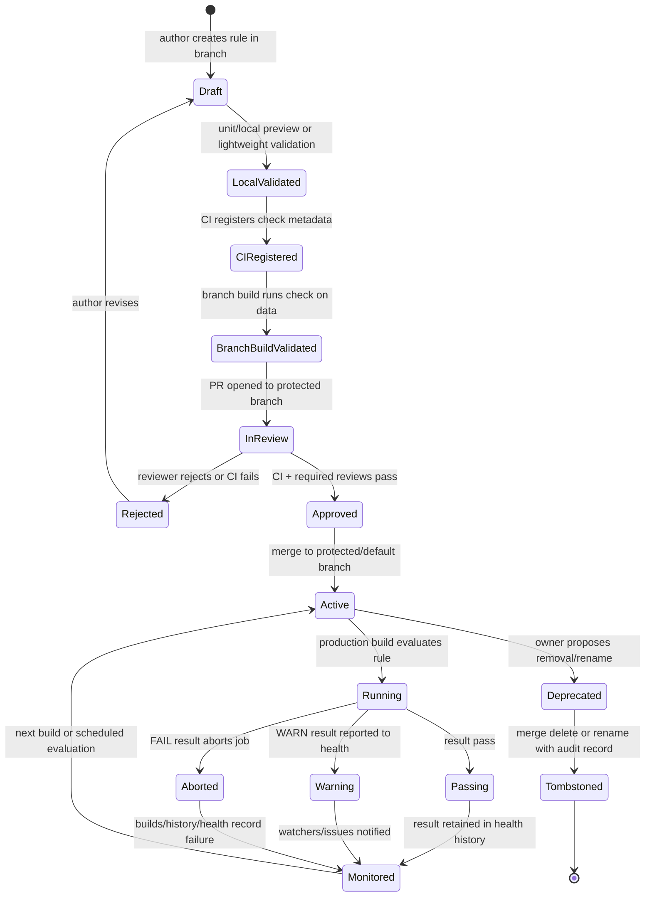

# 48 — Palantir Data Quality 治理、代码评审与生命周期调研

**日期：** 2026-05-30  
**关联 Issue：** #38  
**所属 Epic：** #35  
**角色：** Agent E  
**术语基线：** 已读取 `docs/raw/44-data-quality-source-map.md`；本文沿用其中对 Data Expectations `Check` 与 Data Health `Health Checks` 的边界区分。  

---

## 1. 总结与洞察

1. 【事实】Palantir Data Expectations 把质量规则定义在 Code Repository 的 transform 代码中；受保护分支上的规则变更需要走与代码相同的 PR review，且 check 会在相关分支的 CI 中注册。来源：<https://www.palantir.com/docs/foundry/maintaining-pipelines/define-data-expectations>
2. 【事实】Check name 是 Data Expectations 的治理主键之一：同一 transform 内必须唯一，并用于跨 Data Health、Builds application 等应用识别；改名等价于删除旧 check 并创建新 check，旧历史与单独监控设置不会随新名称保留。来源：<https://www.palantir.com/docs/foundry/maintaining-pipelines/define-data-expectations>
3. 【推断】Data Quality 模块自身只覆盖“规则表达、构建期执行、结果上报”这一段；完整治理闭环依赖 Code Repositories、CI、protected branch、Builds、Dataset Preview、Data Health、Data Lineage、权限和 Marketplace 共同完成。
4. 【事实】Marketplace packaging 对 Data Health checks 有明确限制：Data expectation health checks 随 packaged transformation 自动加入，packager 不能手动添加或移除；带 Foundry Issue 创建配置的 health check validation 不受支持。来源：<https://www.palantir.com/docs/foundry/data-health/marketplace-data-health/>
5. 【建议】自建平台不要只实现质量规则 DSL；最低限度需要稳定规则身份、PR 审批策略、CI 注册、构建阻断、历史结果保留、监控订阅迁移、删除/改名审计、权限校验和打包安装边界。

---

## 2. 调研范围与资料

本文聚焦质量规则作为治理对象的生命周期，不重复展开 DSL 明细。`docs/raw/44-data-quality-source-map.md` 已建立本轮术语基线，并明确 Data Expectations 的 `Check` 不等同于 Data Health 的 `Health Checks`；本文沿用该边界。既有 #10 raw 文档 `docs/raw/26-pro-code-governance-quality-observability.md` 已确认 Foundry 高码治理由 Code Repositories、repository checks、Data Expectations、Data Health、Data Lineage、Markings/permissions 和 observability 联动构成；本文在此基础上补充 Data Quality 规则治理、review、注册、历史保留、打包和运维风险。

优先资料：

| 编号 | 来源 | 本文用途 |
|---|---|---|
| S01 | <https://www.palantir.com/docs/foundry/maintaining-pipelines/define-data-expectations> | Data Expectations 的 PR review、CI 注册、check name、历史保留、Data Health 集成 |
| S02 | <https://www.palantir.com/docs/foundry/transforms-python/data-expectations-getting-started> | Python transforms 中 Check 结构、`on_error`、跨应用识别 |
| S05/S06 | <https://www.palantir.com/docs/foundry/observability/data-health> / <https://www.palantir.com/docs/foundry/data-health/overview/> | Data Health、Health tab、历史结果、Data Lineage 入口 |
| S08 | <https://www.palantir.com/docs/foundry/data-health/check-evaluation/> | 自动/手动 check schedule、transaction update、threshold reset |
| S10 | <https://www.palantir.com/docs/foundry/data-health/notifications/> | watchers、email、自动创建/关闭 Foundry Issue |
| S13 | <https://www.palantir.com/docs/foundry/data-health/marketplace-data-health/> | Marketplace packaging 支持范围和限制 |
| S14 | <https://www.palantir.com/docs/foundry/data-health/builds-checks-faq/> | CI、权限、shrinkwrap、timeout 等运维风险 |
| S15 | `docs/raw/26-pro-code-governance-quality-observability.md` | 高码治理与质量可观测性背景 |
| #36 | `docs/raw/44-data-quality-source-map.md` | Data Quality 资料源与术语基线 |

---

## 3. 规则作为代码变更的治理链路

### 3.1 Define：规则进入 Code Repository

【事实】Data Expectations 是定义在 dataset input 或 output 上的代码化要求；Expectation 是数据结构或内容上的强类型要求，Check 是连接到某个 transform input/output 的有意义检查，可以由一个或多个 expectation 组合而成。来源：<https://www.palantir.com/docs/foundry/maintaining-pipelines/define-data-expectations>

【事实】Python Transforms 中 `Check(expectation, 'Check unique name', on_error='WARN/FAIL')` 是基本结构；check name 在 transform 内唯一，并用于 Data Health、Builds application 等应用识别；`FAIL` 默认会 abort job，`WARN` 继续 job 并由 Data Health 处理 warning。来源：<https://www.palantir.com/docs/foundry/transforms-python/data-expectations-getting-started>

【推断】质量规则的真实治理对象不是“某段 UI 配置”，而是 repository 中 transform 代码的一部分；因此规则的新增、阈值调整、FAIL/WARN 降级、输入/输出绑定变化，都应被视为生产逻辑变更。

### 3.2 CI 注册与开发分支验证

【事实】Data Expectations 文档说明 check 会在相关分支的 CI 中注册；受保护分支上的 expectation 变更需要像其他代码变更一样走 pull request；Palantir 建议在合并到默认分支前，先在 development branch build dataset 来验证 Data Expectations 是否满足。来源：<https://www.palantir.com/docs/foundry/maintaining-pipelines/define-data-expectations>

【事实】受保护分支可以要求 `ci/foundry-publish` 成功运行；官方说明如果在 CI 成功前 merge，不能保证变更会生效，因此强烈建议把它设为 protected branch requirement。来源：<https://www.palantir.com/docs/foundry/code-repositories/branch-settings>

【推断】Data Expectations 的注册不是最终 build 才隐式发现，而是代码发布路径的一部分：开发分支变更 -> CI 注册/发布候选元数据 -> 分支 build 预验证 -> PR review -> protected branch merge -> 生产分支 check 生效。

### 3.3 Protected branch review

【事实】Code Repositories 的 protected branch 只能通过 PR 修改，并必须满足预定义要求；可配置项包括要求 CI 成功、要求 code reviews、要求 specific reviewers、要求 security approval 等。来源：<https://www.palantir.com/docs/foundry/code-repositories/branch-settings>

【事实】protected branch review 可要求没有 rejection、至少一个 approval，或指定用户/组审批；高级审批策略可以根据 PR 修改文件路径的正则匹配决定需要哪些用户/组审批。来源：<https://www.palantir.com/docs/foundry/code-repositories/branch-settings>

【建议】自建平台应把质量规则目录或 transform 文件纳入 CODEOWNERS/advanced approval policy 等价机制。例如：

| 变更类型 | 建议审批人 |
|---|---|
| 新增 FAIL 规则 | 数据集 owner + 下游 owner 可选 |
| FAIL 改 WARN | 数据治理/质量 owner 必审 |
| 删除 check | 数据集 owner + 平台质量 owner 必审 |
| 改 check name | 按删除旧 check + 创建新 check 审批 |
| 改输入 pre-condition | 上游 owner 或源系统 owner 参与 |
| 改输出 post-condition | 下游关键消费方 owner 参与 |

---

## 4. Check 身份、历史保留与 rename/delete 风险

### 4.1 Check name 是稳定身份，不只是展示名

【事实】Data Expectations 文档明确：dataset 上的 checks 由名称唯一识别；check 的历史以及单独 monitoring settings 只在名称不变时保留；改变 check name 等价于移除旧 check 并创建新 check。来源：<https://www.palantir.com/docs/foundry/maintaining-pipelines/define-data-expectations>

【事实】Python guide 同样强调 check unique name 不能在同一 transform 的 inputs/outputs 间重复，并会跨 Data Health、Builds application 识别。来源：<https://www.palantir.com/docs/foundry/transforms-python/data-expectations-getting-started>

【推断】check name 承载至少三类治理语义：

| 语义 | 影响 |
|---|---|
| 执行身份 | Build job 能把某次结果归属到具体 check |
| 监控身份 | Data Health watcher、通知、issue trigger 绑定到该 check |
| 历史身份 | 趋势、失败历史、SLA 证据以该名称串联 |

### 4.2 Rename/delete 生命周期

【事实】官方没有给出“rename with migration”的机制；已确认改名等价删除旧 check + 创建新 check。来源：<https://www.palantir.com/docs/foundry/maintaining-pipelines/define-data-expectations>

【推断】删除或改名的运维风险：

| 操作 | 风险 | 治理处理 |
|---|---|---|
| 改名 | 历史断裂、watcher/notification/issue settings 不继承 | 要求 PR 模板说明旧名、新名、迁移原因；平台记录 alias 或 tombstone |
| 删除 | 质量覆盖消失；已有 issue 可能失去后续状态 | 要求 owner 审批；保留 tombstone 与最后 N 次结果 |
| 合并多个 checks | 原有 check 粒度丢失；通知从局部变成整体 | 明确 composite check 的监控粒度变化 |
| 拆分 composite check | 历史按新 check 重开；通知对象增多 | 在 PR 中标注拆分映射 |

【建议】自建平台不要把规则名称作为唯一不可变 ID。应引入 `rule_id`/`check_id` 作为稳定主键，`display_name` 可改；当用户执行 rename 时，应保留历史、订阅、issue 绑定和 alias 映射。

---

## 5. 构建期执行、监控设置与通知闭环

### 5.1 Build/run 行为

【事实】注册后的 checks 会作为 build job 的一部分运行；失败会在 Builds application 和 dataset History tab 中显示；若 check 定义为 FAIL on error，job status 会变成 Aborted；Job timeline 中的 Expectations indicator 可查看结果和 expectation breakdown。来源：<https://www.palantir.com/docs/foundry/maintaining-pipelines/define-data-expectations>

【事实】pre-condition 失败时会 abort 当前 transform 的 output，而不是 abort 定义 pre-condition 的 input；如果要 abort input dataset 的 build，需要在该 input dataset 的 transform 上定义 post-condition。来源：<https://www.palantir.com/docs/foundry/maintaining-pipelines/define-data-expectations>

【事实】incremental transform 中 Data Expectations checks 仍运行在 full datasets 上。来源：<https://www.palantir.com/docs/foundry/maintaining-pipelines/define-data-expectations>

【推断】治理审查不能只看 rule expression，还要看绑定位置：同样是主键唯一性，放在上游 output post-condition 与下游 input pre-condition 的阻断对象和责任边界不同。

### 5.2 Data Health monitoring settings

【事实】每次 check run 都会产生 result 并上报 Data Health；最新 Data Expectations results 会展示在 Dataset Preview 的 Health tab，用户可在那里设置 notifications 和 issue triggers。来源：<https://www.palantir.com/docs/foundry/maintaining-pipelines/define-data-expectations>

【事实】Health checks 可在 Dataset Preview 的 Health tab 添加、修改并查看 historic check results；Data Lineage 可将 datasets 按 health check status 着色，并在底部 Data Health tab 展示 lineage graph 中所有 datasets 的 health checks/status。来源：<https://www.palantir.com/docs/foundry/data-health/overview/>

【事实】Data Health 支持 Monitoring views 和 Health checks 两类能力：Monitoring views 用 scope-based monitoring rules 做规模化监控；Health checks 用于单资源细粒度检查，包括 dataset content/schema validation。来源：<https://www.palantir.com/docs/foundry/observability/data-health>

【事实】Data Health notifications 包括 in-platform notifications、email digests，并可集成 PagerDuty、Slack 或 REST endpoints；Health checks 的 watchers 会收到失败通知。来源：<https://www.palantir.com/docs/foundry/observability/data-health>、<https://www.palantir.com/docs/foundry/data-health/notifications/>

【事实】Data Health 可配置 check 失败时自动创建 Foundry Issue，并可指定 assignee；check resolve 后也可以自动关闭 issue。来源：<https://www.palantir.com/docs/foundry/data-health/notifications/>

【推断】Data Expectations 的规则代码与 Data Health 的监控设置是两个生命周期层：规则进入 PR/CI，监控订阅和 issue trigger 更接近运行期配置。改 check name 或删除 check 会同时影响两层。

### 5.3 Check evaluation schedule

【事实】time-based health checks 可配置自动或手动 schedule。自动模式在 dataset updated 和 dataset crossed configured threshold 两个时点运行；dataset update 会评价当前 check、计算当前时间与前次 transaction 的间隔，并重置下一次阈值。手动 schedule 可按分钟、小时、天、周或 custom schedule 固定运行。来源：<https://www.palantir.com/docs/foundry/data-health/check-evaluation/>

【推断】Data Expectations 偏构建期，Health checks 偏运行期监控；两者都进入 Data Health，但触发机制和运维含义不同。自建平台需要在元模型中区分 `build-time rule` 与 `monitoring-time rule`，否则容易把构建阻断误设计成异步告警。

---

## 6. Marketplace packaging 限制

【事实】Palantir 文档标注 Add health checks to Marketplace product 为 Beta；用户可用 Foundry DevOps 将 Data Health checks 加入 Marketplace products 供其他用户安装复用。来源：<https://www.palantir.com/docs/foundry/data-health/marketplace-data-health/>

【事实】当前支持 health checks on datasets；但 health check configuration validations 不支持 dataset validations、path configuration validations，以及带 Foundry issue 创建配置的 health checks。这里的限制指 packaging/installation validation 能力边界，不等同于“带 issue 配置的 health check 完全不能存在或不能被单独配置”。来源：<https://www.palantir.com/docs/foundry/data-health/marketplace-data-health/>

【事实】health check groups 会作为 input 自动加入；安装时 packaged group 中的 health checks 会添加到提供的 input group。来源：<https://www.palantir.com/docs/foundry/data-health/marketplace-data-health/>

【事实】如果 packaged dataset transformation 包含 data expectation，data expectation health checks 会自动加入；这类 checks 是 transform logic 的一部分，packager 不能手动添加或移除。来源：<https://www.palantir.com/docs/foundry/data-health/marketplace-data-health/>

【推断】Marketplace 将 Data Expectations 视为产品代码逻辑的一部分，而不是可由 packager 任意选择的外部监控配置。这降低了安装方漏装质量门禁的风险，但也要求产品作者在 transformation 源码中维护规则生命周期。

【建议】自建平台的规则打包应区分：

| 类别 | 打包策略 |
|---|---|
| 代码内构建期规则 | 随 transform/package 强绑定发布，安装方默认获得 |
| 可选运行期 health check | 允许安装方选择、参数化或覆盖 |
| 通知/issue 配置 | 不应直接跨租户打包；应在安装环境中重新绑定 owner、watcher、assignee、外部 endpoint |
| 路径/二级 dataset validation | 需要安装期解析和权限验证，不能简单复制 |

---

## 7. Builds/checks FAQ 中的治理与运维风险

| 风险 | 官方证据 | 治理含义 |
|---|---|---|
| Build error 难定位 | FAQ 建议检查 build 是否曾成功、是否改过生成逻辑、上游数据规模/schema/逻辑是否变化，并在 Builds application 的 Datasets pane 查看 logs/history。来源：<https://www.palantir.com/docs/foundry/data-health/builds-checks-faq/> | 质量失败排查需要代码 diff、数据 diff、上游 lineage 与日志联动，不能只展示“规则失败”。 |
| Schema/scale 变化导致失败 | FAQ 明确上游数据规模暴增、schema 改变、上游逻辑变化都可能造成下游 build failure。来源：同上 | 质量规则审查应纳入 lineage impact；FAIL 规则上线前应在开发分支跑真实或代表性数据。 |
| Resource queue | FAQ 说明 builds “waiting for resources” 可能由平台活动高峰导致；建议避开整点或午夜等常见调度时间。来源：同上 | 大规模质量规则会增加 build 成本；规则 rollout 需要容量与调度窗口管理。 |
| Shrinkwrap drift | FAQ 说明 shrinkwrap file 记录 path 与 dataset unique ID/current path 映射；dataset 删除、重命名、移动或并行分支合并都可能引发 shrinkwrap error。来源：同上 | 规则代码中的 dataset path/ownership 不是纯文本问题；需要资产 ID 映射、重命名检测和分支冲突治理。 |
| Permission denied | FAQ 说明触发 build 的用户必须有必要权限，尤其要是 output dataset 的 Editor；Data Lineage 可用 Permissions filter 检查。来源：同上 | CI/build service account、人工触发者和输出资产权限必须纳入规则变更发布前检查。 |
| Repository ownership conflict | FAQ 说明 CI job 可能因 repository does not own dataset 失败；原因是多个 repositories 创建同一 output dataset，dataset 认为自己被另一个 repository 控制。来源：同上 | 自建平台要保证 dataset output owner 唯一，迁移 ownership 要有显式流程，避免多 repo 竞争同一产物。 |
| Check timeout | FAQ 建议重跑 CI、升级 repository、必要时在 `ci.yml` 加 `--refresh-dependencies`。来源：同上 | 质量规则执行依赖 CI/runtime 环境，需保留 retry、dependency refresh、超时预算和失败分类。 |

---

## 8. 能力边界：Data Quality 自身能力 vs 平台依赖

| 能力 | Data Quality / Data Expectations 自身 | 依赖模块 | 结论 |
|---|---|---|---|
| 规则表达 | Expectation、composite expectation、Check、pre/post-condition、FAIL/WARN | Python Transforms SDK / Pipeline Builder 等开发面 | 【事实】规则 DSL 是自身能力，但语言/开发框架承载定义入口。 |
| 规则注册 | check 在相关分支 CI 中注册 | Code Repositories、CI/foundry-publish、branch metadata | 【事实】注册依赖代码仓库与 CI。 |
| 代码评审 | 规则变更跟随 protected branch PR review | Code Repositories、protected branch policy、specific reviewers、advanced approval policy | 【事实】审查不是 Data Quality 独立能力。 |
| 构建阻断 | `FAIL` 可 abort job，`WARN` 继续并上报 | Builds application、build job runtime、dataset History tab | 【事实】阻断语义来自 rule，执行与展示依赖 Builds。 |
| 结果监控 | Check result 上报 Data Health | Data Health、Dataset Preview Health tab、notifications、issue triggers | 【事实】Data Expectations 产生结果，监控闭环依赖 Data Health。 |
| 历史保留 | 名称不变时保留 check history 和 individual monitoring settings | Data Health 历史结果存储、check identity | 【事实】历史身份由 check name 维持；缺稳定 ID 是治理风险。 |
| 影响分析 | 规则位于 input/output，可推断上下游责任边界 | Data Lineage、Dataset Preview、Builds logs/history | 【推断】影响分析依赖 lineage 与 build metadata。 |
| 权限约束 | 规则本身不提供 ACL | Repository roles、dataset Editor 权限、Data Lineage permissions filter、Markings/security approval | 【事实/推断】发布、触发、移除安全传播等依赖权限系统。 |
| 打包复用 | transformation 内 Data Expectations 随产品自动加入 | Marketplace、Foundry DevOps、installation input group | 【事实】Marketplace 打包是产品交付能力，不是 Data Quality 独立能力。 |

---

## 9. 自建平台质量规则生命周期状态机

状态说明：

| 状态 | 最小元数据 | 关键控制 |
|---|---|---|
| Draft | rule code、dataset binding、check name、owner | 分支隔离 |
| CIRegistered | branch、commit、check identity、registration result | CI 必跑且可追溯 |
| BranchBuildValidated | sample/full build result、FAIL/WARN 行为 | 合并前验证 |
| InReview | PR、diff、reviewers、impact summary | protected branch policy |
| Active | default branch commit、effective version | 生产规则版本 |
| Running | build id、transaction id、runtime、input/output | 构建期执行 |
| Monitored | result history、watchers、issue trigger | Data Health 等价能力 |
| Deprecated | old/new mapping、deprecation reason | 删除/改名审批 |
| Tombstoned | last result、retention deadline、audit trail | 历史与订阅迁移 |

---

## 10. 自建平台最小治理能力清单

【建议】最小可用版本至少包含以下能力：

| 能力 | 最低要求 |
|---|---|
| 稳定规则身份 | `rule_id` 不随展示名改变；保留 `display_name`、dataset binding、transform、branch、commit |
| 规则代码化 | 质量规则与 transform 同仓库或同版本发布；禁止只存在于临时 UI |
| PR diff 语义化 | 展示新增/删除/rename/FAIL-WARN 变化、阈值变化、input/output 绑定变化 |
| 审批策略 | 受保护分支、required CI、required reviewers、质量 owner/code owner |
| CI 注册 | 规则元数据在 CI 中注册并校验唯一性、权限、dataset ownership |
| 分支构建验证 | 支持 development branch 运行规则，合并前可查看结果 |
| 构建阻断 | 支持 FAIL abort 与 WARN continue，并在 build timeline/history 中展示 |
| 结果存储 | 保存 check result、expectation breakdown、build id、transaction id、commit、branch、data snapshot |
| 监控订阅 | watchers、email/IM/webhook、issue auto-create/close；rename/delete 时迁移或提示 |
| 历史保留 | 删除规则后保留 tombstone 和历史结果，支持审计查询 |
| 血缘影响 | 展示规则所在 dataset 的 upstream/downstream，区分 pre-condition 与 post-condition 责任边界 |
| 权限校验 | 验证触发者/service account 对 output dataset 有写权限，验证安装方对依赖资源有访问权 |
| 打包安装 | 将 transform 内强制规则随 package 发布；通知和 assignee 在安装环境重绑 |
| 运维诊断 | 对 CI timeout、dependency refresh、ownership conflict、shrinkwrap/path drift、permission denied 做失败分类 |

---

## 11. 证据缺口

1. 【待验证】官方公开文档确认 check 在 CI 中注册，但未公开 CI 注册的内部 schema、存储位置、幂等策略和跨分支冲突处理。
2. 【待验证】官方公开文档确认 check name 改名会断开历史和 monitoring settings，但未说明是否存在后台 alias、导出 API 或管理员迁移工具。
3. 【待验证】Marketplace packaging 文档说明 Data expectation health checks 自动加入且不能手动增删，但未披露安装后 check name 冲突、版本升级、产品卸载时的历史保留策略。
4. 【待验证】Data Health issue 自动创建/关闭的去重、升级、重开、跨 rename 行为未在当前资料中展开。
5. 【待验证】不同语言 transform（Java、SQL、R）与 Python Data Expectations 的治理等价性未逐页核验，本文不把 Python SDK 细节无条件外推到所有语言。

---

## 12. 自建平台启示

1. 【建议】质量规则必须有“代码生命周期”和“监控生命周期”双模型：代码侧管 PR、CI、版本、构建阻断；监控侧管历史、watcher、通知、issue、SLA。
2. 【建议】不要让规则名称承担不可变身份；使用稳定 ID，并把 rename/delete 设计成可审计迁移，而不是静默丢历史。
3. 【建议】把规则 review 做成语义化差异，而不是普通代码 diff：重点突出 FAIL/WARN 降级、阈值放宽、check 删除、input/output 绑定变化、full dataset 校验成本变化。
4. 【建议】运行期 health checks、build-time expectations、Monitoring views 要统一进入健康模型，但保留触发机制差异，避免把“失败后告警”和“构建前/构建中阻断”混为一类。
5. 【建议】Marketplace/模板化复用要保守：强制质量门禁随 transform 发布，环境相关通知、assignee、外部 endpoint 和 issue 配置在安装时重新绑定。

---

## 13. 来源 URL

- Palantir — Define data expectations: <https://www.palantir.com/docs/foundry/maintaining-pipelines/define-data-expectations>
- Palantir — Python Data expectations getting started: <https://www.palantir.com/docs/foundry/transforms-python/data-expectations-getting-started>
- Palantir — Code Repositories branch settings: <https://www.palantir.com/docs/foundry/code-repositories/branch-settings>
- Palantir — Data Health: <https://www.palantir.com/docs/foundry/observability/data-health>
- Palantir — Health checks overview: <https://www.palantir.com/docs/foundry/data-health/overview/>
- Palantir — Health checks types: <https://www.palantir.com/docs/foundry/data-health/check-types/>
- Palantir — Check evaluation: <https://www.palantir.com/docs/foundry/data-health/check-evaluation/>
- Palantir — Notifications and issues: <https://www.palantir.com/docs/foundry/data-health/notifications/>
- Palantir — Add health checks to Marketplace product: <https://www.palantir.com/docs/foundry/data-health/marketplace-data-health/>
- Palantir — Builds and checks FAQ: <https://www.palantir.com/docs/foundry/data-health/builds-checks-faq/>
- 仓库内参考：`docs/raw/26-pro-code-governance-quality-observability.md`
