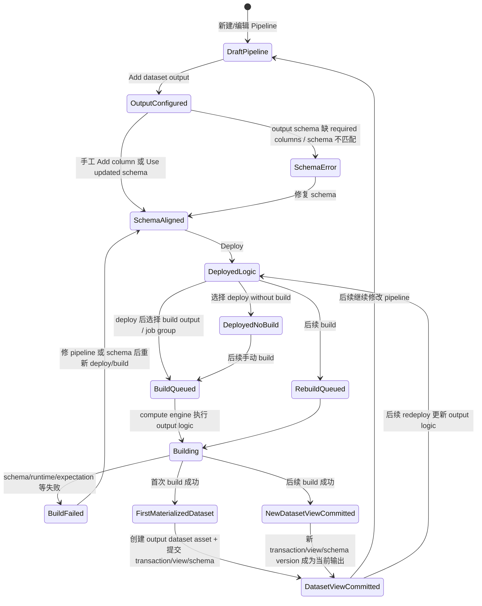

# 57 — Pipeline 目标 Dataset Schema、分区布局与主键确定机制调研

**日期：** 2026-06-13  
**更新：** 2026-06-18
**关联 Issue：** #68
**类型：** 技术调研 / Pipeline output contract / Dataset schema / Physical layout / Primary key
**写入范围：** 本文件  

---

## 1. 总结与洞察

1. 【事实 + 推断】Pipeline Builder 中先创建的是 output 配置/声明；deploy 固化 output 逻辑；首次 build 成功后才物化为 Foundry Dataset 资产和 Dataset view。output schema 可手工添加列或使用 transform 输出 schema，schema 错误会阻止部署。
2. 【事实】Foundry 对外公开的稳定语义是：Dataset schema 绑定在 dataset view 上，可按 `branchName`、`endTransactionRid`、`versionId` 查询；因此目标数据集 schema 不是脱离版本存在的静态表头，而是输出 view 的元数据。
3. 【事实 + 推断】分区不是自动按 `dt` 或主键生成的表定义。Foundry 的 Hive-style partitioning 需要在写出时显式指定 `partition_cols` / partition columns，并把分区列记录到 transaction metadata；projection 是另一类平台维护的优化结构。
4. 【事实 + 推断】公开资料没有显示 Pipeline output dataset 会自动生成传统数仓意义上的 bucket / clustered table spec。Spark `repartition` / `repartitionByRange` 只控制写出前的执行分布和文件形态，不等于 Dataset 的持久分桶契约。
5. 【事实】Dataset 层没有公开的“默认主键”或“每个 dataset 必有主键”语义；primary key 主要出现于 output expectations、特定 write mode 和 streaming/CDC 消费语义中，核心定义是一组非空且组合唯一的列。

---

## 2. 问题定义

本任务回答四个问题：

1. Pipeline 的目标数据集 schema 是如何确定的。
2. Pipeline 部署或首次 build 自动创建 output dataset 时，分区和分桶如何确定。
3. 目标数据集是否天然存在主键。
4. 如果需要主键，主键应如何确定。

为避免把未公开实现说成已验证事实，本文区分：

- 【事实】：Palantir 官方文档或仓库既有证据直接支持。
- 【推断】：由多个事实拼接得到的工程判断。
- 【待验证】：公开资料没有给出内部实现细节。

---

## 3. 目标 Dataset Schema 如何确定

### 3.0 Pipeline Builder output dataset 的完整状态流转

Palantir 官方说明：Pipeline Builder output 是 pipeline 的最终产物，output 会在首次部署并 build pipeline 后创建；对 dataset output 来说，第一次 build 后会在 pipeline 同目录下创建对应 dataset。【事实】

更清晰的理解方式是：Pipeline Builder 里至少有四类对象状态，不能都叫“dataset 已创建”。

对应状态含义如下：

| 状态 | 是否已有 Pipeline 配置 | 是否已有 output 逻辑 | 是否已有可消费 Dataset asset | 是否已有数据 view / schema version |
|---|---:|---:|---:|---:|
| `OutputConfigured` | 是 | 草稿态 | 否 | 否 |
| `SchemaAligned` | 是 | 草稿态且可部署 | 否 | 否 |
| `DeployedNoBuild` | 是 | 已部署 | 首次场景下仍未创建 | 否 |
| `BuildQueued` / `Building` | 是 | 已部署并开始执行 | 不应依赖其可消费 | 否，直到 build 成功提交 |
| `FirstMaterializedDataset` / `DatasetViewCommitted` | 是 | 已执行成功 | 是 | 是 |
| 后续 `NewDatasetViewCommitted` | 是 | 新逻辑执行成功 | 复用同一 output dataset asset | 新 transaction / view / schema version |

因此，“部署时自动创建 dataset”要拆成三层看：

- **deploy**：更新 pipeline output 逻辑；可选择不立即 build。【事实】
- **first successful build**：执行逻辑并首次物化 output；这时才创建 output dataset asset，并提交第一版可查询/可消费的 view 与 schema。【事实 + 推断】
- **subsequent build**：不再重新创建同名 dataset asset，而是在该 output dataset 上提交新的 transaction/view/schema version。【推断】

这也解释了为什么 output schema 配置在创建前就很重要：官方文档说明，output schema 可以手工 `Add column`，也可以连接 transform node 后使用 `Use updated schema`；如果 output schema 缺少 required columns，会进入 error state，且不能部署 pipeline。【事实】

一句话重述：**Pipeline Builder 中先创建的是 output 配置/声明；deploy 固化的是 output 逻辑；build 成功后才物化为 Foundry Dataset 资产和 Dataset view。**【事实 + 推断】

### 3.1 对外稳定语义：schema 绑定在 dataset view 上

既有证据已经说明，Foundry Dataset 的 schema 不是简单挂在“表”这个抽象上，而是绑定在 dataset view 上。`Get Dataset Schema` API 支持按 `branchName`、`endTransactionRid`、`versionId` 查询 schema，返回值包含 `branchName`、`endTransactionRid` 和 schema `versionId`。【事实】

这意味着：

- 同一个 dataset 在不同 branch / transaction / view 上可以对应不同 schema version。【事实】
- 目标 dataset schema 的最终锚点是“这次 build 产出的 output view 是什么”，而不是 pipeline 定义文件里单独保存的一份静态 schema。【推断】

### 3.2 Pipeline 先声明输出契约，再由 build 产出最终 schema

在高码路径里，Transform 通过 `Input` / `Output` 声明 dataset 级依赖，平台据此组装 DAG；但 `Input` / `Output` 本身主要声明“读哪个 dataset、写哪个 dataset”，不是显式列出完整 schema 的 DDL。【事实】

在低码路径里，Pipeline Builder 不只是连线 UI。仓库既有资料已经记录：

- Builder 至少分成 transform 与 expression 两层，后者有字段和值级类型系统。【事实】
- Builder 后端会生成 transform code，并执行 pipeline integrity checks，提前发现 schema 和 refactor 问题。【事实】

据此可以得到更精确的工程判断：

1. **编译/设计期**：Builder 或 Transform contract 会推导、校验“输出应该长什么样”，例如列名、列类型、字段是否存在、重命名是否破坏下游。【事实 + 推断】
2. **运行期**：实际 compute engine 运行 transform，生成最终输出 DataFrame / table / files，并写入 output dataset transaction。【推断】
3. **提交后**：该 output view 对应的 schema 被固化为新的 schema version，对外可被 Schema API、Lineage、Preview、Health checks 消费。【事实 + 推断】

### 3.3 不能把“schema inference”误解为纯运行后猜测

如果只把 schema 理解成“作业跑完后读一遍文件得到表头”，会漏掉 Builder integrity checks、Data Expectations schema checks 和下游 refactor 校验这些前置约束。

更准确的说法是：

- **前置层**：Transform contract、Builder expression/type system、integrity checks 决定允许什么 schema 变化。【事实 + 推断】
- **提交层**：output view 挂接的 schema version 决定这次产物最终暴露什么 schema。【事实】

因此，“目标 dataset schema 如何确定”应理解为：

> 由 transform / builder 逻辑产生的输出结构，经平台在 build 前后做契约校验，最终随 output dataset view 固化为 schema version。【推断】

---

## 4. 分区、分桶与物理布局如何确定

### 4.1 Foundry 没有默认 `dt` 分区主坐标

仓库既有 Dataset 调研已经证明：Foundry Dataset 的一阶坐标是 `Dataset + branch + transaction/view`，不是传统数仓的 `table + dt`。【事实】

这并不表示 Foundry 不能分区，而是表示分区不是 Dataset 身份、版本边界或业务生产边界的默认主坐标。【事实 + 推断】

### 4.2 Hive-style partitioning 由写出逻辑显式指定

Palantir 官方 Hive-style partitioning 文档说明：

- Spark transform 写 output dataset 时，可在 `write_dataframe(..., partition_cols=[...])` 中指定 partition columns。【事实】
- Java transform 可在 `DatasetFormatSettings` 中添加 partition columns。【事实】
- Foundry 会按照指定列的取值组合写出独立文件路径，并在 transaction metadata 中记录该 dataset 按这些列 partitioned；Spark、Polars 等 reader 可利用 metadata 和路径减少读取文件范围。【事实】
- 官方提醒高基数字段不适合 Hive-style partitioning，因为每个唯一值组合至少会产生一个文件，容易造成过多文件。【事实】

所以，Pipeline output dataset 的分区字段不是部署时自动从 schema、主键或日期列推断出来的；它来自 transform / output 写出配置，或者来自 Builder 暴露的等价 output/layout 配置。【事实 + 推断】

### 4.3 Spark repartition 不是持久分区定义

官方示例建议在 Hive-style partitioning 场景下先按同一组列 `repartitionByRange`，再用 `partition_cols` 写出。这两件事的职责不同：

| 机制 | 作用层 | 是否是 Dataset 持久布局契约 | 说明 |
|---|---|---|---|
| `partition_cols` / partition columns | 文件布局 | 是 | 决定路径分区和 transaction metadata 中的 partition columns |
| `repartitionByRange` / `repartition` | Spark 执行分布 | 否 | 控制写出前数据如何分布到 task，影响小文件、倾斜和 OOM 风险 |
| projection | 平台维护的优化结构 | 是，但不是 canonical dataset 的目录分区 | 面向过滤、join、聚合等查询模式，可自动 compact |

【推断】因此自研平台不能把 Spark task partition 数量当成表分区规范。它只能回答“这次写出如何分布和形成多少文件”，不能回答“下游查询可按哪些列做 partition pruning”。

### 4.4 “分桶”没有公开的自动表级契约

公开资料里没有看到 Pipeline output dataset 自动生成传统 Hive bucket、Iceberg bucket transform 或数仓 clustering key 的通用规则。【事实】

需要区分三个容易混淆的概念：

1. **S3 bucket**：Foundry S3-compatible API 中，S3 bucket 对应 Foundry dataset 的 RID；这是对象存储 API 映射，不是表分桶。【事实】
2. **Spark repartition/hash 分布**：执行期数据分布，不是持久 bucket spec。【事实 + 推断】
3. **projection / filter-optimized layout**：平台维护的二级优化表示；可处理高基数字段并自动 compact，但不是开放目录分桶。【事实 + 推断】

所以如果问题里的“分桶”指传统数仓中按 key 分桶、cluster 或 bucket transform，当前公开证据只能得出保守结论：**Palantir Pipeline output dataset 不会在部署时自动根据主键或 schema 生成这类 bucket 契约；需要通过 projection、写出分布控制或底层表格式能力另行建模。**【推断】

### 4.5 分区/布局字段应如何选择

分区字段应由访问模式和写入成本决定，而不是由主键自动决定：

| 候选字段 | 是否适合 Hive-style partitioning | 原因 |
|---|---|---|
| `business_date` / `record_date` | 常见适合 | 低到中等基数，查询经常按日期过滤 |
| `department` / `region` / `tenant_type` | 视基数而定 | 过滤稳定且每个分区数据量足够时适合 |
| `user_id` / `order_id` / 主键列 | 通常不适合 | 高基数会造成大量小文件；更适合 projection、索引或业务去重键 |
| `run_id` / transaction id | 不适合 | 版本证据字段，不应当变成业务查询布局 |

【建议】自研平台应把 `layout contract` 独立建模，至少区分 `business partition manifest`、`physical partition columns`、`projection/index spec`、`write distribution hints`。这些字段可以相互关联，但不应合并成一个“分区分桶字段”。

---

## 5. 目标 Dataset 是否有主键

### 5.1 Dataset 基础模型没有公开的默认主键语义

仓库现有 Dataset / Pipeline / Lineage 资料一再强调 Dataset 的核心元数据是 schema、permissions、transactions、branches、views、lineage 和 build history；并没有公开文档说明“每个 dataset 必须定义主键”或“平台自动为 dataset 生成主键”。【事实】

这与传统关系型表不同：Dataset 更接近“带 schema 和版本语义的文件集合”，不是自动附带 PK/FK/unique constraints 的 OLTP 表。【推断】

### 5.2 Primary key 作为可声明的数据契约出现

已有 Data Quality 证据明确表明：

- Pipeline Builder 当前支持 output expectations 中的 `primary key` 和 `row count`。【事实】
- Python Data Expectations 支持 `primary key`、`schema`、`group-by`、`foreign value` 等规则。【事实】
- Data Health content checks 也包含 `primary key` 检查。【事实】

这说明 primary key 在 Foundry 公开模型里的位置是：

- 不是 Dataset 底座默认自带的系统主键。【事实】
- 而是可以附着在 output 或 dataset 上的质量/契约约束，用来校验唯一性与非空性。【事实 + 推断】

结论：**目标 dataset 不天然有主键；只有当工程师或产品在质量/契约层显式声明时，它才成为一个被检查的主键语义。**【推断】

### 5.3 Primary key 也会影响部分 write mode / streaming 消费语义

Pipeline Builder dataset output 的 write mode 文档里，`Append only new rows`、`Snapshot difference`、`Snapshot replace`、`Snapshot replace and remove` 都使用 primary keys 判断 newly seen rows、替换旧行或保留每个 primary key 的一行结果。【事实】

Streaming 文档还说明：stream primary key 是 schema metadata，用于 CDC-aware consumer 计算 deduplicated current view；设置 streaming primary key 时，还必须把相同列设置为 partition keys，以维护顺序并正确解析去重视图。【事实】

这两点说明 primary key 不只是质量检查字段，也可能进入增量写入或 CDC 消费协议；但它仍然需要显式配置，不能从普通 Dataset schema 自动推出。【事实 + 推断】

---

## 6. 主键如何确定

### 6.1 Palantir 对主键的公开语义

仓库既有证据已经记录，Palantir 对 primary key 的公开定义是：

- 一个或多个列。【事实】
- 每个列必须 non-null。【事实】
- 列组合必须 unique。【事实】

这说明主键的确定不是“挑一个 ID 列”这么简单，而是先确定数据的业务粒度，再决定是单列键还是组合键。【推断】

### 6.2 工程上应按业务身份粒度确定

对自研平台可直接复用的判断是：

1. **优先使用上游稳定业务键**：如订单号、用户号、设备号、事件源唯一 ID。【建议】
2. **若单列不足以唯一，使用组合键**：例如 `tenant_id + order_id`、`source_system + entity_id`。【建议】
3. **不要把业务日期当主键**：`business_date` 更像切片、周期或消费语义，不代表实体唯一性。【建议】
4. **不要把 transaction / run_id 当业务主键**：它们是版本与执行证据，回答“谁在什么时候生成了这批数据”，不能回答“这行记录代表哪个业务实体”。【建议】
5. **没有天然业务键时才引入 surrogate key**：例如稳定 hash 或系统分配键；但仍应保留原始业务去重字段，避免把 surrogate key 变成不可解释的黑盒。【建议】

### 6.3 与增量、去重和质量门禁的关系

主键是否需要声明，通常取决于下游场景：

| 场景 | 是否需要显式主键 | 原因 |
|---|---|---|
| 只做一次性宽表产出、无 upsert / dedup | 未必必须 | 可能只需要 schema contract 和 row count |
| 需要去重、幂等重跑、merge/upsert | 强烈建议 | 没有稳定键就无法判断同一业务记录 |
| 要做 Data Expectations / Health checks | 建议声明 | 可直接用 primary key check 守护唯一性 |
| 需要映射到 Ontology object identity | 必须先定业务键 | 否则对象 identity 不稳定 |

仓库已有高码调研也提到，普通增量方案常依赖 `updated_at`、主键或 CDC 事件；而 Foundry 的增量基座是 Dataset transaction。【事实】这并不意味着主键不重要，而是意味着：

- transaction 负责**版本增量**；【事实】
- primary key 负责**业务实体唯一性/去重语义**；【推断】
- 二者不能混用。【建议】

---

## 7. 对自研 Pipeline / Dataset 设计的直接启示

1. 【建议】把 schema 拆成两层：`declared/expected schema` 与 `materialized schema version`。前者服务编译期校验，后者服务运行结果追溯。
2. 【建议】把 physical layout 设计成显式 contract：`partition columns`、`projection/index spec`、`write distribution hints`、`compaction policy` 分开建模。
3. 【建议】把 primary key 设计成显式 contract，而不是隐含约定；至少支持单列/组合列、non-null、unique 和校验结果持久化。
4. 【建议】在 metadata 模型里分开保存 `dataset_version_coordinate`、`physical_layout` 与 `business_identity_key`，避免把 transaction、partition 或主键互相误用。
5. 【建议】当 Pipeline Builder/低码入口存在时，必须把字段级类型推导、schema change impact 和 layout impact 分析做成平台能力，否则很难复现 Foundry 的 integrity checks 体验。
6. 【建议】若未来支持 upsert / CDC / ontology writeback，主键应提前进入 contract 与 lineage 模型，而不是事后靠 SQL 约定补齐。

---

## 8. 待验证问题

1. 【待验证】Builder integrity checks 在 build 前保存的是“完整显式 schema IR”还是“按节点惰性推导的字段类型图”，公开资料不足。
2. 【待验证】schema version 的内部持久化表结构、diff 算法和与 refactor warning 的联动机制未公开。
3. 【待验证】Pipeline Builder 的 primary key expectation 是否同时反向写入某种元数据注册表，还是仅作为 build-time / health-time rule 保存，公开资料不足。
4. 【待验证】Java transforms、SQL transforms、lightweight engines 与 Spark 在 schema materialization 上是否共享完全一致的内部模型，仓库现有证据尚未逐一展开。
5. 【待验证】Pipeline Builder 是否在某些 enrollment 中暴露 output layout UI，并将其转换为与 Spark `partition_cols` 等价的配置，公开资料不足。
6. 【待验证】projection 与 Dataset schema evolution、primary key expectation、write mode 之间是否存在统一元数据注册表，公开资料不足。

---

## 9. 特性分支下 schema 变更的限制与不兼容处理

### 9.1 分支隔离层面：可以变，但不会直接改主分支

Foundry 的 branch-aware build 语义是：build 只会修改当前 build branch 上的 datasets，不会修改其他 branch；dataset branch 只是指向该 branch 最新 transaction 的指针，不支持直接 merge dataset branches。【事实】

因此当特性分支修改 pipeline，导致 output schema 变化时：

- 该变化首先只体现在该 branch 对应 output dataset view 的 schema version 上。【事实】
- `main` / `master` 上的数据和 schema 不会被这个 branch build 直接改掉。【事实】
- 真正进入主分支的是“逻辑变更被 merge 后，在主分支重新 build 产出的新 transaction/view/schema version”，不是把 feature branch 的 dataset branch 直接 merge 过去。【推断】

### 9.2 没有看到“禁止 schema 变更”的总开关，但存在三类硬限制

公开资料没有显示一个通用规则说“feature branch 不允许修改 output schema”。更准确的说法是：**schema 变更允许发生，但能否继续 build / propose / merge，取决于下面几类限制。**【推断】

#### 限制一：Pipeline Builder proposal / merge 时的 schema errors

Pipeline Builder branch proposal 页面明确说明：有些 proposal 会出现 schema 或 edit errors，必须先 `Fix schemas`，否则无法成功 build 和 merge。【事实】

这意味着：

- branch 内可以先把 pipeline 改出新的 schema；【事实 + 推断】
- 但如果变更导致图上的 schema 不一致、下游条件不成立或 proposal 检查失败，必须先修复，不能直接合入主分支。【事实】

#### 限制二：增量构建对 schema change 很敏感

对于 incremental transforms，schema change 不是普通小改动：

- Java 增量文档明确写到：如果依赖的 input dataset schema 变化，默认会被视为 `NEW_VIEW`，可能破坏 incrementality。【事实】
- 只有 low-level Java transforms 才有显式“ignore schema change / use schema modification type”能力，而且官方明确警告它可能带来意外后果。【事实】
- Python 增量文档明确写到：当用 `previous` 模式读取旧输出时，如果你给出的 schema 与上次输出的实际 schema 在列类型、nullability 或列顺序上不匹配，会抛 `SchemaMismatchError`。【事实】

所以 branch 下 schema 变更的一个硬边界是：

> 如果新 schema 让增量逻辑无法再安全解释旧 view / previous output，build 会失败，或者需要退回一次 full snapshot / non-incremental rebuild。【推断】

#### 限制三：某些 schema drift 被官方建议拆成新 dataset

Data Connection FAQ 对 append 场景给了很明确的处理原则：

- 如果文件或 JDBC 表在增量 `APPEND` 事务之间发生真正的 schema 变化，原 dataset 可能开始报 schema mismatch。【事实】
- 如果新 schema 与旧 schema 是根本不同的 table view，官方建议使用 **new dataset** 承接新 schema，并在名字里标版本，例如 `v1.0` / `v1.1`。【事实】

这说明 Foundry 也不是把所有 schema evolution 都视为“同一个 dataset 内自然兼容”的问题；对于破坏性 drift，官方建议直接版本化 dataset，而不是强行在原数据集上续写。【事实 + 推断】

### 9.3 历史数据与新 schema 不兼容时怎么处理

这要分几种情况。

#### 情况一：加列这类加法变更

Python incremental examples 明确写到：如果只是给输出新增一列，下一次增量运行会为新写入的行带上新列，而历史行上的该列会是 `null`。【事实】

如果你希望旧数据也补上这个新列：

- 需要提高 transform 的 `semantic_version`，让它至少做一次 non-incremental/full recompute。【事实】

这是最典型的“branch 下可以先改 schema，但历史数据默认不会自动回填”的处理方式。【推断】

#### 情况二：列类型、列顺序、nullability 或关键列依赖变化

如果变更不是简单加列，而是涉及：

- 列类型变化
- 列顺序变化
- `previous` 读取时的 schema 不匹配
- 被 transform 明确依赖的列被删除、重命名或改类型

那么常见结果不是“历史数据自动适配”，而是：

- incremental build 失败；【事实】
- 或者需要先做一次新的 snapshot/full rebuild，重新生成全量输出；【事实 + 推断】
- 若连 full rebuild 也不能合理解释旧数据，则要拆新 dataset。【推断】

#### 情况三：源表/接入层 schema 发生根本变化

对于 Data Connection append ingest，Palantir 官方 FAQ 的建议更强硬：

- 暂停 sync；
- 必要时回滚已写坏的 transaction；
- 用新的 target dataset 接新 schema；
- 需要时再把新旧 dataset union 到上层消费视图中。【事实】

这说明“历史数据和新 schema 不兼容”的平台级兜底策略不是自动魔法迁移，而是：

1. 停止继续污染旧 dataset；
2. 把 schema break 当成版本切换；
3. 通过新 dataset 或上层 union/semantic layer 处理兼容性。【推断】

### 9.4 实操判断规则

可以把 branch 下 schema 变化按下面规则判断：

| 变更类型 | branch 下能否先存在 | 常见后果 | 推荐处理 |
|---|---|---|---|
| 新增可空列 | 可以 | 历史行该列为 `null` | 如需回填，做 full rebuild / bump `semantic_version` |
| 新增列且下游/质量规则要求全量一致 | 可以，但可能卡在 expectations / proposal checks | build 或 merge 失败 | 先修 schema / expectations，再全量重算 |
| 删除列、重命名列、改类型 | 可以改，但高风险 | incremental 失败、schema error、下游断裂 | 评估是否 full rebuild；必要时拆新 dataset |
| input schema drift 发生在 append ingest 中 | 技术上会发生，但不应继续落原 dataset | schema mismatch / dataset 污染 | 停 sync、必要时回滚、切新 dataset 版本 |
| streaming key / primary key 列被覆盖或删除 | 可以改，但 key metadata 会丢 | 去重/顺序保证变化 | 重新 `Key by` 或重新声明 key |

### 9.5 关键产品决策：breaking change 是否要求历史兼容

这确实是平台必须明确的决策点。公开资料反映的不是“平台自动帮你兼容一切历史数据”，而是：**不同类型的 schema 变化，应由产品显式决定是兼容演进、全量重算，还是切新 dataset 版本。**【推断】

如果不先做这个决策，后面所有实现都会摇摆：

- 增量是否还能继续跑；
- 下游是否允许无感知读取；
- 旧数据是否允许以 `null` 或默认值形式暴露；
- 是否需要保留旧 contract 给历史消费者；
- schema change impact 是 warning 还是 hard stop。

#### 建议的三档策略

| 决策档位 | 定义 | 历史数据要求 | 常见处置 |
|---|---|---|---|
| 向后兼容演进 | 新 schema 仍能解释旧数据；旧消费者不必立刻改 | 需要兼容 | 允许 branch merge；旧数据可保留 `null` / 默认值；必要时后台补算 |
| 破坏性但允许重建 | 新 schema 不能安全解释旧数据，但可通过一次 full rebuild 重建成统一新视图 | 不要求原 transaction 直接兼容，但要求重建后兼容 | merge 前或 merge 后强制 full rebuild；提升 `semantic_version`；暂时阻断增量 |
| 破坏性且不兼容 | 新旧 schema 代表不同数据 contract，历史数据不应再按新 schema 暴露 | 不兼容 | 新建 dataset 版本，如 `dataset_v2`；旧 dataset 继续服务旧消费者，逐步迁移 |

#### 什么应判定为 breaking change

建议把下面这些默认归入 breaking change，除非产品明确声明可以自动迁移：

1. 删除列，且该列对下游可见或被下游依赖。
2. 重命名列，但没有提供兼容别名/双写期。
3. 列类型发生不兼容变化，例如 `string -> int`、`timestamp -> date`。
4. 主键、去重键、streaming key、join key 变化。
5. 字段语义变化但沿用旧字段名，例如金额单位、时区、枚举含义变化。
6. nullability 从可空变成不可空，且历史数据无法满足。

相对地，下面通常可视为非 breaking 或弱 breaking：

1. 新增可空列。
2. 新增下游可忽略的派生列。
3. 增加新的 optional enum 值，但旧逻辑能容忍。

#### 建议的默认产品立场

如果目标是做 Foundry 风格的数据平台，而不是单纯文件落地系统，建议默认采用下面的决策：

1. **默认假设 breaking change 不要求历史 transaction 原地兼容。**
2. **但要求产品在 merge 前明确选择一种处置方式：**
   - `compatible_evolution`
   - `rebuild_required`
   - `new_dataset_version_required`
3. **凡是影响主键、join key、类型语义、下游公共 contract 的变更，默认至少进入 `rebuild_required`。**
4. **凡是连 full rebuild 都无法给出可信统一语义的变更，直接进入 `new_dataset_version_required`。**

这个立场更稳，因为它把“是否兼容历史”从隐式运行时事故，提升成显式治理决策。【建议】

#### 对自研平台的最小落地要求

如果接受上面的决策框架，自研平台最少要补四个能力：

1. `schema_change_classification`：把 schema diff 标成 additive / compatible / breaking。
2. `merge_gate`：breaking change 未声明处置策略时，不允许合入主分支。
3. `rebuild_or_version_policy`：为 breaking change 指定 full rebuild 还是 new dataset version。
4. `consumer_migration_notice`：把 contract 变化通知到下游 owner，而不是只在 build 日志里失败。

---

## 10. 参考资料

### 仓库内证据

- `docs/raw/21-pro-code-capability-deep-dive.md`
- `docs/raw/29-lineage-branch-version-pipeline-sync.md`
- `docs/raw/45-data-expectations-build-gates.md`
- `docs/raw/46-data-health-health-checks.md`
- `docs/topics/pipeline.md`
- `docs/topics/dataset.md`

### 上游资料入口

- Palantir Foundry - Pipeline Builder output overview: https://www.palantir.com/docs/foundry/pipeline-builder/outputs-overview/
- Palantir Foundry - Pipeline Builder add dataset output: https://www.palantir.com/docs/foundry/pipeline-builder/outputs-add-dataset-output/
- Palantir Foundry - Pipeline Builder deliver pipeline: https://www.palantir.com/docs/foundry/pipeline-builder/outputs-deliver-pipeline/
- Palantir Foundry API - Get Dataset Schema: https://www.palantir.com/docs/foundry/api/datasets-v2-resources/datasets/get-dataset-schema
- Palantir Foundry API - Put Dataset Schema: https://www.palantir.com/docs/foundry/api/datasets-v2-resources/datasets/put-dataset-schema
- Palantir Foundry - Hive-style partitioning: https://www.palantir.com/docs/foundry/optimizing-pipelines/hive-style-partitioning/
- Palantir Foundry - Projections vs hive-style partitioning: https://www.palantir.com/docs/foundry/optimizing-pipelines/projections-vs-hive-style-partitioning/
- Palantir Foundry - Define data expectations: https://www.palantir.com/docs/foundry/maintaining-pipelines/define-data-expectations
- Palantir Foundry - Pipeline Builder Data Expectations Overview: https://www.palantir.com/docs/foundry/pipeline-builder/dataexpectations-overview
- Palantir Foundry - Pipeline Builder create unique IDs: https://www.palantir.com/docs/foundry/pipeline-builder/unique-id-creation/
- Palantir Foundry - Streaming keys: https://www.palantir.com/docs/foundry/building-pipelines/streaming-keys/
- Palantir Foundry - S3-compatible API for Foundry datasets: https://www.palantir.com/docs/foundry/data-integration/foundry-s3-api/
- Palantir Foundry - Data Health Checks Reference: https://www.palantir.com/docs/foundry/data-health/checks-reference/
- Palantir Foundry - Branching core concepts: https://www.palantir.com/docs/foundry/data-integration/branching
- Palantir Foundry - Pipeline Builder branches approve a change: https://www.palantir.com/docs/foundry/pipeline-builder/branches-approve-a-change
- Palantir Foundry - Incremental transforms usage guide (Python): https://www.palantir.com/docs/foundry/transforms-python/incremental-usage
- Palantir Foundry - Incremental transforms examples (Python Spark): https://www.palantir.com/docs/foundry/transforms-python-spark/incremental-examples
- Palantir Foundry - Incremental transforms (Java): https://www.palantir.com/docs/foundry/transforms-java/incremental-transforms
- Palantir Foundry - Data Connection FAQ: https://www.palantir.com/docs/foundry/data-connection/faq
