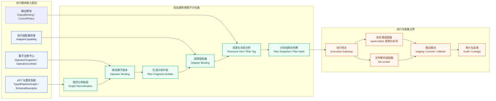
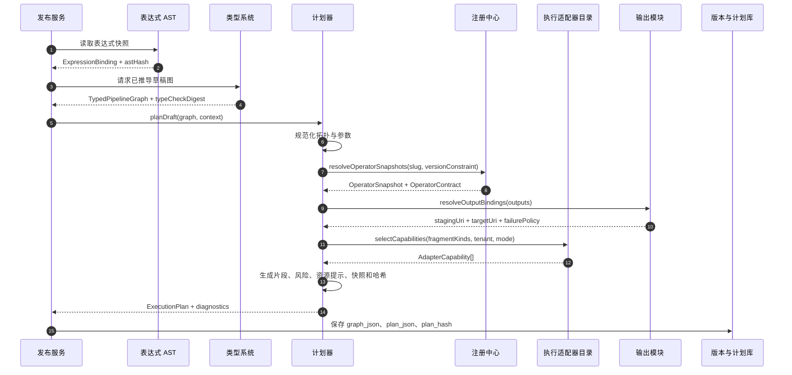

# Pipeline Builder 批处理转换算子计划器模块设计

## 背景、问题、目标与范围

当前仓库已经通过 `docs/pipeline-builder-operator-platform-architecture-design.md` 和 `docs/pipeline-builder-operator-platform-detailed-design.md` 明确了算子平台的总体方向：自研平台以算子注册中心（operator registry）保存能力事实，以表达式抽象语法树（abstract syntax tree）和类型系统（type system）承接可校验语义，以执行适配器（execution adapter）把统一语义映射到自研运行环境。`docs/raw/pipeline-builder-operators/artifacts/transform-final/README.md` 也把 `transform_inventory.jsonl`、`transform_inventory.csv` 和 `transform_inventory_summary.json` 定义为转换算子正式清单入口，其中本地统计显示 transform 侧有 89 个唯一 slug，`supported_in` 覆盖 Batch、Faster 和 Streaming 三类可见能力标签。

当前问题是：在注册中心、表达式 AST、类型系统、执行适配器和输出模块并行设计时，批处理转换算子计划器（batch transform planner）需要先把自己的职责边界、输入假设、计划对象、MVP 规则、风险提示和发布产物定义清楚，否则后续实现会在“草稿图能否直接运行”“Batch/Faster/Streaming 是否等于内部引擎”“文件解析是否属于通用批处理适配器”“输出提交由谁负责”等问题上反复偏移。

本文结论是：批处理转换算子计划器只负责把已经通过结构、参数和类型校验的草稿图编译为不可变的执行计划（ExecutionPlan），并给出计划哈希、计划快照、计划片段、适配器绑定、资源提示、风险标记和错误码。计划器不读取原始用户数据，不执行转换，不提交正式输出，也不反推 Palantir 内部执行引擎。Batch、Faster、Streaming 在本平台内仅作为 Palantir 可见能力标签保存；自研平台是否使用 `spark-batch`、`file-worker` 或其他内部适配器，由本文定义的适配器映射策略独立决定。

本文目标是给出可执行的软件设计，使后续研发可以按本文实现计划器模块、契约测试、MVP 算子编译规则和灰度回滚策略。本文范围覆盖模块职责与边界、上下游接口、核心对象、MVP 规则、计划哈希与快照、适配器选择、资源风险提示、错误码、端到端示例、测试场景和上线策略。本文不覆盖注册中心内部存储、表达式 AST 语法全集、类型系统求解算法、执行适配器运行时代码和输出模块两阶段提交实现；这些分别由并行模块设计承接。

## 证据边界与阅读关系

Palantir 官方材料是第一事实来源。官方 Functions index 说明 Pipeline Builder 中表达式按行级、聚合和生成器分类，而转换算子作用于整表或多表；官方 Transform data 文档说明用户在 Pipeline Builder 中选择数据集后搜索并配置转换；官方 Outputs 文档说明 Pipeline outputs 可以是 datasets、virtual tables 或 Ontology components；官方 Faster pipelines 文档说明 Faster pipelines 与 Batch pipelines 的支持范围不同，用户需要通过预览或构建输出验证结果。这些事实只证明 Palantir 产品可见能力边界，不证明其内部执行引擎。

本仓库已有设计是第二事实来源。概要设计给出“算子注册中心 + 类型化中间表示 + 执行适配器”的架构边界，详细设计把 `Aggregate`、`Mapping join`、普通 Join、Union by name、CSV 或 Excel 文件解析列为转换侧 MVP，并明确 `Batch/Faster/Streaming` 保存为 `supported_in` 能力标签。本设计在上述事实之上做工程推断：计划器以批处理执行计划为交付物，默认映射到自研批处理适配器或文件解析适配器，但不把任何 Palantir 标签直接等同于 Spark、Flink 或 Palantir 内部服务。

上游阅读链接：

- `docs/pipeline-builder-operator-platform-architecture-design.md`
- `docs/pipeline-builder-operator-platform-detailed-design.md`
- `docs/raw/pipeline-builder-operators/artifacts/transform-final/README.md`

Palantir 官方参考链接：

- [Pipeline Builder Functions index](https://www.palantir.com/docs/foundry/pipeline-builder/functions-index/)
- [Pipeline Builder Transform data](https://www.palantir.com/docs/foundry/pipeline-builder/transforms-transform-data/)
- [Pipeline Builder Outputs overview](https://www.palantir.com/docs/foundry/pipeline-builder/outputs-overview/)
- [Faster pipelines with Pipeline Builder](https://www.palantir.com/docs/foundry/building-pipelines/create-faster-pipeline-pb/)
- [Pipeline Builder Data expectations](https://www.palantir.com/docs/foundry/pipeline-builder/dataexpectations-configure-health-check/)

## 模块定位

批处理转换算子计划器位于控制面，输入是已解析并完成类型推导的流水线草稿图，输出是可由执行网关提交的不可变计划。计划器的核心价值不是“替执行引擎优化所有细节”，而是把低代码语义固定成可审计、可复现、可选择适配器的计划快照。



计划器负责六件事。第一，读取类型系统输出的 `TypedPipelineGraph`，把草稿态节点排序成稳定的有向无环图。第二，按注册中心快照把 `slug + layer + versionConstraint` 固定为不可变的 `operatorVersionId` 和 `contractHash`。第三，为每个 MVP 转换节点生成 `PlanFragment`，并保留表达式 AST 的编译引用。第四，根据算子契约、输入介质、租户策略和输出要求选择自研适配器。第五，生成资源提示和风险标记，让发布前能看到 shuffle、文件扫描、列冲突和输出风险。第六，生成规范化 JSON、计划哈希和计划快照，供发布版本复现。

计划器不负责四件事。它不创建或修改算子定义，不替代注册中心晋级流程；不做表达式类型推导，不把任意 SQL 或脚本注入计划；不直接调用 Spark、Flink 或文件解析库执行；不完成输出提交、数据期望或回滚事务。这样拆分后，计划器可以被纯单元测试和契约测试覆盖，运行时失败也能定位到适配器或输出模块。

## 并行依赖的接口假设

注册中心、表达式 AST、类型系统和输出模块与计划器并行设计，因此本文把依赖写成接口假设。后续若并行设计采用不同字段名，只要语义等价，计划器可以通过适配层对齐；若语义缺失，则应由对应模块补齐，而不是让计划器绕过边界直接读取对方内部表。

| 依赖模块 | 计划器需要的输入 | 必要字段或方法 | 计划器使用方式 | 不可跨越的边界 |
| --- | --- | --- | --- | --- |
| 注册中心 | `OperatorSnapshot`、`OperatorContract`、`OperatorVersionSnapshot` | `operatorVersionId`、`slug`、`layer`、`version`、`status`、`supportedIn`、`categories`、`parameterKinds`、`schemaInference`、`adapterCandidates`、`contractHash`、`sourceUrl` | 解析草稿引用、锁定算子版本、读取 MVP 规则、生成 `OperatorBinding` | 计划器不能把 `DISCOVERED` 或 `SPECIFIED` 当作生产可执行版本 |
| 表达式 AST | `ExpressionBinding`、`ExpressionAstSnapshot` | `expressionAstId`、`astHash`、`normalizedJson`、`argumentPath`、`columnLineage` | 引用表达式、构造表达式快照、计算计划哈希 | 计划器不能重新解释表达式字符串 |
| 类型系统 | `TypedPipelineGraph`、`TypedTransformNode`、`SchemaDescriptor`、`TypeDescriptor` | `nodeId`、`topologicalOrder`、`inputPorts`、`arguments`、`inferredType`、`inputSchema`、`outputSchema`、`typeCheckDigest` | 生成片段输入输出、确认 schema、构造血缘摘要 | 计划器不能跳过类型系统接受未推导节点 |
| 执行适配器目录 | `AdapterCatalog`、`AdapterCapability` | `adapterKey`、`adapterVersion`、`supportedFragmentKinds`、`supportedDataDomains`、`enabledTenants`、`rolloutStage` | 选择 `AdapterBinding`、标注灰度和适配器策略 | 计划器不能绕过灰度策略强行选择适配器 |
| 输出与数据期望 | `OutputBinding`、`OutputContract`、`CommitPolicy` | `outputNodeId`、`stagingUri`、`targetUri`、`failurePolicy`、`expectationRefs`、`lineageRequired` | 生成输出写入目标、写入输出快照和风险提示 | 计划器不能直接提交输出或执行回滚 |

计划器对外暴露内部服务接口 `BatchTransformPlanner`。建议方法如下：

| 方法 | 输入 | 输出 | 失败条件 |
| --- | --- | --- | --- |
| `planDraft` | `pipelineId`、`draftRevision`、`TypedPipelineGraph`、`PlannerContext` | `ExecutionPlan`、`PlanningDiagnostic[]` | 有阻断错误时返回 `PLAN_REJECTED`，不产生可发布计划 |
| `explainNode` | `TypedPipelineGraph`、`nodeId`、`PlannerContext` | 单节点 `PlanFragment`、资源风险、适配器候选 | 节点不存在或类型未通过时返回定位错误 |
| `dryRunAdapterSelection` | `PlanFragment[]`、`PlannerContext` | 每个片段的适配器候选、选择理由、阻断原因 | 适配器目录不可用或策略阻断 |
| `normalizePlan` | `ExecutionPlan` | 规范化 JSON、`planHash` | 计划对象缺少快照字段或包含非确定性字段 |

## 核心对象模型

`ExecutionPlan` 是发布态唯一可运行入口。它由多个 `PlanFragment` 组成，每个片段绑定一个转换节点或文件解析节点。片段通过 `OperatorBinding` 记录算子版本，通过 `AdapterBinding` 记录自研适配器选择，通过 `ResourceHint` 和 `RiskTag` 记录可见成本和风险。

| 对象 | 职责 | 关键字段 |
| --- | --- | --- |
| `ExecutionPlan` | 描述一个发布版本的完整批处理执行计划 | `planId`、`pipelineVersionId`、`planSchemaVersion`、`mode=BATCH`、`fragments`、`outputs`、`resourceHints`、`riskTags`、`operatorSnapshotHash`、`typeCheckDigest`、`planHash`、`createdAt` |
| `PlanFragment` | 描述一个可提交给适配器的计划片段 | `fragmentId`、`nodeId`、`fragmentKind`、`inputRefs`、`outputRef`、`operatorBinding`、`adapterBinding`、`argumentBindings`、`outputSchema`、`lineageSummary`、`fragmentHash` |
| `OperatorBinding` | 锁定草稿节点引用到注册中心版本 | `slug`、`title`、`layer=TRANSFORM`、`operatorVersionId`、`version`、`contractHash`、`supportedIn`、`sourceUrl`、`evidenceType` |
| `AdapterBinding` | 记录适配器选择结果和理由 | `adapterKey`、`adapterVersion`、`selectionReason`、`fallbackAdapters`、`rolloutStage`、`requiresStaging`、`capabilityDigest` |
| `ResourceHint` | 给发布、调度和用户展示资源估计 | `fragmentId`、`cpuClass`、`memoryClass`、`shuffleExpected`、`inputScale`、`estimatedRows`、`estimatedBytes`、`fileCount`、`timeoutClass` |
| `RiskTag` | 给发布前审查和灰度策略使用的风险标记 | `code`、`severity`、`fragmentId`、`nodeId`、`message`、`reason`、`mitigation` |
| `PlanSnapshot` | 固化复现所需的外部依赖摘要 | `operatorVersions`、`contracts`、`inputSchemaHashes`、`outputSchemaHashes`、`adapterCapabilities`、`outputBindings`、`plannerVersion` |
| `PlanningDiagnostic` | 返回给调用方的结构化计划错误或警告 | `code`、`severity`、`nodeId`、`argumentPath`、`message`、`suggestion` |

计划 JSON 的最小形态如下。示例字段使用稳定排序；实际实现可以扩展字段，但不能把非确定性运行字段放进 `planHash` 输入。

```json
{
  "planSchemaVersion": "1",
  "mode": "BATCH",
  "plannerVersion": "batch-transform-planner/1",
  "pipelineVersionId": "pv_203_demo_001",
  "fragments": [
    {
      "fragmentId": "fragment_parse_orders",
      "nodeId": "node_parse_orders",
      "fragmentKind": "FILE_PARSE_CSV",
      "operatorBinding": {
        "slug": "parseCsvV1",
        "layer": "TRANSFORM",
        "operatorVersionId": "opv_parseCsvV1_1",
        "version": "1",
        "contractHash": "sha256:contract-parse-csv"
      },
      "adapterBinding": {
        "adapterKey": "file-worker",
        "adapterVersion": "1.0.0",
        "selectionReason": "FILE_INPUT_REQUIRES_FILE_WORKER"
      },
      "inputRefs": ["input_orders_files"],
      "outputRef": "tmp_orders_table",
      "argumentBindings": {
        "schema": {"type": "STRUCT_REF", "schemaHash": "sha256:schema-orders"},
        "includesHeader": {"type": "LITERAL", "value": true}
      },
      "outputSchemaHash": "sha256:schema-orders"
    }
  ],
  "resourceHints": [
    {
      "fragmentId": "fragment_parse_orders",
      "inputScale": "SMALL",
      "fileCount": 12,
      "shuffleExpected": false,
      "timeoutClass": "INTERACTIVE_PREVIEW_OR_BATCH"
    }
  ],
  "riskTags": [
    {
      "code": "FILE_PARSE_SCHEMA_DRIFT",
      "severity": "WARN",
      "fragmentId": "fragment_parse_orders",
      "message": "CSV header 与声明 schema 的匹配依赖大小写归一化和列名清洗"
    }
  ],
  "planHash": "sha256:canonical-plan-json"
}
```

## MVP 编译规则

MVP 只覆盖详细设计中已经列出的高频批处理转换：`aggregateV1`、`mappingJoinV1`、普通 Join、Union by name、CSV 文件解析和 Excel 文件解析。普通 Join 在正式清单中对应 `complexInnerJoinV1`、`complexLeftJoinV1`、`complexOuterJoinV1`、`complexAntiJoinV1` 和 `complexCrossJoinV1` 等 join 家族；Union by name 对应 `unionByNameV1`，并为 `wideUnionByNameV1` 保留同类规则；文件解析对应 `parseCsvV1` 和 `parseExcelV2`。

| 能力 | 清单 slug | 可见标签 | 默认片段类型 | 默认自研适配器 | 关键编译规则 |
| --- | --- | --- | --- | --- | --- |
| Aggregate | `aggregateV1` | Batch、Faster | `AGGREGATE` | `spark-batch` 或等价批处理适配器 | `groupByColumns` 必须存在于输入 schema；聚合表达式必须来自表达式 AST 的聚合表达式绑定；输出 schema 由 group by 列和 alias 后聚合列组成 |
| Mapping join | `mappingJoinV1` | Batch、Faster | `MAPPING_JOIN` | `spark-batch` | 左表为主输入，映射表必须有可用于查找的 key；计划器标注映射表规模未知风险，适配器可根据统计信息选择广播或普通 join |
| 普通 Join | `complexInnerJoinV1`、`complexLeftJoinV1`、`complexOuterJoinV1`、`complexAntiJoinV1`、`complexCrossJoinV1` | Batch、Faster | `JOIN` | `spark-batch` | join 条件必须是布尔表达式；非 key 同名列必须按参数前缀或选择条件消歧；cross join 必须打出高风险标记 |
| Union by name | `unionByNameV1` | Batch、Faster、Streaming | `UNION_BY_NAME` | 批处理计划中默认 `spark-batch` | MVP 只生成批处理计划；列按名称对齐，缺失列策略必须来自算子契约，输出列顺序采用首个输入加新增列的稳定规则 |
| Wide union by name | `wideUnionByNameV1` | Batch、Faster、Streaming | `UNION_BY_NAME_WIDE` | 批处理计划中默认 `spark-batch` | 作为 Union by name 变体保留片段类型，列集合扩大时标注宽表风险 |
| CSV 文件解析 | `parseCsvV1` | Batch | `FILE_PARSE_CSV` | `file-worker`，必要时产出临时表再交给批处理适配器 | 输入数据域必须是 Files；schema 必须显式给出；编码、分隔符、引号、多行和 header 参数进入 `argumentBindings` |
| Excel 文件解析 | `parseExcelV2` | Batch | `FILE_PARSE_EXCEL` | `file-worker` | 输入数据域必须是 Files；sheet、跳过行、header 清洗、输出 sheet 名列等参数进入计划；多 sheet 或宽 schema 标注解析风险 |

这里需要特别强调能力标签与适配器映射的区别。`supportedIn=["Batch","Faster"]` 表示 Palantir 文档或本仓库清单中可见的能力标签；`adapterKey="spark-batch"` 或 `adapterKey="file-worker"` 表示自研平台本次选择的执行适配器。计划器的选择顺序是：先确认草稿目标模式是 `BATCH`，再确认算子版本包含可见标签 `Batch`，再根据自研 `AdapterCatalog` 选择能承接该片段类型和数据域的适配器。`Faster` 标签只作为兼容性和未来优化信号进入快照，MVP 不因为存在 `Faster` 标签就生成单独的 faster 引擎计划。`Streaming` 标签在批处理计划中只证明该算子可见上也支持 Streaming，不能让批处理计划器生成流式状态计划。

## 计划生成流程

计划生成分为七步。第一步接收 `TypedPipelineGraph`，验证 `mode` 为 `BATCH`，并确认类型检查摘要存在。第二步按拓扑顺序规范化节点和参数，删除草稿 UI 坐标、折叠状态和临时预览字段。第三步向注册中心解析每个转换节点，锁定 `OperatorBinding`。第四步根据 MVP 编译规则生成 `PlanFragment`。第五步调用适配器目录生成 `AdapterBinding`。第六步综合输入统计、schema、算子成本标签和输出策略生成 `ResourceHint` 与 `RiskTag`。第七步生成 `PlanSnapshot`、规范化 JSON 和 `planHash`。



计划器遇到阻断错误时不返回半成品计划。非阻断风险以 `RiskTag` 返回并进入发布审查；发布策略可以要求某些高风险标签必须人工确认。预览计划与正式发布计划共用同一套片段生成逻辑，但预览计划的 `OutputBinding` 指向临时样本区域，并且 `planHash` 不写入正式 `pipeline_version`。

## 计划哈希与计划快照

计划哈希用于证明发布版本可复现。计算方式是对 `ExecutionPlan` 的规范化 JSON 做 SHA-256。规范化规则包括字段按字典序排序、数组按语义稳定顺序排列、时间字段只保留发布输入中已确定的版本时间、不包含 run ID、trace ID、临时 token、UI 坐标、日志级别和适配器运行时动态指标。只要草稿语义、算子版本、契约、类型推导结果、适配器能力或输出绑定发生变化，`planHash` 就应变化。

计划快照至少保存五类摘要。第一是算子版本快照，包含 `operatorVersionId`、`contractHash`、`sourceUrl` 和 `supportedIn`。第二是类型快照，包含输入输出 schema hash、表达式 AST hash 和 `typeCheckDigest`。第三是适配器快照，包含 `adapterKey`、`adapterVersion`、能力摘要和灰度阶段。第四是输出快照，包含输出节点、staging 规则、目标引用和失败策略。第五是计划器自身快照，包含 `plannerVersion`、规则版本和错误码版本。

`planHash` 与 `fragmentHash` 分层使用。`fragmentHash` 用于定位单个节点计划是否变化，支持后续局部预览缓存和差异展示；`planHash` 用于发布版本整体复现和运行审计。适配器日志必须同时记录 `planHash`、`fragmentId`、`fragmentHash` 和 `adapterKey`。

## 适配器选择策略

适配器选择遵循“语义先行、策略约束、能力匹配、风险可见”的顺序。计划器先根据 `fragmentKind` 和输入数据域筛选适配器，再根据租户灰度、环境、资源等级和输出策略过滤，最后按优先级选择一个主适配器并记录候选。

| 选择条件 | 规则 |
| --- | --- |
| 片段类型 | `FILE_PARSE_CSV` 和 `FILE_PARSE_EXCEL` 默认选择 `file-worker`；表结构类 `AGGREGATE`、`JOIN`、`UNION_BY_NAME` 默认选择 `spark-batch` 或平台等价批处理适配器 |
| 输入数据域 | Files 输入不能直接进入表处理适配器，必须先通过文件解析片段产出临时表；Table 输入不能误投给文件解析适配器 |
| 可见能力标签 | 批处理计划要求算子版本包含 `Batch` 标签；`Faster` 和 `Streaming` 标签仅进入能力快照和后续兼容提示 |
| 灰度策略 | 适配器未对租户、项目或环境启用时返回 `ADAPTER_POLICY_BLOCKED` |
| 版本策略 | 适配器能力摘要必须与计划器支持的片段 schema 兼容，不兼容时返回 `ADAPTER_CAPABILITY_MISMATCH` |
| 输出策略 | 需要 staging 或两阶段提交的片段只能选择声明支持 staging 的适配器 |

当多个适配器都可用时，MVP 选择优先级为文件解析优先专用 `file-worker`，表转换优先 `spark-batch`，后续可以按租户策略加入 `batch-v2`、`accelerated-batch` 等自研适配器。无论名称如何，这些都是自研适配器键，不与 Palantir 内部实现建立对应关系。

## 资源风险提示

资源提示和风险标记的目标是让用户、发布审批和调度系统在运行前理解成本与失败概率。它们不是精确成本模型，第一版按 schema、参数、输入统计和算子成本标签给出可核对的启发式判断。

| 风险码 | 触发条件 | 严重度 | 说明与建议 |
| --- | --- | --- | --- |
| `SHUFFLE_EXPECTED` | Aggregate、Join 或 Repartition 类片段存在 group by、join key 或 repartition | `INFO` 或 `WARN` | 提示会发生数据重分布，输入较大时建议检查分区列 |
| `CROSS_JOIN_HIGH_CARDINALITY` | `complexCrossJoinV1` 或缺少等值条件的 join | `ERROR` 或 `WARN` | 默认阻断大输入；小样本预览可允许但必须显式确认 |
| `JOIN_COLUMN_CONFLICT` | 左右表存在同名非 key 输出列且未设置前缀或选择条件 | `ERROR` | 要求用户设置前缀或调整输出列选择 |
| `MAPPING_DATASET_SIZE_UNKNOWN` | Mapping join 的映射表没有统计信息 | `WARN` | 适配器无法提前判断广播或普通 join，建议补统计信息 |
| `UNION_SCHEMA_DRIFT` | Union by name 输入 schema 不一致 | `WARN` 或 `ERROR` | 缺失列策略为补空值时警告；策略不允许缺失列时阻断 |
| `WIDE_SCHEMA_PRESSURE` | 输出列数超过平台配置阈值 | `WARN` | 宽表会增加计划、预览和输出 schema 管理成本 |
| `FILE_PARSE_SCHEMA_DRIFT` | CSV 或 Excel header 与 schema 依赖清洗或大小写归一 | `WARN` | 建议固定 schema 并保留解析样例 |
| `FILE_SCAN_LARGE_INPUT` | 文件数量或总大小超过预览/批处理阈值 | `WARN` | 预览采样，正式运行进入批处理队列 |
| `OUTPUT_EXPECTATION_BLOCKING` | 输出绑定包含阻断型数据期望 | `INFO` | 提示质量失败会阻断提交并隔离临时输出 |

发布策略可以把 `ERROR` 风险当作阻断，把 `WARN` 风险要求人工确认，把 `INFO` 风险直接记录审计。风险标记必须包含 `reason` 和 `mitigation`，不能只写“有风险”。

## 错误码

计划器错误码需要稳定，便于前端定位、接口契约测试和审计检索。错误分为输入契约、算子绑定、计划规则、适配器选择、输出绑定和内部错误六类。

| 错误码 | 类别 | 触发条件 | 建议动作 |
| --- | --- | --- | --- |
| `PLANNER_GRAPH_NOT_TYPED` | 输入契约 | `TypedPipelineGraph` 缺少类型推导摘要或存在未推导节点 | 先调用类型系统完整校验和类型推导 |
| `PLANNER_MODE_UNSUPPORTED` | 输入契约 | 草稿模式不是 `BATCH` | 改用对应模式计划器，或把流水线目标模式设为批处理 |
| `OPERATOR_VERSION_NOT_RESOLVED` | 算子绑定 | 注册中心无法解析 slug、layer 或版本约束 | 修正草稿引用或等待注册中心晋级算子版本 |
| `OPERATOR_NOT_VERIFIED` | 算子绑定 | 算子版本状态未达到可发布要求 | 使用已验证版本，或在注册中心完成验证 |
| `OPERATOR_MODE_UNSUPPORTED` | 算子绑定 | 批处理计划中使用不含 `Batch` 标签的算子版本 | 更换算子或调整流水线模式 |
| `PLAN_RULE_UNSUPPORTED_OPERATOR` | 计划规则 | 算子存在但计划器 MVP 未定义编译规则 | 暂不允许发布，目录应展示为未实现批处理计划 |
| `PLAN_ARGUMENT_BINDING_FAILED` | 计划规则 | 参数缺失、参数种类与契约不一致或表达式绑定缺失 | 回到画布修正参数并重新类型校验 |
| `PLAN_SCHEMA_CONFLICT` | 计划规则 | Join 或 Union 输出 schema 无法稳定推导 | 调整列选择、前缀或缺失列策略 |
| `ADAPTER_NOT_FOUND` | 适配器选择 | 没有适配器声明支持片段类型和数据域 | 启用适配器或暂缓该算子发布 |
| `ADAPTER_POLICY_BLOCKED` | 适配器选择 | 灰度、租户、环境或资源策略阻断 | 申请灰度或切换到已启用适配器 |
| `ADAPTER_CAPABILITY_MISMATCH` | 适配器选择 | 适配器版本不支持计划器生成的片段 schema | 升级适配器或降低计划器规则版本 |
| `OUTPUT_BINDING_FAILED` | 输出绑定 | 输出模块无法分配 staging 或目标引用 | 修正输出配置、权限或目标状态 |
| `PLAN_HASH_FAILED` | 快照与哈希 | 计划包含非规范字段或快照不完整 | 修正规范化逻辑，禁止发布 |
| `PLANNER_INTERNAL_ERROR` | 内部错误 | 计划器未预期异常 | 记录 traceId、输入摘要和错误上下文，按平台故障处理 |

错误返回必须包含 `nodeId`、`argumentPath`、`fragmentId` 中能定位的字段。全局错误至少包含 `pipelineId`、`draftRevision` 和 `traceId`。

## 端到端示例

下面示例从草稿图到执行计划串联文件解析、聚合、Mapping join、普通 Join、Union by name 和输出。业务场景是把供应商上传的订单 CSV 解析成表，按客户聚合金额，用映射表补客户分群，再与客户主数据左连接，最后与历史修正表按列名合并后写出数据集输出。

草稿图的关键节点如下：

1. `node_parse_orders` 使用 `parseCsvV1` 解析 Files 输入 `input_order_files`，声明 schema 为 `order_id`、`customer_id`、`amount`、`event_date`。
2. `node_aggregate_orders` 使用 `aggregateV1`，按 `customer_id` 分组，聚合 `sum(amount)` 为 `total_amount`。
3. `node_mapping_segment` 使用 `mappingJoinV1`，用 `customer_id` 从小型映射表补充 `segment_code`。
4. `node_join_customer` 使用 `complexLeftJoinV1`，把聚合结果与客户主表按 `customer_id` 左连接，右表非 key 列使用 `customer_` 前缀。
5. `node_union_adjustment` 使用 `unionByNameV1`，把 join 结果与历史人工修正表按列名合并。
6. `output_customer_amount` 写入数据集输出，绑定主键和行数数据期望。

计划器生成的片段顺序如下：

| 顺序 | 片段 | 适配器 | 输入 | 输出 | 风险 |
| --- | --- | --- | --- | --- | --- |
| 1 | `FILE_PARSE_CSV` | `file-worker` | `input_order_files` | `tmp_orders_table` | `FILE_PARSE_SCHEMA_DRIFT` |
| 2 | `AGGREGATE` | `spark-batch` | `tmp_orders_table` | `tmp_order_amount_by_customer` | `SHUFFLE_EXPECTED` |
| 3 | `MAPPING_JOIN` | `spark-batch` | `tmp_order_amount_by_customer`、`dataset_customer_segment_map` | `tmp_order_with_segment` | `MAPPING_DATASET_SIZE_UNKNOWN` |
| 4 | `JOIN` | `spark-batch` | `tmp_order_with_segment`、`dataset_customer_master` | `tmp_customer_enriched` | `SHUFFLE_EXPECTED` |
| 5 | `UNION_BY_NAME` | `spark-batch` | `tmp_customer_enriched`、`dataset_manual_adjustment` | `staging_customer_amount` | `UNION_SCHEMA_DRIFT` |

最终 `ExecutionPlan` 记录所有算子版本、schema hash、适配器版本、输出 staging URI、数据期望摘要和 `planHash`。执行网关按片段依赖提交运行，文件解析适配器只产出临时表，批处理适配器处理表转换，输出模块在数据期望通过后执行正式提交。如果主键期望失败，输出模块按策略隔离 `staging_customer_amount`，计划器不参与回滚事务，但审计可以通过 `planHash` 和 `fragmentId` 追溯计划来源。

## 测试场景

计划器测试分为单元测试、契约测试、快照测试、适配器选择测试和端到端小样本测试。文档任务阶段建议先把这些场景转成后续实现任务的验收清单。

| 场景 | 输入 | 预期 |
| --- | --- | --- |
| Aggregate 成功编译 | 已类型校验的 `aggregateV1` 节点，group by 列和聚合表达式合法 | 生成 `AGGREGATE` 片段，输出 schema 为分组列加聚合 alias，风险含 `SHUFFLE_EXPECTED` |
| Aggregate 非数值聚合 | 类型系统返回 `sum(String)` 类型错误时仍请求计划 | 返回 `PLANNER_GRAPH_NOT_TYPED` 或沿用类型错误，不生成计划 |
| Mapping join 映射表缺统计 | 映射表 schema 合法但无规模统计 | 生成计划并返回 `MAPPING_DATASET_SIZE_UNKNOWN` 警告 |
| 普通 Join 列冲突 | 左右表同名非 key 列且未配置前缀 | 返回 `PLAN_SCHEMA_CONFLICT`，定位到 join 节点参数 |
| Cross join 大输入 | `complexCrossJoinV1` 两侧输入统计超过阈值 | 返回高严重度 `CROSS_JOIN_HIGH_CARDINALITY`，发布策略默认阻断 |
| Union by name schema 差异 | 两个输入列集合不一致且缺失列策略允许补空值 | 生成 `UNION_BY_NAME` 片段，返回 `UNION_SCHEMA_DRIFT` 警告 |
| Union by name 缺失列不允许 | 契约或参数要求严格列一致 | 返回 `PLAN_SCHEMA_CONFLICT` |
| CSV 文件解析 | Files 输入、schema、header、编码和分隔符参数合法 | 生成 `FILE_PARSE_CSV` 片段并选择 `file-worker` |
| Excel 文件解析 | Files 输入、schema、sheet 选择和 header 清洗参数合法 | 生成 `FILE_PARSE_EXCEL` 片段并选择 `file-worker` |
| Batch-only 检查 | 批处理计划中使用不含 `Batch` 标签的算子 | 返回 `OPERATOR_MODE_UNSUPPORTED` |
| 适配器灰度阻断 | 租户未启用 `file-worker` | 返回 `ADAPTER_POLICY_BLOCKED`，不生成可发布计划 |
| 计划哈希稳定 | 同一 typed graph、注册中心快照和适配器能力重复计划 | `planHash` 完全一致 |
| 计划哈希变化 | 仅算子 `contractHash` 或输出 schema hash 变化 | `planHash` 变化，`fragmentHash` 定位变化片段 |
| 输出绑定失败 | 输出模块无法分配 staging URI | 返回 `OUTPUT_BINDING_FAILED` |
| 快照字段完整 | 发布计划生成后检查 `PlanSnapshot` | 包含算子、类型、适配器、输出和计划器版本摘要 |

端到端小样本测试使用“订单 CSV 解析到客户金额输出”的示例图，验证从 `TypedPipelineGraph` 到 `ExecutionPlan` 的完整路径，不启动真实生产运行。适配器集成测试由后续执行适配器实现承接，计划器只验证提交给适配器的计划片段符合契约。

## 灰度与回滚策略

计划器上线采用三层灰度。第一层是只读解释模式，只对草稿图生成 `explainNode` 结果，不允许发布，用于验证片段、风险和错误码是否符合预期。第二层是预览模式，允许在小样本和临时输出上使用计划器生成预览计划，正式发布仍走旧路径或保持关闭。第三层是发布模式，允许指定租户、项目或工作空间用 `planDraft` 生成正式 `ExecutionPlan`。

灰度开关建议按以下维度控制：`planner.enabled` 控制计划器入口，`planner.publishEnabled` 控制正式发布，`planner.mvpOperators` 控制允许的 slug 列表，`planner.adapterAllowList` 控制可选适配器，`planner.blockOnWarnRisk` 控制警告风险是否阻断发布。每次开关变更都写入审计，并记录关联变更、操作者和原因。

回滚策略分两类。控制面回滚时，把 `planner.publishEnabled` 关闭，新发布版本不再使用批处理计划器；已经发布的 `ExecutionPlan` 保留 `planHash` 和快照，历史运行仍可按原计划审计。运行面回滚时，由输出模块和执行网关按 `run_output_commit`、staging URI 和 commit key 隔离或回滚输出；计划器只提供计划来源，不直接修改输出。若发现某个算子规则有缺陷，可以在注册中心把对应 `operatorVersion` 从生产目录降级，或在计划器配置中临时移出 `planner.mvpOperators`，避免新计划继续使用。

上线观测指标包括 `planner_plan_requests_total`、`planner_plan_failures_total`、`planner_plan_duration_ms`、`planner_risk_tags_total`、`planner_adapter_selection_total`、`planner_hash_changes_total` 和 `planner_error_code_total`。告警重点是内部错误突增、计划哈希不稳定、适配器选择阻断率异常和发布后运行失败集中在同一 `fragmentKind`。

## 交付检查

本设计聚焦批处理转换算子计划器模块。自查标准如下：文档开头已经包含背景、问题、目标和范围；模块职责与边界已经区分控制面计划器、注册中心、AST、类型系统、执行适配器和输出模块；核心对象已经覆盖 `ExecutionPlan`、`PlanFragment`、`OperatorBinding`、`AdapterBinding`、`ResourceHint` 和 `RiskTag`；MVP 规则已经覆盖 Aggregate、Mapping join、普通 Join、Union by name、CSV 和 Excel 文件解析；Batch、Faster、Streaming 已明确为可见能力标签；计划哈希、计划快照、适配器选择、资源风险提示和错误码已定义；端到端示例、测试场景、灰度与回滚策略已写入；Mermaid 图可按标准语法渲染；参考资料链接到上游两份设计、本地 final bundle 和 Palantir 官方文档。
