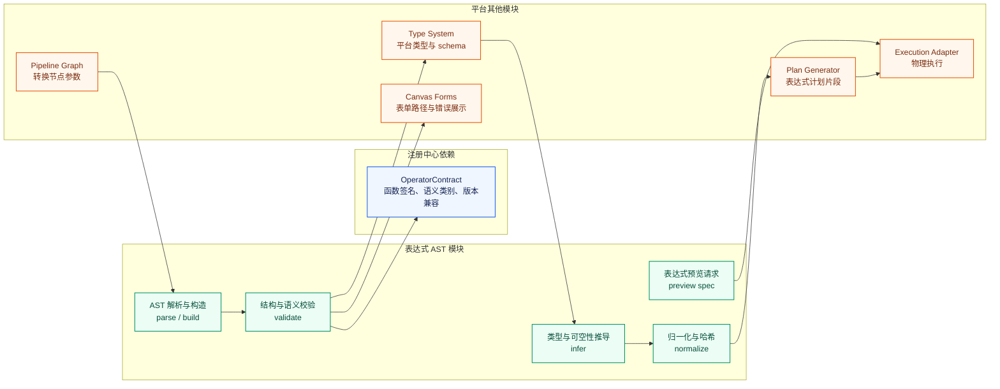

# Pipeline Builder 表达式抽象语法树关键模块设计

## 背景、问题、目标与范围

当前仓库已经完成 Pipeline Builder 算子平台的概要设计和详细设计，并明确采用“算子注册中心 + 类型化中间表示 + 执行适配器”的总体方向。表达式函数（expression function）是这一架构里的值层能力：它接收列、字面量或其他表达式，输出一个值或一个可放入列中的结构化值；转换算子（transform operator）是结构层能力：它接收数据集、表、文件或流，改变数据流形状、行列结构或输出边界。两者的组合关系不对称，转换算子可以包含表达式，表达式不能反向包含转换算子。

本文聚焦表达式 AST 模块，核心问题是：怎样把表达式从“函数名和参数清单”设计成可保存、可校验、可预览、可归一化、可升级、可编译到执行计划的抽象语法树（abstract syntax tree）。如果没有 AST，平台只能保存任意公式字符串或引擎私有 SQL 片段，错误定位、类型推导、安全审计、版本兼容和跨适配器执行都会失控。本文结论是：表达式模块应以受控 AST 作为唯一语义载体，以 `OperatorContract`、类型系统和计划器为外部依赖，以节点 ID、参数路径、错误路径和表单路径作为人机共同定位协议。

本文目标是设计表达式 AST 关键模块，覆盖职责边界、节点模型、序列化、语义约束、接口草案、错误码、测试场景和安全策略。本文不重新定义注册中心完整数据模型，不实现转换算子计划器，也不承诺 Palantir 内部表达式实现细节；`OperatorContract` 在本文中作为注册中心设计输出的依赖接口假设使用，字段名称和枚举可以在注册中心契约收敛后按兼容规则微调。

本文范围只回答表达式 AST 模块如何成为可执行设计。表达式属于值层能力，可以作为 `Mapping`、`Aggregate`、`Join` 默认值、`Filter` 条件、`Window` 输出列、结构体构造和数组映射等转换参数的一部分；表达式自身不能创建、连接、聚合整张表，也不能包含转换节点、输出节点或执行适配器私有脚本。

## 证据边界与设计依据

事实层依据来自 Palantir 官方 Pipeline Builder 文档、当前 expression final bundle，以及已有平台设计文档。官方文档支持的事实是 Pipeline Builder 提供表达式函数和转换算子，表达式处理列和值，转换算子处理数据流和输出边界。当前仓库材料支持的事实是 expression final bundle 收口为 335 条唯一 slug，但字段级质量信号仍需在注册中心晋级时保留，不能把清单直接视为生产可执行目录。

判断层结论来自本仓库既有设计：概要设计已经明确表达式是值层能力，转换算子是结构层能力；详细设计已经要求表达式不保存任意 SQL 或脚本，只保存受控语义树。本文把这些判断进一步落到 AST 节点、接口和执行约束上。

局限层需要说明三点。第一，本文不声明 Palantir 内部 AST 格式，只设计自研平台的可执行表达式模型。第二，注册中心设计仍在并行进行，本文对 `OperatorContract` 的字段使用依赖接口假设。第三，表达式最终编译到 Spark、Flink 或其他运行环境时，物理语法由适配器负责，AST 模块只承诺稳定语义和可定位错误。

## 术语清单

| 术语 | 英文 | 说明 |
| --- | --- | --- |
| 表达式抽象语法树 | expression abstract syntax tree | 由受控节点组成的表达式语义树，不保存任意 SQL 或脚本 |
| 表达式节点 | expression node | AST 中的最小语义单元，例如字面量、列引用、函数调用或条件表达式 |
| 节点 ID | node id | 表达式树内稳定定位单个节点的 ID，用于错误、预览、血缘和表单映射 |
| 参数路径 | argument path | 按 JSON Pointer 风格定位算子参数位置的路径 |
| 错误路径 | error path | 校验错误指向的 AST 或参数位置，服务端和前端共同使用 |
| 表单路径 | form path | 前端表单控件和 AST 节点之间的映射路径 |
| 表达式作用域 | expression scope | 表达式所在的上下文，决定可用列、聚合、窗口和生成器规则 |
| 语义类别 | semantic kind | 行级、聚合、窗口、生成器等表达式执行语义 |
| 归一化 | normalization | 把等价表达式整理成稳定 JSON、稳定节点顺序和稳定哈希的过程 |

## 1. 模块职责与边界

表达式 AST 模块位于 `type-system` 和 `plan-generator` 之间，同时向 `pipeline-graph`、预览服务和前端表单提供稳定语义结构。它的首要职责是把用户配置的值层逻辑保存为强约束树结构，并在保存、校验、预览和发布前给出可解释结果。

模块职责包括六类。第一，解析和构造 AST，接收前端表单或 API 传入的节点 JSON，转换为服务端强类型对象。第二，完成节点级结构校验，例如必填字段、子节点种类、节点 ID 唯一性和路径可解析性。第三，调用注册中心 `OperatorContract` 和类型系统完成参数类型、返回类型、可空性和语义类别推导。第四，为计划器输出规范化后的表达式计划片段，不泄露前端表单细节。第五，为预览服务提供表达式级执行请求、样本输出和错误定位。第六，生成列级血缘、版本升级报告和兼容迁移结果。

模块边界同样需要清楚。AST 模块不拥有算子目录事实，不判断某个 slug 是否已经生产可用；这些事实来自注册中心。AST 模块不直接读取业务数据，不绕过权限系统执行预览；预览由执行网关和适配器完成。AST 模块不生成整表转换计划，转换节点的输入输出端口、schema 变更和适配器选择由计划器负责。AST 模块也不接受任意 SQL、JavaScript、Python、正则替换脚本或引擎私有表达式文本作为语义来源；只有白名单节点和注册中心契约允许的函数调用可以进入发布计划。

表达式与转换算子的边界是本文最重要的约束。转换算子的参数可以声明 `parameterKind = EXPRESSION`、`EXPRESSION_LIST`、`EXPRESSION_MAP` 或结构化参数中的表达式字段，因此一个转换节点可以拥有多个表达式 AST。表达式节点的子节点集合只允许值层节点，不能引用 `TransformNode`、`OutputNode`、`ExecutionPlan` 或适配器命令。这样做的原因是值层表达式只能回答“这个位置的值怎么算”，不能回答“数据流怎样改变”。



## 2. 与注册中心、类型系统和计划器的接口

### 2.1 `OperatorContract` 依赖假设

本文假设注册中心为每个表达式函数版本提供 `OperatorContract`。AST 模块只读取契约，不直接编辑契约。表达式函数的契约至少需要包含 `operatorVersionId`、`slug`、`layer = EXPRESSION`、`signature`、`parameters`、`returnTypeExpr`、`typeVariables`、`nullabilityPolicy`、`semanticKind`、`allowedScopes`、`determinism`、`previewSupport`、`compatibility` 和 `goldenCasesRef`。

其中 `semanticKind` 是表达式校验的关键字段，取值包括 `ROW_LEVEL`、`AGGREGATE`、`WINDOW`、`GENERATOR` 和 `SPECIAL_FORM`。`allowedScopes` 描述函数能出现的位置，例如普通映射、过滤条件、聚合参数、窗口参数或结构构造内部。`determinism` 用于计划器判断表达式是否可缓存、可下推或可在预览中稳定复现。`compatibility` 用于版本升级时判断同一 slug 的新版本是否能自动迁移。

如果注册中心尚未补齐契约，表达式函数只能进入草稿可见或实验状态，不能进入发布态执行计划。这样做是为了避免把 expression final bundle 中仍带字段级质量信号的条目误当成已验证执行能力。

### 2.2 类型系统接口

AST 模块向类型系统提交 `ExpressionTypingRequest`，输入包括表达式树、输入 schema、表达式作用域、目标运行模式和注册中心契约快照。类型系统返回 `ExpressionTypingResult`，包含每个节点的 `inferredType`、`nullable`、`semanticKind`、`columnLineage`、`constantFoldable` 和结构化错误。

类型系统需要支持基础类型、数值精度、字符串、布尔、日期时间、二进制、JSON、数组、结构体、映射、几何、媒体占位类型和空值类型。数组、结构体和映射不是附属功能，而是表达式值层能力的重要部分：一个表达式可以构造结构体、返回数组、访问映射键，仍然不因此变成转换算子。

### 2.3 计划器接口

计划器只接收通过校验并归一化的 `NormalizedExpression`。这个对象包含稳定节点 ID、归一化 JSON、表达式哈希、引用的 `operatorVersionId` 集合、输入列依赖、语义类别和目标返回类型。计划器可以把它编译成 Spark 表达式、Flink 表达式或适配器内部表达式，但不得要求 AST 模块保存引擎私有 SQL 字符串。

计划器还需要从 AST 模块获得语义限制。例如，一个 `AggregateExpression` 只能在聚合转换的聚合参数中编译；一个 `WindowExpression` 只能在窗口转换或声明窗口上下文的转换参数中编译；一个 `Generator` 表达式可能改变行展开语义，因此不能混入普通行级 `Mapping` 字段。

## 3. AST 节点设计

所有节点共享基础字段：`id`、`kind`、`typeHint`、`sourceSpan`、`metadata`。`id` 在单棵表达式树内唯一，建议使用 `expr_<短随机或稳定序号>`；发布归一化时保留用户可见节点 ID，同时生成内容哈希。`kind` 决定节点结构。`typeHint` 是用户或调用方提供的期望类型，不替代类型系统推导。`sourceSpan` 用于从表单或文本辅助输入定位来源。`metadata` 只保存非执行语义信息，例如标签、折叠状态和 UI 控件偏好，计划器默认忽略。

### 3.1 基础节点

`Literal` 表示字面量，包含 `value`、`literalType` 和 `nullable`。它可以表示字符串、数值、布尔、日期时间、空值、数组字面量、结构体字面量和映射字面量。大对象字面量不直接内嵌到表达式树，应使用受控资源引用并由权限系统检查。

`ColumnRef` 表示列引用，包含 `columnPath`、`relationRef` 和 `expectedType`。`columnPath` 支持嵌套字段，例如 `customer.address.city`；`relationRef` 用于 join 或多输入转换中消除同名列歧义。列引用只能引用当前表达式作用域暴露的输入 schema，不能通过字符串拼接访问隐藏列。

`FunctionCall` 表示普通函数调用，包含 `operatorRef`、`arguments` 和 `variadicArguments`。`operatorRef` 使用 `slug + versionConstraint` 或发布态 `operatorVersionId`。草稿态可保存版本约束，发布态必须锁定具体版本。参数按 `OperatorContract.parameters` 校验，支持命名参数和有序参数，但归一化后必须形成稳定顺序。

`Conditional` 表示条件表达式，包含 `branches` 和 `elseExpression`。每个分支由 `when` 和 `then` 组成，`when` 必须推导为布尔类型，所有 `then` 和 `elseExpression` 必须能合并出共同返回类型。`Conditional` 是特殊形态节点，不一定对应单个注册中心函数，但仍由 AST 模块负责校验和编译约束。

`Cast` 表示显式类型转换，包含 `expression`、`targetType`、`castMode` 和 `onFailure`。`castMode` 可取 `STRICT`、`SAFE_NULL`、`FORMAT_AWARE`；`onFailure` 只能引用受控策略，例如返回空值、返回默认表达式或报错，不能执行脚本。类型系统需要区分隐式类型提升和显式 Cast，错误提示也应建议用户在必要时显式转换。

### 3.2 聚合、窗口和生成器节点

`AggregateExpression` 表示聚合语义，包含 `function`、`argument`、`distinct`、`filter` 和 `alias`。它只能出现在聚合转换算子的聚合参数、窗口转换中的受控聚合位置，或注册中心契约显式声明允许的作用域。普通行级表达式不能包含聚合节点，原因是聚合会跨多行读取值，已经超出单行值计算。

`WindowExpression` 表示窗口语义，包含 `function`、`partitionBy`、`orderBy`、`frame` 和 `argument`。窗口表达式可以保留值层输出，但依赖窗口上下文；计划器必须确认外层转换算子提供窗口执行能力。窗口函数不能在没有排序或 frame 约束时默认使用不稳定物理顺序，除非契约明确声明该函数与顺序无关。

`GeneratorExpression` 表示可能把一个输入值展开成多个输出值或多行候选的表达式，例如数组展开类能力。它默认不能出现在普通字段映射中，因为生成器可能改变行数；只有外层转换算子契约声明支持生成器参数时，AST 模块才允许通过。

### 3.3 结构化值节点

`StructExpression` 表示结构体构造，包含 `fields`。每个字段有 `name`、`expression` 和 `nullable`。字段名在同一结构体内必须唯一，字段顺序归一化时保持用户声明顺序，因为某些下游格式会保留结构顺序。

`ArrayExpression` 表示数组构造或数组函数参数，包含 `elements` 或 `generator`。普通数组构造要求元素类型能合并为共同元素类型；数组映射、过滤、规约等高阶能力应通过注册中心函数契约表达，并为 lambda 参数建立独立作用域。第一版 AST 可以把 lambda 建模为受控 `LambdaExpression`，其参数只在当前函数调用内部有效。

`MapExpression` 表示映射构造，包含 `entries`。键表达式必须推导为可作为键的稳定类型，不能是结构体、数组或媒体对象。重复键的处理策略必须显式：报错、后者覆盖或按函数契约处理，不能依赖底层引擎偶然行为。

### 3.4 节点类别总览

| 节点 | 主要字段 | 返回类型 | 允许位置 |
| --- | --- | --- | --- |
| `Literal` | `value`、`literalType` | 字面量类型 | 任意值层位置 |
| `ColumnRef` | `columnPath`、`relationRef` | 输入列类型 | 行级、聚合参数、窗口参数 |
| `FunctionCall` | `operatorRef`、`arguments` | 契约返回类型 | 契约允许的位置 |
| `Conditional` | `branches`、`elseExpression` | 分支公共类型 | 行级和契约允许的位置 |
| `Cast` | `expression`、`targetType`、`castMode` | 目标类型 | 行级和契约允许的位置 |
| `AggregateExpression` | `function`、`argument`、`distinct`、`filter` | 聚合返回类型 | 聚合或窗口受控位置 |
| `WindowExpression` | `partitionBy`、`orderBy`、`frame` | 窗口函数返回类型 | 窗口受控位置 |
| `GeneratorExpression` | `function`、`input` | 生成元素类型 | 外层转换显式允许的位置 |
| `StructExpression` | `fields` | 结构体类型 | 任意值层位置 |
| `ArrayExpression` | `elements`、`elementType` | 数组类型 | 任意值层位置 |
| `MapExpression` | `entries`、`keyType`、`valueType` | 映射类型 | 任意值层位置 |

## 4. JSON 序列化、路径和定位协议

表达式 JSON 使用 `astVersion`、`root`、`nodes` 和 `bindings` 四段结构。`root` 保存根节点 ID，`nodes` 保存节点表，子节点通过 ID 引用。这样做比纯嵌套 JSON 更适合表单编辑、局部错误定位和节点复用检查；计划器接收前可以重新物化为树结构。

```json
{
  "astVersion": "1.0",
  "root": "expr_case_1",
  "nodes": {
    "expr_case_1": {
      "kind": "Conditional",
      "branches": [
        {
          "when": "expr_gt_1",
          "then": "expr_cast_1"
        }
      ],
      "elseExpression": "expr_literal_0"
    },
    "expr_gt_1": {
      "kind": "FunctionCall",
      "operatorRef": {
        "slug": "greaterThanV1",
        "layer": "EXPRESSION",
        "versionConstraint": "1"
      },
      "arguments": {
        "left": "expr_col_amount",
        "right": "expr_literal_100"
      }
    },
    "expr_col_amount": {
      "kind": "ColumnRef",
      "relationRef": "orders",
      "columnPath": ["amount"]
    },
    "expr_literal_100": {
      "kind": "Literal",
      "literalType": "Decimal",
      "value": "100.00"
    },
    "expr_cast_1": {
      "kind": "Cast",
      "expression": "expr_col_amount",
      "targetType": {
        "kind": "String"
      },
      "castMode": "STRICT"
    },
    "expr_literal_0": {
      "kind": "Literal",
      "literalType": "String",
      "value": "small"
    }
  },
  "bindings": {
    "argumentPath": "$.nodes[?(@.id=='node_mapping')].arguments.outputColumns[0].expression",
    "formPath": "nodes.node_mapping.arguments.outputColumns.0.expression",
    "fieldPath": "outputColumns[0].expression"
  }
}
```

节点 ID 的要求是稳定、唯一和不承载业务含义。草稿编辑时，前端可以生成临时 ID；服务端保存时必须检查重复和悬空引用。发布归一化时，系统保留原始 ID 用于错误回放，同时生成 `normalizedId` 或表达式哈希用于计划缓存。

路径协议分三层。参数路径（argument path）定位表达式挂在外层转换节点的哪个参数上，使用 JSONPath 或 JSON Pointer 风格。错误路径（error path）定位 AST 内部具体节点和字段，例如 `$.expressions.discount.nodes.expr_gt_1.arguments.left`。表单路径（form path）定位前端控件，例如 `nodes.node_mapping.arguments.outputColumns.0.expression.nodes.expr_gt_1.arguments.left`。服务端返回错误时必须同时提供 `nodeId`、`argumentPath`、`errorPath` 和可选 `formPath`，使前端无需重新推断。

```json
{
  "code": "EXPR_TYPE_MISMATCH",
  "severity": "ERROR",
  "nodeId": "expr_gt_1",
  "argumentPath": "$.nodes[?(@.id=='node_mapping')].arguments.outputColumns[0].expression",
  "errorPath": "$.expressions.discount.nodes.expr_gt_1.arguments.left",
  "formPath": "nodes.node_mapping.arguments.outputColumns.0.expression.nodes.expr_gt_1.arguments.left",
  "message": "greaterThanV1 的 left 参数需要 Numeric，但 amount 推导为 String",
  "suggestion": "先使用 Cast 将 amount 转为 Decimal，或选择数值列"
}
```

## 5. 语义约束

表达式作用域分为行级、聚合、窗口和生成器四类。行级表达式只读取当前行的列和值，允许字面量、列引用、普通函数、条件、显式类型转换和结构化值构造。聚合表达式跨多行读取值，只能在聚合作用域或受控窗口作用域出现。窗口表达式读取当前分区和 frame 内的行，需要外层转换提供窗口上下文。生成器表达式可能展开行或集合，只能在外层转换契约显式声明支持时使用。

混用规则必须保守。普通行级表达式不能包含聚合、窗口或生成器节点。聚合表达式的参数可以包含行级表达式，但不能再嵌套另一个聚合，除非契约明确声明支持二阶段聚合。窗口表达式的 `partitionBy` 和 `orderBy` 只能是行级表达式，`argument` 可以是行级表达式或契约允许的聚合表达式。生成器表达式不能作为 `Conditional` 的普通分支返回值，除非外层作用域声明返回类型是集合并且不会改变行数。

平台禁止任意 SQL 和脚本注入。用户输入的表达式文本如果作为便捷输入存在，只能经过受控解析器转成 AST；解析失败时返回结构化错误，不能把原始文本透传给 Spark SQL、Flink SQL、Python、JavaScript 或 shell。函数调用只允许引用 `OperatorContract.layer = EXPRESSION` 且状态满足发布要求的版本。`Literal` 中的字符串永远是数据值，不是可执行代码。`ColumnRef` 只能通过 schema 解析，不能把 `amount); drop table` 之类文本拼进物理表达式。

空值、异常和确定性也属于语义约束。每个函数契约必须声明空值传播、空值拒绝或默认值策略；类型转换必须声明失败行为；非确定性函数需要标记，预览和正式运行不能把它们错误缓存为常量。时间相关函数需要明确时区来源，避免预览环境和正式运行环境产生不一致结果。

## 6. 表达式预览、归一化和版本兼容升级

表达式预览支持三种粒度：单表达式预览、转换参数内表达式预览、转换节点小样本预览。单表达式预览用于用户编辑字段计算时快速查看结果；转换参数内预览用于聚合、窗口或 join 默认值等依赖外层上下文的场景；转换节点预览由计划器和适配器运行，AST 模块只提供表达式片段和错误定位信息。预览必须带权限上下文、输入 schema、样本策略和超时限制，不能绕过数据权限读取全量数据。

归一化在发布前执行。归一化规则包括：解析所有草稿态 `slug + versionConstraint` 为稳定 `operatorVersionId`；按契约顺序排列命名参数；删除不影响执行的 UI 元数据；补齐默认参数；把数值、日期时间和类型描述格式化为稳定表示；计算 `expressionHash`；生成引用的 operator 版本快照。归一化输出用于计划缓存、发布差异、审计和版本升级比较。

版本兼容升级由 AST 模块和注册中心共同完成。注册中心提供函数版本之间的 `compatibility` 和迁移规则，AST 模块负责在表达式树上应用规则并产出升级报告。兼容升级可以自动替换 `operatorVersionId`、补齐新增默认参数或重命名参数；行为变化、返回类型变化、空值策略变化、语义类别变化和删除参数必须生成阻断或人工确认。历史发布版本不自动升级，新草稿可以根据策略提示升级。

升级报告需要能被审计和回放，格式包含原节点 ID、原函数版本、新函数版本、迁移动作、影响类型和验证结果。示例：`expr_sum_1` 从 `sumV1` 升级到 `sumV2`，如果只是参数名从 `expression` 改为 `value` 且返回类型不变，可以自动迁移；如果空值策略从忽略空值变为遇空返回空，必须阻断自动升级。

## 7. API 与内部接口草案

表达式模块对外暴露控制面 API，对内暴露强类型服务接口。HTTP API 只面向草稿编辑、校验、预览和升级建议，不直接暴露物理执行细节。

| 接口 | 方法 | 用途 | 响应要点 |
| --- | --- | --- | --- |
| `/api/expressions/parse` | `POST` | 将受控输入构造成 AST | AST、结构化错误、节点路径 |
| `/api/expressions/validate` | `POST` | 校验 AST 结构、类型和语义作用域 | 推导类型、错误列表、列级依赖 |
| `/api/expressions/preview` | `POST` | 在授权样本上预览表达式结果 | 样本值、schema、错误路径、指标 |
| `/api/expressions/normalize` | `POST` | 生成发布前归一化表达式 | 归一化 JSON、哈希、版本快照 |
| `/api/expressions/upgrade-plan` | `POST` | 根据注册中心兼容规则生成升级建议 | 迁移动作、阻断项、影响节点 |

内部接口建议以 Java 21 强类型对象建模，便于控制面服务保持事务和模块边界。

```java
interface ExpressionAstService {
    ParseResult parse(ExpressionParseRequest request);

    ValidationResult validate(ExpressionValidationRequest request);

    TypingResult inferTypes(ExpressionTypingRequest request);

    NormalizedExpression normalize(ExpressionNormalizeRequest request);

    PreviewSpec buildPreviewSpec(ExpressionPreviewRequest request);

    UpgradePlan planUpgrade(ExpressionUpgradeRequest request);
}
```

关键请求对象需要包含 `workspaceId`、`pipelineId`、`draftRevision`、`scope`、`inputSchema`、`operatorContractSnapshot` 和 `permissionContextRef`。关键响应对象必须包含 `traceId`、`expressionId`、`rootNodeId`、`diagnostics` 和 `contractVersions`，使错误、预览和发布都能追溯到同一份契约快照。

## 8. 错误码

错误码前缀使用 `EXPR_`，与图结构、转换算子和适配器错误区分。错误对象遵循详细设计中的结构化错误格式，并额外要求包含 AST 节点定位字段。

| 错误码 | 场景 | 处理建议 |
| --- | --- | --- |
| `EXPR_AST_VERSION_UNSUPPORTED` | `astVersion` 超出服务端支持范围 | 按兼容升级接口迁移 AST |
| `EXPR_NODE_ID_DUPLICATED` | 同一表达式树内节点 ID 重复 | 重新生成冲突节点 ID |
| `EXPR_NODE_REF_NOT_FOUND` | 子节点引用不存在 | 修复引用或删除悬空参数 |
| `EXPR_NODE_KIND_UNSUPPORTED` | 节点类型不在白名单 | 使用受支持节点重建表达式 |
| `EXPR_OPERATOR_NOT_FOUND` | 注册中心找不到函数 slug 或版本 | 选择目录内可用函数 |
| `EXPR_OPERATOR_CONTRACT_MISSING` | 函数缺少 `OperatorContract` | 阻断发布，等待契约晋级 |
| `EXPR_ARGUMENT_REQUIRED` | 必填参数缺失 | 补齐参数或使用默认值 |
| `EXPR_ARGUMENT_KIND_INVALID` | 参数种类与契约不一致 | 调整为列、字面量、表达式或结构化参数 |
| `EXPR_TYPE_MISMATCH` | 参数类型无法满足契约 | 使用 Cast 或更换列和函数 |
| `EXPR_NULLABILITY_VIOLATION` | 可空性不满足函数要求 | 增加空值兜底或过滤 |
| `EXPR_SCOPE_VIOLATION` | 聚合、窗口或生成器出现在非法作用域 | 把表达式移动到支持该语义的转换参数 |
| `EXPR_COLUMN_NOT_FOUND` | `ColumnRef` 无法在输入 schema 中解析 | 选择存在列或修正关系别名 |
| `EXPR_AMBIGUOUS_COLUMN` | 多输入作用域中列名歧义 | 补充 `relationRef` |
| `EXPR_SQL_SCRIPT_FORBIDDEN` | 请求包含任意 SQL 或脚本文本 | 使用受控 AST 节点表达逻辑 |
| `EXPR_PREVIEW_UNSUPPORTED` | 表达式或函数不支持预览 | 使用节点预览或发布校验结果定位 |
| `EXPR_UPGRADE_BLOCKED` | 版本升级存在行为变化 | 人工确认或保留旧版本 |

## 9. 测试场景

测试需要覆盖结构、类型、语义、预览、归一化、升级和安全七层。结构测试验证节点 ID 唯一、根节点存在、悬空引用、循环引用、未知节点类型和路径生成。类型测试覆盖 `Literal`、`ColumnRef`、`FunctionCall`、`Conditional`、`Cast`、结构体、数组和映射的合法与非法组合。语义测试覆盖行级表达式中误用聚合、聚合参数中使用行级表达式、窗口表达式缺失作用域、生成器被放入普通字段映射等场景。

预览测试使用小样本 schema 和授权上下文，验证单表达式预览能返回样本值，聚合表达式在缺少外层聚合上下文时返回 `EXPR_SCOPE_VIOLATION`，无权限输入返回权限错误而不是泄露样本。归一化测试验证参数顺序、默认值补齐、UI 元数据剔除、哈希稳定和 operator 版本锁定。升级测试验证兼容函数自动迁移、不兼容空值策略阻断、历史发布表达式保持旧版本。安全测试验证 SQL 片段、脚本片段、异常列名、大字面量、未授权资源引用和表达式深度超限都能被阻断。

建议的最小自动化样例如下。

| 场景 | 输入 | 预期 |
| --- | --- | --- |
| 行级字段计算 | `amount * 1.08` 的 AST | 推导为 Decimal，列级血缘包含 `amount` |
| 条件表达式 | `if status = 'paid' then amount else 0` | 分支类型合并为 Decimal |
| 显式转换 | `Cast(amount as String)` | 返回 String，记录显式转换 |
| 聚合合法 | `sum(amount)` 位于 Aggregate 参数 | 通过校验，语义类别为 `AGGREGATE` |
| 聚合非法 | `sum(amount)` 位于普通 Mapping 字段 | 返回 `EXPR_SCOPE_VIOLATION` |
| 窗口合法 | `row_number over partition by customer order by ts` 位于 Window 参数 | 通过校验，要求外层窗口上下文 |
| 结构体构造 | `{id: customer_id, total: amount}` | 返回 Struct，字段名唯一 |
| 数组类型合并 | `[1, 2.5]` | 返回 `Array<Decimal>` |
| 映射重复键 | `{'a': 1, 'a': 2}` | 按契约返回重复键错误 |
| 任意 SQL 注入 | 原始 SQL 文本请求 | 返回 `EXPR_SQL_SCRIPT_FORBIDDEN` |
| 版本升级 | `cleanStringV1` 到兼容新版本 | 生成升级动作和表达式哈希变化 |

## 10. 安全策略

表达式安全的第一条原则是“数据值不是代码”。所有用户输入都必须进入 AST 白名单节点，字符串字面量只能作为数据值，列名只能通过 schema 解析，函数只能通过注册中心契约引用。任何不能解析成受控 AST 的文本，都不能进入计划器。

第二条原则是“预览权限等同于数据读取权限”。用户可以编辑表达式，不代表可以预览任意输入数据。预览请求必须带 `permissionContextRef`，执行网关必须检查输入数据读取权限、样本落盘权限和输出展示权限。错误消息默认不展示敏感样本值；需要展示样本时按数据标记脱敏。

第三条原则是“资源和复杂度有上限”。服务端需要限制 AST 最大深度、节点数量、字面量大小、数组或映射字面量元素数量、正则类函数复杂度、预览行数和预览超时。递归引用、循环节点、过深 `Conditional` 和可能导致指数级展开的生成器组合必须阻断。

第四条原则是“物理执行由适配器隔离”。AST 模块不拼接引擎 SQL，不直接执行用户函数，不访问文件系统和网络。需要代码式扩展时，应进入自定义函数运行时，并按概要设计要求使用沙箱、依赖白名单、超时、内存、网络和文件系统限制；组合式自定义表达式优先展开为受控 AST。

## 11. 相关文档和参考资料

上游设计文档：

- `docs/pipeline-builder-operator-platform-architecture-design.md`：算子平台概要设计，给出值层表达式、结构层转换算子、注册中心、类型系统、计划器和适配器的总体边界。
- `docs/pipeline-builder-operator-platform-detailed-design.md`：算子平台详细设计，给出 `OperatorContract`、API、存储、错误格式、测试场景和安全 checklist。
- `docs/transform-expression-comparison.md`：说明 transform 与 expression 的机制差异，是本文坚持值层/结构层边界的仓库依据。
- `docs/raw/pipeline-builder-operators/artifacts/pb-expression-final/README.md`：expression final bundle 入口，说明正式清单、字段级质量信号和过程文件边界。

Palantir 官方资料：

- Palantir Pipeline Builder Overview: https://www.palantir.com/docs/foundry/pipeline-builder/overview/
- Palantir Pipeline Builder Transforms Overview: https://www.palantir.com/docs/foundry/pipeline-builder/transforms-overview/
- Palantir Pipeline Builder Functions Index: https://www.palantir.com/docs/foundry/pipeline-builder/functions-index/
- Palantir Create custom functions: https://www.palantir.com/docs/foundry/pipeline-builder/management-create-custom-functions/
- Palantir Transforms Python API: https://www.palantir.com/docs/foundry/transforms-python/lightweight-api/

## 12. 交付检查结论

本文将表达式 AST 模块定义为值层可执行设计，不把表达式提升为转换算子，也不把转换算子嵌入表达式。模块通过 `OperatorContract` 接收注册中心事实，通过类型系统完成推导，通过计划器进入物理执行，通过路径协议服务前端表单和错误定位。后续实现任务可以按“AST 数据模型、契约校验、类型推导、预览接口、归一化升级、安全测试”拆分，但每个实现都应继续保持本文的值层边界和禁止任意 SQL/脚本注入原则。
