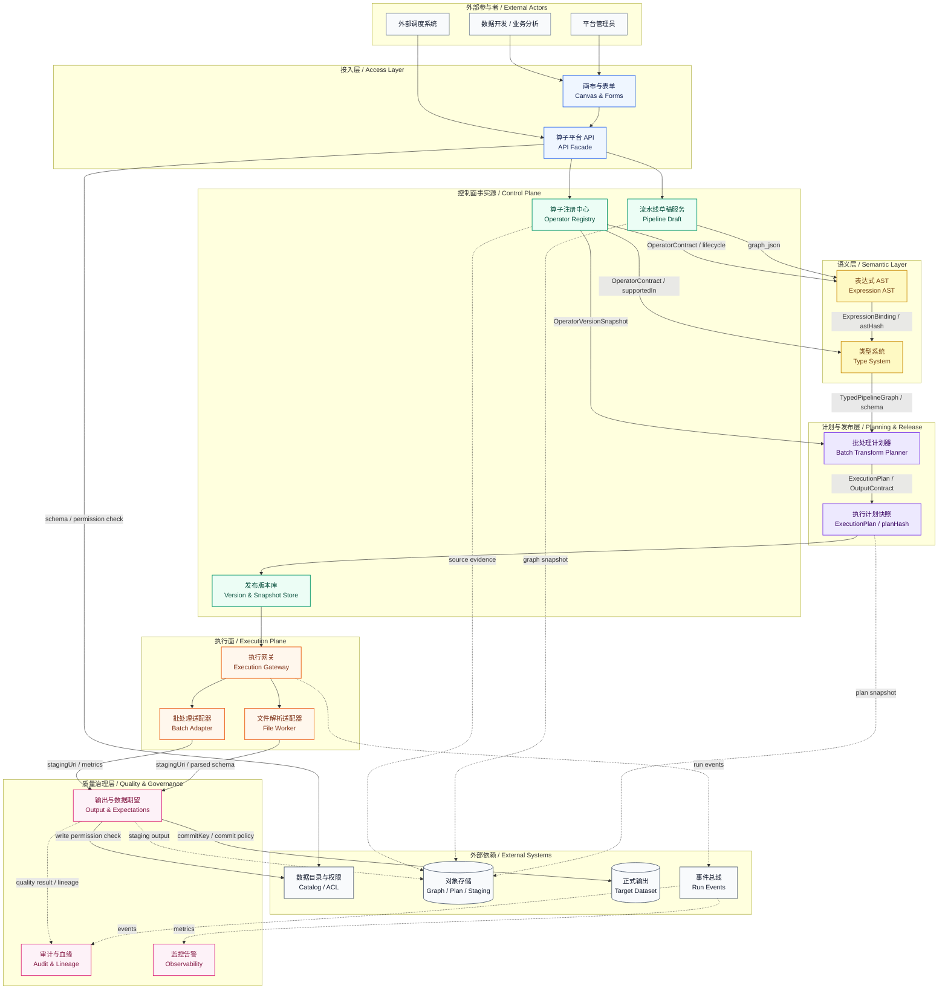

# Pipeline Builder 算子平台关键模块设计索引

## 背景、问题、目标与范围

本索引来自注册中心、表达式 AST、类型系统、批处理计划器、输出与数据期望五个并行模块设计工作，承接平台算子软件方案设计和架构评审优化。上游两份设计已经回答“平台总体上应该怎样复刻/对齐 Pipeline Builder 的算子能力”，但后续实现还需要把关键模块拆到可以独立评审、独立排期、独立验收的粒度。

本文的目标是说明五个关键模块之间的依赖关系、并行策略和阅读顺序，避免评审者把注册中心、表达式抽象语法树、类型系统、批处理计划器、输出与数据期望混成一个大模块。本文不替代各模块的详细设计，也不新增接口事实；接口、表结构、状态机、错误码和测试场景以各模块文档为准。

## 模块拆分结论

五个模块按“事实源、语义树、类型判定、计划生成、输出门禁”拆分。注册中心可以先行；表达式抽象语法树可以和注册中心并行，但需要声明对 `OperatorContract` 的假设；类型系统依赖注册中心契约和表达式树结构，可以在假设明确后并行设计；批处理转换算子计划器依赖前三者的输出，同时需要与输出模块对齐 `OutputContract`；输出与数据期望可以并行固化两阶段提交协议，供计划器预留字段。

## 全局模块关系图

下图按软件架构设计的模块关系视角表达。它把平台拆成接入层、控制面、语义层、计划发布层、执行面、质量治理层和外部依赖七个区域。图中的实线表示同步调用或主要数据流，虚线表示异步事件、审计或血缘写入；跨模块协作只能通过契约、快照、计划、事件和输出提交协议完成，不能直接读取其他模块的内部表。

这张图有四个读图约定。第一，注册中心、表达式 AST、类型系统、批处理计划器、输出与数据期望是本轮展开设计的核心模块，其他节点是它们依赖或服务的上下文模块。第二，注册中心是事实源，输出 `OperatorContract` 和版本快照；表达式 AST 和类型系统不复制算子目录。第三，计划器只生成不可变 `ExecutionPlan` 和输出契约，不直接运行任务，也不提交正式输出。第四，输出与数据期望模块通过 `commitKey` 和两阶段提交控制正式输出可见性，并把质量结果写入审计与血缘。

## 设计文档入口

| 模块 | 文档 | 主要交付 |
| --- | --- | --- |
| 算子注册中心 | `docs/pipeline-builder-operator-registry-module-design.md` | 算子事实源、生命周期、导入审核、契约、API、表结构 |
| 表达式抽象语法树 | `docs/pipeline-builder-expression-ast-module-design.md` | 值层 AST、节点模型、路径协议、语义约束、安全边界 |
| 类型系统 | `docs/pipeline-builder-type-system-module-design.md` | 平台类型、类型推导、schema 推导、聚合/窗口/生成器检查 |
| 批处理转换算子计划器 | `docs/pipeline-builder-batch-transform-planner-module-design.md` | `ExecutionPlan`、计划片段、MVP 转换规则、计划哈希、适配器选择 |
| 输出与数据期望 | `docs/pipeline-builder-output-expectation-module-design.md` | 输出契约、两阶段提交、数据期望、隔离回滚、血缘与权限标记 |

## 建议执行顺序

第一批可以并行推进注册中心、表达式 AST 和输出与数据期望。注册中心提供事实源和契约雏形；表达式 AST 在契约假设下固化表达式树；输出与数据期望固化输出提交协议，给计划器预留输出字段。第二批推进类型系统，把注册中心的 `OperatorContract` 和表达式 AST 结构收敛成类型推导接口。第三批推进批处理计划器，把注册中心、表达式 AST、类型系统和输出模块的输出组合成批处理执行计划。

如果研发资源充足，也可以让批处理计划器提前做只读 `explain` 模式设计，但不能在类型系统接口未收敛前进入发布级计划实现。原因是计划器不应重新解释表达式，也不应接受未完成类型推导的图。

## 接口对齐口径

跨模块字段采用以下默认名称。草稿态算子引用使用 `slug + layer + versionConstraint`，发布态引用使用 `operatorVersionId`。能力标签统一使用 `supportedIn` 表示接口对象字段，持久化字段可使用 `supported_in`。表达式快照使用 `expressionAstId`、`astHash` 和 `normalizedJson`。类型系统输出使用 `TypedPipelineGraph`、`SchemaDescriptor`、`TypeDescriptor` 和 `typeCheckDigest`。计划器输出使用 `ExecutionPlan`、`PlanFragment`、`planHash` 和 `fragmentHash`。输出模块使用 `OutputContract`、`commitKey`、`stagingUri`、`targetUri` 和 `run_output_commit`。

这些名称是模块间的共识接口，不要求实现语言中的类名完全一致；如果后续实现采用不同命名，必须在实现说明或 MR 中说明映射关系。

## 参考资料

- 概要设计：`docs/pipeline-builder-operator-platform-architecture-design.md`
- 详细设计：`docs/pipeline-builder-operator-platform-detailed-design.md`
- 架构评审优化：`docs/pipeline-builder-operator-platform-architecture-design.md` 的修订记录
- Palantir Pipeline Builder Overview: https://www.palantir.com/docs/foundry/pipeline-builder/overview/
- Palantir Pipeline Builder Functions Index: https://www.palantir.com/docs/foundry/pipeline-builder/functions-index/
