# Pipeline Builder 算子平台概要设计

## 背景、问题、目标与范围

当前仓库已经围绕 Palantir Foundry Pipeline Builder 的转换算子（transform）与表达式函数（expression）完成基础调研，并把正式材料沉淀到 `docs/` 与 `docs/raw/pipeline-builder-operators/artifacts/*-final/`。这批材料已经能回答“Pipeline Builder 有哪些可见算子”和“转换算子与表达式函数的机制差异”，但自研平台要复刻并对齐 Pipeline Builder 的算子能力，还需要回答更上层的问题：平台应怎样组织算子元数据、类型校验、编排计划、执行适配和质量闭环，才能从静态清单走向可运行的软件能力。

本概要设计面向自研平台的架构评审，并按架构评审意见补强。本文首先给出结论：自研平台应采用“算子注册中心 + 类型化中间表示 + 执行适配器”的架构。算子注册中心（operator registry）承接官方能力、仓库清单与平台实现状态；流水线中间表示（pipeline intermediate representation）作为画布、校验、编译和审计之间的稳定边界；执行适配器（execution adapter）把同一套语义计划映射到 Spark、Flink、文件解析、地理空间、媒体处理和自定义函数等运行环境。

本文的目标是完成平台算子能力的概要设计，覆盖需求分析、总体方案、关键系统、关键技术、质量、可靠性和安全边界。本文不展开每个接口字段、数据库表和测试用例的实现细节；这些内容放在并列文档 `docs/pipeline-builder-operator-platform-detailed-design.md`。本文也不重新刷新 Palantir 官方清单，不承诺自研平台与 Palantir 内部实现一致；Palantir 官方文档只作为产品能力边界的第一事实来源，当前仓库材料作为第二事实来源，架构落地路径属于工程判断。

## 模板来源与证据边界

本文参照飞书模板“智能云-系统架构设计模版”组织，模板链接为 `https://li.feishu.cn/wiki/wikcni4rYDANFYZc8bZUdXoG6i9`。飞书命令行工具（Lark CLI）已经安装到最新可用版本 `1.0.39`，并可通过 `wiki +node-get` 读取模板标题、节点类型和文档 token；但 `docx` 正文读取需要 `docx:document:readonly` 权限，该权限仍处于审批中，因此本次模板正文结构通过用户已登录的 Chrome 浏览器读取。由浏览器可见目录确认的概要模板结构包括“简介、需求分析、总方案设计、4+1 视图、关键系统设计、关键技术分析、质量设计、可靠性设计”等章节。

Palantir 官方文档支持的事实包括：Pipeline Builder 是 Foundry 的数据集成主应用；它通过后端模型在逻辑创建和执行之间充当中间层；Pipeline Builder 同时提供表达式和转换算子，表达式以列为输入并输出单列，转换算子以整表为输入并返回整表；官方文档还覆盖输出、数据期望、自定义函数、批处理、流式、地理空间和媒体等能力边界。当前仓库材料支持的事实包括：expression final bundle 收口 335 条唯一 slug，transform final bundle 收口 89 条唯一 slug，transform 条目带有 Batch、Faster、Streaming 等支持标记。需要注意的是，Batch、Faster、Streaming 是当前可见能力标签，不等价于 Palantir 内部执行引擎实现；expression 与 transform final bundle 也带有字段级质量信号，平台导入时必须继承这些质量信号，而不能只继承数量闭合结论。本文中关于控制面拆分、存储模型、执行计划、适配器映射和落地阶段的内容是自研平台工程推断。

## 修订记录

| 日期 | 修订版本 | 修改章节 | 修改描述 | 修改人 |
| --- | --- | --- | --- | --- |
| 2026-05-23 | V1.3 | 3.1、3.2、4、5、6、7 | 根据架构评审补齐 Palantir 能力边界、输出两阶段提交、运行模式映射证据边界、适配器契约、血缘权限和专业图表达 | Codex |
| 2026-05-23 | V1.2 | 3.2、3.3、4 | 统一架构图视觉语言，按 C4 风格边界、分层架构、容器图、部署图、泳道时序和决策树优化 Mermaid 图形 | Codex |
| 2026-05-23 | V1.1 | 1.3、3.2、3.3、4 | 补全架构图谱，增加人和 AI 共同理解方案时使用的读图约定、4+1 视图图示、子系统关系和关键技术链路 | Codex |
| 2026-05-23 | V1.0 | 全文 | 按飞书系统架构设计模板拆分形成平台算子能力概要设计 | Codex |

## 术语清单

| 术语/缩略语 | 英文全称 | 中文解释 |
| --- | --- | --- |
| Pipeline Builder | Pipeline Builder | Palantir Foundry 中用于构建数据集成流水线的低代码产品 |
| 转换算子 | transform | 以数据集、文件、流或整表结构为输入并改变数据流结构的操作 |
| 表达式函数 | expression function | 以列、字面量或表达式为输入并产生单列结果的函数 |
| 算子注册中心 | operator registry | 保存算子元数据、版本、参数、类型、运行环境和实现状态的控制面服务 |
| 流水线中间表示 | pipeline intermediate representation | 平台内部描述流水线语义图的稳定结构，不绑定具体执行引擎 |
| 执行计划 | execution plan | 经过校验和规划后可交给执行面运行的不可变计划 |
| 执行适配器 | execution adapter | 把执行计划映射到 Spark、Flink 或专项运行时的扩展组件 |
| 数据期望 | data expectation | 绑定到输出节点的数据质量检查要求 |

## 1 简介

### 1.1 目的

本概要设计用于在架构层面对齐“自研平台复刻/对齐 Pipeline Builder 算子能力”的系统边界。读者应能通过本文理解为什么不能只复制函数名，为什么需要把表达式函数与转换算子分层，为什么必须先建立注册中心和类型化中间表示，再逐步实现执行适配器。

本文给出的架构结论是：平台以算子注册中心作为事实入口，以类型系统和中间表示作为编排边界，以计划生成器作为控制面与执行面的隔离层，以执行适配器承接不同运行引擎，以预览、测试、数据期望和审计构成质量闭环。

### 1.2 范围

本文覆盖算子平台的控制面、执行面、数据模型、4+1 架构视图、关键技术、质量、可靠性和安全设计。本文不覆盖前端交互视觉设计，不逐条解释 424 个现有清单条目，也不定义所有数据库字段的最终物理类型。详细接口、表结构、配置、测试场景和 checklist 见并列详细设计文档。

### 1.3 人和 AI 的共识阅读约定

本文按“先看结论图，再看视图图，再看详细设计”的方式组织，目标是让人和 AI 都能用同一组名词、边界和链路讨论方案。读者第一次阅读时，应先看 3.2 的总体共识图，确认平台被拆成输入层、控制面、执行面、质量闭环和治理层；再看 3.2.1 到 3.2.5 的 4+1 视图，确认谁使用系统、对象如何建模、模块如何实现、流程如何运转、系统如何部署；最后看 `docs/pipeline-builder-operator-platform-detailed-design.md`，把架构对象映射到接口、表结构、配置和测试。

为了避免“人读成产品方案，AI 读成代码模块”的偏差，本文里的图有三条约定。第一，图中的节点名优先使用中文业务名，括号或代码块里的英文名只作为实现标识。第二，图中的箭头表示主要依赖或数据流，不表示所有方法调用。第三，图中的模块边界就是后续拆实现任务、拆服务、拆测试的默认边界；如果实现阶段需要调整，必须在实现说明或 MR 中说明原因。

## 2 需求分析

### 2.1 需求背景、目标、范围

从业务背景看，自研平台需要提供接近 Pipeline Builder 的低代码数据集成体验。用户在画布上选择输入、配置转换、预览结果、挂接输出和质量检查，平台在背后完成类型检查、执行计划生成、运行调度和审计追踪。Palantir 官方文档强调 Pipeline Builder 的后端会在逻辑创建和执行之间处理转换代码生成、完整性检查和问题反馈，这说明“低代码画布”不是单纯 UI，而是需要强控制面能力支撑。

从当前仓库看，已有 expression 和 transform 两套 final bundle。它们是复刻能力的候选知识库，但不是可以直接投产的执行能力。平台必须把每个条目从“发现”推进到“已规格化、已实现、已验证”几个状态，并保留证据来源和版本边界。

本阶段目标是形成可落地架构，使后续实现可以按“注册中心、表达式与类型系统、批处理转换算子、输出与数据期望、专项能力扩展”逐步推进。

### 2.2 功能需求

平台需要支持以下核心功能。首先，算子目录要能按表达式函数、转换算子、分类、运行环境、实现状态和证据等级检索。其次，流水线画布需要把输入、转换节点、表达式参数、输出节点、数据期望和测试用例保存为统一图结构。再次，保存、预览和发布前必须进行结构、参数、类型、模式、运行环境和权限校验。最后，执行面要支持预览、单元测试、正式运行、运行指标采集、失败定位和输出质量检查。

功能需求的边界是“平台能力对齐”，不是“Palantir 内部实现复刻”。例如，Palantir 支持 Spark、Flink、地理空间、媒体和自定义函数；自研平台需要保留这些能力位和扩展边界，但可以按业务优先级分阶段实现。

### 2.3 可用性需求

平台要让非专业代码用户在配置时尽早发现问题，因此编辑期错误必须能定位到节点、字段、参数或表达式子树。类型不匹配、列不存在、运行模式不支持、输出主键不唯一等问题不应等正式运行后才暴露。对专业用户而言，平台还要提供可追溯的执行计划、版本差异、运行指标和错误码，避免低代码体验变成不可调试的黑盒。

### 2.4 时间与成本

建议按五个阶段推进。第一阶段用 2 到 3 周完成只读算子注册中心和清单导入。第二阶段用 3 到 4 周完成表达式抽象语法树（abstract syntax tree）、基础类型系统和小样本预览。第三阶段用 4 到 6 周实现批处理高频转换算子。第四阶段用 2 到 3 周补齐输出、数据期望和发布版本。第五阶段按业务优先级扩展地理空间、流式、媒体和自定义函数。成本判断基于当前仓库已有清单的可复用程度和常规平台研发复杂度，后续立项时仍需按团队规模和现有平台能力重新估算。

## 3 总方案设计

### 3.1 架构核心决策点

核心决策点有三个。第一，是否把算子实现直接绑定到某一个执行引擎。结论是不应绑定，原因是 Pipeline Builder 官方能力本身覆盖批处理、流式、地理空间、媒体和输出等多类运行场景，单一引擎接口会过早限制平台扩展。第二，是否把 expression 与 transform 合并成一种内部节点。结论是不应合并，原因是表达式函数处理值层逻辑，转换算子处理结构层逻辑，两者组合关系是不对称的：转换算子可以包含表达式参数，表达式不应包含转换算子。第三，是否把当前仓库清单直接视为生产可用目录。结论是不应直接发布，原因是清单代表调研结果和证据状态，平台还需要补充类型、参数、适配器、测试和权限状态。

#### 3.1.1 业界方案调研

可参考的方案有三类。第一类是 Spark SQL 或 Flink SQL 这类引擎原生函数目录，它们执行能力强，但表达式、转换、输出和低代码画布之间缺少统一产品模型。第二类是数据编排工具中的算子节点模型，它们适合图编排，但常把参数校验推迟到运行期。第三类是 Pipeline Builder 展现出来的产品模型：用户通过图和表单配置转换，后端承担逻辑创建与执行之间的中间层职责，并提供类型安全、输出检查、预览和版本控制等能力。

#### 3.1.2 调研方案小结

自研平台应吸收第三类方案的产品边界，但实现上采用更可控的注册中心和适配器架构。直接暴露 Spark 或 Flink 的函数目录会让低代码体验被引擎细节牵引；只做图编排又会缺少类型安全和质量闭环。因此推荐方案是：统一语义模型在控制面生成，物理执行通过适配器承接。

为避免把 Palantir 的可见产品能力误写成内部实现，本文把对齐对象拆成五类能力。表达式函数（expression function）和 Pipeline Builder 交互式转换算子（Pipeline Builder transform operator）是本平台第一优先级；自定义表达式（custom expression）和自定义转换（custom transform）先按“可复用组合能力”建模；代码式 Transform API（Transform API code transform）作为外部互操作或高级扩展，不默认等同于低代码算子节点。

| 能力类型 | Palantir 可见边界 | 自研平台建模方式 | 输入输出与预览 | 发布、血缘与执行归属 |
| --- | --- | --- | --- | --- |
| 表达式函数 | 列、字面量或表达式入参，输出单列 | `ExpressionNode` 与 `OperatorContract` 中的值层能力 | 依附转换节点或预览表达式结果 | 随包含它的转换节点发布，血缘可追溯到列级表达式 |
| Pipeline Builder 交互式转换算子 | 通过画布和表单配置，输入整表或结构化数据流，输出整表或输出节点 | `TransformNode` 与计划片段 | 支持节点或子图预览，输出 schema 由类型与模式推导生成 | 由平台计划器和适配器执行，是 MVP 主要复刻对象 |
| 自定义表达式 | 用户把表达式组合沉淀为可复用函数 | 组合式 `OperatorDefinition`，不默认进入代码沙箱 | 复用表达式类型系统，可在使用处预览 | 发布为表达式版本，随引用方进入计划快照 |
| 自定义转换 | 用户把一段 transform board 组合沉淀为可复用转换 | 组合式子图模板，展开或引用为 `TransformNode` | 预览时按子图执行，错误定位保留到模板内部节点 | 发布时锁定模板版本、内部算子版本和参数映射 |
| Transform API 代码式转换 | 代码开发者使用 Foundry 代码 API 定义转换 | 外部互操作或高级代码运行时，不作为低代码算子默认实现 | 可作为外部输入/输出或受控代码节点，预览能力取决于运行时 | 执行归属在代码运行时，平台只保存接口契约、版本、血缘和权限边界 |

### 3.2 总体方案

总体架构分为控制面（control plane）和执行面（execution plane）。控制面负责元数据、草稿图、校验、计划、发布、权限和审计；执行面负责预览、测试、正式运行、指标采集和结果提交。控制面与执行面之间只交换不可变执行计划和结构化事件，避免运行时组件直接修改草稿或注册中心。

先用 C4 Context 风格确认系统边界：算子平台是自研平台内的独立系统，连接用户、调度、数据目录、计算集群和治理系统；它不等同于 Palantir Foundry 内部实现，也不直接暴露底层 Spark 或 Flink 函数目录。

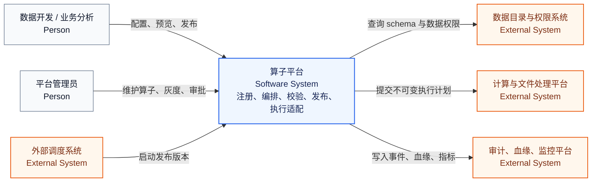

下面的总体共识图是本文最重要的容器级图。它把平台拆成五个稳定层次：输入与交互层承接用户和外部系统；控制面把草稿、注册中心、校验和计划生成固定下来；执行面把计划交给不同运行环境；质量闭环负责预览、测试、数据期望、输出提交和审计；治理层负责版本、权限、灰度和观测。后续详细设计中的 API、表和测试都应能回到这张图中的某个节点。

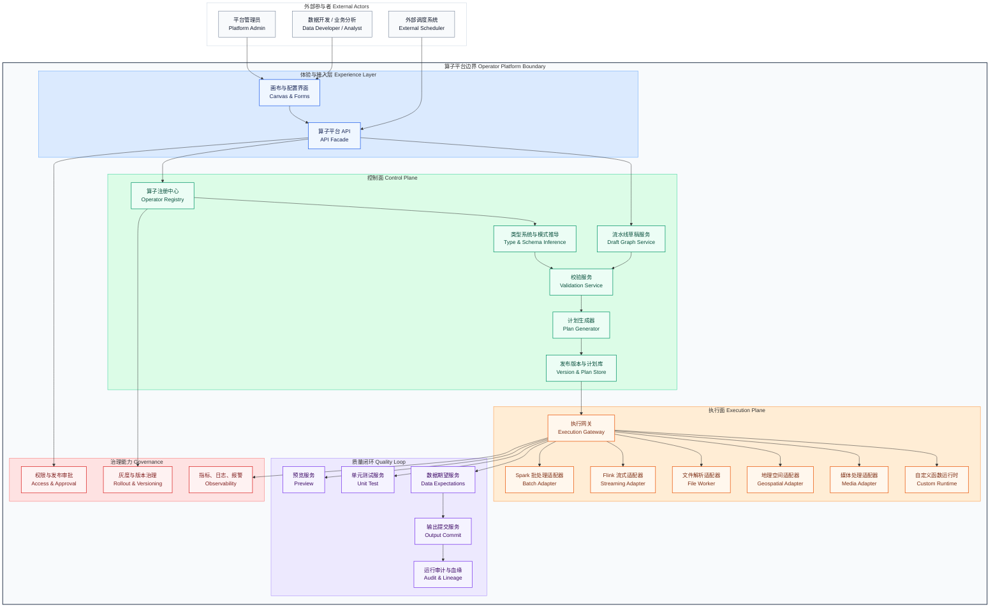

为便于共识，下面用能力分层图说明每层回答的问题。只要讨论对象能放进这张图，后续就能继续细化；如果放不进去，说明它可能不是算子平台本身的职责。

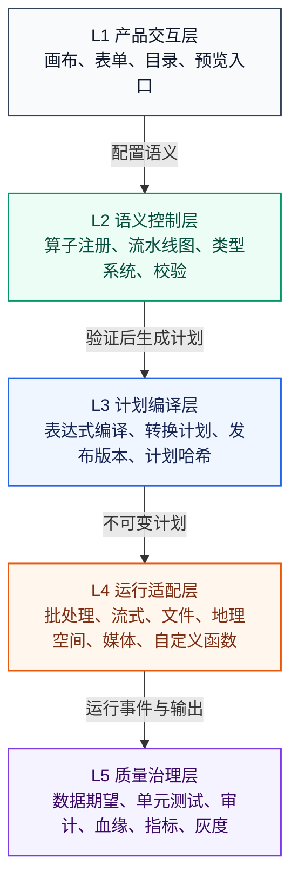

#### 3.2.1 Use-Case View

主要参与者包括数据开发、业务分析、平台管理员、运行调度系统和审计系统。数据开发创建流水线、配置算子、调试预览并发布版本。业务分析更多消费预览、输出和质量结果。平台管理员维护算子注册、适配器状态、权限策略和灰度策略。调度系统按发布版本启动运行。审计系统消费运行事件、血缘和质量结果。

关键用例包括查询算子目录、编辑流水线、保存草稿、预览节点、执行单元测试、发布版本、运行流水线、查看错误定位、配置数据期望、升级算子版本和下线废弃算子。

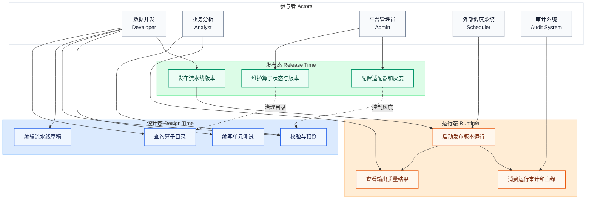

这张图用于回答“谁为了什么使用系统”。实现阶段如果出现新的 API 或后台任务，应先判断它服务哪个用例；如果找不到对应关系，应谨慎放入算子平台范围。

#### 3.2.2 Logical View

逻辑视图以领域对象为中心。`OperatorDefinition` 表示一个稳定算子族，`OperatorVersion` 表示可执行版本，`ParameterSchema` 表示参数模式，`TypeDescriptor` 表示平台类型，`ExpressionNode` 表示表达式树，`TransformNode` 表示转换节点，`PipelineGraph` 表示流水线语义图，`ExecutionPlan` 表示发布后的物理计划。

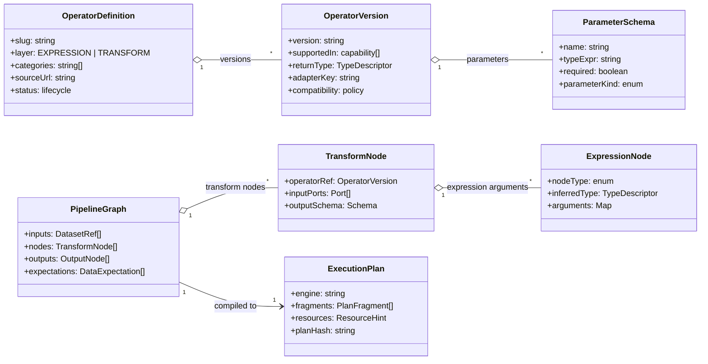

为了让 AI 和人对“状态”也有同一理解，算子生命周期单独成图。`DISCOVERED` 只表示平台认识该条目，不能被当成可执行能力；只有 `VERIFIED` 才能进入默认生产目录。

#### 3.2.3 Implementation View

建议控制面优先采用 Java 21 与 Spring Boot 实现，原因是注册中心、校验、版本、权限和审计都属于强领域模型服务，适合使用类型系统、事务和模块化边界管理。如果现有平台不是 Java 技术栈，也应保留同等模块边界。

代码模块建议拆分为 `operator-registry`、`pipeline-graph`、`type-system`、`plan-generator`、`execution-gateway`、`quality-check`、`audit` 和 `admin`。执行适配器按运行环境独立部署或独立模块化：批处理适配器承接 Spark 或平台既有批处理引擎，流式适配器承接 Flink 或现有流引擎，文件解析适配器作为独立工作进程，地理空间适配器封装 JTS、Apache Sedona 或平台已有地理库，媒体适配器作为后续专项能力承接图像、音频或视频处理，自定义函数运行时只承接明确需要代码沙箱的高级扩展；Pipeline Builder 自定义表达式和自定义转换优先按组合式复用能力建模。

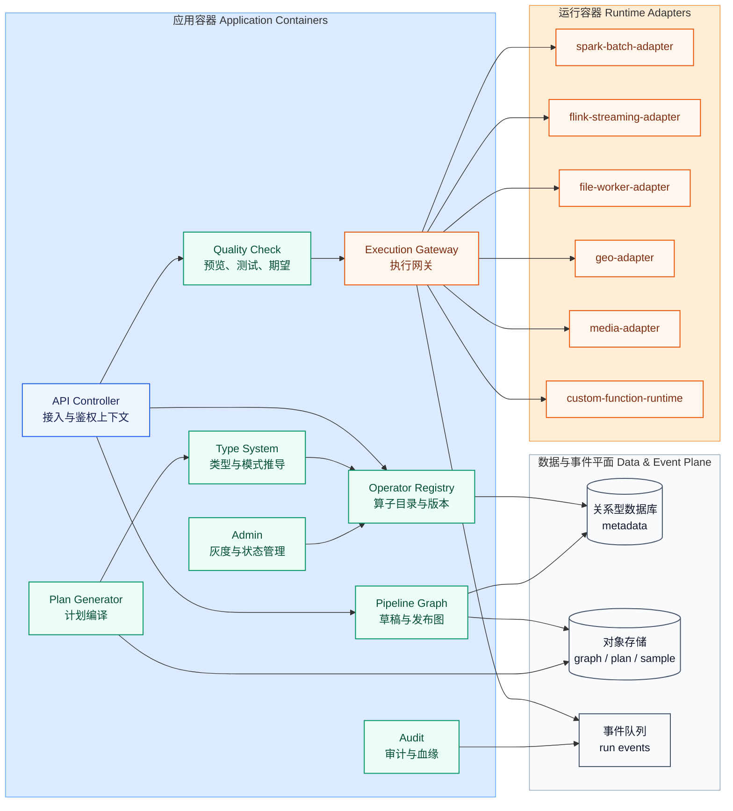

#### 3.2.4 Process View

保存流程是：前端提交草稿图，草稿服务保存图结构，校验服务执行轻量结构校验并返回节点级错误。预览流程是：前端请求节点或子图预览，校验服务执行完整校验，计划生成器生成临时预览计划，调度器选择适配器运行采样数据，质量服务返回样本、模式和错误。发布流程是：完整校验通过后生成不可变版本和执行计划，发布服务锁定算子版本、输入输出和数据期望。正式运行流程是：调度系统按发布版本启动计划，执行适配器回传事件、指标和失败码，质量服务执行数据期望并决定是否阻断输出。

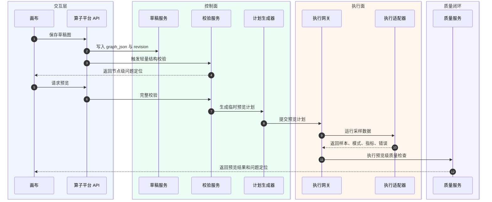

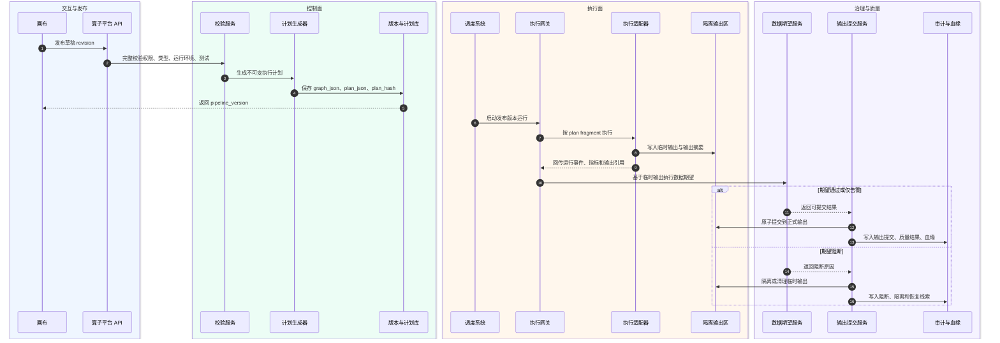

#### 3.2.5 Deployment View

部署上建议控制面服务无状态化，依赖关系型数据库、对象存储和消息队列。注册中心、草稿服务、校验服务和计划服务可以先作为一个后端应用内的模块部署，执行网关和执行适配器按运行环境拆分。Spark 与 Flink 任务运行在既有计算集群；文件解析、地理空间、媒体和自定义函数运行时以工作进程或容器任务承接。审计事件写入日志与事件流，指标进入监控系统。部署图同时表达网络信任边界：客户端只进入接入区，服务区通过服务账号访问数据区和计算区，密钥由统一密钥管理服务托管，跨区恢复依赖数据库备份、对象存储版本和事件队列持久化。

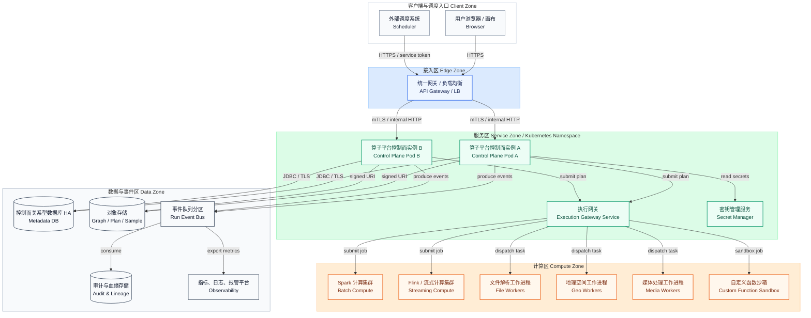

### 3.3 关键系统设计

#### 3.3.1 子系统划分

算子注册子系统负责导入、查询、版本、状态和证据来源。类型与校验子系统负责参数形状、类型推导、模式推导和运行环境校验。流水线编排子系统负责草稿图、发布版本和执行计划。执行调度子系统负责预览、测试、正式运行和适配器选择。质量闭环子系统负责数据期望、单元测试、输出提交和结果判定。安全审计子系统负责权限、运行审计、血缘和变更记录。

```mermaid
flowchart LR
  Registry["算子注册子系统<br/>Operator Registry"]
  TypeValidation["类型与校验子系统<br/>Type & Validation"]
  Pipeline["流水线编排子系统<br/>Pipeline Orchestration"]
  Execution["执行调度子系统<br/>Execution Scheduling"]
  Quality["质量闭环子系统<br/>Quality Loop"]
  OutputCommit["输出提交子系统<br/>Output Commit"]
  SecurityAudit["安全审计子系统<br/>Security & Audit"]

  Registry -->|算子定义、版本、参数| TypeValidation
  Pipeline -->|草稿图、输入输出模式| TypeValidation
  TypeValidation -->|校验结果、推导模式| Pipeline
  Pipeline -->|不可变执行计划| Execution
  Execution -->|运行结果、样本、指标、临时输出| Quality
  Quality -->|通过、告警、阻断| OutputCommit
  OutputCommit -->|正式提交、隔离、回滚| SecurityAudit
  Execution -->|运行事件、血缘| SecurityAudit
  Quality -->|期望结果、阻断原因| SecurityAudit
  SecurityAudit -.权限策略、灰度状态.-> Registry

  classDef registry fill:#eff6ff,stroke:#2563eb,stroke-width:1.5px,color:#172554
  classDef validation fill:#ecfdf5,stroke:#059669,stroke-width:1.5px,color:#064e3b
  classDef pipeline fill:#f5f3ff,stroke:#7c3aed,stroke-width:1.5px,color:#3b0764
  classDef execution fill:#fff7ed,stroke:#ea580c,stroke-width:1.5px,color:#7c2d12
  classDef audit fill:#fef2f2,stroke:#dc2626,stroke-width:1.5px,color:#7f1d1d
  class Registry registry
  class TypeValidation validation
  class Pipeline pipeline
  class Execution execution
  class Quality validation
  class OutputCommit execution
  class SecurityAudit audit
```

#### 3.3.2 子系统关系

注册中心是控制面事实入口，但不直接执行。校验服务读取注册中心和草稿图，生成结构化校验结果。计划生成器只接受通过校验的图，输出不可变执行计划。执行调度器只接受执行计划，不读取草稿。质量闭环读取运行结果和输出数据，反向写入质量事件、审计和告警。这个关系保证编辑态、发布态和运行态边界清晰，避免用户改草稿影响已发布任务。

子系统之间的责任边界如下表。后续拆分实现任务时，默认每个主系统各自拥有对应数据和测试；跨系统协作通过 API、事件或不可变计划完成。

| 子系统 | 拥有的数据 | 对外承诺 | 不承担的职责 |
| --- | --- | --- | --- |
| 算子注册子系统 | 算子定义、版本、参数、来源、状态 | 回答平台认识哪些算子、哪些算子可执行 | 不执行流水线，不保存草稿 |
| 类型与校验子系统 | 类型规则、错误码、推导结果 | 回答图是否可保存、预览、发布 | 不生成物理运行资源 |
| 流水线编排子系统 | 草稿图、发布版本、执行计划 | 回答某个版本应如何运行 | 不直接访问业务数据 |
| 执行调度子系统 | 运行记录、适配器事件 | 按执行计划运行并回传结构化结果 | 不修改已发布计划 |
| 质量闭环子系统 | 数据期望、测试用例、质量结果、输出提交记录 | 判断输出是否满足约束，并控制正式输出提交 | 不替代权限审批，不直接执行计划 |
| 安全审计子系统 | 权限、审计、血缘、指标 | 提供授权、追踪和告警 | 不定义算子语义 |

## 4 关键技术分析

第一项关键技术是类型化中间表示。它需要描述列引用、字面量、函数调用、条件表达式、聚合表达式、转换节点、输入输出端口和数据期望。它的难点不是 JSON 保存，而是要让服务端拥有强类型对象和稳定错误路径，确保前端能把错误定位到具体节点和参数。

第二项关键技术是表达式类型系统。表达式函数需要区分行级表达式、聚合表达式和生成器语义，还要支持泛型、可空性、数组、结构体、映射、几何、媒体和时间类型。没有类型系统，平台只能在运行期失败，无法达到 Pipeline Builder 官方文档强调的类型安全体验。

第三项关键技术是转换算子计划器。转换算子改变整表或数据流结构，计划器必须能处理聚合、连接、文件解析、流式窗口、地理空间和媒体等差异。每类计划器输出统一计划片段，但内部可以选择不同物理实现。

第四项关键技术是执行适配器。适配器需要实现校验、预览、执行、单元测试和指标采集五类能力。适配器边界稳定后，平台可以先实现 Spark 批处理，再扩展流式、地理空间、媒体和代码式扩展，而不需要修改前端和草稿图模型。

第五项关键技术是注册中心版本治理。Palantir 函数条目常有 `V1`、`V2`、`V3` 等版本，平台要把它们映射为可发布、可废弃、可回滚的版本对象。历史流水线必须锁定算子版本，不能因注册中心更新而改变历史执行结果。

第六项关键技术是输出两阶段提交。执行适配器不能直接覆盖正式输出，而应先写入临时输出或隔离区，数据期望通过后由输出提交服务完成原子提交；数据期望失败时输出保持隔离、清理或保留供排障使用。这个协议是“质量失败能够阻断坏数据”的架构前提。

第七项关键技术是适配器契约。适配器不只是一个执行入口，还要声明 `validatePlan`、`preview`、`execute`、`cancel`、`collectMetrics` 和 `emitEvent` 等能力，明确请求响应结构、错误码分层、重试语义、资源配额、版本兼容和租户灰度。只有契约稳定，控制面才能把 Batch、Faster、Streaming 等能力标记安全映射到自研执行环境。

关键技术之间的链路可以用下面的图理解。用户提交的是草稿图，平台先把草稿图还原为类型化语义，再校验，再生成不可变执行计划，最后交给适配器。正式输出必须经过数据期望和输出提交服务，任何跳过校验直接执行、或跳过质量检查直接覆盖正式输出的路径都不符合本文架构。

```mermaid
flowchart LR
  DraftGraph["草稿图<br/>graph_json"] --> Parse["语义解析<br/>PipelineGraph"]
  Parse --> TypeInfer["类型与模式推导<br/>Type / Schema Inference"]
  TypeInfer --> Validate["完整校验<br/>Parameter / Mode / Permission"]
  Validate --> Plan["计划生成<br/>ExecutionPlan"]
  Plan --> AdapterSelect["适配器选择<br/>Adapter Selection"]
  AdapterSelect --> Run["运行入口<br/>Preview / Test / Run"]
  Run --> Result["运行结果<br/>Sample / Output / Metrics / Error"]
  Result --> Expectation["质量检查<br/>Data Expectations"]
  Expectation --> Commit{"输出策略<br/>Commit / Quarantine"}
  Commit --> Audit["治理输出<br/>Audit / Alert / Lineage"]

  classDef semantic fill:#ecfdf5,stroke:#059669,stroke-width:1.4px,color:#064e3b
  classDef plan fill:#eff6ff,stroke:#2563eb,stroke-width:1.4px,color:#172554
  classDef run fill:#fff7ed,stroke:#ea580c,stroke-width:1.4px,color:#7c2d12
  classDef govern fill:#f5f3ff,stroke:#7c3aed,stroke-width:1.4px,color:#3b0764
  class DraftGraph,Parse,TypeInfer,Validate semantic
  class Plan,AdapterSelect plan
  class Run,Result run
  class Expectation,Commit,Audit govern
```

适配器选择也要有稳定规则。计划生成器不直接调用 Spark 或 Flink，而是先读取算子契约中的 `supported_in` 能力标记，再结合自研平台的执行等级、适配器能力矩阵、租户灰度、资源策略和数据域进行匹配；如果没有可用适配器，发布校验必须失败，而不是把错误推迟到运行期。这里的 Batch、Faster、Streaming 只表示可见能力维度，不能反推 Palantir 内部执行引擎。

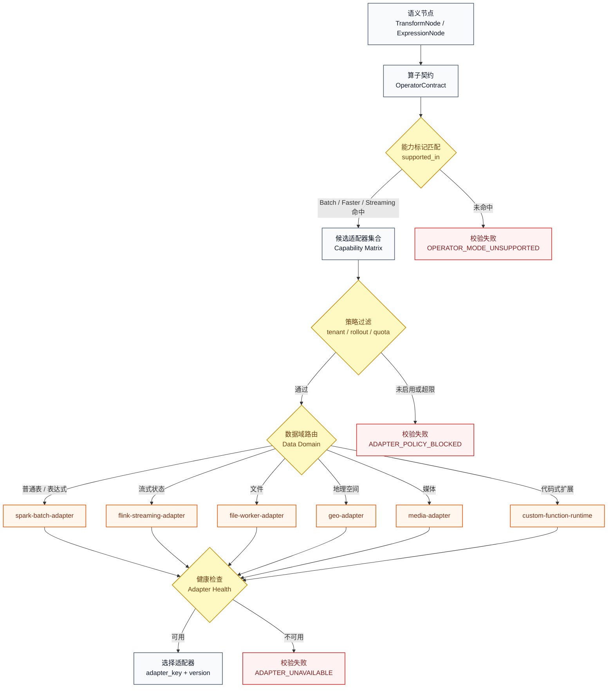

## 5 质量设计

### 5.1 质量场景

质量场景分为编辑期、发布期和运行期。编辑期质量目标是尽早发现配置错误，例如列不存在、类型不匹配、参数缺失、运行模式不支持。发布期质量目标是生成可复现执行计划，并确保数据期望、单元测试和权限检查完成。运行期质量目标是稳定执行、准确告警、保留可追溯事件，并在输出不满足期望时按策略阻断或告警。

建议核心质量指标如下。

| 场景 | 指标 | 建议目标 | 说明 |
| --- | --- | --- | --- |
| 算子目录查询 | P95 延迟 | 小于 300 ms | 目录查询是画布配置高频路径 |
| 草稿校验 | P95 延迟 | 小于 2 s | 轻量校验用于保存和编辑反馈 |
| 小样本预览 | P95 延迟 | 小于 30 s | 受输入采样和执行引擎影响，需要展示采样说明 |
| 发布计划生成 | 成功率 | 大于 99% | 前提是校验通过且依赖适配器可用 |
| 运行错误定位 | 错误码覆盖率 | 大于 95% | 平台错误、用户配置错误、数据质量错误要分层 |

为了让非功能要求可验收，平台在立项时应补齐以下基线。下表给出 MVP 建议值，后续可按租户规模和既有计算平台能力调整。

| 非功能项 | MVP 建议目标 | 验证与运营要求 |
| --- | --- | --- |
| 控制面可用性 | 月可用性不低于 99.5% | 网关、应用实例、数据库和消息队列纳入健康检查 |
| 预览并发 | 单租户默认 10 个并发预览，全局按资源池限流 | 超限返回可解释排队或限流错误 |
| 正式运行并发 | 按项目配额控制，调度重试必须幂等 | `pipeline_run` 使用幂等键避免重复运行 |
| RTO | 控制面 30 分钟内恢复核心读写 | 保留数据库备份、对象存储版本和配置版本 |
| RPO | 控制面元数据不超过 5 分钟数据丢失窗口 | 发布版本、计划和审计事件优先持久化 |
| 事件保留 | 运行事件至少 90 天，审计事件按平台合规要求保留 | 超期归档后仍能追踪发布版本和输出提交 |
| 降级触发 | 预览队列积压、适配器不可用、数据期望大面积失败 | Runbook 明确关闭新适配器、回滚版本、隔离输出的操作 |

### 5.2 遵循质量规范

方案质量依赖四类规范。第一，所有正式算子都必须有来源、版本、参数、类型、运行环境和实现状态。第二，所有发布计划都必须不可变，并能回溯到草稿图、算子版本和适配器版本。第三，所有错误都必须有稳定错误码、定位路径和建议动作。第四，所有已实现算子都必须有小样本测试和至少一个运行适配器验证。

### 5.3 灰度策略

灰度策略按算子、适配器和租户三层控制。新算子先进入 `DISCOVERED` 或 `SPECIFIED`，只有完成适配器和测试后才能进入 `IMPLEMENTED`；进入生产目录前要通过 `VERIFIED` 状态。新适配器先在测试空间启用，再按项目白名单灰度。新版本算子默认不自动升级历史流水线，用户需要显式迁移或在发布新版本时选择升级。

## 6 可靠性设计

### 6.1 可靠性目标

控制面目标是保证草稿、发布版本和注册中心数据不丢失，执行计划可重放，运行事件可追踪。执行面目标是保证失败可重试、错误可定位、输出不满足质量要求时不悄悄覆盖下游数据。对用户而言，可靠性不是“所有任务都成功”，而是失败时能说明原因、保留现场并支持恢复。

### 6.2 故障预防

冗余设计上，控制面服务应无状态部署多副本，数据库启用备份和主从或托管高可用。依赖设计上，注册中心、草稿库、计划库、对象存储、计算集群和消息队列都要有超时、重试和降级策略。容错设计上，预览失败不应影响草稿保存，某个专项适配器不可用不应影响其他算子目录查询。容量设计上，要按草稿数量、计划数量、运行事件量、预览并发和正式运行并发分别估算。健康检查上，控制面检查数据库、消息队列和关键适配器连通性；执行面检查运行队列、计算集群和工作进程状态。缓存设计上，算子目录可以缓存，但发布和校验必须读取带版本号的稳定快照。变更设计上，注册中心 schema、算子版本和适配器升级都要支持回滚。

### 6.3 故障发现

可观测性覆盖四类信号：请求指标、校验指标、运行指标和质量指标。请求指标包括 API 延迟、错误率和并发数。校验指标包括失败码分布、节点类型分布和高频错误。运行指标包括运行时长、输入输出行数、资源消耗、重试次数和适配器失败率。质量指标包括数据期望通过率、阻断次数和单元测试失败率。报警优先关注发布失败率突增、适配器不可用、预览队列堆积、正式运行失败率突增和数据期望大面积失败。

### 6.4 故障恢复

恢复手段包括草稿自动保存、发布版本回滚、算子版本回滚、适配器开关、预览降级、运行重试和输出阻断。发布版本是最重要的恢复边界：一旦某次算子升级导致运行异常，可以把生产调度回退到上一个发布版本，而不是修改当前草稿。对于数据期望失败，默认策略应阻断输出或隔离写入，避免坏数据覆盖下游；是否允许仅告警由项目级策略配置。输出提交服务需要保留 `STAGED`、`VALIDATED`、`COMMITTED`、`QUARANTINED`、`ROLLED_BACK` 等状态，确保恢复动作能从审计事件和输出提交记录还原。

## 7 安全设计

安全设计覆盖数据访问、函数执行、发布权限和审计。数据访问权限在输入、预览、正式运行和输出阶段都要校验；能编辑流水线不等于能读取所有上游数据。表达式编译必须基于受控抽象语法树，禁止拼接任意执行代码。自定义函数运行时只用于代码式扩展，需要沙箱、依赖白名单、超时、内存、网络和文件系统限制；组合式自定义表达式和自定义转换优先复用平台现有算子权限。发布动作要记录操作者、草稿版本、算子版本、计划哈希和审批状态。

权限模型按主体、资源和动作三层落地。主体包括用户、服务账号、调度系统和适配器运行身份；资源包括 workspace、pipeline、pipeline version、input dataset、preview sample、output dataset 和 operator version；动作包括查看目录、编辑草稿、预览、发布、运行、提交输出、管理算子和查看审计。预览和正式运行必须检查输入数据权限，输出提交必须检查目标输出写权限，审计查询必须按 workspace 和数据标记过滤。

血缘模型至少保留输入 RID、输出 RID、branch 或 version、schema hash、列级依赖、表达式派生路径、算子版本、适配器版本、运行 ID、输出提交 ID 和权限标记传播结果。只有这些字段进入审计与血缘存储，运行事件才能从“日志”升级为可治理事实。

## 8 成本与资源设计

成本主要来自控制面存储、预览计算、正式运行计算、文件解析工作进程和运行事件存储。平台应把预览和正式运行分池管理，避免大量预览占用生产计算资源。计划生成时要打出风险标记，例如大规模 shuffle、笛卡尔积、未限定文件解析、大状态流式窗口和无空间索引的地理 join，帮助用户在运行前理解成本影响。

## 9 评审结论

建议通过该概要设计，并进入详细设计和分阶段实现拆分。评审关注点应集中在三个问题：注册中心是否能承接现有清单和后续版本治理；中间表示是否足以支撑表达式嵌入转换算子；执行适配器边界是否能让批处理先落地、专项能力后扩展。若这三个问题成立，平台可以先交付最小可用版本，再逐步提升算子覆盖率。

## 相关文档

- `docs/pipeline-builder-operator-platform-detailed-design.md`：本文对应的详细设计，覆盖接口、存储、配置、测试和 checklist。
- `docs/transform-expression-comparison.md`：transform 与 expression 的机制对比，是本文进行值层/结构层拆分的仓库依据。
- `docs/pipeline-builder-transform-functions.md`：transform 官方条目摘录和人工叙述。
- `docs/pipeline-builder-expression-functions-inventory.md`：expression 正式清单说明和字段级质量边界。
- `docs/raw/pipeline-builder-operators/artifacts/transform-final/README.md`：transform 最终统一产物入口。
- `docs/raw/pipeline-builder-operators/artifacts/pb-expression-final/README.md`：expression 最终统一产物入口。

## 参考资料

- Palantir Pipeline Builder Overview: https://www.palantir.com/docs/foundry/pipeline-builder/overview/
- Palantir Pipeline Builder Transforms Overview: https://www.palantir.com/docs/foundry/pipeline-builder/transforms-overview/
- Palantir Pipeline Builder Functions Index: https://www.palantir.com/docs/foundry/pipeline-builder/functions-index/
- Palantir Pipeline outputs: https://www.palantir.com/docs/foundry/pipeline-builder/outputs-overview/
- Palantir Data expectations: https://www.palantir.com/docs/foundry/pipeline-builder/dataexpectations-overview/
- Palantir Create custom functions: https://www.palantir.com/docs/foundry/pipeline-builder/management-create-custom-functions/
- Palantir Transforms Python API: https://www.palantir.com/docs/foundry/transforms-python/lightweight-api/
- 飞书概要设计模板：`https://li.feishu.cn/wiki/wikcni4rYDANFYZc8bZUdXoG6i9`
