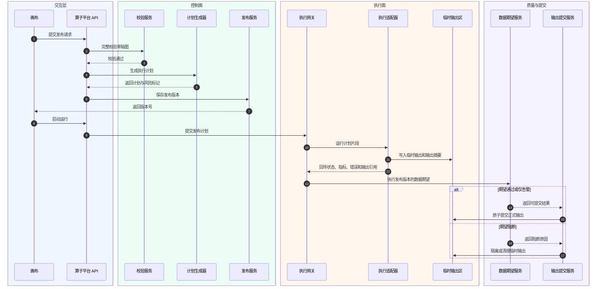

# Pipeline Builder 算子平台详细设计

## 背景、问题、目标与范围

自研平台要复刻并对齐 Pipeline Builder 的算子能力，不能止步于“有一份函数清单”。当前仓库已经沉淀 expression final bundle 和 transform final bundle，概要设计也已经明确平台采用“算子注册中心 + 类型化中间表示 + 执行适配器”的总体架构。接下来需要把这个架构拆成可执行的软件设计，使研发团队可以按模块建表、定义接口、实现校验、生成计划、接入执行适配器，并建立测试和上线检查。

本详细设计与 `docs/pipeline-builder-operator-platform-architecture-design.md` 并列，并按架构评审意见补强。本文的核心问题是：怎样把现有清单转成平台内可版本化、可校验、可执行、可观测的算子能力。本文的结论是：第一阶段先建设注册中心、导入暂存表和只读目录；第二阶段落地表达式抽象语法树（abstract syntax tree）与类型系统；第三阶段落地批处理高频转换算子；第四阶段落地输出、数据期望和发布版本；第五阶段扩展地理空间、流式、媒体和自定义函数。

本文覆盖需求承接、功能描述、质量指标、技术方案决策、详细方案设计、关键 API、存储设计、测试场景、配置、调试监控、兜底策略、质量 checklist、安全 checklist、参考资料和评审结论。本文不替代后续实现任务，不定义前端视觉交互细节，也不承诺一次实现全部 424 个已有清单条目。

## 模板来源与证据边界

本文参照飞书模板“智能云- xxx 系统 xxx 功能详细设计模版”组织，模板链接为 `https://li.feishu.cn/wiki/wikcnxqIEkhxQICkave0kbLSpih?from=from_copylink`。飞书命令行工具版本为 `1.0.39`，可读取 wiki 节点元信息；正文读取需要的 `docx:document:readonly` 权限仍在审批中，因此本次模板正文结构通过用户已登录的 Chrome 浏览器读取。浏览器可见目录确认详细设计模板包括“需求承接、功能描述及质量指标、技术方案决策、详细方案设计、关键 API、存储设计、关键测试场景、配置说明、调试监控策略、兜底策略、质量设计 checklist、安全设计 checklist、参考资料、评审结论”等章节。

Palantir 官方文档是第一事实来源，当前仓库 final bundle 是第二事实来源。本文中 API、表结构、状态机、配置和测试路径属于工程设计建议，需要在后续实现中通过代码、自动化测试和真实运行验证。

## 修订记录

| 日期 | 修订版本 | 修改章节 | 修改描述 | 修改人 |
| --- | --- | --- | --- | --- |
| 2026-05-23 | V1.3 | 2、4、5、6 | 根据架构评审补齐能力边界、OperatorContract、输出两阶段提交、版本状态、幂等并发、血缘权限和 Palantir 证据分层 | Codex |
| 2026-05-23 | V1.2 | 4.1.5 | 统一发布与运行流程图视觉语言，使用泳道和自动编号增强评审可读性 | Codex |
| 2026-05-23 | V1.1 | 4.1.6 | 增加人和 AI 共同理解方案时使用的共识契约、最小上下文包和评审口径 | Codex |
| 2026-05-23 | V1.0 | 全文 | 按飞书详细设计模板拆分形成平台算子能力详细设计 | Codex |

## 术语清单

| 术语/缩略语 | 英文全称 | 中文解释 |
| --- | --- | --- |
| 算子定义 | operator definition | 表示一个稳定算子族，保存 slug、层级、分类、来源和生命周期 |
| 算子版本 | operator version | 表示某个算子在平台内可发布、可废弃、可执行的版本 |
| 参数模式 | parameter schema | 描述算子参数名、类型、必填性、默认值、可变参数和参数种类 |
| 表达式节点 | expression node | 平台内部表达式抽象语法树中的节点 |
| 转换节点 | transform node | 平台内部以数据流为输入输出的转换算子节点 |
| 计划片段 | plan fragment | 一个转换节点或表达式子树编译后的物理执行片段 |
| 数据期望 | data expectation | 绑定到输出节点的数据质量要求，例如主键、行数和模式稳定性 |
| 适配器键 | adapter key | 标识执行适配器的稳定字符串，例如 `spark-batch` 或 `file-worker` |

## 1. 需求承接

本详细设计承接概要设计中的架构级结论，并把它拆成可实现模块。架构级文档链接为 `docs/pipeline-builder-operator-platform-architecture-design.md`。需求来源包括 Palantir 官方 Pipeline Builder 文档、当前仓库 `docs/raw/pipeline-builder-operators/artifacts/transform-final/` 与 `docs/raw/pipeline-builder-operators/artifacts/pb-expression-final/` 两套最终统一产物，以及 `docs/transform-expression-comparison.md` 对值层和结构层关系的判断。

本功能的需求边界是“算子平台能力底座”，不是完整 Pipeline Builder 产品复刻。第一阶段需要让平台能可靠管理算子目录和版本；第二阶段需要让表达式能被结构化保存、校验和预览；第三阶段需要让高频转换算子能进入批处理执行；第四阶段需要让输出质量闭环可用。地理空间、流式、媒体和自定义函数作为后续扩展，但本设计会保留它们的模型位置，避免后续返工。

## 2. 功能描述及质量指标

### 2.1 主要功能描述

平台提供算子目录、流水线草稿、校验、预览、发布、运行、数据期望和审计八类能力。算子目录从当前仓库 final bundle 导入候选条目，经过规格化后形成平台内的算子定义、算子版本和参数模式。流水线草稿保存输入、转换节点、表达式节点、输出节点和数据期望。校验服务根据算子注册中心、输入模式和运行环境返回结构化错误。预览服务在采样数据上运行临时计划。发布服务生成不可变流水线版本和执行计划。运行服务把执行计划交给适配器。数据期望服务在输出后执行质量检查。审计服务记录变更、运行和质量事件。

能力边界上，MVP 优先对齐 Pipeline Builder 交互式表达式函数和转换算子。自定义表达式和自定义转换先按“由现有表达式或转换图组合出的可复用能力”建模；只有代码式 Transform API 或确需执行用户代码的扩展才进入代码沙箱运行时。Batch、Faster、Streaming 在平台内保存为 `supported_in` 能力标签，不直接等同于 Spark、Flink 或任何 Palantir 内部执行引擎。

最小可用版本建议覆盖 20 到 30 个高频表达式函数和 5 到 8 个高频转换算子。表达式侧优先覆盖数值、布尔、字符串、时间、类型转换、条件分支、JSON 解析和数组基础函数。转换侧优先覆盖 `Aggregate`、`Mapping join`、普通 Join、Union by name、CSV 或 Excel 文件解析。选择这些能力的原因是它们覆盖字段清洗、聚合、连接和文件导入四类常见数据集成场景，也能验证表达式嵌入转换算子的模型是否成立。

### 2.2 需达成的质量指标

| 指标 | 目标 | 验证方式 |
| --- | --- | --- |
| 算子导入唯一性 | `slug + version + layer` 无重复 | 导入任务单元测试和数据库唯一索引 |
| 草稿保存结构校验 | 非法图结构 100% 返回结构化错误 | 图结构测试覆盖孤立节点、环、缺失输入、重复输出 |
| 类型校验覆盖 | 最小可用版本算子 100% 有参数类型规则 | 类型系统单元测试覆盖合法和非法输入 |
| 预览可用性 | MVP 范围内小样本预览成功率大于 95% | 适配器集成测试和预览运行记录 |
| 发布可复现性 | 每个发布版本都有计划哈希和算子版本快照 | 发布表字段与审计事件校验 |
| 错误可定位性 | 平台错误 100% 有错误码、节点路径和建议动作 | 错误码快照测试和接口契约测试 |
| 质量闭环 | Pipeline Builder 对齐层支持主键和行数期望，自研增强层支持模式稳定性 | 数据期望测试覆盖通过、失败、仅告警 |

## 3. 技术方案决策

候选方案有三种。方案一是按函数名直接实现，把每个 Palantir 条目映射成后端函数或 SQL 模板。它的优点是短期快，缺点是元数据、参数、类型和运行代码耦合，后续版本治理困难。方案二是注册中心驱动的类型化中间表示，先定义平台语义，再由计划器和适配器执行。它的优点是边界清晰、可扩展、可测试，缺点是前期需要建设类型系统和计划生成器。方案三是按执行引擎插件化，把 Spark、Flink、文件解析和地理空间分别做独立插件。它的优点是专项实现灵活，缺点是容易形成多个互不兼容的算子模型。

结论选择方案二，并吸收方案三的适配器思想。也就是说，控制面坚持统一注册中心和中间表示，执行面允许不同适配器独立演进。

| 方案 | 功能完整性 | 扩展难易程度 | 技术成熟度 | 生态活跃度 | 落地工作量 | 可借鉴的点 | 开源/商业 |
| --- | --- | --- | --- | --- | --- | --- | --- |
| 方案一：直接函数实现 | 中 | 低 | 高 | 高 | 低 | 快速验证少数函数 | 自研实现 |
| 方案二：注册中心 + 类型化中间表示 + 适配器 | 高 | 高 | 中 | 中 | 中 | 统一模型、版本治理、执行解耦 | 自研实现 |
| 方案三：执行引擎插件化 | 中 | 中 | 中 | 中 | 中 | 适配器独立部署和专项优化 | 自研实现 |

## 4. 详细方案设计

### 4.1 方案设计

#### 4.1.1 模块拆分

| 模块 | 职责 | 第一阶段交付 |
| --- | --- | --- |
| `operator-registry` | 管理算子定义、版本、参数、状态、来源和证据边界 | 导入 final bundle，提供目录查询 |
| `pipeline-graph` | 管理草稿图、发布图、节点和输出 | 保存草稿、读取草稿、发布快照 |
| `type-system` | 类型描述、参数校验、表达式类型推导、模式推导 | 支持基础类型、列引用、函数调用和聚合参数 |
| `plan-generator` | 把通过校验的图生成执行计划 | 生成 Spark 批处理计划片段 |
| `execution-gateway` | 选择适配器、提交预览/测试/正式运行、收集状态 | 对接 Spark 批处理适配器 |
| `quality-check` | 管理单元测试和数据期望 | 对齐层支持主键、行数；自研增强层支持模式稳定性 |
| `output-commit` | 管理临时输出、质量阻断、正式提交、隔离和回滚 | 支持两阶段输出提交和提交审计 |
| `audit` | 记录发布、运行、错误、质量和血缘事件 | 写入审计表和日志 |

能力边界在详细设计中按下表落地。

| 能力 | 平台对象 | 是否进入 MVP | 设计约束 |
| --- | --- | --- | --- |
| 表达式函数 | `ExpressionNode` + `OperatorContract` | 是 | 只能输出值层结果，随引用它的转换节点进入计划 |
| Pipeline Builder 交互式转换算子 | `TransformNode` + `PlanFragment` | 是 | 改变整表或数据流结构，支持节点预览和 schema 推导 |
| 自定义表达式 | 组合式 `OperatorDefinition` | 部分 | 不默认执行用户代码，优先展开成受控表达式树 |
| 自定义转换 | 子图模板或组合式转换版本 | 后续 | 发布时锁定模板版本和内部算子版本 |
| Transform API 代码式转换 | 外部互操作或代码运行时节点 | 后续 | 只保存接口契约、版本、血缘和权限边界，不把它误写成低代码算子默认实现 |

#### 4.1.2 算子生命周期

算子生命周期主要作用于 `operator_version`，因为同一个算子族可能同时存在 V1 已废弃、V2 已验证、V3 仍在实现中的情况。`operator_definition` 只保存家族级可见性和归档状态，不能替代版本状态。

| 状态 | 含义 | 进入条件 | 退出条件 |
| --- | --- | --- | --- |
| `DISCOVERED` | 已从 Palantir 官方文档或仓库清单发现 | final bundle 导入或人工新增 | 参数和类型完成规格化 |
| `SPECIFIED` | 参数、类型、运行环境和来源已整理 | 人工审核或规则补齐 | 至少一个适配器实现 |
| `IMPLEMENTED` | 至少一个执行适配器可运行 | 适配器集成测试通过 | 自动化测试和样例验证通过 |
| `VERIFIED` | 可进入生产目录 | 单元、集成、质量检查通过 | 被废弃或发现阻断缺陷 |
| `DEPRECATED` | 已废弃，不允许新建引用 | 兼容性策略或替代版本确定 | 历史流水线完成迁移后下线 |

状态只能按受控流程变更，不能通过直接改库完成。发布态流水线引用的是 `operator_version.id`，不是展示名称，避免后续升级改变历史行为。每次版本状态变更都写入 `operator_version_state_history`，记录操作者、原因、前后状态和关联验证证据。

#### 4.1.3 流水线中间表示

中间表示使用 JSON 保存，服务端映射为强类型对象。最小结构如下。

```json
{
  "graphVersion": "1",
  "mode": "BATCH",
  "inputs": [
    {
      "id": "dataset_orders",
      "kind": "DATASET",
      "rid": "ri.foundry.main.dataset.orders",
      "schemaRef": "schema_orders_v1"
    }
  ],
  "nodes": [
    {
      "id": "node_aggregate_orders",
      "kind": "TRANSFORM",
      "operator": {
        "slug": "aggregateV1",
        "layer": "TRANSFORM",
        "versionConstraint": "1"
      },
      "inputs": [
        {
          "port": "dataset",
          "ref": "dataset_orders"
        }
      ],
      "arguments": {
        "groupByColumns": [
          {
            "type": "COLUMN_REF",
            "name": "customer_id"
          }
        ],
        "aggregations": [
          {
            "type": "CALL",
            "function": "alias",
            "arguments": {
              "alias": {
                "type": "LITERAL",
                "value": "total_amount"
              },
              "expression": {
                "type": "CALL",
                "function": "sum",
                "arguments": {
                  "expression": {
                    "type": "COLUMN_REF",
                    "name": "amount"
                  }
                }
              }
            }
          }
        ]
      }
    }
  ],
  "outputs": [
    {
      "id": "output_orders",
      "inputRef": "node_aggregate_orders",
      "kind": "DATASET",
      "expectations": [
        {
          "type": "ROW_COUNT",
          "min": 1
        }
      ]
    }
  ]
}
```

输出节点先以 `DATASET` 作为 MVP 默认类型，同时在模型中保留 `VIRTUAL_TABLE`、`OBJECT_TYPE`、`LINK_TYPE`、`TIME_SERIES`、`GEOTEMPORAL` 和 `EXTERNAL_EXPORT` 等占位。除 `DATASET` 外的输出类型在本阶段只定义契约位置和血缘字段，不承诺第一版执行适配器全部实现。

表达式节点不保存任意 SQL 或脚本，只保存受控语义树。转换节点可以包含表达式节点作为参数，表达式节点不能包含转换节点。这个规则是平台值层和结构层的核心边界。

草稿态和发布态的算子引用必须区分。草稿态可以使用 `slug + layer + versionConstraint`，方便用户在目录中选择或后续按兼容策略升级；发布态必须解析为稳定的 `operatorVersionId`，并把参数模式、适配器版本、来源 URL、兼容策略和字段级质量信号写入计划快照。这样既保留编辑体验，也保证历史运行可复现。

正式算子必须补齐 `OperatorContract`，否则只能停留在 `DISCOVERED` 或 `SPECIFIED`，不能进入生产目录。契约字段如下。

| 契约字段 | 含义 | 用途 |
| --- | --- | --- |
| `inputPorts` / `outputPorts` | 输入输出端口、是否可变长、端口数据域 | 支撑画布连线、图结构校验和 schema 推导 |
| `typeVariables` / `typeBounds` | 泛型变量、类型边界、返回类型表达式 | 支撑表达式和转换参数类型推导 |
| `nullabilityPolicy` | 空值传播、空值拒绝或默认值语义 | 避免不同适配器对空值处理不一致 |
| `parameterKinds` | 列、表达式、数据集、字面量、结构化参数 | 支撑前端表单和后端校验共用规则 |
| `aggregationSemantics` | 行级、聚合、窗口或生成器语义 | 防止聚合函数出现在非法位置 |
| `supportedIn` | Batch、Faster、Streaming 等能力标签 | 只表示可见能力，不直接绑定具体引擎 |
| `previewSupport` | 是否支持节点预览、子图预览、采样限制 | 支撑预览 SLA 和错误提示 |
| `schemaInference` | 输出 schema 推导规则和失败条件 | 支撑发布前校验和下游输出契约 |
| `costTags` | shuffle、stateful、file-scan、geo-join 等成本信号 | 支撑发布风险提示和资源策略 |
| `compatibility` | 兼容策略、废弃策略、迁移建议 | 支撑版本升级和历史运行复现 |
| `goldenCases` | 最小正例、反例、边界样例 | 支撑导入晋级、计划器和适配器回归测试 |

#### 4.1.4 校验流程

校验流程分四层。第一层是图结构校验，检查节点引用、输入输出端口、环和孤立输出。第二层是算子引用校验，检查 slug、版本、状态和运行环境。第三层是参数和类型校验，检查必填参数、参数种类、列引用、表达式返回类型和聚合位置。第四层是发布校验，检查权限、适配器可用性、数据期望、单元测试和输出策略。

结构化错误格式如下。

```json
{
  "code": "TYPE_MISMATCH",
  "severity": "ERROR",
  "nodeId": "node_aggregate_orders",
  "argumentPath": "$.arguments.aggregations[0].expression",
  "message": "sum 的输入必须是数值类型，但 amount 推导为 String",
  "suggestion": "先使用类型转换表达式，或选择数值列作为聚合输入"
}
```

#### 4.1.5 发布与运行流程

发布前必须完整校验草稿图。校验通过后，发布服务生成 `pipeline_version`，锁定 `graph_json`、`operator_version`、输入输出 schema hash、数据期望和执行计划。执行计划包含计划片段、引擎、资源提示、风险标记和适配器版本。正式运行只接受发布版本，不接受草稿图。执行适配器先写临时输出，数据期望通过后由输出提交服务提交到正式输出；质量阻断时只能隔离或清理临时输出，不能覆盖下游可见数据。



#### 4.1.6 人和 AI 共同理解的设计契约

为了让方案设计能被人类评审者和 AI 工具稳定理解，后续实现、拆任务、生成测试、补接口时都应遵循同一份设计契约。这里的契约不是额外流程，而是把架构图中的边界转成可检查的文本规则。

| 共识对象 | 人类评审时关注的问题 | AI 辅助实现时必须保留的约束 |
| --- | --- | --- |
| 算子定义 | 这个条目是否只是被发现，还是已经能执行 | 不得把 `DISCOVERED` 当成可生产使用状态 |
| 算子版本 | 历史流水线是否会被新版本影响 | 发布态必须引用稳定版本 ID，不能只引用展示名 |
| 参数模式 | 参数是否能被前端表单、后端校验和执行计划共同理解 | 参数种类必须显式区分列、表达式、数据集、字面量和结构化参数 |
| 表达式节点 | 表达式能否定位错误并跨引擎编译 | 不得保存任意 SQL 或脚本片段，只能保存受控抽象语法树 |
| 转换节点 | 节点是否改变数据流结构 | 转换节点可以包含表达式，表达式不能包含转换节点 |
| 执行计划 | 发布版本能否复现 | 计划发布后不可变，必须保存计划哈希和算子版本快照 |
| 执行适配器 | 运行失败能否定位到具体引擎和计划片段 | 适配器只接收已校验计划，不直接读取或修改草稿图 |
| 数据期望 | 质量失败是否会影响输出 | 失败策略必须显式配置为阻断、告警或记录审计 |

AI 使用本方案辅助后续实现时，最小上下文包应包括三类材料：第一类是概要设计中的总体共识图、4+1 视图和关键技术链路；第二类是本文中的 API、存储表、状态机、错误格式、配置和测试场景；第三类是当前仓库的 `docs/raw/pipeline-builder-operators/artifacts/transform-final/README.md` 与 `docs/raw/pipeline-builder-operators/artifacts/pb-expression-final/README.md`。缺少任意一类材料时，AI 只能生成局部草案，不能声称已经完成可交付实现。

人类评审时可以按三句话判断方案是否被共同理解。第一，所有人是否都认可“注册中心回答有哪些能力，类型系统回答能否组合，计划生成器回答如何运行，适配器回答在哪运行”。第二，所有人是否都认可“草稿态、发布态、运行态不能混用”。第三，所有人是否都认可“表达式是值层，转换算子是结构层，表达式只能被转换算子引用，不能反向包含转换算子”。如果任意一句无法达成一致，应回到概要设计 3.2 的图重新对齐，而不是继续推进实现。

### 4.2 关键 API 接口

API 以控制面职责划分。HTTP 状态码表示请求级结果，业务校验错误放在 `errors` 数组。需要幂等的写操作必须使用客户端请求 ID、`Idempotency-Key` 或版本号保护；重复请求应返回第一次成功创建的资源，而不是创建新版本或新运行。

| 接口 | 方法 | 请求要点 | 响应要点 |
| --- | --- | --- | --- |
| `/api/operators` | `GET` | `layer`、`category`、`mode`、`status`、`keyword` | 算子列表、版本摘要、实现状态 |
| `/api/operators/{layer}/{slug}` | `GET` | `layer` 必填 | 算子详情、版本、参数、来源、示例 |
| `/api/operator-imports` | `POST` | final bundle 路径或上传批次 ID | 导入批次、候选数量、错误数量 |
| `/api/pipelines` | `POST` | 名称、空间、运行模式 | 草稿 ID |
| `/api/pipelines/{id}/graph` | `PUT` | `graph_json`、`baseRevision`、`clientRequestId` | 新 revision、轻量校验结果 |
| `/api/pipelines/{id}/validate` | `POST` | 校验级别、目标节点可选 | 结构化错误、推导模式 |
| `/api/pipelines/{id}/preview` | `POST` | 节点 ID、采样策略、临时参数 | 预览 run ID、样本、schema、错误 |
| `/api/pipelines/{id}/tests` | `POST` | 输入样例、期望输出或断言 | 测试 ID、校验结果 |
| `/api/pipelines/{id}/publish` | `POST` | 草稿 revision、发布说明、`Idempotency-Key` | 版本 ID、计划哈希、风险标记 |
| `/api/pipeline-versions/{versionId}/runs` | `POST` | 运行类型、资源参数、`Idempotency-Key` | run ID |
| `/api/runs/{runId}` | `GET` | 无 | 状态、指标、错误、输出、质量结果 |

并发控制规则如下：草稿保存使用 `baseRevision` 做比较并交换（compare and swap），版本不匹配返回 `REVISION_CONFLICT`；发布和运行使用 `Idempotency-Key + resource scope` 唯一约束，网络超时后的重试返回已创建的 `pipeline_version` 或 `run_id`；调度系统重试必须传入稳定幂等键，避免同一发布版本被重复运行。

算子详情响应示例：

```json
{
  "slug": "aggregateV1",
  "layer": "TRANSFORM",
  "name": "Aggregate",
  "categories": ["Aggregate", "Popular"],
  "sourceUrl": "https://www.palantir.com/docs/foundry/pipeline-builder/functions-index/",
  "status": "VERIFIED",
  "versions": [
    {
      "version": "1",
      "supportedIn": ["BATCH", "FASTER"],
      "adapterKeys": ["spark-batch"],
      "status": "VERIFIED",
      "parameters": [
        {
          "name": "dataset",
          "typeExpr": "Table",
          "required": true,
          "parameterKind": "DATASET"
        },
        {
          "name": "aggregations",
          "typeExpr": "List<Expression<AnyType>>",
          "required": true,
          "parameterKind": "EXPRESSION_LIST"
        }
      ]
    }
  ]
}
```

执行适配器采用内部契约而不是直接暴露引擎 API。适配器契约的最小方法如下。

| 方法 | 输入 | 输出 | 关键约束 |
| --- | --- | --- | --- |
| `validatePlan` | `ExecutionPlan`、适配器版本、资源提示 | 可执行性结果、错误码、资源风险 | 发布前调用，失败时不允许发布 |
| `preview` | 临时预览计划、采样策略、权限上下文 | 样本、schema、指标、错误 | 只允许读取授权输入，不写正式输出 |
| `execute` | 发布计划、run ID、输出 staging URI | 运行状态、事件、临时输出引用 | 必须幂等，不能直接覆盖正式输出 |
| `cancel` | run ID、adapter run ID | 取消结果和可恢复状态 | 取消失败需要返回可解释状态 |
| `collectMetrics` | run ID、fragment ID | 行数、耗时、资源、错误摘要 | 指标标签必须包含 `adapter_key` 和版本 |
| `emitEvent` | 结构化事件 | 事件写入结果 | 事件失败要可重试，不影响输出提交事务 |

适配器错误分为用户配置错误、数据质量错误、平台内部错误、适配器不可用、资源不足和权限错误六类。控制面只根据错误分类决定重试、提示、阻断或降级，不能解析适配器私有日志来判断业务语义。

### 4.3 存储设计

建议使用关系型数据库承载控制面元数据，`jsonb` 或等价结构保存草稿图、计划和扩展配置。以下为逻辑表设计，物理字段类型可按平台规范调整。

| 表 | 关键字段 | 约束 | 说明 |
| --- | --- | --- | --- |
| `operator_import_batch` | `id`、`source_type`、`source_path`、`status`、`summary_json`、`created_by`、`created_at` | `id` 主键 | 保存清单导入批次 |
| `operator_staging` | `id`、`batch_id`、`raw_slug`、`raw_json`、`normalized_json`、`quality_flags` | `batch_id` 外键 | 保存候选清单，不直接对外发布 |
| `operator_definition` | `id`、`slug`、`layer`、`name`、`categories`、`source_url`、`evidence_type`、`definition_status` | `slug + layer` 唯一 | 保存算子族和家族级可见性 |
| `operator_version` | `id`、`operator_id`、`version`、`status`、`supported_in`、`return_type`、`adapter_keys`、`compatibility`、`deprecated_at` | `operator_id + version` 唯一 | 保存可引用版本和版本生命周期 |
| `operator_version_state_history` | `id`、`version_id`、`from_status`、`to_status`、`reason`、`evidence_ref`、`changed_by`、`changed_at` | `version_id` 索引 | 保存状态晋级、回退和废弃记录 |
| `operator_parameter` | `id`、`version_id`、`name`、`type_expr`、`required`、`default_expr`、`position`、`parameter_kind` | `version_id + name` 唯一 | 保存参数模式 |
| `operator_contract` | `id`、`version_id`、`contract_json`、`contract_hash`、`golden_cases_uri`、`created_at` | `version_id` 唯一 | 保存输入输出、类型、空值、预览、schema 推导、成本和兼容契约 |
| `pipeline_draft` | `id`、`workspace_id`、`name`、`mode`、`revision`、`graph_json`、`created_by`、`updated_by` | `id` 主键 | 保存编辑态流水线 |
| `pipeline_version` | `id`、`draft_id`、`version`、`graph_json`、`plan_json`、`plan_hash`、`client_request_id`、`published_by`、`published_at` | `draft_id + version`、`draft_id + client_request_id` 唯一 | 保存发布态 |
| `validation_result` | `id`、`target_type`、`target_id`、`severity`、`code`、`message`、`path`、`created_at` | 按目标索引 | 保存校验结果 |
| `pipeline_run` | `id`、`pipeline_version_id`、`run_type`、`status`、`client_request_id`、`started_at`、`finished_at`、`summary_json` | `id` 主键，`pipeline_version_id + run_type + client_request_id` 唯一 | 保存预览、测试和正式运行 |
| `run_event` | `id`、`run_id`、`event_type`、`payload_json`、`created_at` | `run_id` 索引 | 保存结构化运行事件 |
| `data_expectation` | `id`、`pipeline_version_id`、`output_node_id`、`expectation_type`、`config_json`、`severity` | 按输出索引 | 保存输出质量要求 |
| `expectation_result` | `id`、`run_id`、`expectation_id`、`status`、`message`、`metrics_json` | `run_id` 索引 | 保存质量检查结果 |
| `run_output_commit` | `id`、`run_id`、`output_node_id`、`staging_uri`、`target_uri`、`status`、`commit_key`、`message`、`created_at`、`committed_at` | `commit_key` 唯一 | 保存临时输出、正式提交、隔离、回滚状态 |
| `pipeline_lineage` | `id`、`run_id`、`pipeline_version_id`、`input_refs`、`output_refs`、`column_lineage_json`、`schema_hashes`、`permission_marks` | `run_id` 索引 | 保存输入输出、列级依赖、schema 和权限标记传播 |

关键索引包括：`operator_definition(slug, layer)`、`operator_version(operator_id, version)`、`operator_version(status)`、`operator_version(supported_in)`、`pipeline_draft(workspace_id, updated_at)`、`pipeline_version(draft_id, version)`、`pipeline_run(pipeline_version_id, started_at)`、`run_event(run_id, created_at)`、`run_output_commit(run_id, output_node_id)`。如果草稿图、契约、计划或血缘很大，应把完整 JSON 放到对象存储，数据库只保存 URI、哈希和摘要。

### 4.4 关键测试场景设计

测试按导入、校验、编译、执行和质量五层设计。

| 场景 | 输入 | 预期 |
| --- | --- | --- |
| final bundle 导入 | expression 335 条、transform 89 条 | staging 数量一致，重复 slug 被报告，字段级质量信号保留 |
| 算子晋级 | staging 中的 `aggregateV1` | 生成算子定义、版本和参数，状态为 `SPECIFIED` 或更高 |
| 算子契约缺失 | `operator_contract` 未补齐的算子版本 | 不能晋级到 `VERIFIED`，目录标识为不可生产 |
| 图结构错误 | 节点引用不存在的草稿图 | 返回 `NODE_REF_NOT_FOUND`，路径指向错误输入端口 |
| 类型不匹配 | `sum(StringColumn)` | 返回 `TYPE_MISMATCH`，建议使用类型转换或数值列 |
| 运行模式不支持 | Streaming 图中使用 Batch-only 文件解析 | 返回 `OPERATOR_MODE_UNSUPPORTED` |
| 适配器策略阻断 | 租户未灰度启用某适配器 | 返回 `ADAPTER_POLICY_BLOCKED`，不生成发布版本 |
| 批处理聚合预览 | 小样本订单数据 + Aggregate | 返回输出 schema 和样本行 |
| Join 列冲突 | 左右表存在同名非 key 列 | 返回列冲突提示或按配置添加前缀 |
| 数据期望通过 | 输出主键唯一且无空值 | expectation result 为 `PASSED` |
| 数据期望失败 | 输出主键重复 | expectation result 为 `FAILED`，临时输出进入 `QUARANTINED` 或被清理 |
| 输出提交幂等 | 适配器或提交服务重复提交同一 `commit_key` | 返回既有提交结果，不重复覆盖输出 |
| 发布幂等 | 相同 `Idempotency-Key` 重复发布同一 revision | 返回同一个 `pipeline_version` |
| 运行幂等 | 调度系统重复提交同一运行请求 | 返回同一个 `run_id` |
| 血缘写入 | Aggregate 从 `amount` 派生 `total_amount` | 记录输入 RID、输出 RID、schema hash 和列级派生关系 |
| 算子版本升级 | 旧流水线引用 V1，新目录存在 V2 | 历史发布版本仍引用 V1，新草稿可选择 V2 |

自动化测试分层为单元测试、契约测试、适配器集成测试和端到端小样本测试。单元测试覆盖类型系统、参数校验、状态机、输出提交状态机和计划片段生成。契约测试覆盖 API 请求响应、错误码快照、`OperatorContract` 和 `AdapterContract`。适配器集成测试使用小型输入数据运行批处理适配器，并验证临时输出不会在质量失败时覆盖正式输出。端到端测试从导入算子、创建草稿、校验、预览、发布、运行、数据期望、输出提交和血缘写入完整串联。

### 4.5 配置说明

平台需要配置算子导入、执行适配器、预览采样、发布策略和数据期望策略。示例配置如下。

```yaml
operatorPlatform:
  registry:
    import:
      expressionBundlePath: artifacts/pb-expression-final/expression_inventory.json
      transformBundlePath: artifacts/transform-final/transform_inventory.jsonl
      defaultEvidenceType: repository-final-bundle
  validation:
    failOnUnknownOperator: true
    failOnUnsupportedMode: true
    maxErrorsPerGraph: 200
  preview:
    defaultSampleRows: 1000
    maxSampleRows: 10000
    timeoutSeconds: 30
  publish:
    requireValidationPass: true
    requirePlanHash: true
    lockOperatorVersion: true
  adapters:
    sparkBatch:
      enabled: true
      adapterKey: spark-batch
      queue: pipeline-preview
    flinkStreaming:
      enabled: false
      adapterKey: flink-streaming
    fileWorker:
      enabled: true
      adapterKey: file-worker
    mediaWorker:
      enabled: false
      adapterKey: media-adapter
  expectations:
    defaultFailurePolicy: BLOCK_OUTPUT
  outputCommit:
    stagingTtlHours: 72
    defaultFailureAction: QUARANTINE
```

配置变更需要记录审计。影响发布或运行行为的配置，例如 `failOnUnsupportedMode`、`lockOperatorVersion` 和 `defaultFailurePolicy`，不能只通过临时环境变量修改，应进入配置中心并保留版本。

### 4.6 调试、监控策略

调试设计要求每个校验错误、计划片段和运行事件都有可追踪 ID。前端展示错误时使用 `nodeId + argumentPath` 定位；后端日志使用 `traceId + pipelineId + versionId + runId` 串联。执行计划保存 `plan_hash`，适配器日志记录 `adapter_key` 和 `plan_fragment_id`。

监控指标分为 API、校验、执行和质量四类。

| 指标 | 标签 | 用途 |
| --- | --- | --- |
| `operator_api_latency_ms` | `endpoint`、`status` | 观察控制面接口延迟 |
| `operator_validation_errors_total` | `code`、`layer`、`mode` | 识别高频配置错误 |
| `pipeline_preview_duration_seconds` | `adapter_key`、`status` | 观察预览耗时和失败率 |
| `pipeline_run_duration_seconds` | `adapter_key`、`mode`、`status` | 观察正式运行耗时 |
| `operator_adapter_failures_total` | `adapter_key`、`error_code` | 发现适配器故障 |
| `data_expectation_results_total` | `expectation_type`、`status` | 观察质量检查结果 |
| `pipeline_output_commit_total` | `status`、`output_type` | 观察输出提交、隔离和回滚 |
| `pipeline_lineage_write_failures_total` | `adapter_key`、`lineage_type` | 发现血缘写入失败 |

建议报警包括：控制面 5xx 错误率 5 分钟超过 2%；预览队列积压超过阈值；适配器失败率 10 分钟超过 5%；发布校验错误中平台内部错误突增；数据期望阻断数量突增；输出提交失败；临时输出长时间停留在 `STAGED`；运行事件或血缘写入失败。

### 4.7 兜底策略

兜底策略包括功能开关、版本回滚、适配器降级和输出保护。新算子、新适配器和新计划器都要有开关。某个适配器不可用时，目录查询、草稿保存和非相关算子预览仍应可用；相关节点返回明确的 `ADAPTER_UNAVAILABLE`。发布版本可以回滚到上一版本，算子目录可以把新版本从 `VERIFIED` 降回 `IMPLEMENTED` 或 `DEPRECATED`。数据期望失败默认阻断输出，确需仅告警时由项目策略显式配置。输出提交失败时，系统保留临时输出和提交记录，允许人工或自动任务按 `commit_key` 重试；若确认数据不可用，则把提交状态置为 `QUARANTINED` 或 `ROLLED_BACK` 并写入审计。

## 5. 质量设计 Checklist

结果列填写规则沿用飞书详细设计模板：`是` 表示方案满足检查项，`否` 表示不满足，`无需实现` 表示本方案不涉及，`当前暂不考虑` 表示应满足但受阶段约束后续实现。

| 方案回顾 | 提示问题 | 结果 | 备注 |
| --- | --- | --- | --- |
| 需求承接 | 是否有明确验收标准 | 是 | 已在 2.2 给出质量指标 |
| 需求承接 | 是否承接架构级设计文档 | 是 | 对应概要设计文档 |
| 技术选型 | 是否说明多方案对比和选择原因 | 是 | 已选择方案二 |
| 技术选型 | 是否保留后续扩展空间 | 是 | 适配器支持批处理、流式、文件、地理空间、媒体 |
| 异常场景处理 | 是否覆盖参数、类型、模式、运行环境错误 | 是 | 已定义结构化错误和测试场景 |
| 系统接口与数据交互 | 是否分析上下游服务调用关系 | 是 | API、校验、发布、执行流程已拆分 |
| 系统接口与数据交互 | 接口字段含义和范围是否清晰 | 是 | 关键接口给出请求响应要点和示例 |
| 存储设计 | 是否说明表结构、索引和数据影响 | 是 | 已给出逻辑表与关键索引 |
| 存储设计 | 是否考虑缓存、过期和 key 设计 | 是 | 概要设计说明目录缓存和版本快照 |
| 配置 | 是否涉及配置变更 | 是 | 已给出配置样例和审计要求 |
| 调试、监控策略 | 是否便于调试和定位 | 是 | 错误路径、traceId、plan hash 已定义 |
| 调试、监控策略 | 是否有上线后验证指标 | 是 | 已定义 API、校验、执行、质量指标 |
| 实车验证 | 是否需要实车验证 | 无需实现 | 本功能为数据平台软件能力，不涉及车辆实测 |
| 兜底策略 | 出现问题是否可以恢复 | 是 | 版本回滚、开关、适配器降级和输出保护已设计 |

方案质量分按模板规则计算时，本方案当前有效检查项均为 `是` 或 `无需实现`。后续实现阶段需要把 checklist 从设计自查转成代码和运行验证，不能用本文替代实现验收。

## 6. 安全设计 Checklist（试运行）

| 方案回顾 | 提示问题 | 结果 | 备注 |
| --- | --- | --- | --- |
| 日志审计 | 是否记录访问日志 | 是 | API、发布、运行和质量事件均需记录 |
| 日志审计 | 日志是否便于安全审计 | 是 | 包含操作者、版本、计划哈希和运行 ID |
| 访问控制 | 是否区分编辑、发布、运行和管理权限 | 是 | 权限模型在概要设计和详细流程中体现 |
| 访问控制 | 是否按数据权限控制预览和运行 | 是 | 输入、预览、输出都需要权限校验 |
| 访问控制 | 是否定义资源层级和授权检查点 | 是 | 覆盖 workspace、pipeline、version、dataset、output、operator version |
| 接口安全 | 是否避免越权访问 | 是 | API 需按 workspace、pipeline、version 授权 |
| 接口安全 | 是否禁止未授权接口文档访问 | 是 | 生产环境接口文档按平台规范受控 |
| 协议安全 | HTTP 业务对外接口是否使用 HTTPS | 是 | 由平台网关统一承担 |
| 协议安全 | 内部证书和密钥是否托管 | 是 | 按平台密钥管理能力承接 |
| 表达式安全 | 是否避免任意代码注入 | 是 | 表达式只允许受控抽象语法树 |
| 自定义函数安全 | 是否限制依赖、网络、文件和资源 | 是 | 自定义函数运行时需沙箱化 |
| 文件解析安全 | 是否限制文件大小、路径和格式 | 是 | 文件适配器需要白名单和大小限制 |
| 数据保护 | 错误样本是否可能泄露敏感数据 | 是 | 错误样本落盘和展示需脱敏或权限控制 |
| 数据治理 | 是否保存血缘和权限标记传播 | 是 | `pipeline_lineage` 保存输入输出、列级依赖、schema hash 和 permission marks |

## 7. 参考资料

- 概要设计：`docs/pipeline-builder-operator-platform-architecture-design.md`
- Palantir Pipeline Builder Overview: https://www.palantir.com/docs/foundry/pipeline-builder/overview/
- Palantir Pipeline Builder Transforms Overview: https://www.palantir.com/docs/foundry/pipeline-builder/transforms-overview/
- Palantir Pipeline Builder Functions Index: https://www.palantir.com/docs/foundry/pipeline-builder/functions-index/
- Palantir Pipeline outputs: https://www.palantir.com/docs/foundry/pipeline-builder/outputs-overview/
- Palantir Data expectations: https://www.palantir.com/docs/foundry/pipeline-builder/dataexpectations-overview/
- Palantir Create custom functions: https://www.palantir.com/docs/foundry/pipeline-builder/management-create-custom-functions/
- Palantir Transforms Python API: https://www.palantir.com/docs/foundry/transforms-python/lightweight-api/
- transform 与 expression 机制对比：`docs/transform-expression-comparison.md`
- transform final bundle：`docs/raw/pipeline-builder-operators/artifacts/transform-final/README.md`
- expression final bundle：`docs/raw/pipeline-builder-operators/artifacts/pb-expression-final/README.md`
- 飞书详细设计模板：`https://li.feishu.cn/wiki/wikcnxqIEkhxQICkave0kbLSpih?from=from_copylink`

## 8. 评审结论

建议通过本详细设计，并把后续实现拆成独立任务。第一批任务建议分别覆盖注册中心导入与目录 API、表达式抽象语法树与类型系统、批处理转换算子计划器、输出与数据期望、运行审计与监控。每个实现任务都应补充测试、验证命令和灰度策略，不能用本设计文档代替代码验收。
