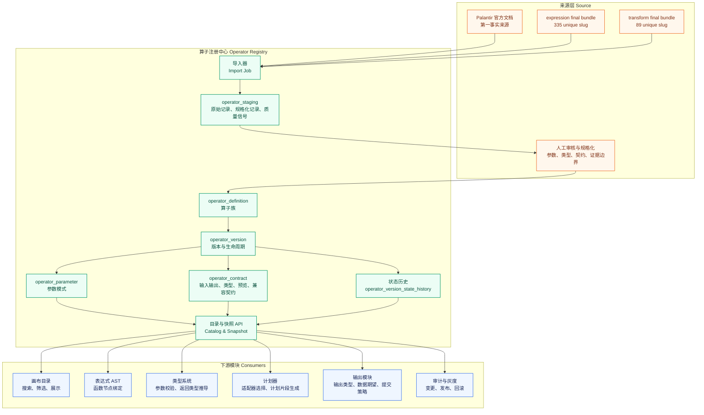
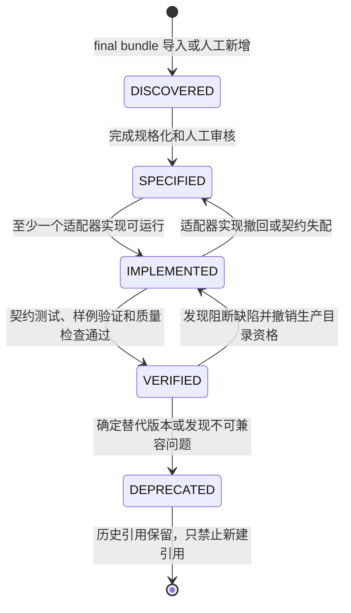

# Pipeline Builder 算子注册中心模块设计

## 背景、问题、目标和范围

当前仓库已经完成 Pipeline Builder 表达式函数（expression function）和转换算子（transform operator）的基础调研，并在 `docs/raw/pipeline-builder-operators/artifacts/pb-expression-final/` 与 `docs/raw/pipeline-builder-operators/artifacts/transform-final/` 收敛为 final bundle。上游概要设计 `docs/pipeline-builder-operator-platform-architecture-design.md` 已经把自研平台确定为“算子注册中心 + 类型化中间表示 + 执行适配器”的总体架构；上游详细设计 `docs/pipeline-builder-operator-platform-detailed-design.md` 进一步给出平台 API、表结构、校验、发布、执行和质量闭环。本文聚焦其中的算子注册中心（operator registry）关键模块。

本文的结论是：注册中心不是静态清单库，而是算子能力从“被发现”走向“可生产引用”的控制面事实源。它必须同时保存官方来源、仓库 final bundle 的字段级质量信号、人工规格化结果、版本状态、参数契约、适配器可用性和状态历史。流水线草稿、表达式抽象语法树（abstract syntax tree）、类型系统（type system）、计划器（planner）和输出模块都只能通过注册中心读取算子语义，不能各自复制一套函数目录。

当前要解决的问题有三类。第一，final bundle 已经说明有哪些候选算子，但其中的字段完整度、证据类型和解析方法不同，不能直接对外发布为生产目录。第二，Pipeline Builder 官方文档描述的是可见产品能力，不等于 Palantir 内部实现；自研平台需要保留事实边界，避免把 Batch、Faster、Streaming 等能力标签误写成具体执行引擎。第三，后续 AST、类型系统、计划器和输出模块会同时依赖算子元数据，如果没有集中注册中心，版本升级、灰度、回滚和错误定位都会发生语义漂移。

本文目标是给出注册中心的可执行设计，覆盖模块职责、上下游关系、核心领域对象、生命周期状态机、final bundle 导入与人工审核流程、API 草案、表结构草案、错误码、配置项、测试场景、灰度和回滚策略。本文不重新刷新 Palantir 官方清单，不逐条解释 424 个现有条目，也不定义某个后端框架、数据库方言或 ORM 映射细节；这些属于后续实现任务。

## 事实来源和工程推断边界

Palantir 官方材料是第一事实来源。官方 Pipeline Builder Overview 说明 Pipeline Builder 是 Foundry 的数据集成主应用，并通过后端模型在逻辑创建和执行之间承担检查、代码生成和问题反馈；Transforms Overview 说明表达式以列值为输入并输出单列，转换算子以整表为输入并返回整表，表达式可以嵌入转换配置；Functions Index 列出表达式与转换算子，并区分行级、聚合、生成器和整表转换；Outputs Overview 说明 pipeline output 可以是 dataset、virtual table 或 Ontology 组件；Data expectations 文档说明 Pipeline Builder 当前支持主键和行数两类数据期望；Custom functions 文档说明自定义表达式和自定义转换用于复用逻辑。

仓库 final bundle 是第二事实来源。`docs/raw/pipeline-builder-operators/artifacts/pb-expression-final/expression_inventory_summary.json` 记录 expression inventory 总数 335、唯一 slug 335、无重复 slug、无空 slug，字段级质量信号包括 `category_null_count = 3`、`supported_in_null_count = 1`、`empty_arguments_count = 6`、`partial_argument_record_count = 1`。这些质量计数不参与清单异常判定，也不等同于人工逐条复核结论。`docs/raw/pipeline-builder-operators/artifacts/transform-final/transform_inventory_summary.json` 记录 transform inventory 总数 89、唯一 slug 89、无空 slug、证据类型均为“事实”，支持标签统计为 Batch 73、Faster 41、Streaming 35，并记录抽取方法分布。注册中心导入时必须保存这些字段级信号和来源边界，而不是只保存条目数量。

本文中的领域对象、状态机、API、表结构、错误码、配置、灰度和回滚策略属于工程推断。它们用于自研平台落地，不声称与 Palantir 内部实现一致。尤其是 `supported_in` 只表示当前可见能力标签，适配器键（adapter key）才表示自研平台内部可执行运行时；两者必须分开建模。

## 上游和下游阅读关系

本文是注册中心模块设计，上游承接两份平台设计，下游服务于后续实现拆分。阅读顺序建议为：先读概要设计确认平台边界，再读详细设计确认统一 API、计划和执行闭环，最后读本文确认注册中心如何给其他模块提供稳定事实。

| 文档 | 与本文关系 |
| --- | --- |
| [docs/pipeline-builder-operator-platform-architecture-design.md](pipeline-builder-operator-platform-architecture-design.md) | 定义平台总体架构和控制面、执行面边界，本文承接其中的 `operator-registry` 模块 |
| [docs/pipeline-builder-operator-platform-detailed-design.md](pipeline-builder-operator-platform-detailed-design.md) | 定义平台级详细设计，本文把其中注册中心部分展开到可实现对象、流程和接口 |
| [artifacts/pb-expression-final/README.md](artifacts/pb-expression-final/README.md) | 定义 expression final bundle 的正式文件、过程文件边界和阅读顺序 |
| [artifacts/transform-final/README.md](artifacts/transform-final/README.md) | 定义 transform final bundle 的正式文件、过程文件边界和阅读顺序 |

## 模块职责与边界

注册中心的首要职责是把外部事实转成平台内可治理的算子事实。它负责导入 final bundle、保留原始记录、规格化 slug、名称、分类、参数、返回类型、支持标签、来源链接和质量信号，并在人工审核后生成 `operator_definition`、`operator_version`、`operator_parameter` 和 `operator_contract`。它还负责维护版本状态机、状态历史、目录查询、灰度策略、废弃策略和快照读取。

注册中心不负责任意表达式解析、运行计划生成或数据输出提交。表达式解析由 AST 模块完成，类型推导由类型系统完成，物理计划由计划器完成，临时输出和正式提交由输出模块完成。注册中心只提供这些模块所需的稳定契约，例如参数种类、类型表达式、输入输出端口、空值策略、schema 推导规则、支持运行模式、适配器能力矩阵和质量证据。

边界判断可以用一句话概括：凡是回答“这个算子是什么、哪个版本可用、需要什么参数、有什么契约、处于什么状态”的问题，属于注册中心；凡是回答“这段用户配置是否能组成合法表达式、如何推导类型、如何生成执行计划、如何写出输出”的问题，属于下游模块。

## 上下游依赖关系

注册中心位于控制面的事实入口，向上接收官方材料、final bundle 和人工审核，向下服务画布目录、AST、类型系统、计划器、输出模块、灰度治理和审计模块。下游模块不得直接读取 `docs/raw/pipeline-builder-operators/artifacts/*-final/` 作为运行依据；final bundle 只能作为导入源和审计证据。



AST 模块依赖注册中心把表达式函数 slug 解析为 `operator_version_id`，并读取 `parameter_kind`、`arity`、聚合语义和生成器语义。AST 只保存用户表达式树和版本引用，不复制返回类型规则。这样当 `caseV2`、`sum` 或自定义表达式升级时，草稿态可以按兼容策略提示用户升级，发布态仍锁定旧版本。

类型系统依赖注册中心读取 `operator_contract` 和 `operator_parameter`。它根据 `type_expr`、`type_variables`、`type_bounds`、`nullability_policy`、`aggregation_semantics` 推导合法性和返回类型。注册中心不执行类型推导，但必须让契约足够结构化，避免类型系统从描述文本中猜规则。

计划器依赖注册中心读取 `supported_in`、`adapter_keys`、`cost_tags`、`preview_support`、`schema_inference` 和 `compatibility`。计划器先确认算子版本处于 `VERIFIED` 或被显式允许的灰度状态，再结合租户、运行模式和适配器能力生成计划。没有可用适配器时，发布校验失败，而不是进入运行期才失败。

输出模块依赖注册中心识别转换算子或输出算子的输出端口、schema 推导规则和数据期望兼容性。输出模块不决定算子版本是否生产可用；它只消费已验证契约，并负责临时输出、数据期望和正式提交。对于 dataset、virtual table、object type、link type、time series、geotemporal、external export 等输出类型，注册中心只保存契约位置和能力标签，具体提交事务由输出模块实现。

## 核心领域对象

`operator_definition` 表示稳定算子族。例如 `aggregateV1` 或 `addOrUpdateStructFieldV1` 在平台中首先是一个定义对象，它保存 `slug`、`layer`、展示名、分类、来源 URL、来源层级、家族可见性和归档标记。定义对象不承担生产可用状态，因为同一算子族可能存在多个版本处于不同生命周期。

`operator_version` 表示某个定义下可被引用的版本。版本保存 `version`、`status`、`supported_in`、`adapter_keys`、`evidence_type`、`quality_score`、`compatibility`、`deprecated_at`、`replacement_version_id` 和 `release_policy`。发布态流水线必须引用 `operator_version.id`，不能只引用 slug 或展示名。

`operator_parameter` 表示版本参数模式。它保存 `name`、`display_name`、`type_expr`、`parameter_kind`、`required`、`position`、`default_expr`、`enum_values`、`variadic`、`description` 和 `quality_flags`。参数种类需要至少区分 `DATASET`、`COLUMN`、`COLUMN_LIST`、`EXPRESSION`、`EXPRESSION_LIST`、`LITERAL`、`TYPE`、`STRUCTURED_OBJECT`、`OUTPUT_REF` 和 `CUSTOM_ARGUMENT`，供前端表单、AST 和类型系统共用。

`operator_contract` 是注册中心给下游模块的核心契约。它保存输入输出端口、类型变量、类型边界、返回类型表达式、空值策略、聚合语义、生成器语义、schema 推导规则、预览支持、成本标签、适配器要求、数据期望兼容性、兼容升级策略和黄金用例引用。没有契约的算子可以进入 `SPECIFIED`，但不能进入 `VERIFIED`。

`operator_staging` 保存导入候选，不直接对外发布。它保留 `raw_json`、`normalized_json`、`quality_flags`、`source_file`、`source_url`、`source_boundary`、`import_batch_id` 和人工审核状态。staging 的价值是让平台能解释“为什么这个字段是空的、为什么这个参数需要人工确认、为什么这个条目不能晋级”，而不是在导入时丢弃不完美信息。

状态历史由 `operator_version_state_history` 保存。每次状态变化都必须记录 `from_status`、`to_status`、`reason`、`evidence_ref`、`changed_by`、`changed_at`、`review_comment` 和关联验证结果。状态历史不可被覆盖，只能追加。它是后续 MR、发布审计、回滚和问题复盘的依据。

## 生命周期状态机

生命周期作用于 `operator_version`。状态枚举固定为 `DISCOVERED`、`SPECIFIED`、`IMPLEMENTED`、`VERIFIED`、`DEPRECATED`。注册中心允许在发现阻断问题时从 `VERIFIED` 降回 `IMPLEMENTED` 或进入 `DEPRECATED`，但每次降级都必须写入状态历史和影响范围。



`DISCOVERED` 表示条目已经从 Palantir 官方文档或仓库 final bundle 被发现。该状态只允许内部查询和审核队列使用，不进入普通用户目录。`SPECIFIED` 表示名称、分类、参数、返回类型、来源边界和基础契约已经规格化，但尚未证明可执行。`IMPLEMENTED` 表示至少一个适配器或计划片段已经实现并通过基础集成验证。`VERIFIED` 表示该版本可进入生产目录，可被新草稿引用。`DEPRECATED` 表示不允许新建引用，但历史发布版本继续可复现运行，直到业务迁移完成。

状态晋级的关键不是填字段，而是证据闭环。`DISCOVERED` 到 `SPECIFIED` 需要人工或规则审核记录；`SPECIFIED` 到 `IMPLEMENTED` 需要实现证据；`IMPLEMENTED` 到 `VERIFIED` 需要契约测试、黄金用例和适配器验证；进入 `DEPRECATED` 需要替代版本、迁移建议和影响面查询。

## final bundle 导入与人工审核流程

导入流程从 `operator_import_batch` 开始。导入器读取 expression 的 `expression_inventory.json`、`expression_inventory_summary.json`，以及 transform 的 `transform_inventory.jsonl`、`transform_inventory_summary.json`。导入器先进行文件级校验，确认条目数量、唯一 slug、空 slug 和 summary 边界；随后逐条写入 `operator_staging`，保留原始 JSON、规格化 JSON 和质量信号。

规格化不应过度修复来源事实。slug、title、source_url、supported_in、category、arguments、return_type、declared_arguments、evidence_type、extraction_method、notes 和 issue_url 等字段都要原样可追溯。规格化层只补充平台字段，例如 `layer`、`normalized_slug`、`version_candidate`、`parameter_candidates`、`quality_flags` 和 `review_action`。如果字段缺失，例如 expression 的 category 或 supported_in 为空，导入器只记录质量信号，不自动推断为某个分类。

人工审核流程按队列推进。审核者先处理阻断级质量信号，例如 slug 冲突、source_url 缺失、参数无法解析、返回类型缺失、支持标签缺失。非阻断信号可以允许进入 `SPECIFIED`，但必须在 `quality_flags` 中保留，并在目录详情和晋级记录中可见。审核者确认后，注册中心生成或更新 `operator_definition` 和 `operator_version`，并把参数候选转为 `operator_parameter`。当需要复杂类型、schema 推导或适配器能力时，审核者再补 `operator_contract`。

状态晋级必须由受控 API 完成。导入任务只能把条目推进到 `DISCOVERED`，人工规格化可以推进到 `SPECIFIED`，实现验证可以推进到 `IMPLEMENTED`，自动化验证加人工确认才能推进到 `VERIFIED`。这样能避免“清单导入成功”等同于“生产可用”的误判。

字段级质量信号需要保留在三个位置。第一，`operator_staging.quality_flags` 保存导入原始信号，用于审计。第二，`operator_parameter.quality_flags` 保存参数级问题，例如参数类型为空、参数描述来自示例文本、参数可选性不确定。第三，`operator_version.quality_score` 或 `quality_summary_json` 保存版本级汇总，用于目录筛选和晋级门禁。

## API 草案

注册中心 API 分为导入、审核、目录、快照、状态和灰度六组。HTTP 状态码只表示请求级结果，业务错误使用结构化错误码。所有写操作都需要 `Idempotency-Key` 或显式版本号保护，避免重复导入、重复晋级和并发覆盖。

| 接口 | 方法 | 用途 | 关键请求 | 关键响应 |
| --- | --- | --- | --- | --- |
| `/api/operator-registry/import-batches` | `POST` | 创建 final bundle 导入批次 | `sourceType`、`expressionBundlePath`、`transformBundlePath`、`Idempotency-Key` | `batchId`、候选数量、文件级质量摘要 |
| `/api/operator-registry/import-batches/{batchId}` | `GET` | 查询导入批次 | `batchId` | 状态、数量、错误、质量信号 |
| `/api/operator-registry/staging` | `GET` | 查询审核队列 | `layer`、`qualityFlag`、`reviewStatus`、`keyword` | staging 列表、原始来源、规格化摘要 |
| `/api/operator-registry/staging/{stagingId}/review` | `POST` | 提交人工审核动作 | `action`、`normalizedPatch`、`reviewComment` | 审核状态、生成的 definition/version 引用 |
| `/api/operators` | `GET` | 目录查询 | `layer`、`status`、`category`、`mode`、`adapterKey`、`keyword` | 可见算子列表和版本摘要 |
| `/api/operators/{layer}/{slug}` | `GET` | 读取算子详情 | `includeHistory`、`includeStaging` | 定义、版本、参数、契约、质量信号、来源链接 |
| `/api/operator-versions/{versionId}/snapshot` | `GET` | 给发布和计划器读取不可变快照 | `versionId`、`snapshotLevel` | 参数、契约、适配器、质量、来源和兼容策略 |
| `/api/operator-versions/{versionId}/state-transitions` | `POST` | 状态晋级、降级或废弃 | `targetStatus`、`reason`、`evidenceRef`、`expectedCurrentStatus` | 新状态、历史 ID、影响面摘要 |
| `/api/operator-versions/{versionId}/rollout` | `PUT` | 设置灰度策略 | `tenantAllowlist`、`workspaceAllowlist`、`percentage`、`defaultVisible` | 灰度策略版本 |
| `/api/operator-versions/{versionId}/references` | `GET` | 查询影响面 | `includeDrafts`、`includePublishedVersions` | 草稿引用、发布引用、运行引用 |

算子快照响应用于发布态锁定，示例如下：

```json
{
  "operatorVersionId": "opv_aggregate_v1_001",
  "definition": {
    "slug": "aggregateV1",
    "layer": "TRANSFORM",
    "name": "Aggregate",
    "sourceUrl": "https://www.palantir.com/docs/foundry/pb-functions-transform/aggregateV1/"
  },
  "version": "1",
  "status": "VERIFIED",
  "supportedIn": ["Batch", "Faster"],
  "adapterKeys": ["spark-batch"],
  "parameters": [
    {
      "name": "aggregations",
      "parameterKind": "EXPRESSION_LIST",
      "typeExpr": "List<Expression<AnyType>>",
      "required": true,
      "qualityFlags": []
    }
  ],
  "contract": {
    "contractHash": "sha256:example",
    "inputPorts": [{"name": "dataset", "domain": "TABLE"}],
    "outputPorts": [{"name": "output", "domain": "TABLE"}],
    "schemaInference": {"strategy": "GROUP_BY_AND_AGGREGATIONS"},
    "previewSupport": {"nodePreview": true, "sampleRowsMax": 10000}
  },
  "qualitySummary": {
    "sourceBoundary": "repository-final-bundle + human-review",
    "fieldFlags": []
  }
}
```

## 表结构草案

表结构按控制面元数据设计，物理字段类型可按平台数据库规范调整。JSON 字段用于保存来源记录、契约和扩展配置，但核心查询字段必须结构化建列，避免目录查询和状态治理依赖 JSON 全表扫描。

| 表 | 关键字段 | 约束 | 说明 |
| --- | --- | --- | --- |
| `operator_import_batch` | `id`、`source_type`、`expression_source_path`、`transform_source_path`、`summary_json`、`status`、`idempotency_key`、`created_by`、`created_at`、`finished_at` | `id` 主键，`idempotency_key` 唯一 | 保存一次导入任务和文件级质量摘要 |
| `operator_staging` | `id`、`batch_id`、`layer`、`raw_slug`、`normalized_slug`、`source_url`、`raw_json`、`normalized_json`、`quality_flags`、`review_status`、`reviewer`、`reviewed_at` | `batch_id` 外键，`batch_id + layer + raw_slug` 唯一 | 保存候选记录和审核状态 |
| `operator_definition` | `id`、`slug`、`layer`、`name`、`description`、`categories`、`source_url`、`source_level`、`visibility`、`archived`、`created_at`、`updated_at` | `slug + layer` 唯一 | 保存算子族 |
| `operator_version` | `id`、`operator_id`、`version`、`status`、`supported_in`、`adapter_keys`、`evidence_type`、`quality_summary_json`、`compatibility_json`、`rollout_policy_id`、`deprecated_at`、`replacement_version_id` | `operator_id + version` 唯一，`status` 索引 | 保存可引用版本和生命周期 |
| `operator_parameter` | `id`、`version_id`、`name`、`display_name`、`position`、`type_expr`、`parameter_kind`、`required`、`default_expr`、`enum_values`、`variadic`、`description`、`quality_flags` | `version_id + name` 唯一，`version_id + position` 索引 | 保存参数模式 |
| `operator_contract` | `id`、`version_id`、`contract_json`、`contract_hash`、`golden_cases_uri`、`schema_inference_key`、`preview_support_json`、`cost_tags`、`created_by`、`created_at` | `version_id` 唯一，`contract_hash` 索引 | 保存可执行契约 |
| `operator_version_state_history` | `id`、`version_id`、`from_status`、`to_status`、`reason`、`evidence_ref`、`review_comment`、`changed_by`、`changed_at` | `version_id` 索引，`changed_at` 索引 | 保存状态变化追加日志 |
| `operator_rollout_policy` | `id`、`version_id`、`policy_json`、`policy_version`、`enabled`、`created_by`、`created_at` | `version_id + policy_version` 唯一 | 保存灰度和目录可见策略 |
| `operator_reference_index` | `id`、`version_id`、`ref_type`、`ref_id`、`ref_status`、`workspace_id`、`last_seen_at` | `version_id + ref_type + ref_id` 唯一 | 保存草稿、发布版本和运行引用索引 |

核心索引包括 `operator_definition(layer, slug)`、`operator_version(status)`、`operator_version USING GIN(supported_in)`、`operator_version USING GIN(adapter_keys)`、`operator_staging(review_status)`、`operator_staging USING GIN(quality_flags)`、`operator_parameter(version_id, parameter_kind)` 和 `operator_reference_index(version_id, ref_status)`。如果数据库不支持数组或 JSON 索引，应拆分为关联表，例如 `operator_version_supported_in`、`operator_version_adapter` 和 `operator_version_quality_flag`。

## 错误码

错误码需要稳定、可国际化，并能定位到批次、staging、版本、参数或契约字段。注册中心错误不直接描述下游运行失败；它只描述导入、审核、目录、状态和灰度治理中的问题。

| 错误码 | 触发场景 | 严重级别 | 建议动作 |
| --- | --- | --- | --- |
| `REGISTRY_IMPORT_SOURCE_NOT_FOUND` | final bundle 路径不存在或不可读 | `ERROR` | 检查配置路径和权限 |
| `REGISTRY_IMPORT_SUMMARY_MISMATCH` | inventory 数量、唯一 slug 或 summary 边界不一致 | `ERROR` | 停止导入，先核对 bundle |
| `REGISTRY_DUPLICATE_OPERATOR_SLUG` | 同一 `layer + slug` 映射到多个定义 | `ERROR` | 人工合并或改正规格化 slug |
| `REGISTRY_STAGING_QUALITY_BLOCKED` | staging 存在阻断级字段质量问题 | `ERROR` | 补充来源或人工确认字段 |
| `REGISTRY_PARAMETER_CONTRACT_MISSING` | 晋级需要的参数或契约缺失 | `ERROR` | 补 `operator_parameter` 或 `operator_contract` |
| `REGISTRY_INVALID_STATE_TRANSITION` | 状态变化不符合状态机 | `ERROR` | 使用合法晋级、降级或废弃动作 |
| `REGISTRY_CONCURRENT_MODIFICATION` | `expectedCurrentStatus` 或版本号不匹配 | `ERROR` | 重新读取后再提交 |
| `REGISTRY_VERIFIED_REFERENCE_EXISTS` | 废弃或删除时存在发布态引用 | `WARN` 或 `ERROR` | 查询影响面，设置替代版本或保留历史运行 |
| `REGISTRY_ROLLOUT_POLICY_BLOCKED` | 租户、工作区或用户不在灰度范围内 | `ERROR` | 调整灰度策略或选择已公开版本 |
| `REGISTRY_OPERATOR_NOT_VISIBLE` | 目录查询命中未公开或无权限版本 | `ERROR` | 使用可见版本或申请权限 |
| `REGISTRY_SNAPSHOT_NOT_IMMUTABLE` | 快照缺少哈希、契约或来源边界 | `ERROR` | 补齐版本快照字段后再发布 |

结构化错误格式如下：

```json
{
  "code": "REGISTRY_PARAMETER_CONTRACT_MISSING",
  "severity": "ERROR",
  "targetType": "OPERATOR_VERSION",
  "targetId": "opv_aggregate_v1_001",
  "path": "$.contract.schemaInference",
  "message": "算子版本缺少 schema 推导契约，不能晋级到 VERIFIED",
  "suggestion": "补充 operator_contract.schemaInference 并关联至少一个黄金用例"
}
```

## 配置项

配置分为导入、质量门禁、目录可见性、快照、灰度和回滚。影响生产行为的配置必须进入配置中心并写入审计，不能只靠临时环境变量。

```yaml
operatorRegistry:
  import:
    expressionInventoryPath: artifacts/pb-expression-final/expression_inventory.json
    expressionSummaryPath: artifacts/pb-expression-final/expression_inventory_summary.json
    transformInventoryPath: artifacts/transform-final/transform_inventory.jsonl
    transformSummaryPath: artifacts/transform-final/transform_inventory_summary.json
    preserveRawRecord: true
    preserveFieldQualitySignals: true
  qualityGate:
    blockOnDuplicateSlug: true
    blockOnMissingSourceUrl: true
    blockOnMissingRequiredParameterType: true
    allowSpecifiedWithNonBlockingFlags: true
    verifiedRequiresContract: true
    verifiedRequiresGoldenCases: true
  catalog:
    defaultVisibleStatuses: ["VERIFIED"]
    includeImplementedForReviewers: true
    cacheTtlSeconds: 300
  snapshot:
    requireContractHash: true
    requireSourceBoundary: true
    lockVersionOnPublish: true
  rollout:
    enabled: true
    defaultPercentage: 0
    allowWorkspaceAllowlist: true
    allowTenantAllowlist: true
  rollback:
    allowVerifiedToImplemented: true
    requireReferenceImpactCheck: true
    requireReplacementForDeprecation: true
```

`defaultVisibleStatuses` 默认只包含 `VERIFIED`，是为了避免用户在目录中选择尚未验证的算子。审核者和实现者可以通过受控角色查看 `DISCOVERED`、`SPECIFIED` 和 `IMPLEMENTED`，但这些状态不应进入普通草稿创建路径。`lockVersionOnPublish` 必须保持开启，否则注册中心升级会改变历史发布版本的行为。

## 测试场景

测试需要覆盖导入、规格化、状态机、API、快照、灰度和下游契约消费。文档任务阶段可以先用检查脚本和快照测试定义预期，后续实现阶段再落到单元测试、契约测试和集成测试。

| 场景 | 输入 | 预期 |
| --- | --- | --- |
| expression final bundle 导入 | 335 条 expression inventory 和 summary | 创建一个导入批次，staging 数量 335，唯一 slug 335，字段级质量信号完整保留 |
| transform final bundle 导入 | 89 行 transform inventory 和 summary | staging 数量 89，`supported_in`、`categories`、`declared_arguments`、`extraction_method` 保留 |
| 字段质量信号保留 | `category_null_count`、`supported_in_null_count`、`partial_argument_record_count` | 写入 batch summary 和 staging quality flags，不被规格化覆盖 |
| 重复 slug 阻断 | 同一 layer 下重复 normalized slug | 返回 `REGISTRY_DUPLICATE_OPERATOR_SLUG`，不生成 definition |
| DISCOVERED 晋级 SPECIFIED | 人工确认参数和来源边界 | 生成 definition、version、parameter，状态历史追加记录 |
| SPECIFIED 晋级 IMPLEMENTED | 提供适配器实现证据 | 状态变为 `IMPLEMENTED`，记录 evidence_ref |
| IMPLEMENTED 晋级 VERIFIED | 契约、黄金用例和适配器验证通过 | 普通目录可见，快照可被计划器读取 |
| VERIFIED 废弃 | 存在替代版本和影响面记录 | 新草稿不能引用旧版本，历史发布版本保留旧引用 |
| AST 读取快照 | 表达式函数版本 ID | 返回参数种类、聚合语义、生成器语义和版本状态 |
| 类型系统读取契约 | `sum(StringColumn)` 所需契约 | 类型系统能基于契约返回类型错误，而不是解析说明文本 |
| 计划器选择适配器 | Batch 图使用只有 Streaming 标签的算子 | 计划器收到不可用快照并返回模式不支持错误 |
| 输出模块读取契约 | 转换算子输出端口和 schema 推导规则 | 输出模块能判断输出类型和数据期望挂接位置 |
| 灰度策略阻断 | 未在 allowlist 的工作区查询灰度版本 | 返回不可见或策略阻断，不影响已公开版本 |
| 回滚 VERIFIED 到 IMPLEMENTED | 发现阻断缺陷 | 普通目录隐藏该版本，历史发布版本仍可按快照运行 |
| 并发状态变更 | 两个审核请求同时晋级 | 只有一个成功，另一个返回 `REGISTRY_CONCURRENT_MODIFICATION` |

## 灰度与回滚策略

灰度以 `operator_version` 为单位，不以 slug 为单位。一个算子族可以同时存在公开的 V1 和灰度的 V2。灰度策略支持租户 allowlist、工作区 allowlist、用户角色和百分比开关。目录查询必须带权限上下文，注册中心根据灰度策略返回可见版本；计划器和发布服务再次读取快照，避免前端目录可见性被绕过。

新版本灰度流程分三步。第一，版本处于 `IMPLEMENTED` 时只对审核者和实现者可见，用于内部验证。第二，版本进入 `VERIFIED` 后仍可设置 `defaultVisible = false`，只对 allowlist 工作区开放。第三，灰度观察指标稳定后再扩大可见范围。观察指标至少包括目录选择次数、校验错误率、预览失败率、发布失败率、运行失败率和人工回退次数。

回滚分为目录回滚、状态回滚和发布回滚。目录回滚通过灰度策略立即隐藏新版本，不改变历史发布版本。状态回滚把 `VERIFIED` 降为 `IMPLEMENTED`，用于发现契约或适配器缺陷但仍可继续修复的情况。发布回滚由 pipeline 发布模块回到上一发布版本，注册中心只提供旧版本快照和影响面查询。任何回滚都必须写入状态历史或灰度策略历史，并保留原因、操作者和影响范围。

废弃策略要比回滚更谨慎。进入 `DEPRECATED` 的版本不允许新草稿引用，但不能删除，因为历史发布版本需要可复现。只有在引用索引确认没有发布态或运行态依赖，且归档策略允许时，才可以把版本从普通查询中彻底隐藏。即使隐藏，状态历史和来源记录仍需保留。

## 交付验收口径

注册中心实现完成时，应能用可核对方式证明以下结果。第一，final bundle 导入后，expression 335 条和 transform 89 条进入 staging，字段级质量信号可查询。第二，至少一个 expression 和一个 transform 能从 `DISCOVERED` 经过审核推进到 `SPECIFIED`，并生成参数和契约草案。第三，至少一个算子版本能通过实现证据和契约测试推进到 `VERIFIED`，普通目录只返回该状态版本。第四，AST、类型系统、计划器和输出模块通过快照 API 消费注册中心契约，不直接读取 final bundle。第五，灰度隐藏、状态降级和废弃都能写入历史并查询影响面。

## 参考资料

- [上游概要设计](pipeline-builder-operator-platform-architecture-design.md)
- [上游详细设计](pipeline-builder-operator-platform-detailed-design.md)
- [expression final bundle](artifacts/pb-expression-final/README.md)
- [transform final bundle](artifacts/transform-final/README.md)
- [Palantir Pipeline Builder Overview](https://www.palantir.com/docs/foundry/pipeline-builder/overview/)
- [Palantir Pipeline Builder Transforms Overview](https://www.palantir.com/docs/foundry/pipeline-builder/transforms-overview/)
- [Palantir Pipeline Builder Functions Index](https://www.palantir.com/docs/foundry/pipeline-builder/functions-index/)
- [Palantir Pipeline outputs](https://www.palantir.com/docs/foundry/pipeline-builder/outputs-overview/)
- [Palantir Data expectations](https://www.palantir.com/docs/foundry/pipeline-builder/dataexpectations-overview/)
- [Palantir Create custom functions](https://www.palantir.com/docs/foundry/pipeline-builder/management-create-custom-functions/)
