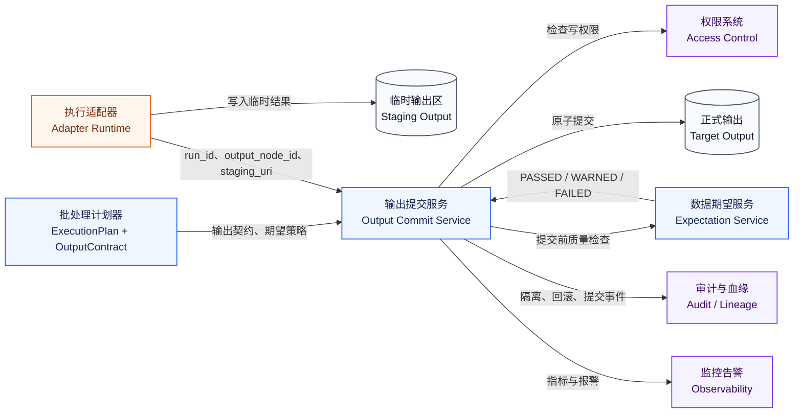
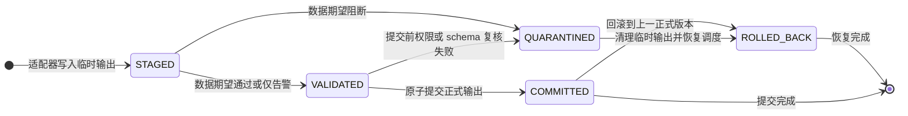

# 输出与数据期望关键模块设计

## 背景、问题、目标与范围

本文聚焦输出与数据期望模块，承接 `docs/pipeline-builder-operator-platform-architecture-design.md` 和 `docs/pipeline-builder-operator-platform-detailed-design.md`。平台算子能力要从“能运行”走向“可生产”，关键不只是把转换结果写出去，而是要在数据期望失败时避免坏数据覆盖正式输出，并把输出提交、血缘、权限标记、审计和恢复动作变成可执行协议。

本文首先给出结论：输出与数据期望模块应采用“临时输出 + 数据期望 + 输出提交状态机”的设计。执行适配器只能写入临时输出区，数据期望服务基于临时输出产出质量结论，输出提交服务再根据策略把输出推进到 `COMMITTED`、`QUARANTINED` 或 `ROLLED_BACK`。这使数据质量检查成为正式输出可见性的前置门禁，而不是事后日志。

本文范围覆盖输出节点模型、数据期望模型、两阶段输出提交、质量失败策略、血缘与权限标记传播、API、表结构、错误码、测试场景、监控告警和灰度回滚。本文不实现具体存储引擎的原子提交代码，不承诺第一版支持所有 Foundry 输出类型，也不替代批处理计划器和执行适配器设计。

## 来源与证据边界

Palantir 官方文档是第一事实来源。当前可见文档支持的事实包括：Pipeline Builder 提供输出能力，数据期望（data expectations）公开材料明确覆盖主键（primary key）和行数（row count）类约束，Pipeline Builder 的低代码运行体验需要在发布和运行之间保留质量反馈。当前仓库设计是第二事实来源，上游架构评审优化已经明确两阶段输出提交、`run_output_commit` 和 `pipeline_lineage` 是自研平台工程设计。

因此本文把能力分成两层：Pipeline Builder 对齐层优先覆盖主键和行数期望；自研增强层覆盖模式稳定性、列级派生记录、权限标记传播和输出隔离恢复。凡涉及 `STAGED`、`VALIDATED`、`COMMITTED`、`QUARANTINED`、`ROLLED_BACK` 的状态机，均为自研平台为满足可执行性和可靠性补充的工程设计。

## 模块职责与边界

输出与数据期望模块负责五件事。第一，接收计划器给出的输出契约，确定输出节点、输出类型、目标位置和质量策略。第二，管理临时输出和正式输出之间的状态转换。第三，在输出正式可见前执行数据期望并产出结构化质量结果。第四，把输出提交、隔离、回滚和质量结果写入审计与血缘。第五，对外提供查询、重试、人工恢复和监控指标。

它不负责执行转换逻辑，不直接读取或修改草稿图，不决定算子是否可用，也不替代权限系统本身。执行适配器只负责把结果写到临时输出区；计划器只负责把输出契约写入执行计划；权限系统负责回答用户或服务账号是否能读写目标资源；本模块负责把这些决策串成可恢复的输出提交协议。

## 上下游关系

批处理计划器需要在 `ExecutionPlan` 中提供 `OutputContract`。该契约至少包含 `outputNodeId`、`outputType`、`targetRef`、`writeMode`、`expectedSchemaHash`、`expectationRefs`、`commitPolicy`、`lineageRequired` 和 `permissionScope`。执行适配器需要返回 `stagingUri`、输出摘要、行数、schema hash 和适配器运行 ID。审计与血缘模块消费提交事件和质量结果，不参与提交决策。

## 核心领域对象

| 对象 | 关键字段 | 说明 |
| --- | --- | --- |
| `OutputNode` | `id`、`kind`、`inputRef`、`targetRef`、`writeMode` | 流水线图中的输出节点，MVP 默认 `DATASET` |
| `OutputContract` | `outputNodeId`、`outputType`、`schemaHash`、`expectationRefs`、`commitPolicy` | 发布计划中的输出契约，由计划器生成 |
| `ExpectationDefinition` | `type`、`scope`、`configJson`、`severity`、`failurePolicy` | 数据期望定义，绑定到发布版本和输出节点 |
| `ExpectationResult` | `runId`、`expectationId`、`status`、`metricsJson`、`message` | 单次运行的数据期望结果 |
| `OutputCommit` | `runId`、`outputNodeId`、`stagingUri`、`targetUri`、`status`、`commitKey` | 两阶段输出提交记录 |
| `LineageRecord` | `inputRefs`、`outputRefs`、`columnLineageJson`、`schemaHashes`、`permissionMarks` | 输出成功、隔离或回滚后的治理事实 |

输出类型分为对齐层和占位层。MVP 只承诺 `DATASET` 的可执行提交；`VIRTUAL_TABLE`、`OBJECT_TYPE`、`LINK_TYPE`、`TIME_SERIES`、`GEOTEMPORAL` 和 `EXTERNAL_EXPORT` 先保留契约位置、血缘字段和错误码，不进入第一版适配器验收范围。

## 输出提交状态机

`commitKey` 是提交幂等边界，建议由 `pipelineVersionId + runId + outputNodeId + targetRef + planHash` 生成。重复提交同一个 `commitKey` 时，服务必须返回已有提交记录，不能重复覆盖正式输出。状态转换只能由输出提交服务完成，执行适配器、质量服务和人工运维都不能直接改库绕过状态机。

## 数据期望设计

数据期望按对齐层和增强层分层。

| 期望类型 | 层级 | 配置要点 | 失败策略 |
| --- | --- | --- | --- |
| `PRIMARY_KEY` | Pipeline Builder 对齐层 | 主键列、是否允许空值、唯一性范围 | 默认阻断输出 |
| `ROW_COUNT` | Pipeline Builder 对齐层 | 最小行数、最大行数、与上一版本差异阈值 | 可阻断或告警 |
| `SCHEMA_STABILITY` | 自研增强层 | schema hash、允许新增列、允许类型拓宽 | 默认告警，可配置阻断 |
| `CUSTOM_SQL_LIKE_CHECK` | 自研增强层 | 受控表达式或内置检查模板 | 默认仅告警，进入生产前需审核 |

主键和行数是第一版必须实现的对齐能力。模式稳定性属于自研增强能力，文档和 API 都必须标注为平台扩展，避免被误读为 Palantir 官方公开能力。自定义检查不允许保存任意 SQL 或脚本，只能使用平台受控表达式或审核过的内置模板。

## API 草案

| 接口 | 方法 | 请求要点 | 响应要点 |
| --- | --- | --- | --- |
| `/api/pipeline-versions/{versionId}/outputs` | `GET` | 发布版本 ID | 输出契约、期望摘要、最新提交状态 |
| `/api/runs/{runId}/outputs` | `GET` | 运行 ID | 每个输出节点的 staging、target、状态、质量结果 |
| `/api/runs/{runId}/outputs/{outputNodeId}/commit` | `POST` | `commitKey`、提交策略、操作者 | 提交记录或既有幂等结果 |
| `/api/runs/{runId}/outputs/{outputNodeId}/quarantine` | `POST` | 原因、保留时长、操作者 | 隔离记录 |
| `/api/runs/{runId}/outputs/{outputNodeId}/rollback` | `POST` | 目标版本、回滚原因、审批引用 | 回滚记录 |
| `/api/expectations/{expectationId}/results` | `GET` | 期望 ID、运行范围 | 质量结果列表 |

提交接口只允许平台服务账号或具备发布/运行权限的操作者调用。人工恢复操作必须写入审批引用和审计事件。所有写接口都需要 `Idempotency-Key`，重复请求返回同一资源。

## 表结构草案

| 表 | 关键字段 | 约束 |
| --- | --- | --- |
| `pipeline_output_contract` | `id`、`pipeline_version_id`、`output_node_id`、`output_type`、`target_ref`、`schema_hash`、`commit_policy_json` | `pipeline_version_id + output_node_id` 唯一 |
| `data_expectation` | `id`、`pipeline_version_id`、`output_node_id`、`expectation_type`、`config_json`、`severity`、`failure_policy` | 按 `pipeline_version_id` 和 `output_node_id` 建索引 |
| `expectation_result` | `id`、`run_id`、`expectation_id`、`status`、`metrics_json`、`message`、`created_at` | 按 `run_id` 建索引 |
| `run_output_commit` | `id`、`run_id`、`output_node_id`、`staging_uri`、`target_uri`、`status`、`commit_key`、`message`、`created_at`、`committed_at` | `commit_key` 唯一 |
| `pipeline_lineage` | `id`、`run_id`、`pipeline_version_id`、`input_refs`、`output_refs`、`column_lineage_json`、`schema_hashes`、`permission_marks` | 按 `run_id` 和 `pipeline_version_id` 建索引 |

如果输出摘要、列级血缘或质量指标较大，数据库只保存 URI、哈希和摘要，完整 JSON 进入对象存储。对象存储路径必须包含租户、pipeline version、run ID 和 output node ID，便于清理和权限过滤。

## 错误码

| 错误码 | 场景 | 处理方式 |
| --- | --- | --- |
| `OUTPUT_STAGING_NOT_FOUND` | 适配器未返回临时输出或 URI 不可访问 | 运行失败，允许适配器重试 |
| `OUTPUT_SCHEMA_MISMATCH` | 临时输出 schema 与发布契约不一致 | 阻断提交，进入隔离 |
| `EXPECTATION_FAILED` | 主键、行数或其他期望失败 | 按 `failurePolicy` 阻断或告警 |
| `OUTPUT_COMMIT_CONFLICT` | 同一 target 存在并发提交 | 返回冲突，要求按幂等键重试或人工处理 |
| `OUTPUT_PERMISSION_DENIED` | 操作者或服务账号无目标写权限 | 阻断提交，写审计事件 |
| `OUTPUT_COMMIT_PARTIAL` | 存储引擎提交部分成功 | 标记为隔离，触发恢复 runbook |
| `LINEAGE_WRITE_FAILED` | 血缘写入失败 | 输出可按策略提交，但必须报警并补偿写入 |

## 监控与告警

核心指标包括 `pipeline_output_commit_total`、`pipeline_output_commit_duration_seconds`、`pipeline_output_commit_staged_age_seconds`、`data_expectation_results_total`、`pipeline_lineage_write_failures_total` 和 `output_quarantine_total`。告警优先关注四类情况：临时输出长时间停留在 `STAGED`，`OUTPUT_COMMIT_PARTIAL` 出现，数据期望阻断数量突增，血缘写入持续失败。

日志必须包含 `traceId`、`pipelineId`、`pipelineVersionId`、`runId`、`outputNodeId`、`commitKey` 和 `targetRef`。错误样本或质量样本涉及敏感数据时，只能保存脱敏摘要或受权限保护的对象存储引用。

## 测试场景

| 场景 | 输入 | 预期 |
| --- | --- | --- |
| 期望通过并提交 | 临时输出主键唯一、行数大于阈值 | 状态从 `STAGED` 到 `VALIDATED` 再到 `COMMITTED` |
| 主键重复 | 临时输出存在重复主键 | `EXPECTATION_FAILED`，状态进入 `QUARANTINED` |
| 行数异常但策略为告警 | 行数低于阈值，策略为 `WARN` | 输出可提交，质量结果为 `WARNED` |
| schema 不匹配 | 临时输出 schema hash 不等于发布契约 | `OUTPUT_SCHEMA_MISMATCH`，禁止正式提交 |
| 重复提交 | 相同 `commitKey` 调用提交接口两次 | 第二次返回第一次提交结果 |
| 并发提交冲突 | 两个 run 试图写同一 target | 一个成功，另一个返回 `OUTPUT_COMMIT_CONFLICT` |
| 血缘补偿 | 输出提交成功但血缘写入失败 | 输出状态保持，报警并通过补偿任务写入血缘 |
| 回滚恢复 | 已提交输出发现阻断缺陷 | 状态进入 `ROLLED_BACK`，审计记录回滚目标版本 |

## 灰度与回滚策略

第一阶段只对 `DATASET` 输出启用两阶段提交，且默认在测试 workspace 和白名单项目灰度。新数据期望类型必须先以告警模式运行，观察误报和运行成本后再允许配置为阻断。输出提交服务、数据期望服务和血缘写入都需要独立开关；任何一个组件不可用时，系统应阻断正式输出提交，而不是绕过质量门禁。

回滚优先回到上一个已提交的发布版本输出。对于已隔离的临时输出，默认保留 72 小时供排障；超过保留期后按配置清理，但必须保留提交记录、质量摘要和审计事件。

## 参考资料

- 概要设计：`docs/pipeline-builder-operator-platform-architecture-design.md`
- 详细设计：`docs/pipeline-builder-operator-platform-detailed-design.md`
- Palantir Pipeline outputs: https://www.palantir.com/docs/foundry/pipeline-builder/outputs-overview/
- Palantir Data expectations: https://www.palantir.com/docs/foundry/pipeline-builder/dataexpectations-overview/
- Palantir Pipeline Builder Overview: https://www.palantir.com/docs/foundry/pipeline-builder/overview/
