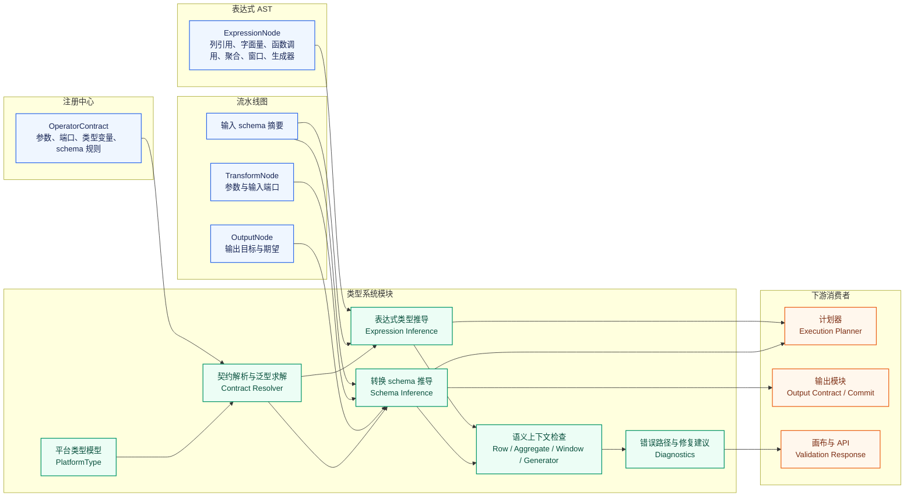

# Pipeline Builder 类型系统关键模块设计

## 背景、问题、目标与范围

自研 Pipeline Builder 算子平台已经在上游设计中确定采用“算子注册中心 + 类型化中间表示 + 执行适配器”的架构。算子注册中心负责回答平台认识哪些表达式函数（expression function）和转换算子（transform operator），表达式抽象语法树（abstract syntax tree）负责保存用户在表单中配置的值层逻辑，计划器（planner）负责把通过校验的流水线图编译成不可变执行计划，输出模块负责在运行结果通过质量约束后完成正式提交。类型系统（type system）位于这些模块之间，承担“能否组合、组合后是什么类型、错误应定位到哪里”的判断职责。

当前问题是，如果没有独立且可执行的类型系统设计，平台很容易退回到两种不可靠路径：一种是前端按表单控件做局部校验，后端到运行期才发现列不存在、聚合位置错误或输出模式不稳定；另一种是把 Spark、Flink、文件解析、地理空间或媒体运行时的类型规则直接暴露到控制面，导致同一份草稿在不同适配器下表现不一致。Palantir 官方文档说明 Pipeline Builder 通过后端通用模型在编辑工具和执行之间充当中间层，并区分表达式、聚合、生成器与整表转换；自研平台需要把这类产品能力边界转成可版本化、可测试、可灰度的内部接口。

本文目标是给出类型系统关键模块的可执行设计。结论先行：类型系统应作为控制面内的独立领域模块，以平台类型模型和 `OperatorContract` 为输入，对表达式 AST、转换节点参数、输入输出 schema、聚合/窗口/生成器上下文进行统一推导和语义检查，并输出结构化 `TypeCheckResult`、`SchemaInferenceResult`、错误码和错误路径。它不直接生成物理执行代码，不读取业务数据样本，不替代计划器选择适配器，也不决定输出两阶段提交策略。

本文范围覆盖模块职责与边界、与注册中心 `OperatorContract`、表达式 AST、计划器、输出模块的接口，平台类型模型，表达式类型推导，转换算子 schema 推导，参数类型匹配，聚合/窗口/生成器语义检查，错误码、错误路径与修复建议，API 和内部接口草案，表与配置草案，测试矩阵和灰度策略。本文不修改上游注册中心或 AST 设计，不承诺 Palantir 内部类型系统实现细节一致，也不把本文草案视为最终代码接口；后续实现应以代码、契约测试和样例运行验证本文判断。

## 证据边界与输入假设

本文第一事实来源是 Palantir 官方文档。官方 Transforms 文档说明 Pipeline Builder 使用通用后端模型描述数据转换，表达式以列为输入并输出单列，转换算子以整表为输入并返回整表；官方 Functions Index 说明表达式可分为行级表达式、聚合表达式和生成器表达式，并在条目中展示支持运行模式、表达式类别、类型变量边界和输出类型；官方 Pipeline outputs 文档说明输出可覆盖 dataset、media set、geotemporal series、virtual table 和 ontology outputs；官方 Data expectations 文档说明数据期望可以绑定到 pipeline output，并覆盖 primary key 与 row count。当前仓库概要设计、详细设计和 `docs/transform-expression-comparison.md` 是第二事实来源，它们已经把表达式归纳为值层，把转换算子归纳为结构层，并要求正式算子补齐 `OperatorContract`。

由于注册中心和 AST 设计并行推进，本文明确写出对这两个模块的输入假设，避免把别的模块职责暗含到类型系统里。

对注册中心的输入假设如下。

| 假设 | 类型系统依赖方式 | 不满足时的处理 |
| --- | --- | --- |
| 注册中心为每个可生产算子版本提供稳定 `operatorVersionId` | 发布态类型检查只引用稳定版本 ID，草稿态可用 `slug + layer + versionConstraint` 解析 | 返回 `OPERATOR_CONTRACT_NOT_FOUND`，不允许发布 |
| `OperatorContract` 包含 `inputPorts`、`outputPorts`、`parameters`、`typeVariables`、`typeBounds`、`nullabilityPolicy`、`semanticClass`、`schemaInference`、`supportedIn` | 类型系统按契约执行参数匹配、泛型求解、可空性传播和 schema 推导 | 返回 `CONTRACT_INCOMPLETE`，算子只能停留在非生产状态 |
| 注册中心保留来源 URL、证据等级、状态和兼容策略 | 类型系统在结果中回传 `contractHash` 与 `evidenceRef`，供计划快照和审计使用 | 返回警告级 `CONTRACT_EVIDENCE_WEAK`，不阻断草稿保存 |
| 参数种类显式区分列、表达式、表达式列表、数据集、字面量和结构化对象 | 类型系统按参数种类选择不同绑定规则和错误路径 | 返回 `PARAMETER_KIND_UNSUPPORTED` |

对表达式 AST 的输入假设如下。

| 假设 | 类型系统依赖方式 | 不满足时的处理 |
| --- | --- | --- |
| AST 节点有稳定 `nodeId`、`kind`、`operatorRef`、`arguments` 和 `sourceRange` 或表单路径 | 类型系统返回错误路径时定位到表达式子树、参数名和数组下标 | 返回 `AST_PATH_MISSING`，错误仍定位到最近可用参数 |
| AST 不保存任意 SQL 或脚本片段，只保存受控语义树 | 类型系统可以做静态推导，并把安全边界交给 AST 与执行适配器 | 返回 `UNSUPPORTED_EXPRESSION_KIND` |
| 列引用节点显式区分字段路径、当前行变量、生成器元素变量和窗口上下文变量 | 类型系统可以判断列是否存在、嵌套字段是否可达、变量作用域是否合法 | 返回 `COLUMN_REF_NOT_FOUND` 或 `VARIABLE_SCOPE_ERROR` |
| AST 节点保留语义上下文，例如 row、aggregate、window、generator 的期望位置 | 类型系统可以检查聚合和生成器是否出现在允许区域 | 返回 `SEMANTIC_CONTEXT_MISMATCH` |

## 模块职责与边界

类型系统模块回答五个问题。第一，某个表达式在给定输入 schema 和上下文中是否类型正确，以及返回什么平台类型。第二，某个转换算子的参数是否满足 `OperatorContract`，以及转换后的输出 schema 是什么。第三，聚合、窗口和生成器这类改变行语义的表达式是否出现在合法位置。第四，类型错误应定位到画布节点、参数路径、表达式节点还是输出字段，并给出怎样的修复建议。第五，类型推导结果如何稳定进入计划快照、输出契约和血缘记录。

类型系统拥有平台类型模型、类型表达式解析、泛型约束求解、可空性传播、表达式类型推导、参数匹配、转换算子 schema 推导、语义上下文检查、错误码和错误路径规范。它依赖注册中心读取算子契约，依赖草稿图读取输入输出和 AST，依赖数据目录或 schema 服务读取输入 schema 摘要，但不直接读取用户数据内容。

类型系统不承担四类职责。第一，它不维护算子生命周期；算子状态、来源和晋级由注册中心负责。第二，它不生成物理执行计划；它只输出语义层 `TypedGraph`、`TypedExpression` 和 `SchemaInferenceResult`，计划器再把这些结果编译为 `ExecutionPlan`。第三，它不提交输出；输出模块读取类型系统给出的目标 schema、主键候选和可空性信息，再结合数据期望执行提交控制。第四，它不在运行期解释适配器私有错误；适配器错误需要映射回平台错误分类，但类型系统只定义编辑期和发布期可静态判断的错误。



## 与上下游模块的接口

### 与注册中心 `OperatorContract` 的接口

注册中心向类型系统提供只读契约快照。类型系统读取契约时必须带上 `contractHash`，校验结果也必须返回该哈希，确保发布计划可以复现当时的类型规则。契约最小结构如下。

```json
{
  "operatorVersionId": "opv_aggregate_v1",
  "layer": "TRANSFORM",
  "semanticClass": "AGGREGATE_TRANSFORM",
  "supportedIn": ["BATCH", "FASTER"],
  "inputPorts": [
    {
      "name": "dataset",
      "domain": "TABLE",
      "cardinality": "ONE"
    }
  ],
  "parameters": [
    {
      "name": "groupByColumns",
      "kind": "COLUMN_LIST",
      "typeExpr": "List<ColumnRef<ComparableType>>",
      "required": true
    },
    {
      "name": "aggregations",
      "kind": "AGGREGATE_EXPRESSION_LIST",
      "typeExpr": "List<Expression<AnyType>>",
      "required": true
    }
  ],
  "typeVariables": [
    {
      "name": "T",
      "bound": "AnyType"
    }
  ],
  "nullabilityPolicy": "PROPAGATE",
  "schemaInference": {
    "rule": "GROUP_BY_PLUS_AGGREGATIONS"
  }
}
```

契约中的 `typeExpr` 使用平台自己的类型表达式语言，而不是直接使用某个运行引擎的类型名。这样做的原因是，注册中心保存的是产品语义和平台承诺，计划器再负责把平台类型映射到 Spark、Flink 或专项适配器。类型系统只接受 `VERIFIED` 或被灰度策略允许的 `IMPLEMENTED` 契约参与发布级校验；草稿级校验可以读取较低状态契约，但结果必须带上不可发布标记。

### 与表达式 AST 的接口

表达式 AST 向类型系统提供结构化节点，不提供任意代码。类型系统返回带类型标注的 `TypedExpression`，供计划器生成表达式计划片段，也供 UI 展示字段类型和错误定位。

```json
{
  "nodeId": "expr_sum_amount",
  "kind": "CALL",
  "operatorRef": {
    "layer": "EXPRESSION",
    "slug": "sum",
    "versionConstraint": "1"
  },
  "arguments": {
    "expression": {
      "nodeId": "expr_col_amount",
      "kind": "COLUMN_REF",
      "path": ["amount"]
    }
  },
  "expectedContext": "AGGREGATE"
}
```

AST 到类型系统的边界要保留两条规则。第一，AST 负责语法结构和节点身份，类型系统负责类型与语义判断。第二，AST 可以表达行级、聚合、窗口和生成器上下文，但这些上下文是否合法由类型系统结合外层转换算子契约判断。

### 与计划器的接口

计划器只接收通过发布级校验的 `TypedGraph`。`TypedGraph` 应包含输入 schema hash、每个转换节点的输出 schema、表达式节点的推导类型、泛型绑定结果、可空性结果、语义上下文结果和已解析的 `operatorVersionId`。计划器不得重新解释草稿中的 `slug` 或未解析类型表达式，否则会破坏发布可复现性。

```json
{
  "graphId": "draft_123",
  "revision": 17,
  "mode": "BATCH",
  "typedNodes": [
    {
      "nodeId": "node_aggregate_orders",
      "operatorVersionId": "opv_aggregate_v1",
      "contractHash": "sha256:...",
      "inputSchemas": {
        "dataset": "schema_hash_orders_v1"
      },
      "outputSchema": {
        "fields": [
          {
            "name": "customer_id",
            "type": {
              "kind": "STRING",
              "nullable": false
            }
          },
          {
            "name": "total_amount",
            "type": {
              "kind": "DECIMAL",
              "precision": 38,
              "scale": 6,
              "nullable": true
            }
          }
        ]
      }
    }
  ]
}
```

计划器可以把类型系统结果作为适配器选择输入。例如几何类型（geometry type）节点需要地理空间适配器，媒体类型（media type）节点需要媒体适配器，窗口聚合需要支持状态或窗口语义的适配器。类型系统只输出语义标签和类型标签，不决定最终适配器。

### 与输出模块的接口

输出模块读取类型系统产出的 `OutputContractDraft`。该草案包含目标输出种类、输出 schema、字段可空性、主键候选、时间字段候选、几何字段候选、媒体引用字段候选和 schema 兼容判断。输出模块再结合数据期望、权限和提交策略决定发布是否可通过。

对 dataset 输出，类型系统必须给出完整列名、字段类型、可空性和列级派生来源。对 virtual table 输出，类型系统只验证平台内 schema 与外部目标 schema 的兼容关系。对 object type、link type 和 time series 输出，类型系统需要验证必需字段、主键或关联键、时间字段和属性字段类型。对 media set 输出，类型系统验证媒体引用、媒体元数据结构和输出 schema，不判断媒体内容质量。

## 平台类型模型

平台类型模型分为类型描述、schema 描述、可空性和类型变量四层。类型描述用于表达单个值或结构化值，schema 描述用于表达表和输出，表示可空性用于判断字段或表达式是否可能为空，类型变量用于支撑泛型函数和转换算子。

基础类型覆盖 `Boolean`、`Byte`、`Short`、`Integer`、`Long`、`Float`、`Double`、`Decimal`、`String`、`Binary`、`Date`、`Timestamp`、`Time`、`Json`、`Unknown` 和 `Null`。`Unknown` 只允许出现在草稿编辑期或来源 schema 不完整的输入中，发布级校验不能残留 `Unknown`。`Null` 表示字面量空值或全空表达式的下界，必须通过期望类型或泛型求解提升到具体可空类型。

数组（array）、结构体（struct）和映射（map）使用递归类型表示。数组写作 `Array<T>`，保留元素类型和元素可空性。结构体写作 `Struct<fieldName: Type>`，字段路径必须稳定，嵌套字段错误路径按字段名逐层返回。映射写作 `Map<K, V>`，键类型默认要求可比较、可哈希且不可为空；值类型可为空。官方 Functions Index 中 map、struct、array 类表达式展示了这些结构在 Pipeline Builder 表达式中的产品边界，自研平台以此作为建模依据之一。

时间类型分为日期（date）、时间戳（timestamp）、时间（time）和时间间隔（duration 或 interval）。日期只表示日粒度，时间戳必须携带时区策略，时间表示一天内时间点。平台默认把时区策略保存在 `TemporalType.timeZonePolicy` 中，允许值为 `UTC_NORMALIZED`、`LOCAL_WITH_ZONE` 和 `SOURCE_DECLARED`。窗口语义、time series 输出和 geotemporal 输出都必须显式引用时间字段，不能用字符串字段隐式转换。

几何类型分为 `Geometry`、`Point`、`LineString`、`Polygon`、`MultiGeometry`、`Raster` 和 `GeotemporalPosition`。几何类型必须带坐标参考系统（coordinate reference system）元数据，默认 `crs` 为空时只能进入草稿级校验；发布到地理空间或 geotemporal 输出前必须解析为平台支持的 CRS。媒体类型分为 `MediaReference`、`MediaMetadata`、`ImageReference`、`AudioReference`、`VideoReference`、`DocumentReference` 和 `DicomReference`。媒体类型描述的是引用、格式和元数据 schema，不把二进制内容放入类型系统。

可空性分为 `NON_NULL`、`NULLABLE`、`UNKNOWN_NULLABILITY` 和 `NULL_ONLY`。类型系统采用保守传播：任何可空输入进入默认传播函数后输出可空；明确 `nullabilityPolicy` 为 `REJECT_NULL` 的函数遇到可空输入时返回错误或要求用户先过滤；聚合函数的可空性由函数契约声明，例如空组、全空输入和计数类函数的返回规则不同。输出 schema 中不允许保留 `UNKNOWN_NULLABILITY`。

泛型类型变量用于表达函数族和转换算子的参数约束。`T extends NumericType` 表示类型变量必须绑定为数值类型，`K extends ComparableType` 表示 map key、group by 或 join key 可以比较，`V extends AnyType` 表示任意值类型。泛型求解的顺序是先收集实参约束，再按上下文期望类型补充约束，最后求最小共同超类型。若没有唯一解，类型系统返回 `TYPE_VARIABLE_UNRESOLVED`，并在修复建议中提示用户增加显式类型转换或选择更具体的列。

| 类型族 | 平台表示 | 发布级要求 | 典型用途 |
| --- | --- | --- | --- |
| 基础类型 | `PrimitiveType(kind, nullable)` | 不能残留 `Unknown` | 字段清洗、条件表达式、普通参数 |
| 数值类型 | `Byte` 到 `Decimal` | 明确精度提升规则 | 聚合、算术、排序 |
| 数组 | `Array<elementType>` | 元素类型可解析 | explode、数组谓词、嵌套 JSON |
| 结构体 | `Struct<Field>` | 字段名稳定且无重复 | JSON 解析、对象属性、嵌套字段 |
| 映射 | `Map<keyType, valueType>` | key 可比较且不可为空 | pivot、键值扩展、动态属性 |
| 时间 | `Date`、`Timestamp`、`Time`、`Interval` | 时间字段策略明确 | 窗口、time series、时间计算 |
| 几何 | `Geometry` 及子类型 | 发布前解析 CRS | 空间 join、geotemporal 输出 |
| 媒体 | `MediaReference` 及子类型 | 引用字段和元数据 schema 明确 | media set 输出、媒体处理 |
| 类型变量 | `TypeVariable(name, bound)` | 发布前完成绑定 | 泛型表达式、通用转换算子 |

## 表达式类型推导

表达式类型推导以“上下文 + AST + 契约”为输入。上下文包含当前行 schema、可见变量、期望语义位置、运行模式和外层转换节点。AST 提供节点结构。契约提供参数类型、返回类型表达式、类型变量边界、可空性策略和语义类别。

推导流程按六步执行。第一步解析列引用和字面量，列引用从当前 schema 或变量作用域中查找，字面量根据值和期望类型推导。第二步解析函数调用契约，锁定 `operatorVersionId` 和 `contractHash`。第三步为每个参数建立类型约束，区分普通表达式、列引用、聚合表达式列表、lambda 或结构化参数。第四步求解泛型变量，并判断实参类型是否满足边界。第五步按返回类型表达式和可空性策略计算结果类型。第六步把语义类别写入节点，例如 row、aggregate、window、generator 或 scalar-literal。

示例：`sum(amount)` 出现在 `Aggregate` 转换算子的 `aggregations` 参数中时，外层上下文期望 `AGGREGATE`，`sum` 契约要求输入是数值表达式，返回数值或按契约提升后的类型。若 `amount` 为 `Decimal(18, 2)` 且可空，返回可设为 `Decimal(38, 2)` 或契约定义的聚合结果类型，并标记可空性来源为输入可空或空组规则。若同一个 `sum(amount)` 出现在普通 `Filter` 的行级条件中，类型系统返回 `SEMANTIC_CONTEXT_MISMATCH`，因为聚合表达式不能直接嵌入行级谓词。

行级表达式可以引用当前行字段、结构体字段、数组元素变量和普通字面量。聚合表达式可以引用分组输入字段，但输出行数由外层聚合转换决定。窗口表达式需要窗口上下文，必须绑定 partition、order 或 time window 规则。生成器表达式从单行产生多行或多值，不能作为普通字段值悄悄返回到不支持展开的上下文。

表达式推导结果必须保存到 `TypedExpression`。

```json
{
  "nodeId": "expr_sum_amount",
  "operatorVersionId": "opv_sum_v1",
  "contractHash": "sha256:...",
  "semanticClass": "AGGREGATE",
  "type": {
    "kind": "DECIMAL",
    "precision": 38,
    "scale": 2,
    "nullable": true
  },
  "typeBindings": {
    "T": "Decimal(18,2)"
  },
  "lineage": [
    {
      "inputPath": "amount",
      "usage": "AGGREGATE_INPUT"
    }
  ]
}
```

## 转换算子 schema 推导

转换算子 schema 推导处理结构层变化。输入是转换节点、输入端口 schema、参数值、参数中的表达式推导结果和算子契约。输出是新的表 schema、列级血缘、schema 兼容信息、成本标签和可提交性标记。

转换 schema 推导规则按算子语义族实现，而不是每个 slug 手写一套完全独立逻辑。`PROJECT_OR_DERIVE` 类算子保留部分列并新增表达式列；`FILTER` 类算子不改变 schema，但可能收窄可空性或添加谓词血缘；`AGGREGATE` 类算子输出分组列和聚合表达式列；`JOIN` 类算子合并左右 schema 并处理 key、重名列和可空性；`UNION` 类算子要求列集合和类型可对齐；`PIVOT` 类算子可能输出 map 或动态列，需要契约声明静态/动态策略；`FILE_PARSE` 类算子从文件结构或用户提供 schema 生成表 schema；`GEO`、`MEDIA` 和 `OUTPUT_SHAPING` 类算子按专项类型规则处理。

schema 推导不能只返回字段列表，还要返回每个字段的来源和为什么存在。例如 Aggregate 输出中的 `customer_id` 来自 group by 字段，`total_amount` 来自 `sum(amount)` 表达式；Join 输出中的右表非 key 字段如果被重命名，血缘仍应指向右表原字段；Union 输出字段来自多输入共同字段，类型需要取共同超类型。这样输出模块和审计模块才能形成列级血缘。

动态 schema 是发布级风险点。文件解析、pivot、JSON 解析和部分媒体元数据可能在不同输入上产生不同字段。平台允许草稿级预览动态字段，但发布级必须满足三种条件之一：用户显式提供目标 schema；契约声明输出为 `Map` 或 `Struct` 中的动态结构；输出模块选择的目标支持 schema 演进并通过发布策略允许。否则返回 `SCHEMA_DYNAMIC_UNBOUNDED`。

## 参数类型匹配

参数类型匹配先看参数种类，再看类型表达式。列参数必须绑定到输入 schema 中存在的字段，并检查字段类型是否满足列类型边界。表达式参数先递归推导表达式类型，再与期望 `Expression<T>` 匹配。字面量参数可以根据期望类型做安全提升，例如整数到长整型、字符串到枚举，但不能在发布级隐式把任意字符串当成时间或几何。结构化参数按对象字段逐个校验，并返回对象路径。

可变参数使用 `arity` 约束。`List<Expression<NumericType>>` 需要至少一个元素时，空数组返回 `PARAMETER_CARDINALITY_ERROR`。互斥参数和条件参数由契约中的 `parameterConstraints` 表示，例如窗口转换必须在 `timeColumn` 和 `rowCountWindow` 中选择一种。默认值由注册中心契约声明，类型系统可以在类型检查结果中把默认值展开为显式参数，但必须标记 `source: DEFAULT`，避免用户以为是手动配置。

参数匹配失败必须区分“参数不存在”“参数种类错误”“类型不匹配”“类型变量无法求解”和“运行模式不支持”。这些错误对修复动作不同：缺参数要补配置，种类错误往往是前端表单或 AST 生成错误，类型不匹配需要换列或加转换，泛型无法求解需要显式类型，运行模式不支持需要换算子或换 pipeline mode。

## 聚合、窗口和生成器语义检查

Palantir 官方 Functions Index 把表达式分成 row level、aggregate 和 generator，这对自研平台是重要的语义边界。类型系统必须在类型正确之外检查表达式是否出现在正确语义区域，因为 `sum(amount)` 的输入类型可以正确，但放在行级 `Filter` 条件里仍然不合法；`explode_array(items)` 的数组类型可以正确，但放在不支持行展开的派生列里会改变行数，必须由外层转换算子显式承接。

聚合检查的规则是：聚合表达式只能出现在 `Aggregate`、`Pivot`、窗口聚合或契约明确允许聚合参数的位置。聚合表达式内部可以包含行级表达式，但行级表达式不能引用聚合输出。分组字段必须来自输入 schema，并满足可比较类型边界。聚合输出列必须有稳定名称，未命名聚合表达式返回 `AGGREGATE_ALIAS_REQUIRED`，避免输出模块拿到不稳定字段名。

窗口检查的规则是：窗口表达式必须绑定窗口上下文，包含 partition、order、time window 或 trigger 中由契约要求的必要字段。事件时间字段必须是时间类型，排序字段必须可比较，窗口边界和 trigger 必须满足运行模式能力。流式窗口和批处理窗口的能力标记不同，类型系统只返回 `WINDOW_SEMANTICS_UNSUPPORTED` 或语义标签，适配器选择由计划器完成。

生成器检查的规则是：生成器表达式只能出现在显式展开上下文，例如 `Explode`、`Flatten` 或契约声明的 generator 参数。生成器输出必须定义元素变量作用域和输出列命名规则。多个生成器同时出现时，契约必须声明笛卡尔展开、zip 展开或禁止组合；没有声明时返回 `GENERATOR_COMBINATION_UNSUPPORTED`，因为不同运行时对多生成器的行数语义可能不一致。

## 错误码、错误路径与修复建议

类型系统错误采用结构化诊断（diagnostic）格式。每个错误必须包含稳定错误码、严重级别、节点 ID、参数路径、表达式路径、schema 路径、用户可读消息、修复建议和证据引用。错误路径使用 JSON Pointer 风格，并额外保留 UI 可直接使用的 `nodeId` 与 `expressionNodeId`。

```json
{
  "code": "TYPE_MISMATCH",
  "severity": "ERROR",
  "nodeId": "node_aggregate_orders",
  "argumentPath": "/arguments/aggregations/0/expression/arguments/expression",
  "expressionNodeId": "expr_col_amount",
  "schemaPath": "/fields/amount",
  "message": "sum 的输入必须是数值类型，但 amount 推导为 String",
  "suggestion": "选择数值列，或先使用显式类型转换表达式把 amount 转成数值类型。",
  "evidenceRef": {
    "operatorVersionId": "opv_sum_v1",
    "contractHash": "sha256:..."
  }
}
```

错误码草案如下。

| 错误码 | 触发条件 | 错误路径 | 修复建议 |
| --- | --- | --- | --- |
| `OPERATOR_CONTRACT_NOT_FOUND` | 注册中心无法解析算子契约 | `nodeId.operatorRef` | 选择已规格化的算子版本，或先补齐注册中心契约 |
| `CONTRACT_INCOMPLETE` | 契约缺少端口、参数、类型变量或 schema 规则 | `operatorVersionId` | 完成 `OperatorContract` 后再进入生产目录 |
| `COLUMN_REF_NOT_FOUND` | 列或嵌套字段不存在 | `expressionNodeId.path` | 选择现有列，或在上游转换中先生成该列 |
| `TYPE_MISMATCH` | 实参类型不满足期望类型 | 参数或表达式路径 | 换列、补显式转换，或选择接受该类型的算子 |
| `NULLABILITY_VIOLATION` | 可空值传入拒绝空值的参数 | schema 路径 | 先过滤空值、填默认值，或选择允许空值的表达式 |
| `TYPE_VARIABLE_UNRESOLVED` | 泛型变量无法唯一绑定 | 函数调用路径 | 增加显式类型转换或使用更具体的输入列 |
| `PARAMETER_CARDINALITY_ERROR` | 必填、最小数量或最大数量不满足 | 参数路径 | 补齐参数或删除多余参数 |
| `SEMANTIC_CONTEXT_MISMATCH` | 行级、聚合、窗口、生成器上下文不匹配 | 表达式路径 | 把表达式移动到支持该语义的转换算子参数中 |
| `AGGREGATE_ALIAS_REQUIRED` | 聚合输出列缺少稳定名称 | 聚合表达式路径 | 为聚合结果配置别名 |
| `WINDOW_SEMANTICS_UNSUPPORTED` | 窗口字段、trigger 或模式不满足契约 | 窗口参数路径 | 使用支持窗口的算子、补时间字段或调整运行模式 |
| `GENERATOR_CONTEXT_REQUIRED` | 生成器出现在非展开上下文 | 生成器表达式路径 | 使用显式展开转换承接生成器输出 |
| `SCHEMA_FIELD_CONFLICT` | Join、Union 或 Struct 字段冲突 | 输出 schema 路径 | 配置前缀、重命名字段或调整输入 schema |
| `SCHEMA_DYNAMIC_UNBOUNDED` | 发布级输出 schema 无法稳定 | 输出节点路径 | 提供目标 schema，或把动态字段收敛为 map/struct |
| `OUTPUT_SCHEMA_INCOMPATIBLE` | 推导 schema 与目标输出不兼容 | 输出字段路径 | 调整字段类型、可空性或输出目标配置 |
| `MODE_CAPABILITY_UNSUPPORTED` | 算子或类型语义不支持当前运行模式 | 节点路径 | 更换 pipeline mode、算子版本或适配器灰度策略 |

严重级别分为 `ERROR`、`WARNING` 和 `INFO`。发布级校验遇到 `ERROR` 必须阻断发布；草稿保存可以保留 `ERROR` 但必须返回给 UI。`WARNING` 用于证据弱、动态 schema 已被输出策略允许、隐式数值提升等非阻断问题。`INFO` 用于默认值展开、类型提升说明和字段重命名提示。

## API 与内部接口草案

外部 API 由算子平台 API 暴露，类型系统作为内部服务或模块实现。草稿保存可以调用轻量校验，预览和发布必须调用完整校验。

| API | 方法 | 请求要点 | 响应要点 |
| --- | --- | --- | --- |
| `/api/pipelines/{id}/typecheck` | `POST` | `revision`、`mode`、可选 `targetNodeId`、`level` | `TypeCheckResult`、诊断列表、节点输出 schema |
| `/api/pipelines/{id}/schema-inference` | `POST` | `revision`、可选输出节点 | 输出 schema、列级血缘、兼容性结果 |
| `/api/operators/{layer}/{slug}/type-contract` | `GET` | `version` 或 `operatorVersionId` | 可读契约摘要、参数类型、返回类型 |
| `/api/type-system/diagnostics/explain` | `GET` | `code`、可选语言 | 错误说明、典型原因、修复建议 |

内部接口建议以 Java 21 领域模型表达，保持与上游 Java 默认栈一致。

```java
public interface TypeSystemService {
    TypeCheckResult checkGraph(TypeCheckRequest request);

    ExpressionInferenceResult inferExpression(ExpressionInferenceRequest request);

    SchemaInferenceResult inferTransformSchema(TransformSchemaRequest request);

    ParameterMatchResult matchParameters(ParameterMatchRequest request);

    OutputContractDraft inferOutputContract(OutputContractRequest request);
}
```

```java
public record TypeCheckRequest(
        PipelineGraph graph,
        ValidationLevel level,
        PipelineMode mode,
        ContractSnapshotResolver contracts,
        InputSchemaResolver inputSchemas,
        RolloutContext rolloutContext
) {}

public record TypeCheckResult(
        boolean publishable,
        List<TypedTransformNode> typedNodes,
        List<OutputContractDraft> outputContracts,
        List<TypeDiagnostic> diagnostics,
        String typeRulesVersion
) {}
```

`ValidationLevel` 建议分为 `DRAFT_LIGHT`、`PREVIEW_FULL` 和 `PUBLISH_STRICT`。`DRAFT_LIGHT` 允许输入 schema 暂时缺失并返回较多警告；`PREVIEW_FULL` 要能生成临时预览计划；`PUBLISH_STRICT` 要求无 `Unknown` 类型、无不稳定输出 schema、契约状态允许发布、输出契约可提交。

## 表与配置草案

类型系统可先复用详细设计中的 `operator_contract`、`validation_result`、`pipeline_version` 和 `pipeline_lineage`，另增逻辑表或缓存表保存类型规则版本和推导结果摘要。

| 表 | 关键字段 | 约束 | 用途 |
| --- | --- | --- | --- |
| `type_rule_set` | `id`、`version`、`status`、`config_hash`、`created_by`、`created_at` | `version` 唯一 | 保存类型规则版本，支持灰度和回滚 |
| `type_alias` | `id`、`rule_set_id`、`alias`、`type_expr`、`description` | `rule_set_id + alias` 唯一 | 保存 `NumericType`、`ComparableType` 等类型族定义 |
| `typecheck_result_cache` | `id`、`graph_hash`、`contract_hashes`、`schema_hashes`、`rule_set_version`、`result_uri`、`created_at` | 哈希组合唯一 | 缓存完整校验结果，降低预览和发布重复成本 |
| `operator_type_override` | `id`、`operator_version_id`、`rule_set_id`、`override_json`、`reason`、`expires_at` | 按算子版本索引 | 灰度修正契约中的类型规则，必须有过期时间和审计 |
| `type_diagnostic_catalog` | `code`、`severity`、`message_template`、`suggestion_template`、`owner` | `code` 主键 | 管理错误码说明和多语言展示 |

配置草案如下。

```yaml
typeSystem:
  ruleSetVersion: "2026-05-23.v1"
  validation:
    publishRejectUnknownType: true
    publishRejectUnknownNullability: true
    maxDiagnosticsPerGraph: 200
    allowDraftWithContractWarnings: true
  inference:
    decimalAggregationPrecision: 38
    defaultTimestampPolicy: UTC_NORMALIZED
    dynamicSchemaPublishPolicy: REQUIRE_EXPLICIT_SCHEMA
    stringToTemporalImplicitCastOnPublish: false
  semantics:
    requireAggregateAlias: true
    allowMultipleGeneratorsOnlyWhenContractDeclares: true
    requireWindowTimeColumnForStreaming: true
  rollout:
    enabledRuleSets:
      - "2026-05-23.v1"
    canaryWorkspaces:
      - "platform-type-system-lab"
    publishStrictDefault: false
```

影响发布行为的配置必须进入配置中心并保留版本。`operator_type_override` 只能用于短期修正已知契约问题，不能成为常态配置来源；每条 override 都需要记录关联变更、原因、验证样例和失效时间。

## 测试矩阵

测试矩阵按类型模型、表达式、转换、语义、输出和灰度六层组织。类型系统的单元测试应覆盖每个错误码的正反例，契约测试应覆盖 API 响应结构和错误路径稳定性，集成测试应串联注册中心契约、AST、计划器输入和输出契约。

| 测试层 | 场景 | 输入样例 | 预期结果 |
| --- | --- | --- | --- |
| 类型模型 | 数值提升 | `Integer + Decimal(10,2)` | 共同类型为 `Decimal`，保留精度策略 |
| 类型模型 | 可空性传播 | `nullable String` 进入 `cleanString` | 输出可空性按契约传播 |
| 类型模型 | Map key 约束 | `Map<Array<String>, Integer>` | 返回 key 不可比较错误 |
| 表达式 | 行级函数 | `add(price, tax)` | 返回数值类型和列级血缘 |
| 表达式 | 泛型函数 | `coalesce(null, customer_id)` | `T` 绑定为 `String`，输出可空性收窄 |
| 表达式 | 列缺失 | `amount_missing` | 返回 `COLUMN_REF_NOT_FOUND` |
| 表达式 | 聚合误用 | `sum(amount)` 出现在行级 filter | 返回 `SEMANTIC_CONTEXT_MISMATCH` |
| 转换 schema | Aggregate | group by `customer_id`，聚合 `sum(amount)` | 输出分组列和聚合列，聚合列需别名 |
| 转换 schema | Join 字段冲突 | 左右表都有 `name` 非 key 字段 | 返回冲突或按配置重命名 |
| 转换 schema | Union 类型不兼容 | `amount: Decimal` 与 `amount: String` | 返回 `TYPE_MISMATCH` 或要求显式转换 |
| 动态 schema | JSON 解析无目标 schema | `parseJsonAsSchema` 缺 schema 参数 | 发布级返回 `SCHEMA_DYNAMIC_UNBOUNDED` |
| 窗口语义 | 流式窗口缺时间列 | Streaming aggregate over window | 返回 `WINDOW_SEMANTICS_UNSUPPORTED` |
| 生成器语义 | 多生成器未声明组合规则 | 同一派生参数内两个 generator | 返回 `GENERATOR_COMBINATION_UNSUPPORTED` |
| 输出契约 | Dataset 输出 | 推导 schema 与目标 dataset schema 对比 | 兼容则通过，不兼容返回字段路径 |
| 输出契约 | Time series 输出 | 时间字段是 `String` | 返回 `OUTPUT_SCHEMA_INCOMPATIBLE` |
| 输出契约 | Media set 输出 | 缺媒体引用字段 | 返回输出字段错误 |
| 灰度 | 新规则集只对白名单 workspace 生效 | canary workspace 与普通 workspace | 白名单使用新规则，普通 workspace 使用默认规则 |
| 缓存 | 同一图、契约和 schema 重复校验 | 相同哈希请求两次 | 第二次命中缓存，结果一致 |
| 回归 | 每个 `TypeDiagnostic` | 错误码快照 | 错误码、路径字段和建议模板保持稳定 |

端到端样例应至少覆盖三个业务链路。第一，dataset 输入经过 Aggregate 生成 dataset 输出，并绑定 primary key 和 row count 数据期望。第二，文件解析生成结构化表，再用表达式清洗字段并输出 dataset。第三，包含几何字段或媒体引用字段的草稿在未启用专项适配器时能完成草稿校验，但发布级给出明确能力阻断。

## 灰度策略

类型系统灰度按规则集、算子契约和工作空间三层控制。规则集灰度用于发布新的类型提升、可空性传播或语义检查规则；算子契约灰度用于让少量 `OperatorContract` 先进入 `IMPLEMENTED` 或白名单验证；工作空间灰度用于让测试项目先开启发布级严格校验。三层灰度必须共同写入校验结果，避免用户只看到“发布失败”而不知道是哪条策略生效。

上线顺序建议分四步。第一步启用只读校验，让类型系统在草稿保存时返回诊断但不阻断保存，并记录高频错误。第二步对测试 workspace 开启 `PUBLISH_STRICT`，要求发布前无类型错误、无不稳定 schema、无未解析泛型。第三步把 MVP 范围内的表达式和转换算子设为默认严格校验，仍允许非 MVP 算子停留在草稿或预览范围。第四步按算子族扩展到地理空间、流式、媒体和自定义组合能力。

回滚边界是 `type_rule_set.version`。新规则导致发布失败率异常升高时，平台应把默认规则集回退到上一版本，保留已发布计划的 `typeRulesVersion` 不变。契约 override 导致误判时，应先关闭 override，再把关联算子版本从生产目录降级或限制到白名单。已经发布的流水线不因规则集升级自动改变计划；用户重新发布时才使用当前规则集。

观测指标包括 `typecheck_requests_total`、`typecheck_duration_ms`、`typecheck_diagnostics_total{code}`、`typecheck_publish_block_total{code}`、`typecheck_cache_hit_ratio`、`type_rule_set_active_workspaces` 和 `operator_type_override_active_total`。报警关注发布阻断率突增、平台内部错误码出现、某个错误码占比异常、缓存命中率骤降和 override 长期未失效。

## 参考资料

- 上游概要设计：`docs/pipeline-builder-operator-platform-architecture-design.md`
- 上游详细设计：`docs/pipeline-builder-operator-platform-detailed-design.md`
- 并列机制对比：`docs/transform-expression-comparison.md`
- Palantir Pipeline Builder Overview: https://www.palantir.com/docs/foundry/pipeline-builder/overview/
- Palantir Pipeline Builder Transforms Overview: https://www.palantir.com/docs/foundry/pipeline-builder/transforms-overview/
- Palantir Pipeline Builder Functions Index: https://www.palantir.com/docs/foundry/pipeline-builder/functions-index/
- Palantir Pipeline outputs: https://www.palantir.com/docs/foundry/pipeline-builder/outputs-overview/
- Palantir Data expectations: https://www.palantir.com/docs/foundry/pipeline-builder/dataexpectations-overview/
- Palantir Media sets: https://www.palantir.com/docs/foundry/media-sets-advanced-formats/media-overview/
- Palantir Geospatial and geotemporal Overview: https://www.palantir.com/docs/foundry/geospatial/overview/

## 交付检查

本文聚焦类型系统关键模块，不修改注册中心、AST、计划器或输出模块的并行设计文档。本文开头补齐背景、问题、目标和范围，正文先给结论，再展开模块边界、接口、类型模型、推导规则、语义检查、错误、API、表、配置、测试和灰度。涉及 Palantir 的内容均作为产品能力边界引用；类型模型、接口和表结构属于自研平台工程判断，需要在后续实现中通过契约测试、单元测试、集成测试和小样本运行验证。
