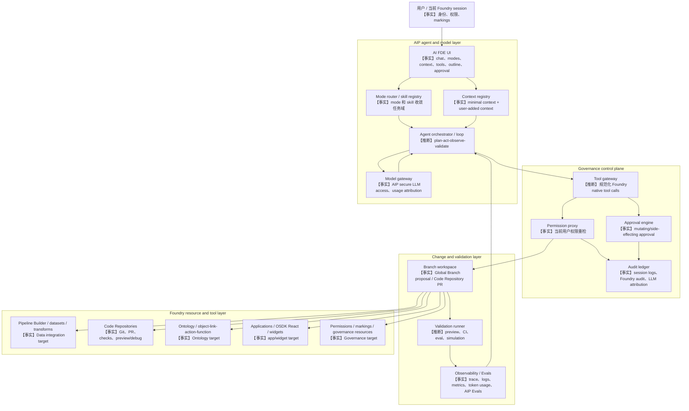

# Palantir AI FDE 综合结论、证据校验与自建方案

**关联 Issue：** #27
**父 Issue：** #20
**采集/综合日期：** 2026-05-30
**输入文档：** `docs/raw/32-ai-fde-source-map.md`、`docs/raw/33-ai-fde-product-positioning.md`、`docs/raw/34-ai-fde-context-tools-skills.md`、`docs/raw/35-ai-fde-governance-branching.md`、`docs/raw/36-ai-fde-architecture-design.md`、`docs/raw/37-ai-fde-self-build-implementation-blueprint.md`

---

## 1. 总判断

1. 【事实】Palantir AI FDE 是 Palantir 官方定义的 "AI-powered forward deployed engineer"：一个在 Foundry 内通过自然语言驱动 Foundry 原生操作的交互式 agent，覆盖数据转换、Code Repositories、Ontology、Functions、Governance、Machine Learning、OSDK React 和 Platform Q&A 等任务域。
2. 【事实】AI FDE 不是独立 bot 或 service account；它在当前用户 Foundry authenticated session 下执行，继承用户权限、markings、session access、audit logging 和 LLM usage attribution。
3. 【事实】AI FDE 的可信边界来自 mode/skill、显式 context、tool selection、tool approval、Global Branching / Code Repository PR、preview/CI/evals、audit logs 的组合，而不是来自 LLM 自身的可靠性声明。
4. 【推断】AI FDE 的产品定位应表述为“平台内受治理约束的工程执行入口”，而不是“通用聊天助手”或“自动替代人类 FDE”。推理链：官方文档同时确认 native tools、branch/proposal/PR、approval、preview/CI 和当前用户权限；这些都指向工程执行闭环。
5. 【推断】AI FDE 的可能架构核心是：AIP model gateway + agent orchestrator + context registry + mode/skill policy + Foundry tool gateway + permission proxy + approval engine + branch workspace + validation runner + audit/eval/observability。推理链：AIP 架构公开 12 类底座能力，AI FDE 文档公开了上下文、工具、权限、审批、分支和验证行为，但未公开内部服务拓扑。
6. 【推断】自建类 AI FDE 的首要任务不是接一个 LLM 聊天窗口，而是先建设可审计、可审批、可回滚、可验证的平台工具执行面。缺少身份透传、权限重检、分支隔离、审批、验证和审计时，只能称为平台助手或工程 copilot，不应称为类 AI FDE。
7. 【猜测】Palantir 内部是否复用 MCP tool schema、是否有统一 agent state machine、context bundle schema、approval policy schema、correlation id 或特定 planner/runtime，公开资料均未披露；本报告不把这些作为事实前提。

---

## 2. 功能定位

### 2.1 AI FDE 是什么

【事实】AI FDE 是 Foundry 内置的交互式 agent。用户通过对话发起任务，AI FDE 分析 intent 与 context，确定 Foundry operations，调用 native tools 执行，并把结果、解释和相关文档反馈给用户。

【事实】AI FDE 依赖 AIP enabled enrollment；Palantir 建议为 Ontology edits 启用 Global Branching，以便通过 branch proposal 审查变更。

【事实】AI FDE 的公开 modes 包括 Data integration、Data connection、Ontology editing、Functions editing、Exploration、Governance、Machine learning、OSDK React 和 Platform Q&A。

【推断】AI FDE 的用户价值是压缩三类 Foundry 工程知识：知道应该在哪个工具里做、知道如何把自然语言任务转成平台资产变更、知道如何通过 preview/CI/proposal/PR 验证和交付。

### 2.2 它不是什么

【事实】AI FDE 不能超过当前用户权限，也没有独立 service account 或额外权限。

【推断】AI FDE 不是 AIP Assist。AIP Assist 更偏平台帮助、文档问答和导航支持；AI FDE 更偏受控执行 Foundry 原生操作。

【推断】AI FDE 不是 AIP Chatbot Studio。Chatbot Studio 是构建业务 chatbot/assistant 的平台；AI FDE 是 Palantir 预置的 Foundry 工程 agent。

【推断】AI FDE 不是 AIP Analyst。AIP Analyst 以 Ontology-first ad-hoc analysis、SQL、object sets、visualization 和 action execution 为主；AI FDE 以平台资产构建、修改、验证和 proposal/PR 交付为主。

【推断】AI FDE 不是 Palantir MCP。MCP 是外部 AI IDE/agent 接入 Foundry context/tools 的协议和工具桥；AI FDE 是平台内置 UX、session、approval、branching 和 audit 集成的专用 agent 应用。

【推断】AI FDE 也不是人类 FDE 的替代。human FDE 是贴近客户问题、做需求澄清、组织协同、架构取舍和交付负责的工程方法；AI FDE 只覆盖可工具化、可审查、可验证的 Foundry 操作子集。

### 2.3 稳定产品边界

| 边界 | 综合结论 |
|---|---|
| 操作范围 | 【事实】围绕 Foundry assets 和 workflows：datasets/transforms、Code Repositories、Ontology、Functions、Governance、ML、OSDK React、Platform Q&A。 |
| 身份边界 | 【事实】使用当前用户 Foundry session；权限错误与用户手工操作一致。 |
| 上下文边界 | 【事实】初始只加载最小 Foundry 概念上下文；用户通过 resources、docs、media、branches、search tools 等显式扩展。 |
| 工具边界 | 【事实】用户可配置 tools；read-only 可自动批准，mutating/default branch/unbranched/side-effecting 操作触发审批。 |
| 交付边界 | 【事实】默认使用 branching，通过 Global Branch proposal 或 Code Repository pull request 提交 review。 |
| 验证边界 | 【事实】可运行 transform preview、function preview、查看 Code Repository CI checks；AIP Evals/observability 是相邻验证与观测底座。 |
| 责任边界 | 【推断】AI FDE 产出草案、修改、验证证据和提案，不应替代 owner review、合规解释、生产风险接受和组织决策。 |

---

## 3. 关键流程

### 3.1 交互闭环

【推断】AI FDE 的公开行为可以抽象为以下流程：

```text
Intent
  -> Mode
  -> Context
  -> Tool plan
  -> Permission preflight
  -> Approval
  -> Execute
  -> Observe
  -> Validate
  -> Proposal / PR / Report
```

【事实】官方明确 AI FDE 会分析用户意图和上下文、选择 Foundry operations、使用 native tools 执行、观察结果并继续决策。

【事实】官方明确 closed-loop operation 的验证例子包括 transform preview、function preview 和 Code Repositories CI checks。

【推断】Permission preflight 与 Approval 必须分开。permission 是服务端强制权限判断；approval 是用户允许 agent 代表自己尝试执行某个 mutating 或 side-effecting 操作。

### 3.2 Context 生命周期

【事实】AI FDE 初始只加载最小 Foundry 概念上下文，不访问用户数据；用户可添加 datasets、functions、branches、interfaces、action types、object types、documentation bundles、uploaded media、drag-and-drop links，或启用 search tools。

【事实】AI FDE chat outline 会记录 prompts、responses 和 tools used，并展示 token usage；用户可以 summary 或 removal 长会话内容。

【推断】自建时应把 context 建模为有来源、权限快照、labels、branch scope、token estimate、active/removed/summarized 状态的资源引用，而不是把检索结果直接拼接进 prompt。

### 3.3 Mode / Skill / Tool

【事实】Mode 是任务域路由：决定相关文档、工具、上下文和问题处理方式；用户可手选，agent 也可自动选择或中途切换。

【事实】Skill 是细粒度能力，分为 agent skills 和 domain skills；每个 skill 映射一个或多个具体 tools，并可启用或禁用。

【推断】Mode 应被实现成 policy bundle，包含 default documentation、allowed resource types、tool groups、approval defaults、validation expectations 和 proposal target。Skill 应被实现成 tool manifest 的上层能力单元，包含 preconditions、risk class、observable outputs 和 failure handling hints。

### 3.4 审批与变更落地

【事实】AI FDE 的默认审批触发包括 default branch 修改、unbranched change、可能产生 side effects 的操作，以及 ontology actions、publishing、creating tags 等高风险 mutating actions。

【事实】Branch-aware approval 允许 feature branch 上某些 file edits 或 dataset builds 更低摩擦执行，但 protected/default branch 仍需要更强审批。

【事实】Global Branching 支持跨 Pipeline Builder、Ontology、Workshop、Code Repositories 等应用在 branch 中端到端修改、测试，并通过 proposal merge 回 main。

【事实】Code Repositories 支持 sandbox branches、pull requests、protected branch policies、CI checks、review 和 security approval。

【推断】AI FDE 的变更落地模型应是 branch-first：agent 先在隔离 branch/sandbox 中修改和验证，再提交 proposal/PR，而不是自然语言直写生产。

---

## 4. 架构分层

### 4.1 综合架构



### 4.2 分层职责

| 层 | 关键模块 | 综合结论 |
|---|---|---|
| User/session | authenticated session、session markings、session access | 【事实】AI FDE 使用当前用户身份；session 只对创建者可见，并受 markings 影响。 |
| Model | model gateway、model enablement、rate limit、usage attribution | 【事实】AI FDE 依赖 AIP；LLM usage 归因到用户，模型启用和容量受 AIP 治理。 |
| Context | context registry、context pack、search/docs/resources/media | 【事实】context 用户可控；【猜测】具体 context packing、summary retention、token budgeting schema 未公开。 |
| Agent | mode router、skill registry、planner/loop、clarification | 【事实】modes/skills 公开；【推断】多步 loop 需要维护 tool state、observation state 和 branch state。 |
| Tools | tool manifest、tool gateway、adapters | 【推断】需要统一工具 schema、参数校验、risk class、result schema；【猜测】Palantir tool manifest 未公开。 |
| Governance | permission proxy、approval engine、audit ledger | 【事实】权限、审批、审计均是 AI FDE 安全边界；approval 不能替代 permission。 |
| Branching | Global Branch workspace、repo branch、proposal/PR、merge checks | 【事实】AI FDE 默认使用 branching，并通过 proposal/PR review。 |
| Validation | preview、CI checks、AIP Evals、simulation、observability | 【事实】preview/CI 被公开确认；【推断】统一 validation runner 是自建时合理抽象。 |
| Operations | trace/log/metrics/token dashboard、cost/rate limits、kill switch | 【事实】AIP observability 和 rate limits 是底座能力；【推断】自建必须补足运营门禁。 |

### 4.3 不应过度外推的架构点

1. 【猜测】AI FDE 内部是否有单一 agent runtime、task graph、统一 state machine 或固定 planner/replanner 策略，公开资料未披露。
2. 【猜测】AI FDE 是否复用 Palantir MCP 的 tool schema 或同一 tool gateway，公开资料只支持“相邻能力”和“可类比 secure interface”，不能证明同源实现。
3. 【猜测】AI FDE session logs、Foundry audit logs、AIP traces、eval runs、CI checks、PR/proposal 之间是否有统一 correlation id，公开资料未披露。
4. 【猜测】AI FDE 如何在 Global Branch、Dataset Branch、Code Repository branch、fallback branch 和 protected branch policy 之间做内部绑定，公开资料未披露。

---

## 5. 治理模型

### 5.1 双层门禁

【推断】AI FDE 的治理模型是“双层门禁”：

1. 【事实】服务端强制门禁：Foundry 权限、resource/project roles、markings、organizations、application access、AIP/model enablement、branch/repository policies、audit logs。
2. 【事实】Agent 交互门禁：context/tool selection、mode/skill scope、tool approval、branch-aware approval、session-level scoped pre-approval、chat outline。

【推断】双层门禁的关键点是：LLM 可以建议下一步，但不能决定自己是否有权限，也不能绕过审批、分支保护或合并门禁。

### 5.2 控制矩阵

| 控制点 | 结论 |
|---|---|
| 身份 | 【事实】所有操作使用当前用户 Foundry session；无 service account 或 privilege escalation。 |
| 权限 | 【事实】AI FDE 操作受 Foundry permissions、application/data access、branching controls 和 audit logging 约束。 |
| Markings/session | 【事实】AI FDE session 只允许创建者访问，并应用用户有权访问的 markings；失去 marking 权限会失去 session access。 |
| Context | 【事实】AI FDE 只访问加入 chat 的 context 或启用 search tools 后可找到的上下文。 |
| Approval | 【事实】mutating/default-branch/unbranched/side-effecting actions 需要审批；read-only 搜索和读取定义可自动批准。 |
| Branch | 【事实】Global Branching 隔离跨应用变更；Code Repository protected branch 只能通过 PR 修改。 |
| Review | 【事实】proposal/PR 合并受 approval policies、CI checks、reviewers、security approval、merge checks 约束。 |
| Audit | 【事实】AI FDE 活动进入 AI FDE session logs 和标准 Foundry audit logs；LLM usage 归因到用户。 |
| Rate/cost | 【事实】AIP 提供 model/enrollment rate limits 和 usage attribution；AI FDE 高频并发操作可能造成基础设施压力。 |

### 5.3 自建最低安全门槛

1. 【推断】必须使用用户身份透传或 delegated token，禁止共享高权 token。
2. 【推断】每次 tool call 必须在服务端重检 resource role、tenant/org、sensitivity label、branch scope 和 action permission。
3. 【推断】所有写操作默认进入 feature branch/sandbox；main/protected/production 默认禁止直接写。
4. 【推断】审批 UI 必须展示 tool、目标资源、branch、diff/side effects、执行身份、验证计划和回滚方式。
5. 【推断】PR/proposal gate 必须独立于 agent，合并前满足 review、CI/checks、安全审批和冲突检查。
6. 【推断】audit ledger 必须记录 prompt、context、tool plan、approval decision、execution result、diff、validation、usage 和 correlation id。
7. 【推断】必须具备 revoke pre-approval、freeze/do-not-merge、kill running tool、rollback branch 等人工 override。

---

## 6. 自建实现方案

### 6.1 建设原则

1. 【推断】先做受控工程副驾驶，不做自治平台工程师。
2. 【推断】先做只读和 branch-local，再扩展到 ontology/action/publishing/tagging 等高风险能力。
3. 【推断】先建设平台原生执行授权，再接外部 Agent 框架做规划和语言交互。
4. 【推断】每个 agent 中间步骤都要沉淀为系统对象：context item、tool call、approval decision、validation run、audit event、PR/proposal。
5. 【推断】最终输出必须引用验证证据或明确无法验证原因，不允许只报告“模型认为已完成”。

### 6.2 必建模块

| 模块 | 最小职责 | 归属判断 |
|---|---|---|
| Agent Orchestrator | 【推断】计划、调用工具、观察结果、重试或停止 | 可由外部 agent 框架实现，但只能通过平台 tool gateway 执行。 |
| Model Gateway | 【事实】模型白名单、路由、token/rate limit、usage attribution | 必须平台原生治理，可外接第三方 provider。 |
| Context Registry | 【推断】记录资源、文档、branch、tool outputs、summary、权限快照和 labels | 权限过滤必须平台原生；摘要/压缩可由 agent 辅助。 |
| Mode Router | 【事实】按任务域收敛 docs/tools/context | mode policy 必须配置化，分类可由 agent 辅助。 |
| Skill Registry | 【事实】skills 映射 tools，可启停 | tool manifest 和 risk class 应由平台维护。 |
| Tool Gateway | 【推断】schema validation、idempotency、adapter、result schema、error classification | 必须平台原生，外部 agent 不能直连底层写 API。 |
| Permission Proxy | 【事实】当前用户权限、labels、branch、resource scope 重检 | 必须平台原生强制。 |
| Approval Engine | 【事实】按 risk、branch、side effect、allowlist、TTL 触发审批 | 必须平台可信服务，不能由 LLM 自判。 |
| Branch Workspace | 【事实】branch/sandbox、diff、PR/proposal、merge gate、retention | 必须与代码/资源系统深度集成。 |
| Validation Runner | 【推断】preview、dry-run、tests、CI、eval、simulation 汇总 | 必须接入确定性验证系统。 |
| Audit Ledger | 【事实】session logs、Foundry audit、LLM usage attribution 类能力 | 必须不可被 agent 篡改。 |
| Evals/Observability | 【事实】trace、logs、metrics、token usage、eval suites | 平台原生为主，agent 上报 spans/metrics。 |

### 6.3 最小接口

【猜测】以下是自建时需要设计的接口，不是 Palantir 公开 API：

| 接口 | 最小职责 |
|---|---|
| `ContextBundleService` | 构造权限过滤、可裁剪、带 labels/token budget 的 context bundle。 |
| `ToolManifestRegistry` | 注册 tool name、input/output schema、risk class、branch policy、approval policy、audit category。 |
| `PermissionPreflightApi` | 对计划中的 tool calls 做批量权限预检，返回 allowed/denied/requires-approval 和原因。 |
| `ApprovalDecisionApi` | 记录单次 tool call、session-level allowlist、branch/project scoped approval 的用户决策。 |
| `BranchWorkspaceResolver` | 解析或创建 Global Branch、repo branch、fallback branch、target branch/proposal/PR。 |
| `ToolExecutionJournal` | 记录 arguments、approval id、user/session、resources、result/error、trace ids、audit ids。 |
| `ValidationRunApi` | 触发 preview、CI、eval、simulation 并回收证据。 |
| `ProposalSynthesisApi` | 将 branch diff、验证证据、风险和回滚说明汇总成 PR/proposal。 |
| `TelemetryCorrelationApi` | 关联 session、message、tool call、audit event、trace、eval、CI、PR/proposal。 |

### 6.4 平台原生 vs 外部 Agent 框架

【推断】平台原生必须负责执行授权：身份、权限、labels、工具 schema、审批、分支、验证、审计、模型治理、rate/cost limit、kill switch。

【推断】外部 Agent 框架适合负责认知编排：planner/replanner、prompt templates、tool selection heuristic、clarification policy、branch-local code edit loop、summarization、PR/proposal 文案、eval case generation。

【推断】边界原则是：agent 可以提出计划和调用受控工具，但不能绕过平台 gateway 直接写资源，也不能自证安全或自批高风险动作。

---

## 7. 90 天 PoC

| 阶段 | 时间 | 范围 | 退出标准 |
|---|---:|---|---|
| P0 只读探索 | Day 1-15 | 【推断】文档、资源目录、元数据、权限内搜索；Exploration / Platform Q&A；context registry；read-only tools；audit | 【推断】能回答“看到了什么、为什么能看、用了哪些工具”，且不同权限用户看到不同资源。 |
| P1 分支内代码修改 | Day 16-35 | 【推断】单 repo / 单项目 branch-local file edits；branch workspace；patch generation；approval engine v1；PR draft | 【推断】所有写入限于 feature branch，生成可审查 PR 草案，main/protected 写入被拒绝或强审批。 |
| P2 Preview / CI validation | Day 36-55 | 【推断】transforms/functions/app code 的 preview、unit test、CI checks、失败修复 loop | 【推断】PR/proposal 描述引用 validation ids、CI urls、preview samples 或明确失败原因。 |
| P3 Ontology / Function / Tool 扩展 | Day 56-75 | 【推断】ontology schema 草案、function edits、governance diagnosis、tool manifest registry v1、risk-based approval | 【推断】高风险变更只生成 proposal/PR；action/publish/tag/security changes 每次审批。 |
| P4 Evals 和运营化 | Day 76-90 | 【推断】golden tasks、eval dashboard、trace correlation、SLO、rate/cost limit、kill switch、runbook | 【推断】可度量成功率、失败原因、审批耗时、token/compute 成本、安全事件，并能演练 freeze/revoke/rollback。 |

### 7.1 Go / No-go 门槛

1. 【推断】无身份透传则 No-go。
2. 【推断】无上下文权限过滤和审计则 No-go。
3. 【推断】agent 可写 main/protected branch 则 No-go。
4. 【推断】无 review artifact 则 No-go。
5. 【推断】无验证证据却输出“已通过”则 No-go。
6. 【推断】无 eval/owner gate 就开放 ontology/action/publishing/tagging 则 No-go。
7. 【推断】无 kill switch、revoke approval、audit export 和 runbook 则 No-go。

---

## 8. 风险清单

| 风险 | 影响 | 缓解 | 可信度 |
|---|---|---|---|
| 权限绕过或共享高权 token | 数据泄露、越权写入、审计失真 | 用户身份透传、服务端权限重检、禁止 service account 自动化 | 【事实】 |
| 上下文污染 | 模型使用过期、无关或无权限信息决策 | context registry、active/removed 状态、mode-scoped context、token budget | 【推断】 |
| Prompt injection 触发危险工具 | 高风险写入或外发 | tool gateway schema validation、risk class、approval、branch restriction | 【推断】 |
| 用户盲批 | 用户未理解 side effects 就批准 | approval UI 展示 diff、目标资源、branch、影响、回滚和验证计划 | 【推断】 |
| Branch 语义混乱 | 在错误分支验证，或误用 fallback 数据 | branch workspace resolver、fallback 记录、validation evidence 标注输入版本 | 【推断】 |
| 验证假阳性 | preview/CI 通过但业务语义错误 | eval suite、owner review、sample inspection、rollout gate | 【推断】 |
| 构建风暴和成本失控 | compute/storage/network/LLM token 成本异常 | per-user/session rate limits、build queue quota、token budget、kill switch | 【事实】 |
| 审计不可关联 | 事故后无法追踪 prompt 到资源变更 | unified correlation id、audit ledger、trace/log/export | 【推断】 |
| 模型供应商合规差异 | 数据流、保留、训练、地域不满足合规 | model gateway policy、provider allowlist、组织级模型配置 | 【事实】 |
| 外部 Agent 框架过度自治 | 绕开平台门禁直接调用底层 API | 只暴露受控 tool gateway，底层 API 强制 authz/audit | 【推断】 |
| 产品边界过度承诺 | 用户误以为 agent 可替代 owner 审批或生产责任 | UI 和文档明确“草案/PR/proposal/需审查”状态 | 【推断】 |
| 内部机制误读 | 把公开资料未披露的 Palantir 实现当事实 | 严格使用【事实】/【推断】/【猜测】和证据缺口 | 【事实】 |

---

## 9. 证据缺口

1. 【猜测】AI FDE 内部 agent orchestrator、planner/replanner、state machine、memory schema、retry budget、rollback strategy 未公开。
2. 【猜测】AI FDE context bundle schema、token budgeting、summary retention、search ranking、resource summarization、敏感字段裁剪算法未公开。
3. 【猜测】AI FDE tool manifest、参数 schema、错误码、幂等策略、tool result schema、risk class 完整清单未公开。
4. 【猜测】Permission preflight 是否支持批量 dry-run、policy explanation、branch-aware reason code 未公开。
5. 【猜测】Approval policy schema、session-level pre-approval 的 TTL、撤销语义、持久化格式和 UI 必填字段未公开。
6. 【猜测】Global Branch、Dataset Branch、Code Repository branch、fallback branch、PR/proposal 在 AI FDE 内部如何统一绑定未公开。
7. 【猜测】AI FDE session logs、Foundry audit logs、AIP observability traces、AIP Evals run、Code Repository checks、PR/proposal 是否存在统一 correlation id 未公开。
8. 【猜测】AI FDE 与 Palantir MCP 是否复用内部 tool schema 或 gateway 未公开；只能确认 MCP 是外部 agent/IDE 的相邻能力。
9. 【事实】AI FDE / AIP feature availability may change and may differ between customers；所有结论需要在目标 Foundry enrollment 中复核。
10. 【推断】自建路线还缺目标平台 API inventory、权限模型、branch/CI/eval 现状、真实用户 golden tasks 和安全/合规验收标准。

---

## 10. 一致性审查

| 审查项 | 结论 |
|---|---|
| 功能定位一致性 | 【事实】#32、#33、#34、#35、#36、#37 均把 AI FDE 定义为 Foundry 内部操作 agent，不是通用 chatbot。 |
| 身份与权限一致性 | 【事实】#32、#35、#36、#37 均确认 AI FDE 使用当前用户 session，不使用独立 service account。 |
| Context/Mode/Skill 一致性 | 【事实】#32、#34、#36、#37 均确认 minimal context、用户显式添加 context、modes 和 skills。 |
| Branch/Review 一致性 | 【事实】#33、#35、#36、#37 均确认默认 branching，并通过 Global Branch proposal 或 Code Repository PR review。 |
| Validation 一致性 | 【事实】#33、#34、#36、#37 均确认 preview/CI checks；AIP Evals 作为相邻验证底座被 #36/#37 使用。 |
| 架构推断边界 | 【推断】#36 和 #37 的模块划分一致，但它们均承认 orchestrator、tool schema、context bundle、correlation id 是未公开实现细节。本文保留为【推断】或【猜测】。 |
| 过度外推降级 | 【猜测】“AI FDE 复用 MCP schema”、“统一 agent runtime”、“统一 correlation id”、“自动验证策略引擎”、“完整 approval policy schema”等均证据不足，已放入证据缺口。 |
| 潜在张力 | 【推断】#34 强调用户只访问加入 chat 的 context，#35 强调 search tools 与权限过滤；二者不矛盾，但自建时必须把 search result 先作为候选 context，经权限过滤和选择后再进入 active context。 |

---

## 11. issue/source index

### 11.1 Issue index

| Issue | 角色 | 输出 / 回链 |
|---|---|---|
| #20 | Coordinator / parent tracking | `docs/superpowers/plans/2026-05-30-palantir-ai-fde-research-plan.md` |
| #21 | Agent B：功能定位与产品边界 | `docs/raw/33-ai-fde-product-positioning.md` |
| #22 | Agent A：资料源与术语基线 | `docs/raw/32-ai-fde-source-map.md` |
| #23 | Agent C：交互、上下文、modes、skills、tools | `docs/raw/34-ai-fde-context-tools-skills.md` |
| #24 | Agent F：自建实现方案与 PoC | `docs/raw/37-ai-fde-self-build-implementation-blueprint.md` |
| #25 | Agent E：架构设计推断 | `docs/raw/36-ai-fde-architecture-design.md` |
| #26 | Agent D：治理、审批、分支 | `docs/raw/35-ai-fde-governance-branching.md` |
| #27 | Agent G：综合、证据校验与最终交付 | `docs/synthesis/palantir-ai-fde-research.md` |

### 11.2 Raw source index

| 路径 | 本文使用方式 |
|---|---|
| `docs/raw/32-ai-fde-source-map.md` | 术语边界、官方资料源矩阵、可信度标签、证据缺口基线。 |
| `docs/raw/33-ai-fde-product-positioning.md` | 功能定位、产品边界、相邻产品比较、设计原则。 |
| `docs/raw/34-ai-fde-context-tools-skills.md` | intent -> mode -> context -> tool plan -> approval -> execute -> observe -> validate -> proposal 流程。 |
| `docs/raw/35-ai-fde-governance-branching.md` | 身份、权限、markings、approval、Global Branching、Code Repository PR、audit、LLM usage attribution。 |
| `docs/raw/36-ai-fde-architecture-design.md` | AIP/Foundry 架构映射、模块分层、未公开接口和架构证据缺口。 |
| `docs/raw/37-ai-fde-self-build-implementation-blueprint.md` | 自建参考架构、平台原生 vs agent 框架边界、90 天 PoC、风险清单。 |

### 11.3 Official source index

| 来源 | URL | 覆盖 |
|---|---|---|
| AI FDE Overview | https://www.palantir.com/docs/foundry/ai-fde/overview | 定义、启用要求、closed-loop、branch/proposal/PR、验证示例。 |
| AI FDE Navigation | https://www.palantir.com/docs/foundry/ai-fde/navigation | session、context、tools、approval、chat outline、token usage。 |
| AI FDE Modes and skills | https://www.palantir.com/docs/foundry/ai-fde/modes-and-skills | modes、skills、mode switching、tool/document scoping。 |
| AI FDE Security and governance | https://www.palantir.com/docs/foundry/ai-fde/security-and-governance | 当前用户身份、权限继承、approval、session access、audit、LLM attribution。 |
| AI FDE Best practices | https://www.palantir.com/docs/foundry/ai-fde/best-practices | 限制 context/tools、生产前验证、AIP Evals、基础设施压力。 |
| AIP Architecture | https://www.palantir.com/docs/foundry/architecture-center/aip-architecture | AIP 12 类能力、secure LLM、context engineering、tools、governance、agent lifecycle、enterprise automation。 |
| AIP Features | https://www.palantir.com/docs/foundry/aip/aip-features | AIP Assist、Chatbot Studio、AIP Evals、AIP Threads、Palantir MCP 等生态能力。 |
| AIP Assist | https://www.palantir.com/docs/foundry/assist/overview | 平台帮助、文档问答、自定义内容源，与 AI FDE 的边界。 |
| AIP Chatbot Studio | https://www.palantir.com/docs/foundry/chatbot-studio/overview | 构建可部署 AIP Chatbots，与 AI FDE 的边界。 |
| AIP Analyst | https://www.palantir.com/docs/foundry/aip-analyst/overview | Ontology-first ad-hoc analysis，与 AI FDE 的边界。 |
| Palantir MCP | https://www.palantir.com/docs/foundry/palantir-mcp/overview | 外部 AI IDE/agent 接入 Foundry 的相邻能力。 |
| Palantir MCP Security | https://www.palantir.com/docs/foundry/palantir-mcp/security | in-platform/local MCP 数据流、approval/proposal review、安全边界。 |
| Global Branching | https://www.palantir.com/docs/foundry/global-branching/overview | 跨应用 branch、端到端测试、proposal merge。 |
| Code Repositories | https://www.palantir.com/docs/foundry/code-repositories/overview/index.html | Web IDE、Git、PR、checks、preview/debug、protected branch。 |
| AIP Observability | https://www.palantir.com/docs/foundry/aip-observability/overview | traces、logs、metrics、token usage、prompt/error details。 |
| AIP Evals | https://www.palantir.com/docs/foundry/aip-evals/overview/ | LLM-backed functions 测试、debug、模型比较、variance 分析。 |
