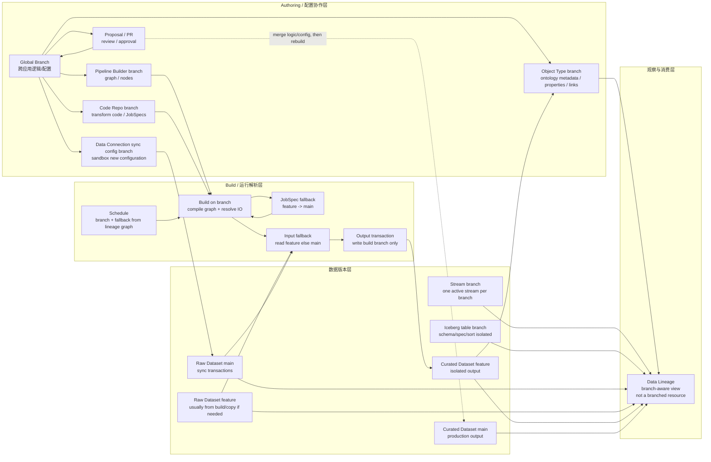

# Palantir DataIntegration 分支模型应用调研

**日期：** 2026-06-22  
**范围：** 重新对齐 Palantir 官方 `Data connectivity & integration` 语义，覆盖 Dataset、Build、Pipeline Builder、Code Repositories、Data Connection、Schedules、Data Lineage、Streams、Iceberg tables。  
**证据边界：** 官方公开资料能确认产品语义和用户可见行为；不能确认内部表结构、SyncRun/BuildRun 全量字段、Data Connection batch sync 是否可显式写任意 feature dataset branch。

## 摘要与洞察

1. 【事实】Palantir 在 DataIntegration 中的分支模型核心不是“Git 分支”，而是 `Dataset branch + Build branch + Global/Pipeline/Code branch` 的组合；数据版本、执行解析和协作审批分别落在不同层。
2. 【事实】Dataset branch 是 transaction 指针，支持创建、从父分支或 transaction 派生、提交 transaction、删除 branch pointer；不支持直接 merge dataset branches。
3. 【事实】Build 是分支模型落地到数据生产的关键应用：JobSpec 从 build branch 或 fallback branch 读取，input dataset 从 build branch 或 fallback branch 读取，output dataset 只写 build branch。
4. 【事实+推断】Data Connection 使用分支主要服务“新 sync 配置的沙箱测试”和“sync 产出 dataset transaction 的版本血缘”；不要把它等同于 Pipeline/Build 的任意 output branch 写入能力。
5. 【事实+建议】Branch fallback 不是单一全局约定：Pipeline Builder 和 Code Repositories 有按 branch 配置入口，Build/Schedule 消费这些配置，Lineage Global Branch 视图则禁用 dataset fallback 展示。

## 1. DataIntegration 相关概念

本章先把后文会用到的 DataIntegration 概念拆开。核心原则是：**Dataset/Transaction 描述数据版本，Build/JobSpec 描述执行，Pipeline Builder/Code Repository 描述逻辑协作，Data Lineage/Ontology 描述观察与消费**。这些概念都可能暴露 “branch” 字样，但含义和边界不同。

### 1.1 数据版本层

| 概念 | 定义 | 例子 | 说明 |
|---|---|---|---|
| Dataset | Foundry 中承载数据的基础对象，本质是对底层文件集合和相关元数据的封装，支持权限、schema、版本和更新。 | `raw_orders` 保存从 ERP 同步来的订单；`customer_features` 保存清洗后的客户特征。 | Dataset 是数据容器，不等于一次运行结果；一次运行通常会写出新的 transaction。 |
| Dataset view | 用户打开 Dataset 看到的行列数据通常是某个 branch 上最新 committed transaction 对应的 view。 | 打开 `customer_features@main` 看到最新生产数据。 | 排障时要问“看的是哪个 branch/view”，不能只说“看 Dataset”。 |
| Transaction | Dataset 的一次原子修改，生命周期通常包括 open、commit、abort；commit 后进入该 branch 的最新 view。 | 一次 Data Connection sync 写入 `raw_orders` 的新文件并 commit transaction。 | 它接近 Git commit，但对象是数据文件变更，不是代码 diff。 |
| Dataset branch | 指向某个 Dataset 最新 transaction 的 branch pointer；不同 branch 的 transaction pointer 独立演进。 | `customer_features@feature-x` 指向 feature 分支上的实验结果，`customer_features@main` 指向生产结果。 | 官方语义不支持直接 merge dataset branches；把实验数据带回主线通常要在 main 重算或显式写新 transaction。 |

### 1.2 执行与解析层

| 概念 | 定义 | 例子 | 说明 |
|---|---|---|---|
| Build | 计算 Dataset 新版本的机制，负责 orchestration、输入解析、输出写入和 build locking。 | 对 `customer_features` 触发一次 build，读取 `raw_orders`、写出 `customer_features` 新 transaction。 | Build 是分支 fallback 落地的关键层，不只是“跑一个任务”。 |
| Job | Build 中的工作单元，由共享逻辑定义，可计算一个或多个 output datasets。 | 一个 Python transform job 同时产出 `customer_features` 和 `customer_quality_metrics`。 | 如果一个 job 定义多个输出，通常要一起更新，不能只 build 其中一部分。 |
| JobSpec | 描述如何构造 Job 的定义，包括输入依赖和执行逻辑；代码或低码逻辑发布后形成 JobSpec。 | Code Repository 中提交 transform 后发布 `customer_features` 的 JobSpec。 | Build 会先编译 build graph，JobSpec 也会按 branch/fallback 解析。 |
| InputSpec | JobSpec 中声明的输入 Dataset 依赖及读取范围。 | `customer_features` 的 InputSpec 声明读取 `raw_orders` 和 `customer_master`。 | InputSpec 指定“要读什么”，运行时还要解析“从哪个 branch/transaction 读”。 |
| Build branch | 一次 build 指定的运行 branch；JobSpec、input、output 都围绕该 branch 和 fallback chain 解析。 | `Build(feature-x)` 优先读 `feature-x` 的 JobSpec 和 input Dataset。 | output transaction 只写 build branch；input 可以 fallback，output 不会隐式写 fallback branch。 |
| Fallback chain | 当前 branch 对应的有序 fallback branch 列表，用于 JobSpec 和 input Dataset 找不到当前 branch 版本时继续查找。 | `feature-x -> integration -> main`。 | 配置粒度主要是 branch/workflow 级；命中结果是逐 input dataset 解析出来的。 |
| Resolved branch | 某个 input 或 JobSpec 最终实际命中的 branch。 | 请求读 `raw_orders@feature-x`，但不存在，于是 resolved branch 是 `main`。 | 审计字段必须区分 `requested_branch` 和 `resolved_branch`，否则解释不了 fallback。 |

### 1.3 逻辑协作层

| 概念 | 定义 | 例子 | 说明 |
|---|---|---|---|
| Pipeline Builder | Palantir 的低码 pipeline 构建工具，图中的节点、转换逻辑和 branch 配置可以协作修改。 | 在 Pipeline Builder 的 `feature-x` branch 中改 join 节点和输出 Dataset。 | 它的 branch merge 合并的是 pipeline 逻辑/配置，不是已经写出的 Dataset transaction。 |
| Code Repository | 高码 transform 的代码仓库；commit transform 代码后发布 JobSpecs，build 系统据此执行。 | 在 `feature-x` 代码分支中修改 Python transform，并触发 preview/build。 | Code branch、build branch、Dataset branch 要分开看；同名只是协作约定，不代表同一对象。 |
| Global Branch | 跨应用的协作分支，用于在 Pipeline Builder、Ontology、部分 Code Repository 等资源上形成一致的 proposal/review 流程。 | 一个 `feature-x` 同时修改 Pipeline Builder 逻辑和 Customer Object Type 元数据。 | Global Branch 是配置/元数据协作入口，不是 Dataset branch 的同义词。 |
| Proposal / PR | 把 branch 上的逻辑或元数据变更提交给主线的评审与合并流程。 | 合并 `feature-x` 的 Pipeline Builder proposal 到 `main`。 | 合并 proposal 后，生产数据仍通常需要在 main 上 rebuild/reindex。 |

### 1.4 接入、调度与观察层

| 概念 | 定义 | 例子 | 说明 |
|---|---|---|---|
| Data Connection | 用于从外部系统或其他 Foundry 实例同步数据，也支持 outbound connection、webhook、export 等。 | 从 PostgreSQL 同步 `orders` 表到 `raw_orders` Dataset。 | 它更像 raw data producer + sync 配置管理，不应直接等同于 Transform build 的任意 output branch 写入能力。 |
| Source | Data Connection 中描述外部系统连接的对象。 | PostgreSQL source、S3 source、Salesforce source。 | Source 关心连接、认证、网络和外部系统边界。 |
| Sync | Data Connection 中把 source 数据同步到 Foundry 的任务/配置。 | 每小时从 PostgreSQL `orders` 表同步增量到 `raw_orders`。 | Sync 产出 Dataset transaction，可进入 lineage；sync 配置可以 sandbox，但公开资料未确认 batch sync 可任意写 feature Dataset branch。 |
| Schedule | 周期性触发 build 的机制，保持数据持续流动。 | 每天 02:00 触发从 raw 到 curated 的 production build。 | Schedule 触发 build，不是自己重新定义 fallback；创建时会受 Data Lineage graph 中 branch/fallback 选择影响。 |
| Data Lineage | 展示 Dataset、pipeline、Ontology 连接关系、build 状态、preview、staleness 等的观察应用。 | 在 graph 中看 `raw_orders -> customer_features -> Customer Object Type`。 | Data Lineage graph 本身不是 branched resource；Global Branch 视图下还会禁用 dataset fallback display。 |
| Stream / streaming dataset | 用于连续写入和读取流式数据的 Dataset/Stream 能力；API 可按 branchName 访问 stream。 | 设备遥测写入 `sensor_events@main` 的 active stream。 | 公开 API 语义更接近精确 branch 访问，未见自动 fallback。 |
| Iceberg table | Foundry Iceberg catalog 中的表格式对象；在 Foundry build context 中 schema、partition spec、sort order 可按 branch 隔离。 | 在 `feature-x` 测试新增列和 partition spec，不污染 `main`。 | Iceberg 原生 branch merge 与 Foundry branch-scoped metadata 不是一回事。 |
| Object Type | Ontology 中面向业务对象的类型定义，通常由 Dataset 或其他 datasource 支撑。 | `Customer` Object Type 由 `customer_features` 映射而来。 | Object Type branch 管 metadata/schema/link，Dataset branch 管数据版本；二者通过 backing datasource 和 indexing 协作。 |

### 1.5 概念之间的最小链路

一个典型 DataIntegration 链路可以这样读：

```text
External system
  -> Data Connection Source / Sync
  -> Raw Dataset transaction
  -> Pipeline Builder or Code Repository logic
  -> JobSpec
  -> Build(branch + fallback chain)
  -> Curated Dataset transaction
  -> Object Type indexing
  -> Data Lineage / Ontology branch view
```

例子：

```text
PostgreSQL orders
  -> Data Connection sync
  -> raw_orders@main transaction T10
  -> Code Repository transform customer_features.py
  -> JobSpec(customer_features)
  -> Build(feature-x, fallback=[main])
       input raw_orders: requested feature-x, resolved main/T10
       output customer_features: write feature-x/T23
  -> Customer Object Type(feature-x metadata)
  -> Data Lineage shows branch state without auto-mixing fallback data
```

这条链路解释了后文最重要的边界：**执行层可以因为 fallback 形成“feature 逻辑 + main 输入 + feature 输出”的运行事实；观察层不能把 main 输入伪装成 feature 数据。**

## 2. Palantir 分支模型总览

Palantir 官方把 Branching 放在 `Data connectivity & integration / Core concepts` 下，而不是只放在开发工具链下。这说明分支是 DataIntegration 的生产控制面能力。它由三类分支共同组成：

| 分支层 | 主体 | 在 DataIntegration 中解决什么问题 | 不解决什么问题 |
|---|---|---|---|
| Dataset branch | Dataset transaction pointer | 数据版本隔离、历史 view、branch-specific preview/build history/staleness | 不做 Git 式数据 merge。 |
| Build branch | Foundry build system | 把逻辑分支和数据分支绑定；解析 JobSpec、input、output、fallback | 不允许 output 偷写其他 branch；不在 input dataset 上自动建 branch。 |
| Authoring branch | Global Branch、Pipeline Builder branch、Code Repository branch | 低码/高码/跨应用配置协作、proposal/PR/review/approval | merge 的是逻辑/配置，不是已产出的 dataset transaction。 |

最容易误判的点是：用户看到的是一个 “branch” 入口，但内部至少跨了三套对象。`Global Branch` 可以 merge 回 `main`，`Dataset Branch` 不能 merge，`Build branch` 是运行时解析边界。

## 3. DataIntegration 中的分支应用

| 应用场景 | Palantir 对象 | 分支如何应用 | fallback | merge / 发布语义 | 可信度 |
|---|---|---|---|---|---|
| 数据版本隔离 | Dataset | branch 是最新 transaction 指针；每个 branch 的 transaction/view 独立演进。 | 作为 build input 时参与 fallback。 | Dataset branch 不支持 merge；带回主线应重算、copy 或 promote 成新 transaction。 | 高 |
| 构建隔离 | Build / JobSpec | 每次 build 在用户指定 branch 上运行；output transaction 写 build branch。 | JobSpec 和 input dataset 都可按 fallback chain 解析。 | build 本身不 merge；merge 后需在 main 重新 build。 | 高 |
| 低码协作 | Pipeline Builder | pipeline branch 是 graph/节点逻辑副本；可 proposal merge 到 main。 | input dataset 可配置 fallback branches；默认 branch 自动作为 fallback。 | proposal 合并 pipeline 逻辑。 | 高 |
| 高码协作 | Code Repositories | sandbox branch 上修改 transform；commit 发布 JobSpecs；可 preview/test/build/PR。 | build graph 可读 fallback JobSpecs；input dataset 可 fallback。 | PR / proposal 合并代码；Global branch 仅支持部分 repo 类型。 | 高 |
| 接入配置沙箱 | Data Connection source/sync config | sync metadata 与 sync definition 可独立管理，因此新 sync 配置可在 branch 中 sandbox 测试。 | 不是数据 input fallback；主要是配置分支。 | 配置通过后影响下游 transform jobs。 | 高 |
| 接入数据版本 | Data Connection sync output dataset | sync task 产出离散 dataset transactions，可做 version lineage，解释哪个 sync task 产生哪个 dataset version。 | 下游 build 可 fallback 读取 raw dataset 主线版本。 | 公开资料未确认 batch sync 可显式写任意 feature branch。 | 中 |
| 调度分支 | Schedules / Data Lineage schedule editor | schedule 应用于 Data Lineage graph 中配置的 branch，包括 fallback branches。 | 有；创建 schedule 时 graph 的 branches/fallback branches 生效。 | schedule 触发 build，不是普通 proposal merge 资源。 | 高 |
| 血缘分支视图 | Data Lineage | 选择 Global Branch 后，graph 展示该 branch 的 dataset、ontology metadata、links、preview/build history/staleness。 | 特殊限制：Global Branch 视图禁用 dataset fallback display。 | Data Lineage graph 不是 branched resource，不能 merge。 | 高 |
| 流式分支 | Streaming dataset / stream / push API | streaming dataset 每个 branch 最多一个 active stream；创建 stream 可指定 branch；API 按 branchName 访问。 | 未见自动 fallback；branch 不存在或无 stream 返回 not found。 | stream branch 不做数据 merge。 | 高 |
| Iceberg 表隔离 | Foundry Iceberg catalog | Foundry build 中自动把 schema、partition spec、sort order 变成 branch-scoped。 | job branch context 自动注入；同一 job 单一 branch context。 | Iceberg 原生 branch merge 不携带 Foundry branch-scoped schema；应 merge code 后在 main rebuild。 | 高 |
| Restricted Views | Restricted Views beta | Global Branching integration 列出 Restricted Views beta。 | 公开资料未展开。 | 按 Global Branch resource 处理。 | 中 |
| 不支持或受限 | TypeScript v2/Python functions、Ontology SDK | Global Branching 明确这些当前不能作为 branch 上可修改代码；函数可引用特定版本测试。 | 不适用。 | 不能按普通 branched resource merge。 | 高 |

## 4. Data Connection 需要单独对齐

Data Connection 是这次最容易混淆的点。Palantir 官方对 Data Connection 的分支描述有两个直接含义：

1. 【事实】Data Connection framework 通过 dataset transactions 管理离散版本，支持跨时间的数据版本血缘，能解释哪些 sync tasks 产生了某个 dataset 的哪些 versions。
2. 【事实】sync metadata 可以独立于实际 sync definitions 管理，因此可以完整分支化新配置，让新 sync 在 branch 中 sandbox 测试，再影响下游 transformation jobs。

这两个事实不等于“Data Connection batch sync 可以像 Transform build 一样任意选择 output dataset feature branch”。保守模型应是：

```text
External system
  -> Data Connection source
  -> Sync config branch        # 配置沙箱、review、上线
  -> Sync run
  -> Raw Dataset transaction   # 版本血缘
  -> Pipeline/Build branch     # 下游隔离、fallback、feature output
```

因此 Data Connection 在分支模型中的角色更像“raw data producer + branchable config”，不是完整的“任意分支写入计算引擎”。如果自研平台把 Sync 输出 branch 和 Transform 输出 branch 做成同一套能力，需要额外设计外部源 cursor、credential、schedule、幂等和回放边界。

## 5. Fallback 机制对齐

### 5.1 Fallback 在哪些地方体现

| 位置 | 是否有 fallback | Palantir 语义 | 自研建模含义 |
|---|---:|---|---|
| JobSpec compilation | 有 | build branch 上没有某 output 的 JobSpec 时，从 fallback branch 读取。 | `run_job_spec.resolved_branch` 必须记录。 |
| Build input dataset | 有 | input 优先读 build branch，否则读 fallback chain 中第一个存在 branch。 | `run_input.requested_branch` 和 `run_input.resolved_branch` 必须分开。 |
| Build output dataset | 无输入式 fallback | output transaction 只写 build branch；branch 不存在时按 fallback ancestry 创建。 | output branch 是写入边界，不能隐式写 fallback branch。 |
| Pipeline Builder input | 有 | 每个 branch 可配置 fallback branches；默认 branch 自动作为 fallback。 | fallback 是 pipeline branch 配置，不是全局常量。 |
| Code Repositories authoring/build | 有 | Code branch 发布 JobSpecs；build graph 可 fallback；PB 可用同名 Code Repo branch 协同。 | 高码和低码要共享 DatasetRef 与 branch resolution。 |
| Schedule | 有 | schedule 应用于 Data Lineage graph 中配置的 branch，包括 fallback branches。 | schedule version 要保存 branch/fallback snapshot。 |
| Data Lineage Global Branch view | 限制性无 | 选中 Global Branch 时 dataset fallback branches disabled，只显示关联 dataset branch。 | UI 展示 branch 与执行 resolved branch 可能不同，必须显式提示。 |
| Stream API | 未见自动 fallback | 按 streamBranchName 精确访问；无 branch/stream/permission 返回 not found。 | 流式 branch 是精确地址，不是 fallback 查找。 |
| Data Connection sync config | 不是数据 fallback | 配置可 branch sandbox；不是 input dataset fallback。 | Sync 配置版本和 Sync 输出 transaction 分开。 |

### 5.2 Fallback 策略是全局约定还是有配置入口

结论：不是单一全局约定。Palantir 至少有三层来源：

| 层级 | 策略来源 | 配置入口 / 生效方式 | 说明 |
|---|---|---|---|
| 默认约定 | 默认 branch 自动作为 fallback branch | 用户不配置时生效 | Pipeline Builder 和 Code Repositories 文档都说明默认 branch 会自动作为 fallback，除非另行配置。 |
| 按 branch 配置 | 每个 branch 可有不同 fallback list，且可有多个 fallback | Pipeline Builder: `Settings -> Manage branches -> Fallback branches`，在 `Check the following branches in order` 中输入或拖拽排序。 | 这是最明确的 UI 配置入口；fallback 顺序是有序列表，不是固定写死到平台全局。 |
| Code Repositories | Code Repo branch build 的 input fallback | Code Repositories branch settings / fallback branches | 语义与 Pipeline Builder 类似：当前 branch 的 input dataset 没有 build 时，从 fallback branches 找可用版本。 |
| Build runtime | Build 请求/branch 上的 fallback chain | Build system 消费当前 branch 的 fallback sequence | JobSpec compilation 和 input dataset resolution 都使用这个 chain；output 只写 build branch，不能隐式写 fallback branch。 |
| Schedule | Data Lineage graph 中已配置的 branches，包括 fallback branches | 创建 schedule 时的 Data Lineage graph branch selection | Schedule 不是自己重新定义 fallback；它作用于 graph 中配置的 branch/fallback。 |
| Data Lineage Global Branch view | 明确禁用 dataset fallback display | 选中 Global Branch 后自动生效 | 这里不是配置 fallback，而是避免观察层把 fallback 数据混进 branch view。 |

### 5.3 配置粒度：branch/workflow 级，不是 dataset 级

结论：fallback 策略的配置粒度主要是 **branch 级**，并且受具体应用或工作流作用域约束；运行时命中结果才是 **per input dataset** 的。

| 问题 | 结论 | 解释 |
|---|---|---|
| 是全局平台级配置吗？ | 不是单一全局配置。 | 默认 branch 可自动作为 fallback，但 Pipeline Builder / Code Repositories 都允许不同 branch 配不同 fallback list。 |
| 是 dataset 级配置吗？ | 不是按每个 dataset 单独配置 fallback 策略。 | 官方描述是“当前 branch 的 input dataset 未 build 时，从 fallback branches list 查找 built version”；列表属于 branch/workflow，而不是 Dataset A 一套、Dataset B 一套。 |
| 运行时是否逐 dataset 判断？ | 是。 | 同一条 fallback chain 会应用到每个 input dataset；Dataset A 可能命中 `main`，Dataset B 可能命中 `feature-x`，这是解析结果，不是 dataset 级策略配置。 |
| Pipeline Builder 粒度是什么？ | pipeline branch 级。 | `Manage branches -> Fallback branches` 下为 branch 配置 fallback 顺序。 |
| Code Repositories 粒度是什么？ | repository branch 级。 | Code Repo 文档说明 fallback 配置只作用于该 Code Repository 内触发的 builds/actions，不影响其他 Foundry 应用或外部 schedule build。 |
| Schedule 粒度是什么？ | schedule graph / branch selection 级。 | schedule 作用于 Data Lineage graph 中配置的 branches，包括 fallback branches；不是给每个 dataset 配独立 fallback。 |

因此，自研平台不能只做一个 `global_default_fallback=main`，也不应先设计成 `dataset_id -> fallback_policy`。更接近 Palantir 的模型是：

```text
branch_fallback_policy:
  scope: pipeline / code_repo / build_graph
  branch_name: feature-x
  ordered_fallbacks:
    - feature-x
    - integration
    - main
  configured_by: user_or_system_default
  captured_at_run: true
```

运行时还要把配置快照落到 build run：

```text
BuildRun:
  requested_branch = feature-x
  fallback_chain_snapshot = [feature-x, integration, main]

RunInput A:
  requested_branch = feature-x
  resolved_branch = main
  fallback_used = true
  resolved_transaction = A_T10

RunOutput B:
  branch = feature-x
  transaction = B_T23
```

如果确实需要 per-dataset override，应把它标成自研扩展能力，而不是 Palantir 对齐能力。否则会导致用户以为“某个 Dataset 自带 fallback 策略”，但 Palantir 语义更像“当前 build branch 带一条 fallback chain，逐个 input dataset 按这条 chain 解析”。

这个设计能同时回答三类问题：

1. 【事实】为什么 feature branch build 会读到 main 数据。
2. 【事实+推断】为什么 Data Lineage Global Branch view 不展示 fallback main 数据。
3. 【建议】为什么审计和排障必须记录 fallback chain snapshot，而不能事后按当前配置反推。

## 6. Object Type 分支与 Dataset 分支如何协作

Object Type 是 Ontology 资源，Dataset branch 是数据版本资源。二者不是同一种 branch，但在 Global Branch、Pipeline Builder output、Ontology indexing 和 Data Lineage 中协作。

### 6.1 协作关系

| 维度 | Object Type branch | Dataset branch | 协作点 |
|---|---|---|---|
| 身份 | Ontology object type 的元数据/契约分支。 | Dataset transaction/view 的数据分支。 | Object Type 通过 backing datasources / Pipeline Builder ontology output 绑定 Dataset。 |
| 创建/修改 | 在 Ontology Manager 或 Global Branch 中修改；protected resource 需 proposal/approval。 | 由 Dataset transaction / Build 写入。 | 同一个 Global Branch 可同时包含 Object Type 修改和 backing Dataset feature 数据。 |
| 数据预览 | Object Type indexed 后，branch 上可 preview 对象数据。 | Dataset node 显示 branch-specific preview/build history/staleness。 | Ontology proposal 的 Preview status 会显示 Object Type 是否已在 branch 上 indexed。 |
| 血缘展示 | Data Lineage 展示 branch-specific object type metadata、properties、links。 | Data Lineage 展示 branch-specific dataset data、build status、staleness。 | Data Lineage 在 Global Branch 下把 Dataset 与 Ontology entity links 按 branch state 展示。 |
| 发布 | 通过 Global Branching proposal / ontology proposal merge 到 `main`。 | 不做数据 merge；merge 逻辑后通常在 `main` rebuild 生成主线 transaction。 | Object Type schema/metadata merge 后，生产数据仍需主线 Dataset transaction 和 reindex。 |

典型流程：

```text
Global Branch feature-x
  -> 修改 Pipeline / Code / Object Type metadata
  -> Build feature-x
       input dataset: feature-x else fallback main
       output dataset: feature-x transaction
  -> Object Type branch view
       backing datasource points at branch-state dataset/output
       branch indexing makes object data available for preview
  -> Data Lineage
       shows Dataset(feature-x) + ObjectType(feature-x metadata) + branch-state links
  -> Proposal merge
       merge Object Type / pipeline logic to main
       main branch rebuild/reindex produces production object data
```

### 6.2 是否有 fallback

结论：Object Type branch 本身没有独立的“读不到就 fallback 到 main object type”的数据解析机制；fallback 主要在 Dataset/Build/Pipeline input 层。需要区分三种场景：

| 场景 | 是否 fallback | 说明 |
|---|---:|---|
| Pipeline Builder 创建 branch 后读取 input Dataset | 有 | 官方说明 Dataset inputs 会使用该 Global Branch；如果不存在则读 main。 |
| Build 运行时解析 input Dataset | 有 | input 优先读 build branch，否则读 fallback chain。 |
| Data Lineage 选中 Global Branch 后展示 Dataset + Object Type | 无 dataset fallback display | 官方限制：Global Branch 视图禁用 dataset fallback branches，只显示该 Global Branch 对应 dataset branch。 |
| Object Type metadata | 无普通 fallback | Global Branch 中展示 branch-specific object type metadata；多 ontology graph 中，只有 Global Branch 关联的 ontology 展示 branch-specific metadata，其他 ontology 继续显示 `Main`。 |
| Object Type backing datasource 被 main 删除/替换 | 无自动 fallback | Ontology branching 文档把 backing datasource 删除/替换列为 merge conflict 场景；选择保留 branch change 会导致 merge failure，应选择 main branch changes。 |
| Pipeline Builder 创建的 Object Type 在 Ontology Manager 分支上修改 | 不支持 | 官方限制：Pipeline Builder 创建的 object types 不能在 Ontology Manager 的 branch 上修改。 |

因此，执行层可能读了 fallback Dataset，但观察层的 Object Type branch view 不会自动把缺失的 Dataset branch 混成 fallback 数据。这是 Palantir 为了避免 branch preview 混淆作出的边界：`Build resolved input` 和 `Lineage/Ontology branch view` 不是同一件事。

### 6.3 案例：feature branch 上游缺失时的两层语义

假设主线上有链路：

```text
main:
  Dataset A(main) -> Dataset B(main) -> ObjectType Customer(main)
```

开发者创建 `feature-x`，只修改了 B 的 transform 和 `Customer` Object Type metadata，例如新增属性、改 display name、改 link 配置，但没有构建或创建 `A(feature-x)`。

执行 build 时，Foundry 的解析逻辑更接近：

```text
Build(feature-x)
  input A:
    try A(feature-x)
    not found
    fallback to A(main)

  output B:
    write B(feature-x) transaction

  ObjectType Customer(feature-x):
    uses feature-x metadata
    can index / preview branch object data once backing data is available
```

所以，实际运行版本链是：

```text
A(main) --fallback input--> Build(feature-x) --> B(feature-x) --> Customer(feature-x metadata/index)
```

但在 Data Lineage 或 Ontology 的 Global Branch 视图中，Palantir 不会把 `A(main)` 自动展示成 `A(feature-x)`。官方对 Data Lineage 的限制是：选中 Global Branch 时，dataset fallback branches disabled，graph 只展示该 Global Branch 关联的 dataset branch 数据。

这意味着用户看到的分支视图可能是：

```text
Global Branch feature-x view:
  A(feature-x): missing / not displayed as fallback main
  B(feature-x): branch-specific data, build status, staleness
  Customer(feature-x): branch-specific metadata, properties, links
```

而实际 build 证据应该记录：

```text
BuildRun(feature-x):
  input A:
    requested_branch = feature-x
    resolved_branch = main
    fallback_used = true
    resolved_transaction = A_T10
  output B:
    branch = feature-x
    transaction = B_T23
  object_type:
    branch = feature-x
    metadata_version = Customer_OT_feature_x
```

这个案例的关键判断是：

1. 【事实+推断】fallback 是 Build 执行时的输入解析机制；Object Type branch view 是分支状态展示机制。
2. 【推断】执行层允许“feature 逻辑 + main 输入 + feature 输出”的混合版本链；观察层不应把 main 输入伪装成 feature 数据。
3. 【建议】平台 UI 必须同时展示 `requested branch`、`resolved branch`、`fallback_used` 和 Object Type metadata branch，否则用户会误以为整条链路都是 feature 数据。

### 6.4 自研建模建议

1. 【建议】Object Type branch 只保存 Ontology metadata diff，例如 properties、links、display metadata、security/indexing config；Dataset branch 保存数据版本。
2. 【建议】Object Type 的 backing datasource 绑定必须记录 `dataset_id + requested_branch + resolved_branch + view/transaction`，否则无法解释 branch preview 使用了哪些数据。
3. 【建议】UI 同时展示两层状态：Object Type branch metadata 是否来自 feature，backing Dataset data 是否来自 feature 或 fallback main。
4. 【建议】proposal merge 只合并 Object Type / pipeline 逻辑；数据发布必须由 main rebuild/reindex 明确产生，不要把 feature Dataset transaction 当作可 merge 数据。

## 7. 分支模型在 DataIntegration 的主图



## 8. 对自研 DataIntegration 的设计启示

1. 【建议】先建 `Dataset + Branch + Transaction/View` 控制面，再建 pipeline DAG；否则无法解释实际读写版本。
2. 【建议】每次 run 必须记录 `requested_branch`、`resolved_branch`、`fallback_chain_snapshot`、`input_transaction/view`、`output_transaction`、`producer_logic_version`。
3. 【建议】Data Connection 的 `sync_config_version`、`external_cursor/watermark`、`credential_version`、`output_transaction` 要和 Pipeline build run 同级进入 lineage。
4. 【建议】UI 上把“Global Branch 视图”和“Build 实际 fallback 命中”分开展示，避免用户以为 feature graph 中展示的数据就是运行时全部输入。
5. 【建议】对 Iceberg/表格式类对象，branch 隔离不能只隔离 snapshot，还要隔离 current schema、partition spec、sort order；否则 schema 测试会污染 main 消费。

## 9. 公开资料与仓库资料

### 官方资料

- Palantir Foundry Branching: <https://www.palantir.com/docs/foundry/data-integration/branching>
- Palantir Foundry Datasets: <https://www.palantir.com/docs/foundry/data-integration/datasets>
- Palantir Foundry Builds: <https://www.palantir.com/docs/foundry/data-integration/builds>
- Palantir Foundry Schedules: <https://www.palantir.com/docs/foundry/data-integration/schedules>
- Palantir Foundry Streams: <https://www.palantir.com/docs/foundry/data-integration/streams>
- Data Connection / Connecting to data: <https://www.palantir.com/docs/foundry/data-integration/connecting-to-data>
- Data Connection Overview: <https://www.palantir.com/docs/foundry/data-connection/overview>
- Pipeline Builder Branches: <https://www.palantir.com/docs/foundry/pipeline-builder/branches-overview>
- Pipeline Builder Fallback branches: <https://www.palantir.com/docs/foundry/pipeline-builder/branches-fallback-branches>
- Code Repositories Navigation: <https://www.palantir.com/docs/foundry/code-repositories/navigation>
- Scheduling / Create a schedule: <https://www.palantir.com/docs/foundry/building-pipelines/create-schedule>
- Data Lineage / Branching data lineage: <https://www.palantir.com/docs/foundry/data-lineage/branching-data-lineage>
- Streams Dataset basics API: <https://www.palantir.com/docs/foundry/api/streams-v2-resources/datasets/dataset-basics/>
- Create Streaming Dataset API: <https://www.palantir.com/docs/foundry/api/streams-v2-resources/datasets/create-streaming-dataset/>
- Get Stream API: <https://www.palantir.com/docs/foundry/api/streams-v2-resources/streams/get-stream>
- Push data into a stream: <https://www.palantir.com/docs/foundry/data-connection/push-based-ingestion>
- Iceberg branch isolation: <https://www.palantir.com/docs/foundry/iceberg/branching>
- Global Branching Integrations: <https://www.palantir.com/docs/foundry/global-branching/integrations>
- Ontology branching overview: <https://www.palantir.com/docs/foundry/ontologies/branching-ontology>
- Review ontology proposals: <https://www.palantir.com/docs/foundry/ontologies/review-ontology-proposals>
- Object types overview: <https://www.palantir.com/docs/foundry/object-link-types/object-types-overview>
- Pipeline Builder ontology output: <https://www.palantir.com/docs/foundry/pipeline-builder/outputs-add-ontology-output>

### 仓库资料

- `docs/raw/18-branching-data-connection.md`
- `docs/raw/29-lineage-branch-version-pipeline-sync.md`
- `docs/raw/27-incremental-scheduling-transaction.md`
- `docs/topics/lineage-and-catalog.md`
- `docs/library/02-data-engineering-core.md`
